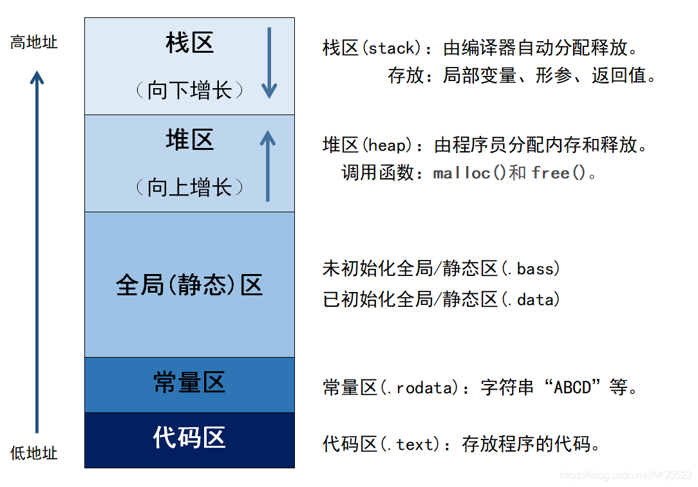
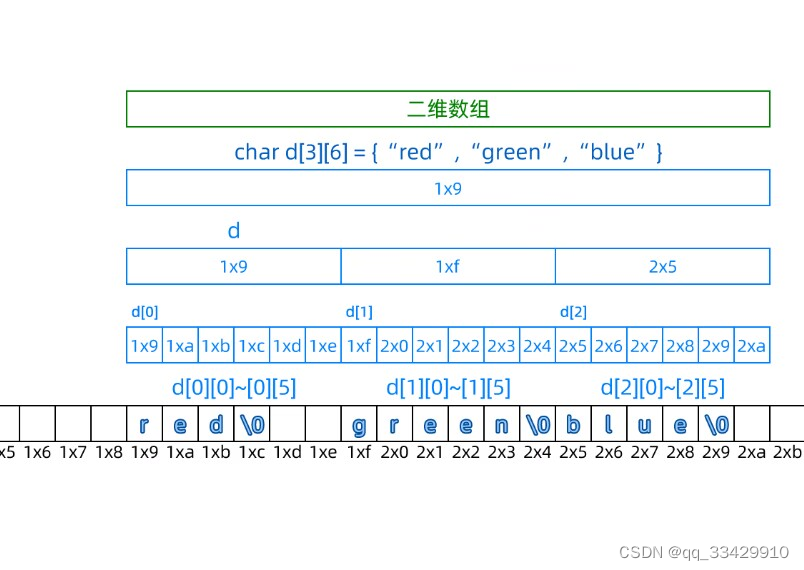
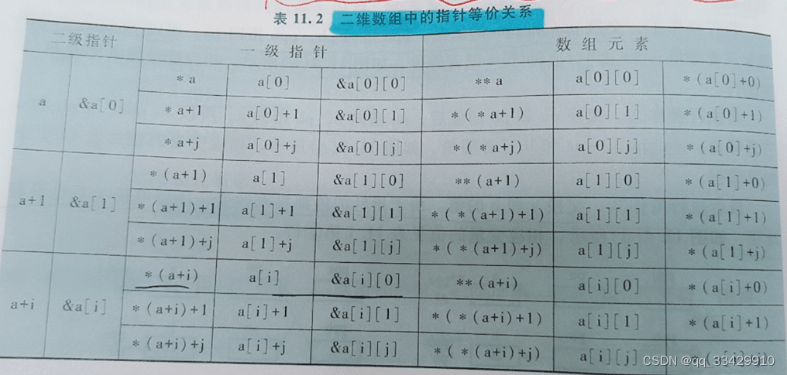
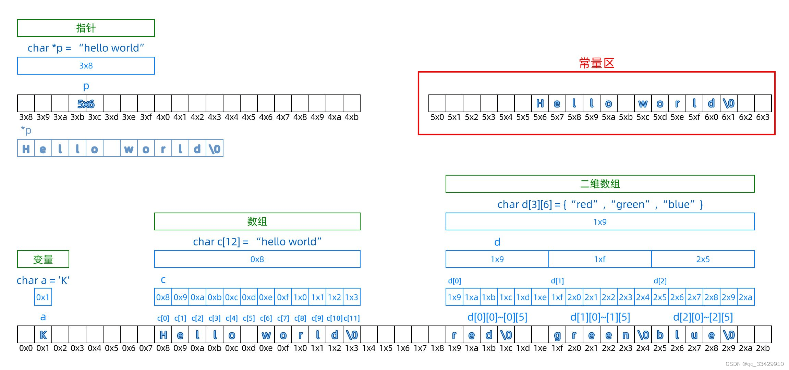
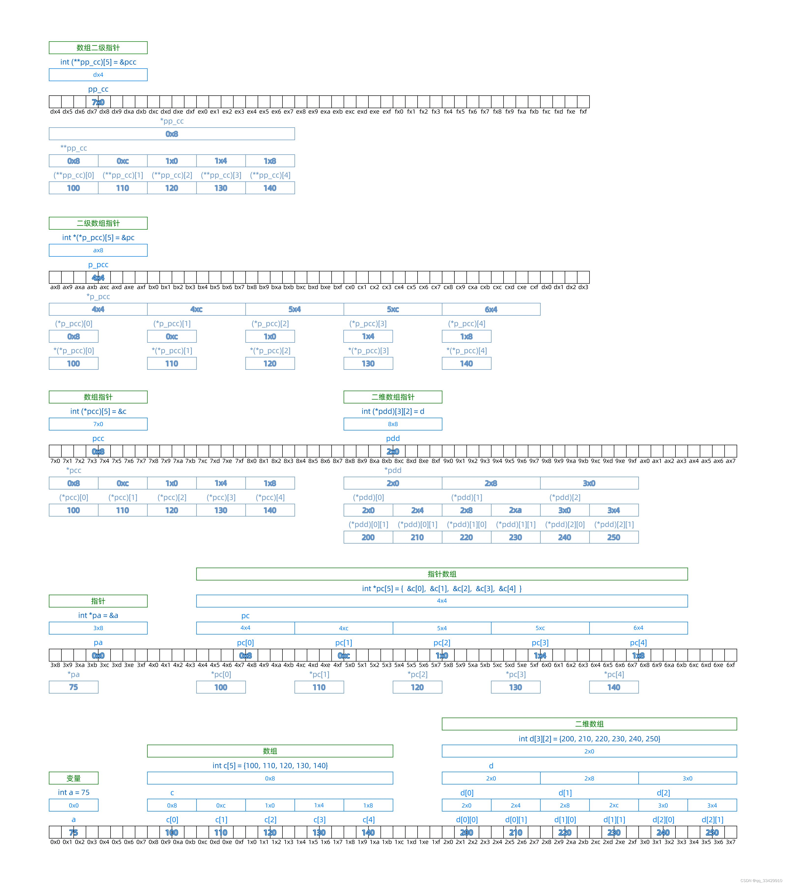
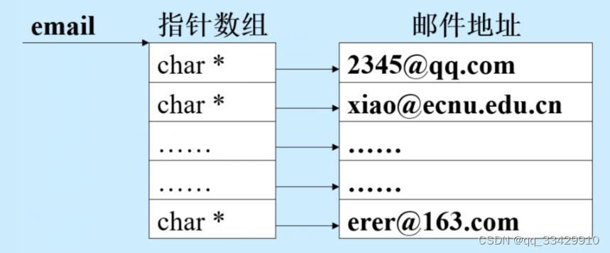

## 内存组成
为了讲明白不同方式下数组、字符串定义时在内存中的存放方式，需要先对计算机内存分区组成有所了解：



### 堆区

**堆区 (Heap)**：由程序员手动申请释放的内存空间。

1. C中：`malloc()`和`colloc()`函数申请，用`free()`释放

> 若不用`free()`释放，容易造成内存泄露（即内存被浪费、耗尽）。

 -  `ptr = (castType*) malloc(size);`

  传入参数为内存的字节数，内存未被初始化。

-  `ptr = (castType*)calloc(n, size);`

  存入参数为内存块数与每块字节数，内存初始化为`0`。

-  `free(ptr);`

  释放申请的内存。

  

2. C++中：`new`申请，`delete`释放。`new`和`delete`都是操作符

-  `int *arr = new int[10];`
-  `delete[] arr;`

### 栈区

**栈区 (Stack)**：由系统管理，存放函数参数与局部变量。函数完成执行，系统自行释放栈区内存。

### 静态存储区

**静态存储区 (Static Storage Area)**：在编译阶段分配好内存空间并初始化。

其中全局区存放静态变量（`static`修饰的变量）、全局变量（具有全局作用域的变量）；常量区存放常量（又称为字面量）。

常量可分为整数常量（如1000L）、浮点常量（如314158E-5L）、字符常量（如'A'、'\n'）和**字符串常量（如"Hello"）**。

> `const`关键字修饰的的变量无法修改，但存放的位置取决于变量本身是全局变量还是局部变量。当修饰的变量是全局变量，则放在全局区，否则依然在栈区分配。
>
> `static`关键字修饰的变量存在全局区的静态变量区。

> **常变量**与**宏定义**的概念不同。
>
> 常变量存储在静态存储区，初始化后无法修改。
>
> 宏定义在预处理阶段就被*替换*。不存在与任何内存区域。

### 代码区

**代码区 (Code Segment)**：存放程序体的二进制代码。

### 代码示例
```c
/*示例代码*/

int a = 0;          //静态全局变量区
char *p1;           //编译器默认初始化为NULL，存在静态全局变量区

void main()
{
    int b;                //栈
    char s[] = "abc";     //栈
    char *p1 = "123";     //"123"在字符串常量区，p1在栈区
    
    p2 = (char *)malloc(10); //堆区
    strcpy(p2, "123");       //"123"放在字符串常量区
    
    const int d = 0;      //栈
    static int c = 0;     //c在静态变量区，0为文字常量，在代码区
    static const int d;   //静态常量区
    
}
```
## 字符串定义 - 一维

### 方法一
`char s[10] = "Hello"`

**内存**：静态存储区上的字面量`"Hello"`被复制到栈区，数组在栈区上的存储方式为`'H''e''l''l''o''\0'`，可以通过`s[i]`修改。但这不会影响到静态存储区上的`"Hello"`。

**定义与使用：**

```c
#include <stdio.h>

void f(char s[10]) {      //等价于char *s
    printf("%s\n", s);
}

int main() {
    char s[10] = "LeeHero";
    s[3] = 'Z';
    printf("%s\n", s);   //输出：LeeZero
    printf("%s\n", s+1); //输出：eeZero
    printf("%c\n", s[3]);//输出：Z
 
    f(s); //数组名作为函数参数传递时，会退化成指向数组首元素的指针 !IMPORTANT
    return 0;
} 
```

> 格式控制符 `%s` 跟随一个地址，并当做是字符串第一个元素对应的地址.
>
> 从该首地址开始解析，直到 `'\0'` 结束。
>
> 在这里指的是 `s[0] = 'H'` 的地址。

### 方法二
`char *s = "Hello"`

// 等价于`const char *s = "Hello"`

**内存**：s是指向字面量`"Hello"`的指针，字面量在静态内存区，因此该字符串不可被修改。

**定义与使用：**

```c
#include <stdio.h>

void f(char s[10]) {       //等价于char *s
    printf("%s\n", s);
}

int main() {
    char *s = "LeeHero";
    //s[3] = 'Z';          //无法执行 
    printf("%s\n", s);     //输出：LeeHero
    printf("%s\n", s+1);   //输出：eeHero
    printf("%c\n", s[3]);  //输出：H
 
    f(s);
    
    return 0;
} 
```

## 字符串定义 - 二维

### 方法一
 `char s[10][10] = {"Hello","World"}`

**内存**：静态存储区上的字面量`"Hello"`，`"World"`被拷贝在栈区，与一维定义方式同理，可以通过语法糖`s[i][j]`修改字符。

**定义与使用：**

```c
#include <stdio.h>

void f(char (*s)[10]) {        //形参s是个指针，指向有10个元素的字符数组
                               //把(*s)[10] 改成 s[][10] ，其他不变，最后效果相同
    printf("%s\n", s[1]);      //输出：Zero
    s[1][0] = 'H';             //通过语法糖s[i][j]修改字符
    printf("%s\n", s[1]);      //输出：Hero
    printf("%c\n", s[0][1]);   //输出：e
}

int main() {
    char s[10][10] = {"Lee","Hero"};
    //s[1] = "Hey";            //无法执行，这种赋值方式仅在初始化时可用
    s[1][0] = 'Z';
    printf("%s\n", s);         //输出：Lee
    printf("%s\n", *s+1);      //输出：ee
    printf("%s\n", s[0]+1);    //输出：ee
    
    printf("%c\n", *(s[0]+1)); //输出：e
    printf("%c\n", s[0][1]);   //输出：e
    
    printf("%s\n", s+1);       //输出：Zero
    printf("%s\n", s[1]);      //输出：Zero
    
    f(s);
    
    printf("%s\n", s[1]);      //输出：Hero 这意味着函数内部的修改不是局部生效的
    return 0;
} 
```

**对于打印结果的一些解释：**

 ***· 对二维数组进行操作与输出***

 1.  `s` 等价于`&s[0]`，是指向[存储`"Lee"`的一维数组]的指针

 2.  `s+1`等价于`&s[1]`，是指向[存储`"Zero"`的一维数组]的指针

 3.  `*s+1`等价于`(*s)+1`，`s`通过`*`解析首先得到[一维数组`"Lee"`]
      即指向[一维数组`"Lee"`的第一个元素`'L'`*的地址*]的指针`s[0]`；
      对该指针+1，相当于`s[0]+1`，使得指针指向[一维数组`"Lee"`第二个元素`'e'`*的地址*]
    格式控制符`%s`将该元素看成字符串的首地址，因而打印出`"ee"`

***· 二维数组传参***

二维数组主要有两种传参方式（以下两种是函数*声明*的方式。声明函数后，都是使实参为数组名来*调用*函数：`f(s);`）

 1. `void f(char (*s)[10]) {}` —— 一维数组指针作形参

 二维数组名实际上就是指向一维数组的指针。因此这里形参s是个指向行元素的指针，与二维数组名匹配。

2. `void f(char s[][10]) {}` —— 二维数组指针作形参
    对于这种方法，仅二维数组的数组行数可以省略，不可省略列数。`f(char s[][])`是错误的。

 **也就是说，1.和2.方式中都需要正确指定列数。**

3. `f(char **s)`，`f(char *s[])`的方式声明函数虽然能编译输出，但编译器可能会出现以下警告信息：
   ```c
    [Warning] passing argument 1 of 'f' from incompatible pointer type
    [Note] expected 'char **' but argument is of type 'char (*)[10]'
   ```

   P.S. 当然，如果一定要用二维指针作实参`f(char **s)`，在传参的时候可以将`s`强制转化：`f((char **)s)`，函数内部操作元素可以通过`*((int *)a+i*10+j)`的方式……但何必呢。
>    如果一定要试试，这里也有个例子：
>
>    ```c
>    #include <stdio.h>
>    
>    void f(char **s) {                     //形参s是个二维指针
>        printf("%c\n", *((char *)s));      //输出：L
>        printf("%s\n", ((char *)s));       //输出：Lee
>        printf("%c\n", *((char *)s+10));   //输出：H
>        printf("%s\n", ((char *)s+10));    //输出：Hero
>    }
>    
>    int main() {
>        char s[10][10] = {"Lee","Hero"};
>        f((char **)s);                     //「我一定要把s看做二维指针去传参！」
>        return 0;
>    }

### 方法二
 `char *s[10] = {"Hello", "World"}`

**内存**：类比`char *s = "Hello"`，这里s是一个指针数组，`s[0]`、`s[1]`是两个指针，分别指向字面量`"Hello"`、`"World"`。指向的内容可以访问，无法修改。

**定义与使用**：

```c
#include <stdio.h>

void f(char **s) {
    printf("%s\n", s[0]);        //输出：Lee
    printf("%c\n", s[0][0]);     //输出：L
}

int main() {
    char *s[10] = {"Lee","Hero"};
    printf("%s\n", s[0]);        //输出：Lee（等价于*s）
    printf("%c\n", s[0][0]);     //输出：L  （等价于*s[0]） 

    f(s);
    return 0;
} 
```

**解释：**

***数组名作为函数参数传递时，会退化成指向数组首元素的指针。***

当把`s`作为参数传递给`f()`函数时，实际上是把指针数组的首地址传递给了`f()`函数。这样，`f()`函数中的`s`就是一个二级指针，它指向了指针数组的第一个元素，也就是第一个字符串的地址。

`f()`函数接受一个二级指针作为参数。由此，`f()`函数中的`s[0]`和`s[0][0]`与主函数中的`s[0]`和`s[0][0]`含义相同。

```c
#include <stdio.h>

int main() {
    
	/* s[10][10]与*s[10]的对比 */
    
    char *s[10] = {"Lee","Hero"};
    printf("%d %d\n", sizeof(s), &s);            //输出：80 6487488
    printf("%s\n", s);                           //无输出！ 
    
    printf("%d %d\n", sizeof(s[0]), &s[0]);      //输出：8  6487488
    printf("%s\n", s[0]);                        //输出：Lee（等价于*s）
    
    printf("%d %d\n", sizeof(s[0][0]), &s[0][0]);//输出：1  4210692
    printf("%c\n\n", s[0][0]);                   //输出：L  （等价于*s[0]） 
    
    char t[10][10] = {"Lee","Hero"};
    printf("%d %d\n", sizeof(t), &t);            //输出：100 6487376
    printf("%s\n", t);                           //输出：Lee
    
    printf("%d %d\n", sizeof(t[0]), &t[0]);      //输出：10  6487376
    printf("%s\n", t[0]);                        //输出：Lee（等价于*t）
    
	printf("%d %d\n", sizeof(t[0][0]), &t[0][0]);//输出：1   6487376
    printf("%c\n", t[0][0]);                     //输出：L  （等价于*t[0]）
    
    /* *s[10]内容无法修改 */
    t[1][0] = 'Z';           //修改二维数组元素
    printf("%s\n", t[1]);    //输出：Zero
    s[1][0] = 'Z';           //程序运行到这里崩溃！
    printf("%s\n", s[1]);    //无输出！
    
    return 0;
} 
```

## 对二维数组结构的认识

### 关于二维数组

`a[i][j]` ： 第 $i$ 行第 $j$ 列元素

`a[i]`：一级指针常量，指第 $i$ 行首元素地址，第 $i$ 行本质为一维数组，`a[i]+j`是第 $i$ 行第 $j$ 列元素的地址

`a`：数组指针常量，是二维数组的起始地址，第 $0$ 行的起始地址。




### 二维数组中的指针等价关系

> 优先级：`()` $>$ `++` $>$ `指针运算符*` $>$ `+`




### 数组结构中对「指针常量」的理解

**指针常量**：不能修改指针所指向的地址，但指向的值可以改变。

数组名是指针常量。数组名代表数组的首地址，它的值不能改变，也就是说不能让数组名指向其他地址。

二维数组中`a[i][j]`中，`a[i]`可以看做是指向第 $i$ 个一维数组的指针，它的值是第 $i$ 个一维数组的首地址。`a[i]` 的值不能改变，也就是说不能让 `a[i]` 指向其他地址。可以类比为指针常量。

总之，数组结构中各元素地址都是连续且无法更改的。

```c
char a[10][10] = {"Lee", "Hero"};
char *p[10] = {0} //定义指针数组

p[0] = a[0];
p[1] = a[1]; 
p[0] = p[1];      //合法

a[0] = a[1];      //非法
```
## 指针 vs 数组 内存结构一图流

> 图由ECNU CS16级的阳太学长提供~





## One More Thing

**「当指针数组、`malloc()`动态分配遇见`qsort()`库函数，关于比较函数`cmp(const void *a, const void *b)`的迷思」**


利用`qsort()`函数对一个整数数组进行排序，一般格式如下：

```c
#include <stdio.h>
#include <stdlib.h>

// 比较函数，用于升序排序整数
int cmp(const void *a, const void *b) {
    int n1 = *(int *)a;
    int n2 = *(int *)b;
    return n1 - n2;
}

int main() {
    int arr[] = {10, 5, 15, 12, 90, 80};
    int n = sizeof(arr) / sizeof(arr[0]), i;
    
    // 调用qsort库函数，传入数组指针，元素个数，元素大小和比较函数
    qsort(arr, n, sizeof(int), cmp);

    // 打印排序后的数组
    printf("Sorted array: ");
    for (i = 0; i < n; i++)
        printf("%d ", arr[i]);
    printf("\n");
    
    /* 输出结果：Sorted array: 5 10 12 15 80 90 */
    
    return 0;
}
```

可见，传入`cmp()`函数的参数是两个`void`型指针，*指向*我们需要排序的*数组中的每个元素*。在上面的例子中，`int n1 = *(int *)a;`即是将`void`型指针强制转换成`int`型指针后用`*`解地址，得到的便是数组中的元素。


`ECNU Online Judge`有这样一道题：[[邮件地址排序]](https://acm.ecnu.edu.cn/problem/97/)

> #### 题面 
>
> 现接收到一大批电子邮件，邮件地址格式为：`用户名@主机域名`，要求把这些电子邮件地址做主机域名的字典序升序排序，如果主机域名相同，则做用户名的字典序降序排序。
>
> #### 输入格式
>
> 第一行输入一个正整数 $n$，表示共有 $n$ 个电子邮件地址需要排序。接下来 $n$ 行，每行输入一个电子邮件地址（保证所有电子邮件地址的长度总和不超过 $10^6$）。 
>
> - 对于 $50\%$ 的数据，保证 $n \leqslant 100, |s_i| \leqslant 100$。
>
> 用户名只包含字母数字和下划线，主机域名只包含字母数字和点。
>
> #### 输出格式
>
> 按排序后的结果输出 $n$ 行，每行一个电子邮件地址。

为节省内存，通过比较逆天的试例，考虑用指针与`malloc()`动态内存管理存储邮件地址：




为了和这篇博客主题契合，这里只介绍这种数据存储结构的实现方式与`cmp()`的设计方法：

```c
/* 数据输入 */

int T; //要输入的邮件个数
scanf("%d", &N);

//建立指针数组 email
char **email;
email = (char **)malloc(N * sizeof(char*))； //相当于实现了char *email[N]

//使指针数组 email 中的每个指针元素都指向一个邮件地址字符串
for (int i = 0; i < N; i++) {
    scanf("%s", s);  //读取一个字符串
    LEN = strlen(s); //获取字符串长度
    p = (char *)malloc((LEN+1) * sizeof(char)); //分配每个字符串的存储空间
    strcpy(p, s);    //把字符串复制到p处，这两行相当于实现了char p[LEN+1] = {s}
    *(email + i) = p;
    //使指针数组 email 中的指针元素指向 p ，p也是个指针，但借助malloc()动态分配，实现了字符串的功能
}
```

数据输入完毕后最终实现的效果，类似于`char *email[50] = {"123@qq.com", "456@ecnu.edu.com"}`的定义方式，只是一维字符数组的长度是借助`malloc()`动态分配的，并不是个定值。

数据输入完毕，我们现在得到了一个名为`email`的指针数组，数组里的每个元素都是一个指针，指向共 $N$ 个字符串。

设计`cmp()`时，传入`cmp()`函数的参数是两个`void`型指针，*指向*我们需要排序的*数组中的每个元素*。因此，`void`型指针指向一级指针，这样的`void`型指针就是二维指针——`char **`。

```c
int cmp (const void *a, const void *b) {
    char *p1 = *((char **)a);
    char *p2 = *((char **)b); //对二级指针a、b进行一次解地址，得到的就是一级指针p1，p2
                 //通过 *(p1+i) *(p2+i) 操作就可以解析到[一级指针所指字符串]的每个字符
                              //从而做进一步的比较处理
    /* 后续省略 */
    return ret;
}
```
以上。如有疑义欢迎提出。
