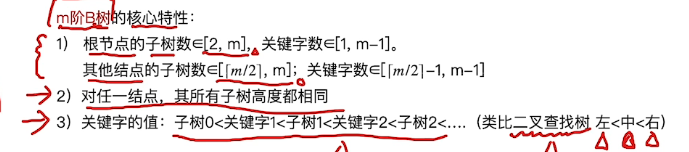
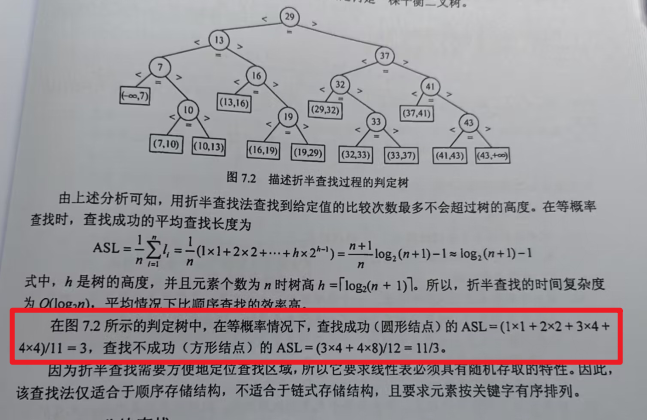
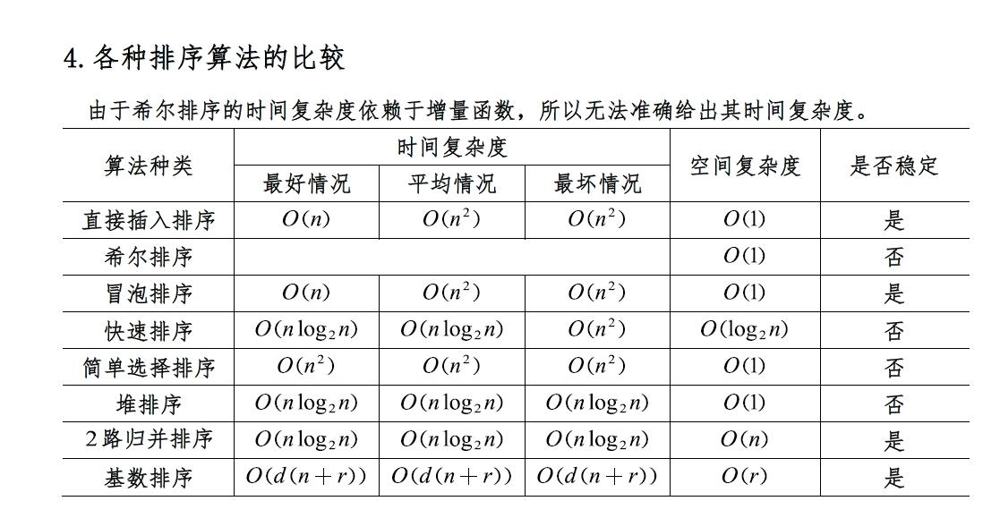
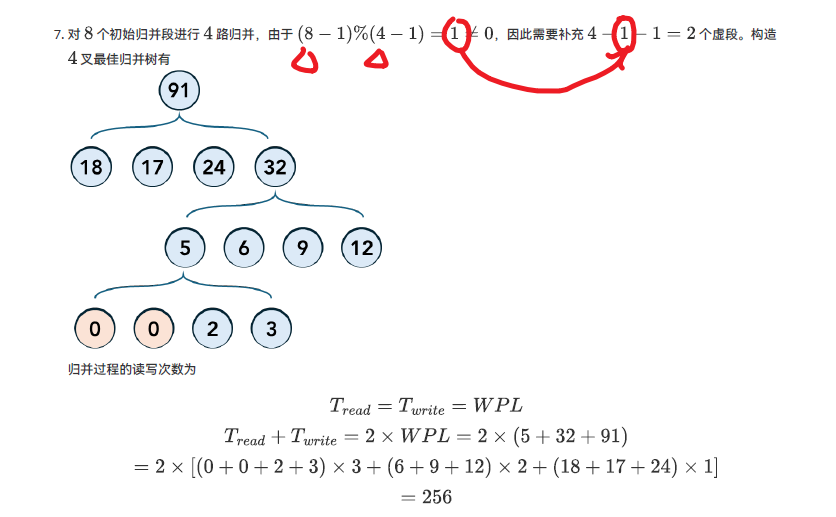

## 数据结构与算法

---

## 顺序表【算法】

- 定义
- 结构
- 实现

---

## 链表【算法】

- 结构
- 实现
- 双链表
- 循环链表

---

## 栈与队列

- 概念
- 存储结构

---

## 串

- 概念
- 匹配（简单模式；KMP）
- 压缩存储

---

## 树和二叉树

- 概念和性质（树&特殊二叉树）
- 存储结构
- 树的应用（哈夫曼；并查集；二叉排序树；（平衡二叉树；红黑树；B&B+树；堆排序））

- $n$ 个符号构造哈夫曼树，共新建 $n-1$ 个节点，结点总数为 $2n-1$
- $n$ 个节点的树会有 $n-1$ 条边
- 树性质：
  - 总结点数 $=n_0+n_1+n_2+\dots+n_m$
  - 总分支数 $=1n_1+2n_2+\dots+mn_m$
  - 总结点数 $=$ 总分支数 $+1$
- 二叉树性质：
  - 叶子结点 $n_0=n_2+1$
  - 第 $k$ 层节点数至多 $2^{k-1}$
  - 高度为 $h$ 二叉树至多 $2^h-1$ 个节点
- 前序+后序只能确定祖先关系，不能唯一确定二叉树。前序 $XY$，后序 $YX$，可推 $X$ 是 $Y$ 祖先
- 森林转换为二叉树，前序对应前序，后序对应中序
- 二叉排序树：左子树节点值都小于根节点；右子树节点值都大于根节点
- 平衡二叉树
  - 平衡因子：左子树高度-右子树高度（绝对值小于 1）
  - 平衡二叉树的旋转
- B树
  - 

---

## 图

- 概念
- 存储结构
- 遍历
- 图的应用（最小生成树；最短路；拓扑排序；关键路径）

- $n$ 个顶点和 $n-1$ 条边可以使无向图联通但无环， $n$ 条边便一定会有环
- $n$ 个顶点的无向完全图有 $C_n^2$ 条边，有向完全图有 $2C_n^2$ 条边

- 图bfs生成树比dfs生成树高小或相等；bfs生成树在所有生成树中树高最小
- 最小生成树：
  - Prim算法（贪心）：任取一节点，每次走**连通分量集合中**节点出发的权值最短的的路径，直到走完所有顶点
  - Kruskal算法：每次选择一条边，要求 **1)** 未被选取，合法路径中权值最小；**2)** 落在不同连通分量
- 最短路（Dijkstra算法）：
  - 三个数组记录：`S[n]` 标记是否访问过；`dist[n]` 当前最短路长度；`pre[n]` 当前节点最短路的前驱元素（当 `dist` 更新时随之更新）
  - 每次选择 **未访问过** 且 ***distance* 最小** 的节点访问
- 拓扑排序：
  - 每次取出没有入度的节点
  - 时间代价：邻接表存储 $O(n+e)$；邻接矩阵存储 $O(n^2)$
- 关键路径：
  - 正拓扑求所有节点最早发生时间 $ve(k)$
  - 逆拓扑求所有节点最迟发生时间 $le(k)$
  - 事件最早开始时间是起点节点的最早时间 $e(a)$
  - 事件最迟开始时间是终点节点的最迟时间-持续时间 $l(a)$
  - 事件最早和最迟相等（差额为 0 ）则为关键活动，对应路径节点组成关键路径

---

## 查找

- 顺序查找
- 折半查找
  - 
- 散列查找（哈希）

---

## 排序

- 插入排序（直接插入排序；希尔排序）
- 交换排序（冒泡排序；快速排序）
- 选择排序（简单选择排序；堆排序）：每次选择最值放在最终位置
- 归并排序
- 内部排序算法间的比较
  - 稳定：插入 归并 冒泡 基数
  - 
- 外部排序（基本概念方法；多路归并树&败者树；置换-选择排序；最佳归并树）
  - 
  - 置换选择排序：先一次塞满工作区，然后放最小的出去，同时记录「MINIMAX」，让每个归并段都可以升序，直到升序不了，创造新的归并段

算法设计：

1. 堆排序 or 二分排序
2. 并查集
3. **链表 & 二叉树**