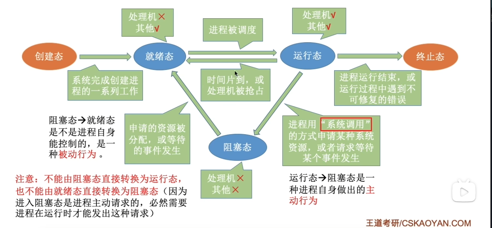

## [1.x] 引论

操作系统功能

- 处理器：分配和控制
- 存储器（内存）：分配和回收
- I/O设备：分配和操纵
- 文件管理：存储、共享和保护

操作系统特征

- 并发
  - 宏观同时，微观交替，同时存在多个和运行的程序
- 并行
  - 真正同时发生
- 共享
  - 互斥共享（临界资源每次只能独占使用，其他人等待）
  - 同时共享（微观可能交替，但和连续完成的效果相同）
- 虚拟
  - 时分复用（微小时间段交替，但是感受上是同时）
  - 空分复用（比如磁盘分区使用）
- 异步
  - 多道程序环境允许多个程序并发执行，但由于资源有限，进程的执行并不是一贯到底的，而是走走停停的，它以不可预知的速度向前推进，这就是进程的异步性。

## [2.x] 进程和线程

进程是一个程序对某个[数据集]的执行过程，是系统分配资源的基本单位。每个进程在内核中都有一个**进程控制块（PCB）**来维护进程的**基本信息和运行状态**。

进程的特征

- 动态性
  - 有着各种过程和生命周期，动态的产生消亡
- 并发性
  - 多个进程实体同时存于内存，在一段时间内同时运行
- 独立性
  - 独立运行、接受资源、接受调度
- 异步性
  - 相互制约，具有执行的间断性
- 结构性
  - PCB来描述，程序段+数据段+PCB

进程状态和转换

调度三个层次

- 高级调度：调度后备队列，为其创建进程（面向用户发起的多个作业）
- 中级调度：调度挂起队列，选择合适进程调回内存
- 初级调度：调度就绪队列，为其分配处理机

进程同步互斥与通信

- 同步：进程因为合作产生的制约关系，有先后执行顺序
- 互斥：多个进程在同一时刻只有一个进程进入临界区
- 信号量：两个原子操作，`P()`信号量--，`V()`信号量++

作业和进程调度算法

- 先来先服务 FCFS
- 短作业优先 SJF
- 时间片轮转调度 RR（默认排队尾）
- 最高优先级调度 HPF（默认非抢占）

> - 周转时间=完成时间-到达时间
> - 带权周转时间=周转时间/运行时间
> - 平均周转时间=总周转时间/任务数
> - 等待时间=开始运行时间-到达时间

## [3.x] 存储管理

动态内存分配算法

- 首次适应算法
  - 从低地址开始查找，找第一个满足的空闲分区
- 最佳适应算法
  - 先按照容量升序空闲分区，再找第一个满足的空闲分区
- 最坏适应算法
  - ......容量降序......
- 邻近适应算法
  - 首尾相连，从低地址开始，下次找从上次查找结束的地方开始

页面置换算法

- 最佳置换算法 OPT
  - 每次淘汰以后最长时间/永远不使用的页面
- 先进先出置换算法 FIFO
  - 每次淘汰最早进入内存的页面（画队列）
- 最近最久未使用置换算法 LRU
  - 每次淘汰当前内存块中最久未使用页面（倒推）
- 时钟置换算法 CLOCK/NRU

> - 缺页中断：包括填入
> - 页面置换：若有空闲，则不用置换
> - 缺页率：缺页中断次数/访问页面总数