# 操作系统复习 · 期末

## [1.x] 引论

### 操作系统功能

- 处理器：分配和控制
- 存储器（内存）：分配和回收
- I/O设备：分配和操纵
- 文件管理：存储、共享和保护

### 操作系统特征

- 并发
  - 宏观同时，微观交替，同时存在多个和运行的程序
- 并行
  - 真正同时发生
- 共享
  - 互斥共享（临界资源每次只能独占使用，其他人等待）
  - 同时共享（微观可能交替，但和连续完成的效果相同）
- 虚拟
  - 时分复用（微小时间段交替，但是感受上是同时）
  - 空分复用（比如磁盘分区使用）
- 异步
  - 多道程序环境允许多个程序并发执行，但由于资源有限，进程的执行并不是一贯到底的，而是走走停停的，它以不可预知的速度向前推进，这就是进程的异步性。

## [2.x] 进程和线程

进程是一个程序对某个[数据集]的执行过程，是系统分配资源的基本单位。每个进程在内核中都有一个**进程控制块（PCB）**来维护进程的**基本信息和运行状态**。

### 进程的特征

- 动态性
  - 有着各种过程和生命周期，动态的产生消亡
- 并发性
  - 多个进程实体同时存于内存，在一段时间内同时运行
- 独立性
  - 独立运行、接受资源、接受调度
- 异步性
  - 相互制约，具有执行的间断性
- 结构性
  - PCB来描述，程序段+数据段+PCB

### 进程状态和转换

### 调度三个层次

- 高级调度：调度后备队列，为其创建进程（面向用户发起的多个作业）
- 中级调度：调度挂起队列，选择合适进程调回内存
- 初级调度：调度就绪队列，为其分配处理机

### 进程同步互斥与通信

- 同步：进程因为合作产生的制约关系，有先后执行顺序
- 互斥：多个进程在同一时刻只有一个进程进入临界区
- 信号量：两个原子操作，`P()`信号量--，`V()`信号量++

### 作业、进程调度算法

- 先来先服务 FCFS
- 短作业优先 SJF
- 时间片轮转调度 RR（默认排队尾）
- 最高优先级调度 HPF（默认非抢占）

> - 周转时间=完成时间-到达时间
> - 带权周转时间=周转时间/运行时间
> - 平均周转时间=总周转时间/任务数
> - 等待时间=开始运行时间-到达时间

## [3.x] 存储管理

### 动态内存分配算法

- 首次适应算法
  - 从低地址开始查找，找第一个满足的空闲分区
- 最佳适应算法
  - 先按照容量升序空闲分区，再找第一个满足的空闲分区
- 最坏适应算法
  - ......容量降序......
- 邻近适应算法
  - 首尾相连，从低地址开始，下次找从上次查找结束的地方开始

### 页面置换算法

- 最佳置换算法 OPT
  - 每次淘汰以后最长时间/永远不使用的页面
- 先进先出置换算法 FIFO
  - 每次淘汰最早进入内存的页面（画队列）
- 最近最久未使用置换算法 LRU
  - 每次淘汰当前内存块中最久未使用页面（倒推）
- 时钟置换算法 CLOCK/NRU

> - 缺页中断：包括填入
> - 页面置换：若有空闲，则不用置换
> - 缺页率：缺页中断次数/访问页面总数

### 分页、分段系统的地址变换

// TO DO

## [4.x] 文件系统

### 文件的逻辑结构

- 无结构文件：一系列二进制流/字符流（eg. .txt）
- 有结构文件：一组相似的结构（定长/可变长记录）组成，每条记录有关键字
  - 顺序文件：
    - 链式存储：定长/可变长记录都无法实现随机存取
    - 顺序存储：可变长记录无法实现随机存取；定长可以实现随机存取
      - 顺序结构按关键字排列，可以快速找到某关键字对应的记录，串结构不行
      - 顺序结构增删比较困难，串结构比较简单
  - 索引文件：
    - 解决可变长记录文件，引入索引表增加文件检索速度，每条记录一个索引项。本质是定长记录的顺序文件
  - 索引顺序文件：
    - 解决索引表项过大对索引表进行瘦身，对记录进行分组，每组记录一个索引项
  - 多级索引顺序文件：
    - 如果索引顺序文件还是很大，可以建立索引的索引表

> 平均查找次数计算：
>
> 

### 文件的物理结构

***管理非空闲磁盘块（存放了文件数据的磁盘块）***

- 操作系统对磁盘块的管理

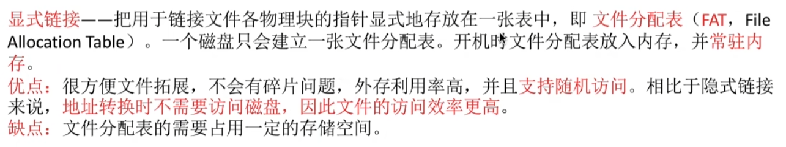

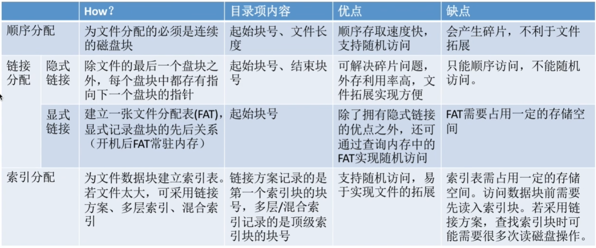

### 文件存储空间管理

***对空闲磁盘块的管理***

（关注方面：什么方式记录和组织，如何分配，如何回收）

- 存储空间的划分：物理磁盘 $\to$ 文件卷/逻辑卷/逻辑盘
- 存储空间的初始化：文件卷 $\to$ 目录区、文件区

- 存储空间管理
  - 空闲表法：适用于连续分配方式，空闲表字段【第一个空闲盘快号—空闲盘块数】
    - 分配：首次适应、最佳适应、最坏适应
    - 回收：注意表项的合并问题
  - 空闲链表法：空闲盘块链&空闲盘区链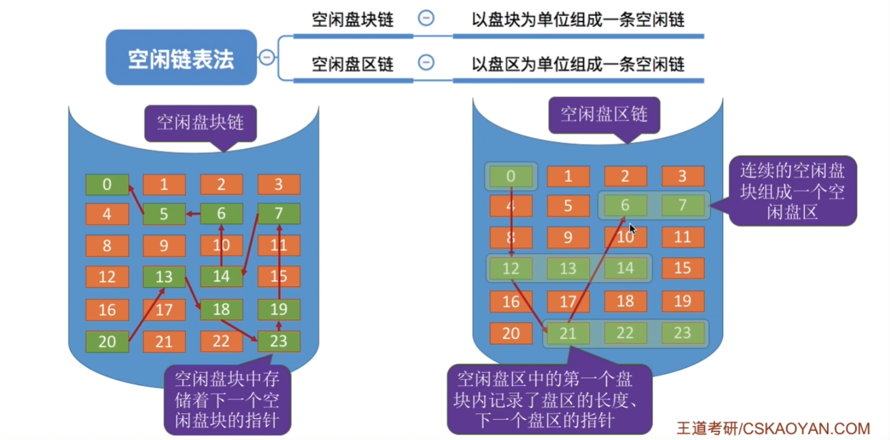
    - 空闲盘块链：适用于离散分配方式，保存链头链尾指针
      - 分配：从链头摘下k个盘块
      - 回收：把新的空闲接到链尾
    - 空闲盘区链：
      - 分配：从链头开始找一个大小要求，也可以用首次适应、最佳适应、最坏适应
      - 回收：若相邻则合并，若不相邻就作为新盘区挂到链尾
  - 位示图法：用二进制位代表盘块空闲状态，1分配0未分配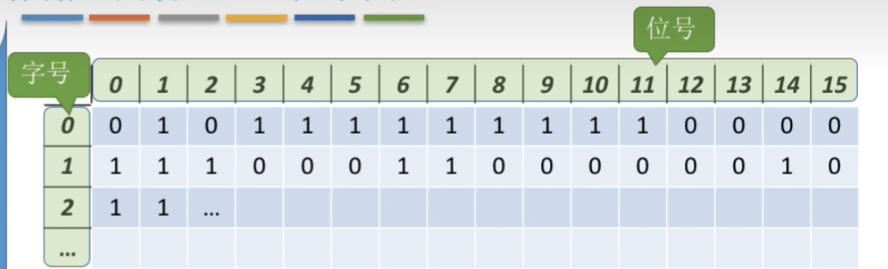
    - **考查：盘块号与（字号，位号）转换。**
      - 盘块号=n*字号+位号
      - 字号=盘块号/n，位号=b%n，注意从0开始还是从1开始
    - 分配：顺序扫描找到k个相邻0（顺序方式），转换分配盘块，变为1
    - 回收：对应盘块设为1
  - 成组链接法：UNIX 策略

### 文件目录管理及文件的搜索

- 文件控制块 FCB：实现文件目录的关键数据结构
  - 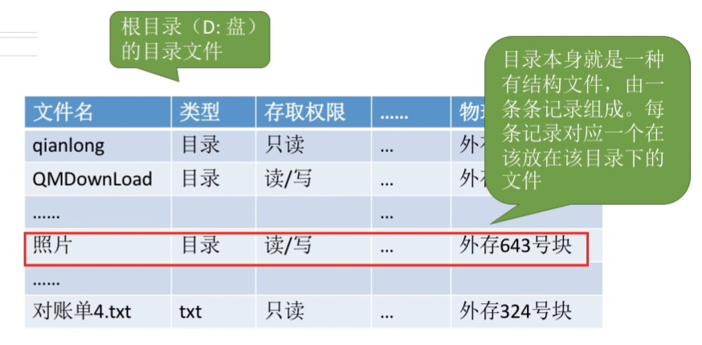
  - 双击文件夹，操作系统会找到对应目录项读入内存，目录内容由此显示
    - 目录文件的一个记录就是文件控制块 FCB，文件名-物理地址-各种信息
  - 对目录进行的操作：搜索，创建，删除，显示，修改
- 目录结构
  - 单级目录结构：整个系统只有一张目录表，实现按名存取，但不允许文件重名
  - 两级目录结构：主文件目录记录用户名，存放对应用户文件存放位置。允许不同用户文件重名
  - 树形（多级）目录结构：访问某个文件用路径名标识文件。
    - 根目录出发为绝对路径，从根目录开始有几级就要几次磁盘I/O操作
    - 当前目录出发为相对路径，从当前目录开始有几级就要几次磁盘I/O操作
    - 不便于实现的共享
  - 无环图目录结构：可以用不同的文件名指向同一个文件/同一个目录，每个共享文件节点设置共享计数器，每次有一个删除命令，共享计数器-1，减为0才会删除节点

- 索引节点：FCB的改进
  - 将FCB中出了文件名之外的信息放在索引节点中，PCB只放索引节点指针。本质是为了增加每个磁盘块可以存放FCB的数目，从而减少磁盘I/O次数

> **对文件的操作**
>
> - 创建文件：*[文件存储空间管理]* 从外存找到文件所需空间；*[文件目录管理]* 根据存放路径找到对应目录文件，创建目录项
> - 删除文件：*[文件目录管理]* 找到对应目录项，找到目录项中文件再外存位置；*[文件存储空间管理]* 回收文件占用；*[文件目录管理]* 删去目录项
> - 打开文件：找到文件名目录项；判断用户权限；把目录项放在内存的打开文件表（进程打开文件表（一个进程一张表），系统打开文件表（一个系统只有一张））
> - 关闭文件：删去进程打开文件表；回收分配给文件的内存空间；系统打开文件表cnt-1，如果cnt==0删去
> - 读、写文件：通过打开文件表的读写指针来控制，读——外存读入内存；写——内存写回外存

### 文件共享

- 基于索引节点（硬链接）：索引节点cnt表示链接到节点上的目录项数，一个用户删除，cnt--
- 基于符号链（软链接）：索引节点指向link，link存放路径

## [5.x] 设备管理

### 基本概念

- I/O设备：将数据输入输出计算机的外部设备。
- 按信息交换的单位分类：块设备/字符设备

### IO 控制方式

- I/O 控制器：实现CPU对设备的控制。
  - 功能
    - 接受和识别CPU发出的命令
    - 向CPU报告设备的状态
    - 数据交换
    - 地址识别
  - 组成
    - CPU与控制器的接口
    - I/O逻辑
    - 控制器与设备的接口
- I/O方式：完成一次读/写操作的流程；CPU干预的频率；数据传送的单位；数据的流向；优缺点
  - 程序直接控制方式：轮询
    - 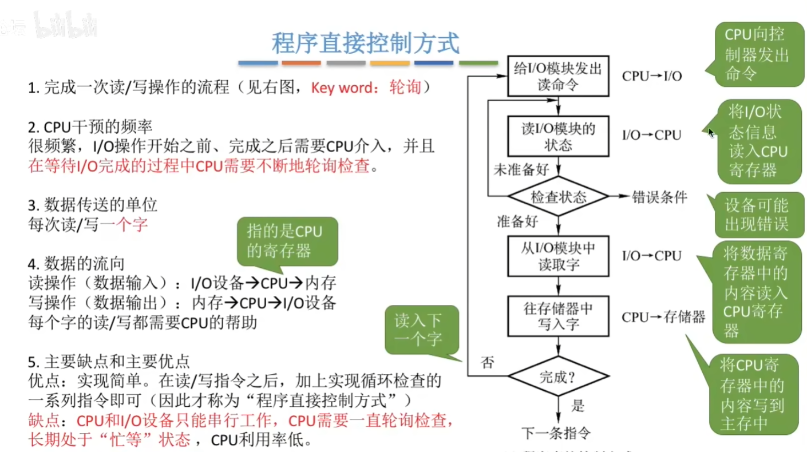
  - 中断驱动方式：中断
    - 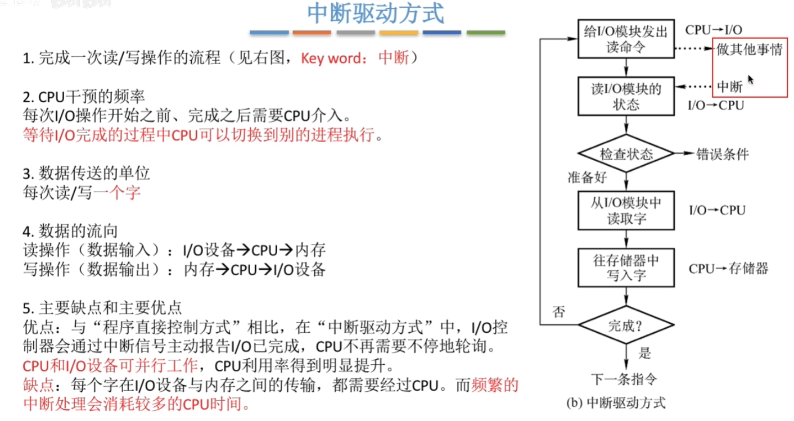
  - 直接存储器存取（DMA）方式
    - 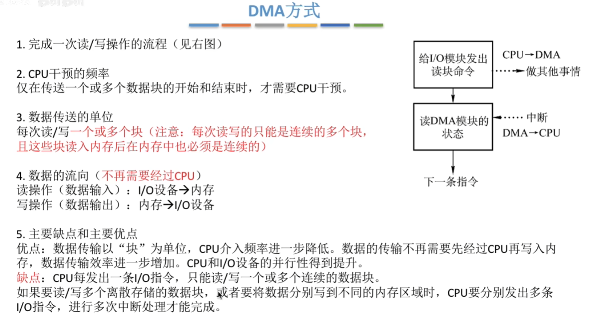

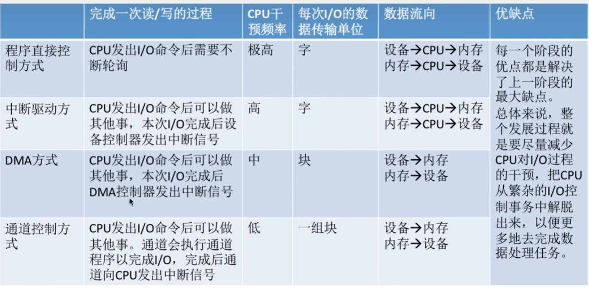

### SPOOLing技术（假脱机技术）

- 脱离主机的控制进行输入/输出操作
  - 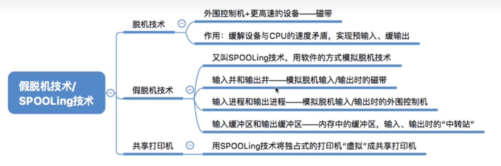

### 磁盘的结构

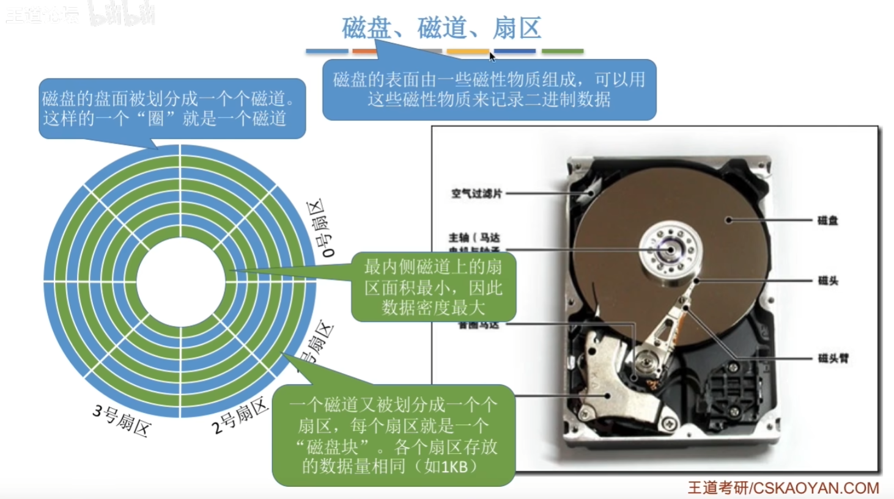

块号 $\to$（柱面号，盘面号，扇区号）

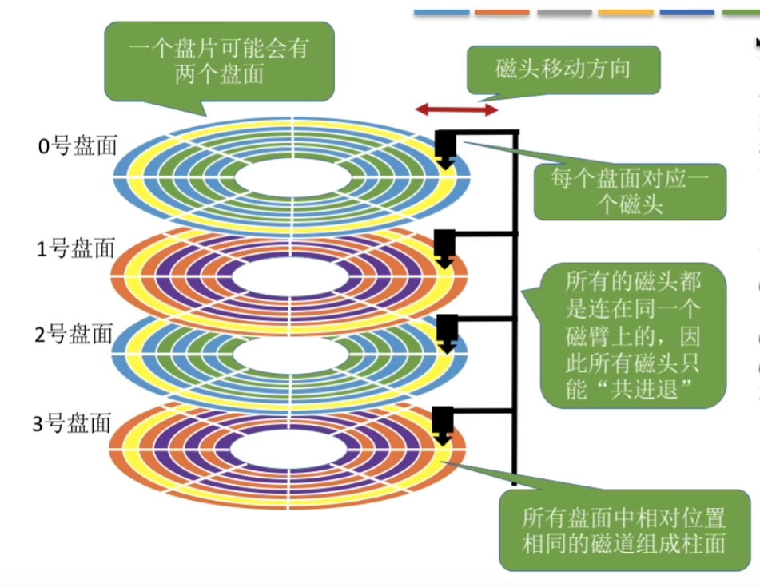

### 磁盘驱动调度

- 寻道时间：移动磁头到指定的磁道
  - 启动磁头臂：s
  - 移动磁头到磁道：每跨越一个磁道m*总共跨越磁道n
  - 总共 $T_s=s+m*n$
- 延迟时间：旋转磁盘定位到目标扇区
  - 转速为 r，平均延迟时间 $T_R=1/(2r)$
- 传输时间：往磁盘读写数据
  - 转速为 r，读写 b 字节，每个磁道字节数为 N，$T_t=b/(rN)$​

- 先来先服务 FCFS
  - 磁头按照请求到达顺序依次移动
  - 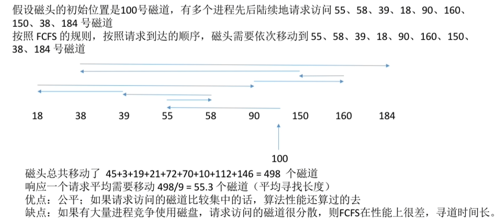
- 最短寻找时间有限算法 SSTF
  - 磁头每次找最近的（贪心算法）
  - 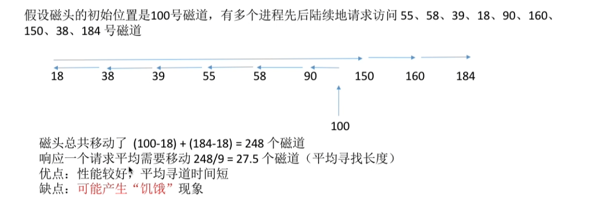
- 扫描算法/电梯算法 SCAN
  - 磁头只有移到最外侧才能向内，最内侧才能向外
  - 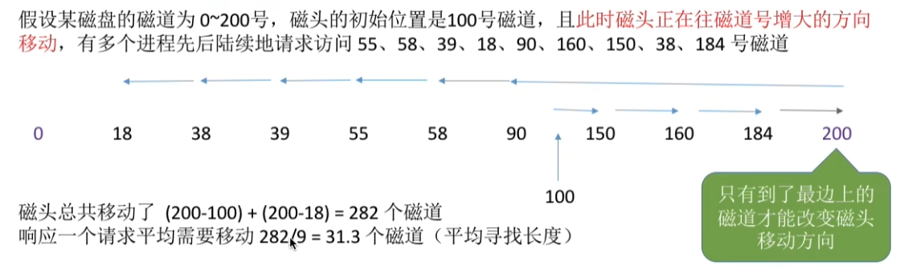
  - 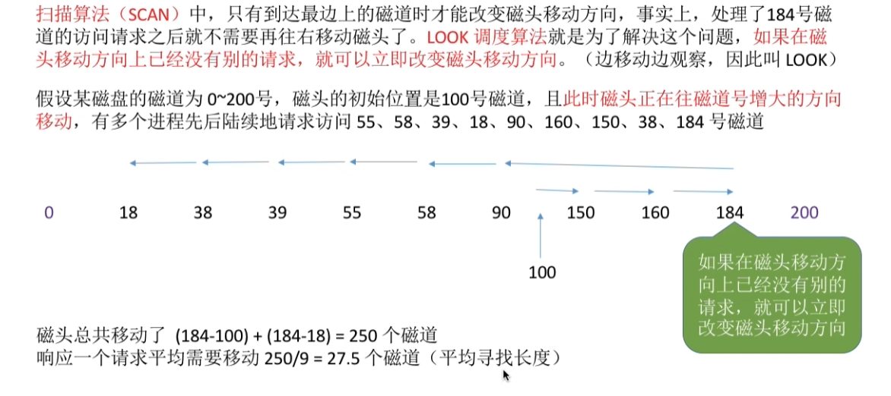
- C-SCAN
  - 磁头只在一个方向才处理请求，返回回起点不处理，是快速移动
  - 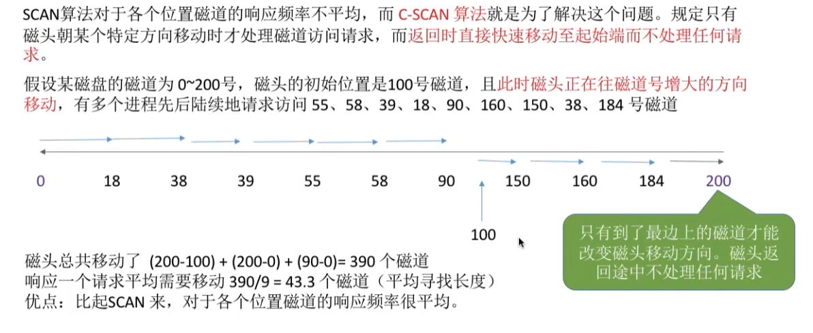
  - 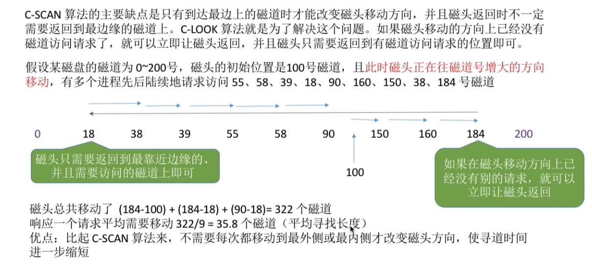

## [6.x] 死锁

### 死锁概念

- 死锁：都在等待对方资源，导致各进程都阻塞，无法向前推进
- 饥饿：由于长期得不到想要的资源，进程无法向前推进 

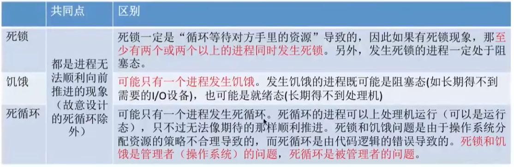

### 死锁产生的必要条件

- 互斥：必须互斥使用的资源导致死锁
- 不可剥夺：用完只能主动释放
- 请求保持：保持至少一个资源的同时提出新的请求
- 循环等待：存在一种进程的循环等待链

### 解决死锁的基本方法

预防死锁

- 破坏必要条件
  - 破坏互斥：SPOOLing 技术改造能互斥使用的资源为共享
  - 破坏不剥夺：如果需要新的资源得不到满足必须释放保持所有资源 / 如果资源被占有，低优先级让给高优先级进程
  - 破坏请求保持：静态分配，运行前一次性给到所有资源否则不投入运行
  - 破坏循环等待：顺序资源分配法，必须按照编号递增的顺序请求资源，保证资源获取必须是单向顺序的

避免死锁

- 安全序列：按安全序列分配资源，每一个进程都能顺利完成
- 不安全状态：分配资源后找不到任何一个安全序列，系统进入不安全状态，进入不安全状态，**有可能**发生死锁
- 银行家算法：

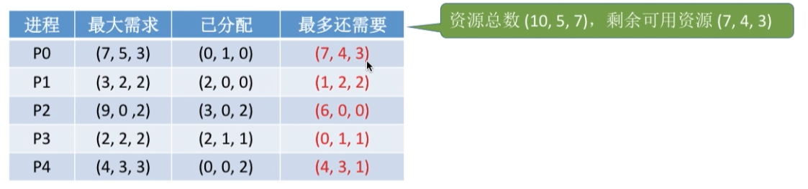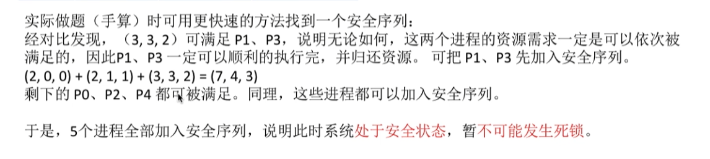

死锁的检测和解除

- 使用资源分配图保存资源的请求和分配信息
  - 进程节点、资源节点
  - 进程节点 $\to$ 资源节点（想申请的资源数）、资源节点 $\to$​ 进程节点（已经分配的资源数）
- 能消除所有边，图可完全简化，没有发生死锁，否则已经发生死锁
- 解除
  - 资源剥夺法：挂起（暂时放到外存）死锁进程并抢占资源
  - 撤销进程法：强制撤销部分/全部死锁进程，剥夺资源
  - 进程回退法：进程会退到避免死锁的底部