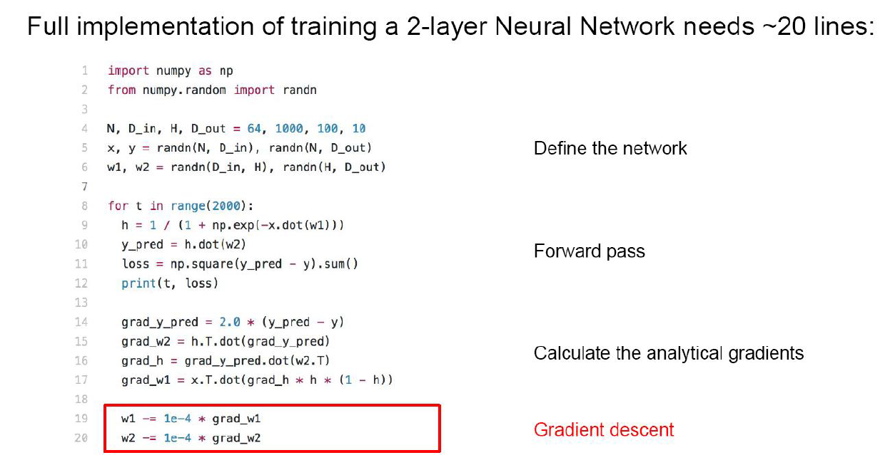
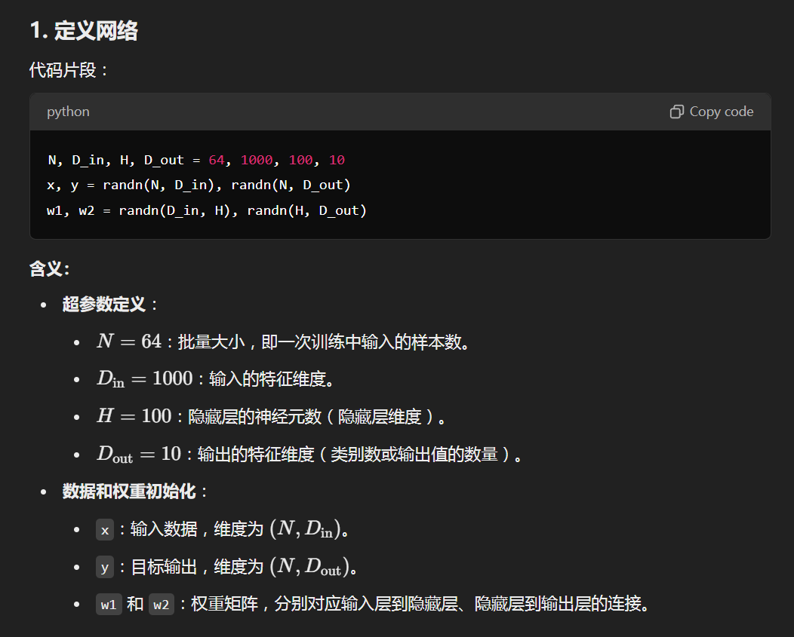
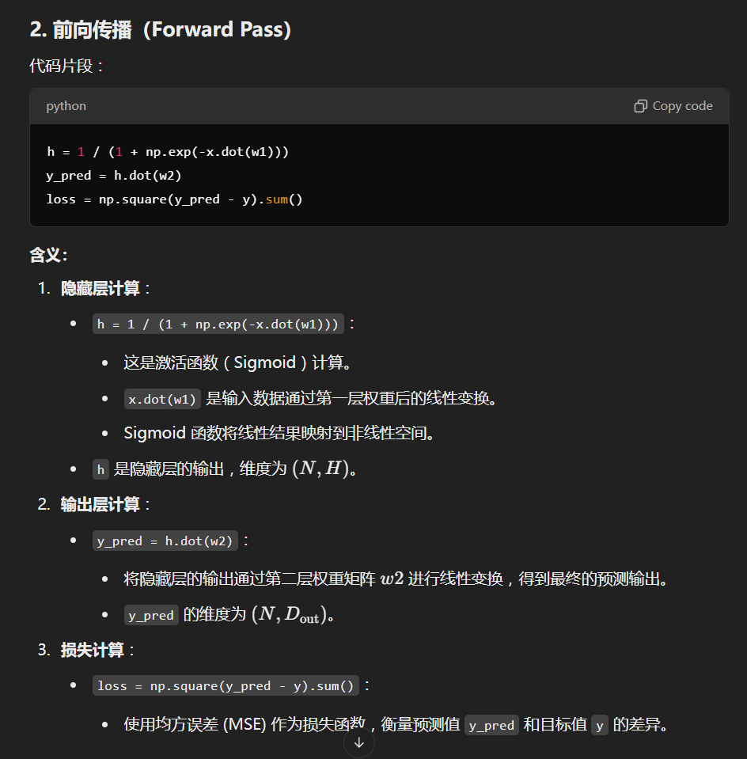
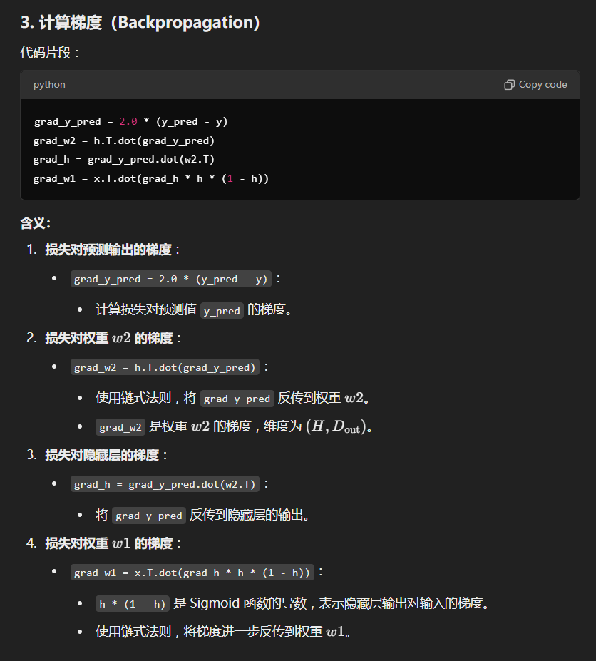
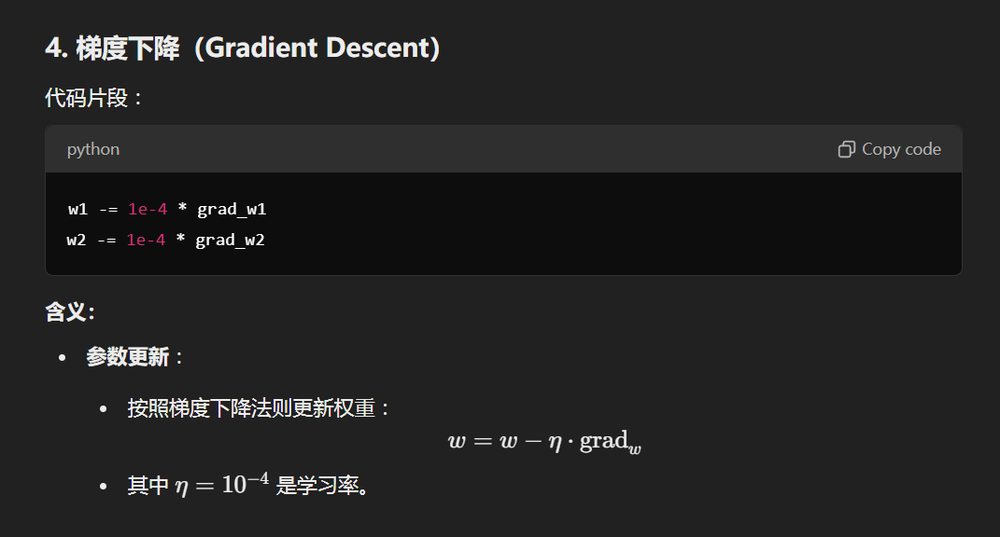

## **第一部分：基本概念**

---

### Lect 01

- 深度学习概述
  - 主流网络
    - 深度卷积网络：第一个卷积网络 LeNet，AlexNet 在 ImageNet上的性能引爆了深度学习，开启了深度学习时代
    - 深度自编码器：通过深度网络学习一个全等映射
    - 循环神经网络（RNN）：对时序数据有效处理工具。存在短期记忆问题，训练成本高
    - 生成对抗网络：GAN的主要结构包括⼀个生成器G（Generator）和一个判别器D（Discriminator）。生成器用于指导训练，判别器提供评判准则。实质是拟合真实样本的分布。
  - 在计算机视觉中的应用
    - 分类 Classification
    - 语义分割 Semantic Segmentation
      - 对图像中的每个像素标记类别标签。不区分实例，只关心像素
    - 对象检测 Object Detection
      - 输入：单个RGB图像
      - 输出：预测后的集合，对于每个预测的对象，标记分类标签（来自固定的、已知类别集合）与边界框（通过四个数字：x、y、宽度、高度）
    - 实例分割 Instance Segmentation
      - 检测图像中的所有对象，并识别属于每个对象的像素（仅限**可数物体**）。方法为先执行对象检测，然后为每个对象预测一个分割掩码。
    - 其他应用：动作识别、动作捕捉与拟合等

## Lect 02

- 深度学习的数学基础

  - 深度网络的组成

    - 神经元与感知器

      **概念：**感知器（Perceptron）是人工神经网络的基本单元，由 Frank Rosenblatt 于 1958 年提出，是一种用于二分类问题的线性分类模型。它模拟了生物神经元的工作原理，通过对输入数据加权求和并应用激活函数来决定输出。感知器是神经网络的基础，但由于其能力有限，后来发展出了多层感知器（MLP）和深度神经网络（DNN）。

      **组成：**一个感知器模型通常包括以下部分：

      1. **输入层**：
         - 输入特征 $\mathbf{x} = [x_1, x_2, \dots, x_n]$，每个特征对应一个输入神经元。
         
      2. **权重和偏置**：
         - 每个输入特征 $x_i$ 有对应的权重 $w_i$，权重表示该特征对输出的重要性。
         - 偏置 $b$ 是一个常数项，调节决策边界的位置。

      3. **加权求和**：
         - 对输入和权重进行线性组合：  
           $$
           z = \sum_{i=1}^n w_i x_i + b
           $$

      4. **激活函数**：
         - 对线性组合的结果 $z$ 应用一个激活函数 $\phi(z)$，决定输出结果。感知器的激活函数是**阶跃函数**：
           $$
           \phi(z) = 
           \begin{cases} 
           1, & \text{if } z \geq 0 \\
           0, & \text{if } z < 0
           \end{cases}
           $$

      5. **输出**：
         - 激活函数的结果作为感知器的输出，通常为 0 或 1（即二分类）。

      **工作原理：**感知器的工作可以分为以下步骤。

      1. **初始化**：初始化权重 $w_i$ 和偏置 $b$，通常为随机值或 0。
      2. **前向传播**：

      - 对输入数据 $\mathbf{x}$ 进行加权求和：  
        $$
        z = \sum_{i=1}^n w_i x_i + b
        $$
      - 将 $z$ 输入激活函数 $\phi(z)$，得到预测输出 $y_{\text{pred}}$。

      3. **计算误差**：比较预测值 $y_{\text{pred}}$ 和真实值 $y$，计算误差。

      4. **权重更新（学习）**：利用感知器学习规则更新权重和偏置，以减少误差：

      $$
      w_i \leftarrow w_i + \eta \cdot (y - y_{\text{pred}}) \cdot x_i
      $$
      $$
      b \leftarrow b + \eta \cdot (y - y_{\text{pred}})
      $$
      - 其中，$\eta$ 是学习率，控制更新步幅的大小。

      5. **迭代训练**：通过多次迭代（Epoch），重复上述步骤，直到误差最小化或达到最大迭代次数。

      **感知器的特点**

      1. 优点：简单易实现，计算量低。可以快速处理线性可分问题。
      2. 局限：**每个类别学习一个模板。**对于一个输入样本 $\mathbf{x}$，线性分类器计算它与每个类别模板 $\mathbf{w}_c$ 的匹配程度（通常是点积 $\mathbf{w}_c^\top \mathbf{x}$）。该样本被分配到最匹配的类别，通常是使点积最大的模板对应的类别；**只能解决线性可分问题**。如果数据集是线性不可分的，感知器无法找到正确的决策边界。

      **问题解决**

      - **特征变换**：通过将原始数据变换到更高维或更具判别力的特征空间，使得非线性问题变成线性问题，然后在变换后的特征空间中应用线性分类器。
        - 颜色直方图（Color Histogram）：用于描述图像中颜色的分布。每个像素的颜色值被映射到直方图中，形成一种全局的特征表示。
        - 方向梯度直方图（Histogram of Oriented Gradients, HoG）：用于捕捉图像的局部纹理特征，尤其适用于检测边缘或形状。常见于图像处理和目标检测任务。

      - **多层感知机 MLP**：通过引入隐藏层和非线性激活函数，增强感知机的表达能力，使其可以解决非线性问题。多层感知机的非线性能力依赖于非线性激活函数（如 ReLU、Sigmoid）。如果没有激活函数，层与层之间的线性变换会被合并为一个线性变换，多层感知机最终退化为一个线性分类器。

    - 代码案例：

      - 
      - 
      - 
      - 
      - 

  - 损失函数与优化

    损失函数（Loss Function）是机器学习模型中用来衡量模型预测结果与真实标签之间差异的函数。它是训练过程中优化的核心，模型的目标是最小化损失函数的值，从而提高模型在任务上的性能。

    总损失函数 $L(W)$ 包含两个部分：

    $L(W) = \frac{1}{N} \sum_{i=1}^N L_i(f(x_i, W), y_i) + \lambda R(W)$

    - **数据损失（Data Loss）**：

      $\frac{1}{N} \sum_{i=1}^N L_i(f(x_i, W), y_i)$

      - 描述模型预测值 $f(x_i, W)$ 与真实值 $y_i$ 之间的误差。
      - 核心目标：使模型在训练数据上的预测更准确。
      - 常见形式包括均方误差（MSE）和交叉熵损失。

    - **正则化项（Regularization Term）**：

      $\lambda R(W)$

      - 正则化项本质上是通过“增加”损失函数的值来迫使模型在优化过程中寻找更平衡的解。它使得模型在训练数据上不过度优化，避免在训练数据上学习到过多的噪声和细节，从而提高模型对未知数据的泛化能力。
      - $R(W)$ 是正则化函数，用于度量模型参数的复杂度。
      - $\lambda$ 是正则化强度超参数，控制数据损失与正则化的权衡
        - $\lambda$ 的取值决定了正则化项在总损失中的权重：
        - **$λ$ 较大**：增加正则化项的影响，限制模型复杂度，可能导致欠拟合。
        - **$ \lambda$ 较小**：减少正则化项的影响，使模型更自由，可能导致过拟合。

  - **正则化的核心目的**：**防止模型过拟合**。过拟合现象表现为模型对训练数据的误差很小，但在测试数据上的误差很大，原因是模型学习了训练数据中的噪声或偶然模式，而不是泛化规律。

    - **表达对权重的偏好**：通过在损失函数中加入额外的约束项（如L1正则化、L2正则化等），可以对模型的权重进行惩罚，从而限制模型的复杂度。这种惩罚有助于避免模型学习到不必要的复杂模式，防止过拟合。
    - **简化模型，提升泛化能力**：正则化通过鼓励较小的权重或稀疏的权重分布，促使模型变得更简单，这有助于模型在未知数据上的表现。简单的模型往往能够更好地推广到测试数据上，而不是仅仅记住训练数据中的噪声。
    - **改善优化过程**：在优化时，正则化项可以增加损失函数的曲率，使得优化过程变得更加平滑和稳定。这样，模型的训练过程不仅可以避免过拟合，还能够更容易找到全局最优解或局部最优解，从而提高模型的性能。

  - **常见的正则化方法**

    1. **L2 正则化**（Ridge Regression）：

       $R(W) = \sum_k \sum_l W_{k,l}^2$

       - 惩罚所有权重平方的总和，鼓励权重更小、更平滑。
       - 通常用于减轻模型的高复杂度。

    2. **L1 正则化**（Lasso Regression）：

       $R(W) = \sum_k \sum_l |W_{k,l}|$

       - 惩罚所有权重的绝对值和，倾向于使一些权重变为零，从而实现特征选择。

    3. **Elastic Net 正则化**（L1 + L2）：

       $R(W) = \sum_k \sum_l (\beta W_{k,l}^2 + |W_{k,l}|)$

       - 结合 L1 和 L2 正则化的优点，平衡特征选择和权重平滑。

  - **更复杂的方法**：

    1. **Dropout**：
       - 随机丢弃网络中的一部分神经元（即使其输出为零），以降低对特定神经元的依赖。
       - 提高网络的鲁棒性，防止过拟合。
    2. **Batch Normalization**：
       - 对每层的激活值进行归一化，防止梯度消失或爆炸。
       - 间接起到正则化的作用。
    3. **其他方法**：
       - 随机深度（Stochastic Depth）、分数池化（Fractional Pooling）等高级方法，旨在通过多样化的结构降低过拟合风险。

  - **softmax 分类器**

    Softmax函数是一种常用于多分类问题的激活函数，它将一个包含任意实数的向量变换为一个概率分布向量。具体来说，Softmax将输入向量中的每个元素映射到[0, 1]范围内，并且这些元素的总和为1。

    **Softmax函数公式**

    对于一个具有 $k$ 个类别的分类问题，假设输入向量为 $\mathbf{z} = [z_1, z_2, \ldots, z_k]$，Softmax函数的输出为 $\mathbf{y} = [y_1, y_2, \ldots, y_k]$，那么Softmax函数的计算公式为：

    $$ y_i = \frac{e^{z_i}}{\sum_{j=1}^k e^{z_j}} $$

    其中，$e$ 是自然对数的底数，$y_i$ 表示第 $i$ 个类别的概率。

    **工作原理**

    1. **计算指数**：对输入向量中的每个元素求指数。这将把原始值转换为非负数。
    2. **归一化**：将所有指数值求和，然后用每个指数值除以这个总和。这一步将确保输出向量中的每个元素都是[0, 1]范围内的数，并且它们的总和为1，从而构成一个有效的概率分布。

    **例子**

    假设我们有一个三分类问题，输入向量为 $[3.2, 5.1, -1.7]$，那么Softmax的计算过程如下：

    1. **计算指数**：
       $$ e^{3.2} = 24.5 $$
       $$ e^{5.1} = 164.0 $$
       $$ e^{-1.7} = 0.18 $$

    2. **求和**：
       $$ 24.5 + 164.0 + 0.18 = 188.68 $$

    3. **归一化**：
       $$ y_1 = \frac{24.5}{188.68} \approx 0.13 $$
       $$ y_2 = \frac{164.0}{188.68} \approx 0.87 $$
       $$ y_3 = \frac{0.18}{188.68} \approx 0.00 $$

    **应用**

    Softmax函数在多分类神经网络（如卷积神经网络）中的最后一层非常常见。它不仅能够将网络输出转换为概率，还能通过最大概率类别选择最终分类结果。

  - **优化 optimization**

    1. **数值梯度（Numerical Gradient）**

    数值梯度是通过**有限差分法**近似计算梯度的一种方法。其核心思想是利用函数值的变化率来估计梯度。

    **特点**：

    - **优点**：简单直观，易于实现。只需要计算损失函数的前向传播，适用于任何复杂的函数。
    - **缺点**：计算速度非常慢，因为每个参数都需要进行两次前向传播（+ε 和 -ε），对于大规模模型（例如深度学习中的数百万参数），计算量巨大。此外，它是近似值，可能有数值误差。

    2. **解析梯度（Analytic Gradient）**

    解析梯度是通过**反向传播（Backpropagation）**或数学推导直接计算梯度的一种方法。它利用损失函数的数学表达式，对权重求导以获得梯度。

    **特点**：

    - **优点**：计算精确且速度快，尤其是在使用深度学习框架（如TensorFlow、PyTorch）时，解析梯度是自动计算的，效率极高。
    - **缺点**：推导复杂，容易出错。实现反向传播时，任何小的错误（如索引、符号错误）都会导致梯度计算不正确。

    3. 在实际应用中，建议的做法是：

    - **优先使用解析梯度**：因为它计算精确且速度快，适合大规模模型的优化。

    - **梯度检查（Gradient Check）**：在实现解析梯度时，为了验证其正确性，可以用数值梯度进行对比检查。这种方法称为梯度检查。

      - 对每个参数，用数值梯度方法计算近似梯度。

      - 用解析梯度方法计算相应梯度。

      - 比较两者的差异，差异应非常小（通常在 $10^{-5}$ 或更小）。

  - 反向传播算法

  - 总结

    - **全连接神经网络的结构和功能**：
      - **全连接神经网络**是由一系列线性函数和非线性激活函数堆叠而成的。与线性分类器相比，神经网络具有更强的表示能力，能够捕捉更复杂的数据模式。
      - **线性函数**是指通过加权求和来处理输入的函数，而**非线性激活函数**（例如ReLU、Sigmoid、Tanh等）则使得神经网络能够处理非线性问题，增强其表达能力。
    - **反向传播算法（Backpropagation）**：
      - 反向传播是一个通过计算图应用链式法则（chain rule）递归地计算所有输入、参数和中间变量的梯度的过程。
      - **链式法则**是微积分中的一个重要规则，用于计算复合函数的导数。在神经网络中，反向传播通过递归应用链式法则，逐层计算损失函数对各层参数的梯度，从而更新权重。
    - **实现方式**：
      - 神经网络的实现通常会维护一个计算图（computational graph），其中每个节点代表一个操作，分为**前向传播（forward）**和**反向传播（backward）**两个阶段。
      - **前向传播（forward）**：计算操作的结果，并将中间结果保存到内存中，以便在反向传播时使用。这是神经网络执行计算的过程，得出网络的输出。
      - **反向传播（backward）**：应用链式法则计算损失函数相对于输入的梯度。在反向传播过程中，从输出层开始逐层计算梯度，并将这些梯度传递回每一层，用于调整模型参数（权重和偏置）。

  

## Lect 03

这段话概述了深度学习模型训练的三个主要阶段及其核心内容：

### **1. 一次性设置/训练前设置（One time setup）**

这是模型训练前的准备阶段，主要包括以下内容：

- **激活函数（Activation functions）**：选择适合的激活函数（如ReLU、Sigmoid、Tanh等），以引入非线性能力，使模型能够表示复杂的函数。

  - Sigmoid函数的性质

  1. **压缩数值**：将任意实数压缩到[0,1]的范围内。
  2. **解释为概率**：输出值可以直接解释为某一事件发生的概率。
  3. **光滑且可微**：这是其在神经网络中的重要性质，因为可微性使得反向传播算法能够计算梯度。

  - Sigmoid函数的问题

  1. **梯度消失**：当输入值绝对值较大时，Sigmoid函数的梯度趋近于0，这会导致训练过程中梯度消失，更新停滞。
  2. **输出不居中**：输出值总是正的，导致神经元的输入信号偏向一侧，这可能影响训练效果。
  3. **计算开销大**：Sigmoid函数计算涉及指数运算，在一些情况下计算效率较低。

  

  - 双曲正切函数的性质

  1. **压缩范围**：将输入值压缩到[-1, 1]范围内。
  2. **零中心化**：输出值在零附近对称分布，有助于加快神经网络的训练速度。
  3. **较大的梯度**：在输入值绝对值较大时，tanh函数的梯度仍然趋向于0（梯度消失问题），但在 [-1, 1] 范围内，其梯度比Sigmoid函数要大。

  - 优点与缺点

    **优点**：

    - **零中心化**：有助于避免神经元输入信号的偏移，使得梯度更新更加稳定。
    - **梯度较大**：相比Sigmoid函数，tanh函数在 [-1, 1] 范围内的梯度更大，有助于缓解梯度消失问题。

    **缺点**：

    - **梯度消失**：在输入值绝对值较大时，tanh函数的梯度仍然趋向于0，可能导致训练过程中的梯度消失问题。
    - **计算开销**：与Sigmoid函数类似，tanh函数的计算也涉及指数运算，在某些情况下计算效率较低。

    

  - ReLU函数的优点

    1. **不饱和**：在正数区域内，ReLU函数不会饱和，这意味着其导数总是1，有助于缓解梯度消失问题。
    2. **计算效率高**：ReLU函数的计算非常简单，仅需比较和取最大值，计算效率远高于Sigmoid和tanh函数。
    3. **收敛速度快**：在实际应用中，使用ReLU激活函数的神经网络比使用Sigmoid或tanh激活函数的网络收敛速度更快，通常加速6倍左右。

  - ReLU函数的缺点

    1. **输出不居中**：ReLU函数的输出值总是非负的，这意味着输出信号不居中，可能导致神经元激活的偏移。
    2. **“死亡ReLU”问题**：当输入值始终为负时，ReLU函数的输出始终为0，导致这些神经元无法更新参数，从而“死亡”。

  

  - Leaky ReLU

    **Leaky ReLU**（漏泄整流线性单元）是ReLU（整流线性单元）的变体。与ReLU不同，Leaky ReLU允许对负输入值有一个小的负斜率，从而解决ReLU在负值区域输出恒为零的问题。

  - Leaky ReLU的优点

    1. **不饱和**：在正数区域内不会饱和，导数为1，有助于缓解梯度消失问题。
    2. **计算效率高**：计算简单，仅需比较和取最大值，计算效率高。
    3. **收敛速度快**：相比于Sigmoid和tanh函数，Leaky ReLU的收敛速度更快，通常加速6倍左右。
    4. **解决“死亡ReLU”问题**：即使输入值为负，输出值也不会始终为0，有助于避免神经元“死亡”。

  - PReLU（Parametric ReLU）

    **PReLU**（参数化整流线性单元）是Leaky ReLU的进一步推广版本。它引入了一个可学习的参数 α\alpha 来代替固定的负斜率，使得模型可以通过训练来确定最佳的负斜率。

  - PReLU的优势

    1. **自适应负斜率**：α 参数可以自适应调整，确保在不同的应用场景下具有最佳的性能。
    2. **缓解梯度消失问题**：通过可变的负斜率系数，有助于缓解梯度消失问题。
    3. **提高模型表现**：实验表明，使用PReLU的神经网络在图像分类任务中可以超越人类水平的表现。

    

- **数据预处理（Data preprocessing）**：对输入数据进行清理和变换，例如归一化、标准化或去除异常值，以确保数据质量和模型的训练效果。

  当输入 $x_i$ 始终为正时，会导致以下问题：

  1. **梯度的符号一致性**：
     - 如果所有输入 $x_i$ 都是正数，那么线性组合 $\sum_{i} w_i x_i + b$ 的变化主要取决于权重 $w_i$ 和偏置 $b$。
     - 激活函数的导数将在正区间取值（例如ReLU函数在正区间为1），那么梯度方向总是正的或总是负的。
     - 这会导致权重的更新方向过于一致，可能无法充分探索参数空间，从而影响模型的训练效果。

  **数据预处理的重要性**

  PPT中指出，保持数据的零均值非常重要，因为它能够平衡梯度的分布。零均值数据具有以下优点：

  1. **平衡梯度**：

     - 数据居中后，正负输入值均衡，导致梯度更加分散，不会总是同一个方向，有助于更有效的权重更新。

  2. **加速收敛**：

     - 平衡的梯度分布能够加速梯度下降算法的收敛速度，提升训练效率。

  3. **防止饱和**：

     - 在使用非线性激活函数时，零均值数据能防止激活函数输出长期处于饱和状态，避免梯度消失问题。

     **PCA（主成分分析）**

     #### 原理

     PCA是一种数据降维技术，通过将数据转换到一个新的坐标系中，使得最大的方差投影到新的坐标系的前几个轴上。PCA的主要目标是找到数据的主成分，这些主成分是能够解释数据最大方差的方向。

     #### 过程

  4. **标准化数据**：将数据标准化，使每个特征具有均值为0和标准差为1。

  5. **计算协方差矩阵**：计算标准化数据的协方差矩阵，表示特征之间的线性关系。

  6. **计算特征值和特征向量**：对协方差矩阵进行特征值分解，得到特征值和特征向量。

  7. **选择主成分**：选择具有最大特征值的前几个特征向量作为主成分。

  8. **转换数据**：将原始数据投影到选定的主成分上，得到降维后的数据。

     **数据白化（Whitening）**

     #### 原理

     数据白化是将数据转换为一个新的空间，使得新空间中的数据具有单位方差，并且协方差矩阵是单位矩阵（即对角矩阵中的对角线元素全为1，其余元素为0）。白化后的数据不相关且具有相同的方差。

     #### 过程

  9. **PCA降维**：首先通过PCA对数据进行降维，使得数据在新的坐标系中具有对角化的协方差矩阵。

  10. **缩放数据**：将降维后的数据进行缩放，使得每个特征的方差为1。这一步的公式为：

      $$ \mathbf{X}*{whitened} = \mathbf{X}*{decomposed} \times \mathbf{D}^{-1/2} $$

      其中，$\mathbf{X}_{whitened}$ 是白化后的数据，$\mathbf{X}_{decomposed}$ 是PCA降维后的数据，$\mathbf{D}^{-1/2}$ 是特征值的逆平方根对角矩阵。

      ### 解释PPT内容

      PPT中的三个散点图展示了原始数据、去相关数据和白化数据：

  11. **原始数据**：左侧的散点图显示了原始数据，数据点之间具有明显的相关性。

  12. **去相关数据**：中间的散点图展示了经过PCA降维后的数据，数据具有对角化的协方差矩阵。

  13. **白化数据**：右侧的散点图展示了经过白化处理后的数据，数据点不相关且具有单位方差，协方差矩阵为单位矩阵。

      通过PCA和白化处理，原始数据被转换为更适合后续分析和建模的形式，提升了数据的可解释性和模型的性能。

  14. **权重初始化（Weight initialization）**：为模型的参数设置初始值，常见方法有随机初始化（如Xavier或He初始化），以防止训练中梯度消失或爆炸。

  15. **正则化（Regularization）**：引入正则化技术（如L1、L2正则化或Dropout）来限制模型复杂度，避免过拟合。

      **归一化前**：

      - 分类损失对权重矩阵的变化非常敏感，优化难度较大。
      - 图中展示的分类决策边界无法很好地区分红色圆圈和蓝色三角形。

      **归一化后**：

      - 分类损失对小的权重变化不那么敏感，优化变得更容易。
      - 图中展示的分类决策边界更好地区分了红色圆圈和蓝色三角形。

- **权重初始化（Weight initialization）**：为模型的参数设置初始值，常见方法有随机初始化（如Xavier或He初始化），以防止训练中梯度消失或爆炸。
  - Xavier初始化方法适用于使用sigmoid或tanh激活函数的网络。它通过确保每层输入和输出的方差相同，来保持信号在前向传播和反向传播中的稳定。

- **正则化（Regularization）**：引入正则化技术（如L1、L2正则化或Dropout）来限制模型复杂度，避免过拟合。

  - 正则化技术是提高模型泛化能力的关键手段。L1和L2正则化通过约束权重大小来防止过拟合，而Dropout通过随机丢弃神经元，使得网络更加鲁棒和灵活。合理选择和组合这些正则化方法，可以有效提升模型的性能和稳定性。

  - Dropout是一种非常流行的正则化技术，尤其在深度神经网络中广泛应用。Dropout通过在每个训练步骤中随机“丢弃”（即忽略）一部分神经元及其连接来防止过拟合。

    #### Dropout的工作原理

    1. **训练阶段**：
       - 在每次训练迭代中，对每个神经元以概率 p 保留，以概率 1 - p 丢弃。
       - 丢弃的神经元不参与前向传播和反向传播，其输出被设为零。
    2. **测试阶段**：
       - 在测试阶段，所有神经元都被激活，但输出乘以一个因子 p，相当于对训练阶段的缩放进行补偿。

    #### 公式表示

    训练时的输出：

    $y = f\left( \sum_{i} w_i x_i + b \right) \cdot \text{mask}$

    其中，$\text{mask}$ 是一个二值向量，每个元素以概率 $p$ 为1，以概率 $1 - p$ 为0。

    测试时的输出：

    $y = p \cdot f\left( \sum_{i} w_i x_i + b \right)$

    #### Dropout的优点

    1. **防止过拟合**：
       - Dropout通过随机丢弃神经元，迫使网络不能依赖某些特定的神经元，从而提升了网络的鲁棒性和泛化能力。
    2. **提升模型的鲁棒性**：
       - 随机性使得模型更加鲁棒，可以有效应对不同数据的变化和噪声。
    3. **简化集成学习**：
       - Dropout相当于对多个子网络进行训练，每个子网络都使用不同的神经元子集。测试时等同于集成了这些子网络的输出。

- **数据增广（Data Augmentation）**：是一种在训练前预处理阶段常用的技术，特别是在图像和文本等数据领域。数据增广通过对训练数据进行一系列随机变换，从而生成新的数据样本，以增加训练数据的多样性和数量，防止模型过拟合并提升模型的泛化能力。以下是详细解释：

### 为什么需要数据增广

1. **防止过拟合**：通过增加训练数据的多样性，可以有效防止模型过拟合，从而提升模型的泛化能力。
2. **提升模型性能**：更多样化的训练数据可以帮助模型更好地学习特征，提高模型在实际应用中的表现。
3. **数据不足时的解决方案**：当训练数据有限时，数据增广可以帮助扩展数据集的规模。

### 常见的数据增广方法

#### 图像数据增广

1. **旋转**：随机旋转图像一定角度。
2. **翻转**：水平或垂直翻转图像。
3. **裁剪**：随机裁剪图像的某个部分并调整大小。
4. **平移**：在水平方向或垂直方向上平移图像。
5. **缩放**：随机缩放图像。
6. **颜色变换**：调整图像的亮度、对比度和饱和度。
7. **噪声**：添加随机噪声，使图像更加多样化。

#### 文本数据增广

1. **同义词替换**：随机替换句子中的某些词语为其同义词。
2. **随机插入**：随机插入新的词语到句子中。
3. **随机删除**：随机删除句子中的某些词语。
4. **随机交换**：随机交换句子中的某些词语的位置。

### **2. 训练动态（Training dynamics）**

在模型训练过程中，需要关注训练的动态行为和优化策略：

- **学习率调度（Learning rate schedules）**：根据训练进度动态调整学习率，例如使用指数衰减、余弦退火或循环学习率等策略，以更快收敛并稳定到较优解。

学习率衰减是一种通过逐渐减少学习率来稳定训练过程的方法。常见的学习率衰减方法包括：

#### Step Decay

Step Decay通过在固定的训练轮次后乘以一个因子来减少学习率。例如，对于ResNets，可以在第30、60和90个epoch后将学习率乘以0.1。具体公式如下：

$$ \text{LR}_{new} = \text{LR}_{initial} \times 0.1^{\left\lfloor \frac{\text{epoch}}{30} \right\rfloor} $$

优点：
- 简单易实现
- 在特定阶段可以显著减少学习率，稳定训练

#### Cosine Decay

Cosine Decay通过余弦函数来逐渐减少学习率，适用于需要平滑下降的场景。公式如下：

$$ \text{LR}(t) = \frac{1}{2} \left( \text{LR}_{initial} \right) \left(1 + \cos\left(\frac{t \pi}{T}\right)\right) $$

其中，\( t \) 是当前epoch，\( T \) 是总的训练epoch。

优点：
- 平滑的学习率下降，有助于避免震荡
- 在训练的最后阶段提供较小的学习率，提升精度

#### Linear Decay

Linear Decay通过线性函数逐渐减少学习率。公式如下：

$$ \text{LR}(t) = \text{LR}_{initial} - \left(\frac{\text{LR}_{initial} - \text{LR}_{final}}{T}\right) \times t $$

其中，\( t \) 是当前epoch，\( T \) 是总的训练epoch，\( \text{LR}_{final} \) 是最终学习率。

优点：
- 简单直观
- 均匀下降，适用于一些简单任务

#### Inverse Sqrt Decay

Inverse Sqrt Decay通过平方根函数来减少学习率，常用于自然语言处理模型中。公式如下：

$$ \text{LR}(t) = \frac{\text{LR}_{initial}}{\sqrt{1 + t}} $$

优点：
- 能有效平衡初期快速学习和后期稳定学习
- 适用于长时间训练任务

### 2. Constant Learning Rate

Constant Learning Rate保持学习率恒定，即在整个训练过程中学习率不变。这种方法在某些简单任务或对学习率不敏感的模型中有效。

- **大批量训练（Large-batch training）**：探索大批量（batch size）的影响，大批量训练可以加速计算，但可能导致模型性能下降，需要结合优化策略。

- **超参数优化（Hyperparameter optimization）**：通过搜索（如网格搜索、随机搜索或贝叶斯优化）来调节超参数（如学习率、批量大小、正则化强度等），以获得最佳模型性能。

### Step 1: Check Initial Loss

**初始损失检查**

首先，在训练模型之前，我们需要确保初始损失是合理的。初始损失可以告诉我们模型是否能够正确处理输入数据以及初始化权重是否适当。如果初始损失过高或过低，可能意味着数据或模型存在问题，需要进行调整。

### Step 2: Overfit a Small Sample

**在小样本上过拟合**

接下来，在一个较小的样本上训练模型并使其过拟合。这一步的目的是确保模型具有足够的容量来学习训练数据。如果模型在小样本上都无法达到较低的损失，可能需要增加模型的复杂度（如增加层数或神经元数量）。

### Step 3: Find Learning Rate that Makes Loss Go Down

**找到能使损失下降的学习率**

学习率是训练过程中最重要的超参数之一。我们需要找到一个合适的学习率，使得损失函数在每次迭代中都能减小。可以通过实验不同的学习率值，观察损失函数的变化趋势来确定最佳学习率。

### Step 4: Coarse Grid, Train for ~1-5 Epochs

**粗略网格搜索，训练1-5个Epoch**

在找到一个合适的学习率后，可以进行粗略的网格搜索，即在一组可能的超参数组合上进行测试，并训练1到5个epoch。通过这种方式，可以快速缩小超参数的搜索范围。

### Step 5: Refine Grid, Train Longer

**精细网格搜索，延长训练时间**

在粗略网格搜索的基础上，进一步细化超参数的搜索范围，并进行更长时间的训练。这一步的目的是通过更精确的搜索找到最优的超参数组合，从而提升模型的性能。

### Step 6: Look at Learning Curves

**观察学习曲线**

最后，通过观察训练和验证过程中的学习曲线，评估模型的表现。学习曲线可以帮助我们判断模型是否过拟合或欠拟合，并确定是否需要进一步调整超参数或模型架构。

### **3. 训练后（After training）**

训练完成后，进一步优化和提升模型性能：

- **模型集成（Model ensembles）**：结合多个训练好的模型的预测结果（如平均或投票）以提升总体性能和稳定性。

- **迁移学习（Transfer learning）**：将一个模型在某个任务上学到的知识（如预训练权重）迁移到另一个相似任务上，从而加快收敛速度并提高性能。

- **分布式训练**是一种加速训练深度神经网络的方法，尤其是在处理大规模数据和复杂模型时。通过分布式训练，可以将计算任务分配到多个计算节点（如CPU、GPU或TPU）上，从而利用多个计算资源并行进行训练，大幅缩短训练时间。以下是详细的解释：

  ### 为什么需要分布式训练？

  1. **大规模数据**：深度学习通常需要处理大量数据，单个计算节点可能难以在合理的时间内完成训练。
  2. **复杂模型**：深度神经网络模型的参数数量非常庞大，训练这些模型需要大量的计算资源和内存。
  3. **加速训练**：通过并行处理，可以显著加速模型训练，提高效率。

  ### 分布式训练的类型

  1. **数据并行（Data Parallelism）**：将训练数据分割成多个子集，每个计算节点处理一个子集，并行进行前向传播和反向传播。每个节点计算自己的梯度，然后汇总梯度并更新全局模型参数。
  2. **模型并行（Model Parallelism）**：将模型的不同部分分配给不同的计算节点。每个节点只计算模型的一部分，节点之间通过传递中间结果进行通信。这种方法适用于模型非常大、单个节点内存不足以容纳整个模型的情况。
  3. **混合并行（Hybrid Parallelism）**：结合数据并行和模型并行，综合利用两者的优点。适用于非常大规模的数据和模型。

## Lect 04

### 深度卷积网络

### 深度卷积网络（Deep Convolutional Neural Networks, CNNs）的介绍

根据该PPT中关于卷积网络基本概念的内容，我们可以从以下几个方面详细展开对深度卷积网络的介绍：

------

### **1. 卷积操作的基本原理**

卷积神经网络的核心操作是卷积，它通过滤波器（Kernel）提取输入数据的局部特征。具体参数包括：

- **输入数据维度**：Cin×H×W
  - Cin：输入的通道数（如RGB图像有3个通道）。
  - H 和 W：输入数据的高度和宽度。
- **超参数**：
  - **Kernel大小** (KH×KW)：决定滤波器的区域范围，通常为小的正方形（如3x3或5x5）。
  - **滤波器个数** (Cout)：决定输出的特征图数量。
  - **Padding** (P)：对边界进行补零操作以保留尺寸，"same padding"常用于保持输出与输入大小一致。
  - **Stride** (S)：卷积窗口的滑动步幅，影响输出特征图的大小。
- **权重矩阵**：卷积操作涉及 Cout×Cin×KH×KW 的权重矩阵。
- **输出大小**：
  - 高度和宽度的计算公式为： $H' = \frac{H - K + 2P}{S} + 1, \quad W' = \frac{W - K + 2P}{S} + 1$
  - 输出特征图的通道数为 Cout。

------

### **2. 深度卷积网络的特点**

深度卷积网络是一种基于多层卷积的架构，能够逐步从低级到高级提取输入数据的特征：

1. **层次化特征提取**：
   - **浅层卷积**：提取边缘、纹理等低级特征。
   - **深层卷积**：提取形状、模式等高级特征。
2. **参数共享**：
   - 卷积核参数在输入的不同位置共享，显著减少了模型参数量，提高了训练效率。
3. **局部感知**：
   - 每个卷积核仅关注局部区域，有效捕捉局部特征，同时通过层叠结构获取全局信息。

------

### **3. 常见的卷积网络设置**

PPT中提到的一些典型配置：

- **3x3卷积** (K=3,P=1,S=1)：最常用的配置，既保留尺寸又提取局部特征。
- **5x5卷积** (K=5,P=2,S=1)：适用于提取更大范围的特征。
- 1x1卷积 (K=1,P=0,S=1)：
  - 用于减少通道维度，提高网络效率。
  - 常见于ResNet中的瓶颈结构。
- **下采样卷积** (K=3,P=1,S=2)：通过步幅为2的卷积实现空间尺寸的下采样。

------

### **4. 深度卷积网络的典型架构**

#### **4.1 经典模型**

- LeNet-5：
  - 最早的卷积网络，用于手写数字识别。
  - 包括卷积层和全连接层。
- AlexNet：
  - 引入ReLU激活函数和数据增强。
  - 证明深度网络在大规模图像分类中的强大能力。
- VGGNet：
  - 全部采用3x3卷积核，易于理解和实现。

#### **4.2 改进模型**

- ResNet：
  - 引入残差连接（Residual Connections），解决深层网络中的梯度消失问题。
- Inception：
  - 通过混合不同大小的卷积核，捕获多尺度特征。
- MobileNet：
  - 使用深度可分离卷积（Depthwise Separable Convolutions）降低计算复杂度。

------

### **5. 深度卷积网络中的其他关键概念**

#### **5.1 激活函数**

- 常用激活函数有ReLU、Leaky ReLU、Sigmoid、Tanh等。
- ReLU（修正线性单元）能有效缓解梯度消失问题，成为主流选择。

#### **5.2 正则化和归一化**

- **正则化**：防止过拟合，常见方法包括Dropout和权重衰减。
- **批量归一化（Batch Normalization）**：加速训练，提高收敛性。

#### **5.3 池化层**

- 最大池化（Max Pooling）和平均池化（Average Pooling）通过降维保留关键特征。

### 池化（Pooling）简介

池化是一种对特征图进行降维和特征提取的操作，通常用于减少数据的空间尺寸，从而减少计算量和防止过拟合。池化层不包含任何可学习的参数，因此不会增加模型的复杂度。

### 输入格式

池化层的输入格式通常为 \(C \times H \times W\)，其中：
- \(C\) 是通道数（通常为卷积层输出的通道数）
- \(H\) 是特征图的高度
- \(W\) 是特征图的宽度

### 超参数

池化层有几个关键的超参数：

1. **核大小（Kernel Size, K）**：
   - 核的大小决定了池化窗口的尺寸，常见的设置有 \(2 x 2\) 和 \(3 x 3\)。

2. **步长（Stride, S）**：
   - 步长决定了池化窗口在输入特征图上的移动步幅，常见的设置有2和1。

3. **池化函数（Pooling Function）**：
   - 池化函数决定了池化操作的类型，常见的函数包括最大池化（Max Pooling）和平均池化（Average Pooling）。

### 输出格式

池化层的输出格式为 $C \times H' \times W'$，其中：
- $H' = \left(\frac{H - K}{S}\right) + 1$
- $W' = \left(\frac{W - K}{S}\right) + 1$

### 常见设置

1. **最大池化（Max Pooling）**：
   - \(K = 2\)，\(S = 2\)（这种设置广泛应用于各种网络结构中）
   - \(K = 3\)，\(S = 2\)（如AlexNet中采用的设置）

### 学习参数

池化层没有可学习的参数，这意味着其操作是固定的，不会在训练过程中更新。这使得池化层的计算开销较低，同时能有效地减少数据的空间尺寸。

### 池化的作用

1. **降维**：通过池化操作，可以减少特征图的尺寸，从而减少计算量和内存占用。
2. **特征提取**：池化可以有效地提取特征，保留重要信息，忽略不重要的细节。
3. **防止过拟合**：池化层通过降低特征图的分辨率，有助于防止模型在训练数据上过拟合。

------

### **6. 应用场景**

深度卷积网络的应用十分广泛，包括但不限于以下领域：

- 计算机视觉：
  - 图像分类（如ImageNet任务）。
  - 目标检测（如YOLO、Faster R-CNN）。
  - 图像分割（如U-Net）。
- 自然语言处理：
  - 文本分类、情感分析（利用卷积处理文本序列）。
- 医学影像：
  - 病灶检测和分割。

## Lect 05

### 深度自编码器详细介绍

------

### **（1）无监督学习的重要性及其作用**

#### **无监督学习的重要性**

无监督学习是机器学习中的重要分支，其主要特点是数据没有标注，通过探索数据的内在结构进行学习。无监督学习在以下场景中具有重要作用：

- **大规模数据处理**：大多数现实数据没有标注，标注过程通常昂贵且耗时，无监督学习能够充分利用这些数据。
- **特征学习**：无监督学习擅长从高维数据中提取关键特征，用于后续的分类、聚类或生成任务。
- **降维与数据可视化**：通过无监督学习技术，可以将高维数据映射到低维空间，方便理解和分析。

#### **监督学习 vs 无监督学习**

- **监督学习**：使用标注数据进行训练，目标是学习输入到输出的映射关系，常用于分类、回归等任务。
- **无监督学习**：无需标注数据，目标是挖掘数据的内在模式，例如聚类、降维、异常检测等。

#### **判别学习 vs 生成学习**

- **判别学习**：关注直接学习输入到输出的决策边界，如逻辑回归和支持向量机。
- **生成学习**：专注于学习数据的分布及生成过程，如深度自编码器和生成对抗网络（GAN）。

无监督学习通常属于生成学习的范畴，旨在理解数据的结构，从中提取潜在信息。

------

### **（2）传统数据降维方法**

#### **主成分分析（PCA）**

PCA是一种经典的线性降维方法，通过将高维数据投影到低维空间，使得投影后的数据具有最大方差。

- **最大方差投影**：选择一组正交方向，使得投影数据的方差最大，从而保留尽可能多的信息。
- **最小重建误差**：通过最小化重建误差，找到数据的最优低维表示。

PCA等价于一种线性自编码器，其中：

- 编码器将数据从高维映射到低维表示。
- 解码器将低维表示重建回高维数据。

#### **从线性自编码器到深度自编码器**

- **线性自编码器**：编码器和解码器都为线性映射，其性能等价于PCA，无法处理非线性数据。
- **深度自编码器**：通过引入多层神经网络和非线性激活函数，深度自编码器能够处理复杂的非线性数据，提取更加灵活的低维表示。

------

### **（3）无监督学习的重要分支：深度自编码器**

#### **深度自编码器的基本构造**

深度自编码器是一种非监督神经网络模型，由两部分构成：

1. **编码器（Encoder）**：将输入数据从高维映射到低维潜在空间，提取紧凑的特征表示。
2. **解码器（Decoder）**：将低维潜在表示重建回高维数据，保证数据的主要信息不丢失。

其结构通常包含多个隐藏层，每层通过非线性激活函数进行变换：

$z = \text{Encoder}(x) \quad \text{and} \quad x' = \text{Decoder}(z)$

目标是最小化输入 xx 和重建数据 x′x' 的差异（如均方误差）。

#### **卷积与反卷积**

- **卷积（Convolution）**：
  - 卷积自编码器用于处理图像或时序数据。编码器通过卷积操作提取局部特征，将输入图像编码为低维特征图。
  - 卷积能够有效捕获空间上的局部依赖性，同时显著减少参数量。
- **反卷积（Deconvolution）**：
  - 解码器通过反卷积或上采样操作将低维特征图还原到原始输入的分辨率。
  - 反卷积是卷积操作的逆过程，用于重建数据。

#### **深度自编码器的优势**

- **强表达能力**：能够处理高维非线性数据。
- **降维与特征提取**：生成更紧凑且有意义的低维表示。
- **多样化应用**：被广泛应用于异常检测、图像去噪、生成数据等任务

### 深度自编码器及其变种详细介绍

深度自编码器是一种无监督学习方法，通过将高维数据映射到低维潜在空间再重建数据来学习其表示。为适应不同任务，深度自编码器衍生出多个变种，如降噪自编码器、稀疏自编码器和变分自编码器。

------

### **（1）降噪自编码器（Denoising Autoencoder, DAE）**

#### **核心思想**

降噪自编码器通过引入噪声对数据进行扰动，然后训练网络将受扰动的数据重建为原始的无噪声数据。目标是提高自编码器对输入数据的鲁棒性，增强特征学习的泛化能力。

#### **工作原理**

- 输入数据 $x$ 被添加噪声生成 $x_{\text{noisy}}$，如高斯噪声、掩盖部分数据（masking noise）等。
- 编码器将 $x_{\text{noisy}}$ 映射到潜在空间表示 $z = \text{Encoder}(x_{\text{noisy}})$。
- 解码器从潜在空间重建无噪声数据 $x' = \text{Decoder}(z)$。
- 损失函数通过最小化原始数据 $x$ 和重建数据 $x'$ 的差异：

$L = \|x - x'\|^2$

#### **应用场景**

- 数据去噪：从受噪声污染的数据中恢复原始数据（如图像去噪）。
- 特征学习：通过对抗噪声学习稳健的特征表示，提升模型的鲁棒性。

------

### **（2）稀疏自编码器（Sparse Autoencoder, SAE）**

#### **核心思想**

稀疏自编码器通过在潜在表示 $z$ 上施加稀疏性约束，使得编码器只激活部分神经元。这种稀疏表示有助于捕获数据的重要结构信息。

#### **稀疏性约束方法**

- 添加正则化项，如KL散度：

  - 控制潜在表示的激活分布，使其接近目标稀疏分布（如稀疏性目标为 $\rho$，神经元激活均值为 $\hat{\rho}$）。
  - KL散度正则化项：

  $L_{\text{sparse}} = \sum_{j} \rho \log \frac{\rho}{\hat{\rho}_j} + (1-\rho) \log \frac{1-\rho}{1-\hat{\rho}_j}$

- 使用 $L_1$ 正则化：直接约束潜在表示 $z$ 的激活值，使其稀疏：

$L_{\text{sparse}} = \lambda \|z\|_1$

#### **特点**

- 强制网络学习更简洁的特征表示，减少冗余信息。
- 提升模型的解释性和特征提取能力。

#### **应用场景**

- 特征选择：在高维数据中提取关键特征。
- 图像表示学习：提取稀疏特征用于图像分类或识别。

------

### **（3）变分自编码器（Variational Autoencoder, VAE）**

#### **核心思想**

变分自编码器是一种生成模型，融合了自编码器和概率图模型的优点。VAE通过学习数据的概率分布，从潜在空间中采样来生成新数据。

#### **工作原理**

1. **潜在空间分布假设**：

   - 假设潜在空间 $z$ 服从某种先验分布（通常是标准正态分布 $p(z) \sim \mathcal{N}(0, I)$）。
   - 编码器输出潜在分布的参数（均值 $\mu$ 和标准差 $\sigma$），而不是确定的值：

   $q(z|x) \sim \mathcal{N}(\mu, \sigma)$

2. **重参数技巧（Reparameterization Trick）**：

   - 为了计算梯度，使用重参数化技巧将随机采样转化为可微操作：

   $z = \mu + \sigma \cdot \epsilon \quad (\epsilon \sim \mathcal{N}(0, I))$

3. **解码器重建数据**：

   - 解码器从潜在分布 $z$ 中采样并生成数据 $x' = \text{Decoder}(z)$

4. **损失函数**：

   - 结合重建误差和KL散度，鼓励潜在分布 $q(z|x)$ 接近先验分布 $p(z)$：

   $L = \mathbb{E}_{q(z|x)}[\|x - x'\|^2] + \text{KL}(q(z|x) \| p(z))$

#### **特点**

- 能够生成新数据，适用于生成模型任务。
- 通过概率方法建模潜在空间，能够有效捕捉数据分布。

#### **应用场景**

- 数据生成：生成图像、文本或其他形式的高质量新数据。
- 异常检测：通过评估样本在潜在空间中的概率，检测异常数据。
- 数据表示学习：学习潜在空间表示用于分类或回归任务。

------

### **总结**

- **降噪自编码器**通过添加噪声增强模型的鲁棒性，用于数据去噪和特征学习。
- **稀疏自编码器**通过稀疏性约束提取关键特征，用于高维数据的特征选择。
- **变分自编码器**融合生成模型的思想，能够建模数据分布和生成新样本，应用广泛。

这些变种扩展了深度自编码器的能力，满足了不同任务的需求。

> 深度网络（Deep Neural Network, DNN）是一种神经网络，其主要特点是由多个层次（深度）组成，用于处理复杂的特征学习和任务。以下是深度网络的主要组成部分：
>
> ------
>
> ### 1. **输入层（Input Layer）**
>
> - 作用：接收原始数据输入，例如图像的像素值、音频信号、文本特征等。
> - 特点：节点数量通常与输入数据的维度一致。例如，对于一张大小为 28×2828 \times 28 的灰度图像，输入层包含 28×28=78428 \times 28 = 784 个节点。
>
> ------
>
> ### 2. **隐藏层（Hidden Layers）**
>
> - 作用：提取输入数据的特征，通过多层非线性变换逐步学习高层次特征。
> - 特点：
>   - **层数（Depth）**：深度网络由多个隐藏层组成，深度越大，模型理论上能学习更复杂的模式。
>   - **神经元数量**：每一层包含的神经元数量决定了该层的容量。
>   - **非线性激活函数**：每个神经元通过激活函数引入非线性，使模型能够拟合复杂的分布。
>
> #### 常见隐藏层结构：
>
> 1. **全连接层（Fully Connected Layer, FC）**：每个神经元与上一层的所有神经元相连。
> 2. **卷积层（Convolutional Layer, Conv）**：提取局部特征，通常用于计算机视觉任务。
> 3. **池化层（Pooling Layer）**：对特征图进行降维（如最大池化、平均池化），减少计算量和过拟合。
> 4. **循环层（Recurrent Layer, RNN）**：捕获序列数据中的时间依赖性，用于自然语言处理和时间序列分析。
> 5. **归一化层（Normalization Layer）**：如批量归一化（Batch Normalization），加速收敛并稳定训练。
>
> ------
>
> ### 3. **输出层（Output Layer）**
>
> - 作用：根据任务类型输出预测结果。
> - 特点：输出层的神经元数量和激活函数通常根据具体任务选择：
>   - **分类任务**：输出类别的概率分布，激活函数通常是 Softmax 或 Sigmoid。
>   - **回归任务**：输出连续值，激活函数通常是线性函数。
>   - **多任务学习**：可能包含多个子输出层。
>
> ------
>
> ### 4. **连接权重和偏置（Weights and Biases）**
>
> - **权重（Weights）**：每一层的神经元与前一层相连的参数，表示特征的线性关系。
> - **偏置（Biases）**：每个神经元的额外参数，用于调节激活函数的平移。
>
> ------
>
> ### 5. **激活函数（Activation Functions）**
>
> - 引入非线性能力，使网络能够拟合复杂函数。
> - 常见激活函数：
>   - **ReLU（Rectified Linear Unit）**：f(x)=max⁡(0,x)f(x) = \max(0, x)，简单高效，适用于大多数深度网络。
>   - **Sigmoid**：f(x) = \frac{1}{1 + e^{-x}}，用于概率输出，但可能导致梯度消失。
>   - **Tanh**：双曲正切函数，输出范围 [-1, 1]。
>   - **Leaky ReLU**：ReLU 的改进版本，解决 ReLU 的“死亡神经元”问题。
>
> ------
>
> ### 6. **损失函数（Loss Function）**
>
> - 衡量网络输出与真实值之间的差距，是优化目标。
> - 常见损失函数：
>   - **分类任务**：交叉熵损失（Cross-Entropy Loss）。
>   - **回归任务**：均方误差（Mean Squared Error, MSE）。
>   - **其他任务**：对比损失、IoU 损失等。
>
> ------
>
> ### 7. **优化器（Optimizer）**
>
> - 调整网络参数以最小化损失函数。
> - 常见优化算法：
>   - **梯度下降（Gradient Descent）**。
>   - **随机梯度下降（Stochastic Gradient Descent, SGD）**。
>   - **自适应方法**：如 Adam、RMSprop、Adagrad。
>
> ------
>
> ### 8. **正则化和归一化**
>
> - **正则化（Regularization）**：防止过拟合的方法，如 L1/L2 正则化、Dropout。
> - **归一化（Normalization）**：调整数据分布以加速训练，如批归一化、层归一化。
>
> ------
>
> ### 9. **训练策略**
>
> - **前向传播（Forward Propagation）**：计算网络输出。
> - **反向传播（Backpropagation）**：利用链式法则计算梯度，调整参数。
> - **迭代训练**：通过多个 epoch 和 mini-batch 训练逐步优化网络。
>
> 深度网络的这些组成共同协作，使其能够在复杂的任务中表现出色，例如图像识别、自然语言处理、自动驾驶等领域。

**第二部分：视觉应用及案例分析**

- 目标检测与识别
- 图像复原与增强
- 图像语义分割
- 3D视觉与点云分析
- 深度网络结构搜索、压缩与加速
- 网络知识迁移与行人重识别