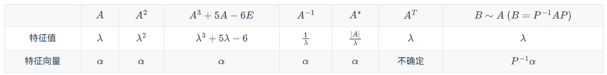

## [1.x] 知识点提纲

### [1.1.x] 行列式

1. 二阶行列式计算
   - 主对角线 $-$ 副对角线
2. 三角行列式计算
   - 上/下三角：主对角线元素乘积
   - 行列式性质：
     - 某行/列的k倍加到另一行/列，行列式值不变
     - 某行/列所有元素公因子可以提到行列式外
     - 交换两行/列，行列式值变号
3. 行和相等行列式计算
   - 把后面所有列加到第一列，提公因子，使得第一列全部变成1
   - 行变换，化成三角行列式
4. 范德蒙德行列式计算
   - 特点：
     - 第一行/列元素全为 $1$
     - 每一列/行元素均为等比数列，且公比元素在第 $2$ 行/列
     - 结果为公比元素作差再相乘
5. 爪形行列式计算
   - 通过提公因子，将主对角线第 $2,3,...,n$ 个元素化为 $1$
   - 化为三角行列式
6. 余子式、代数余子式
   - 余子式 $M_{ij}$ 无符号；代数余子式 $A_{ij}$ 有符号
   - 行列式 $=$ 某行/列元素乘以相应代数余子式后求和
   - eg. 求 $A_{31}+3A_{32}-2A_{33}+2A_{34}$ 
     - 把行列式 $D$ 中 $a_{31},...,a_{34}$ 分别替换为对应系数 $1,3,-2,2$ 后再求行列式即可。
   - eg. 求 $M_{31}+3M_{32}-2M_{33}+2M_{34}$ 
     - 通过 $M$ 和 $A$ 的代换，将原式化为：$A_{31}-3A_{32}+(-2A_{33})-2A_{34}$ 
     - 再系数替换，求新的行列式
7. 用拆和的方法计算行列式
   - 当行列式某行/列为两数之和，行列式可分解为两行列式之和（其余行/列元素不变）
   - 当行列式某两行/列元素成比例，行列式等于零
8. 拉普拉斯公式计算行列式
   - $D=\begin{vmatrix} a_1&a_2&0&0 \\ a_3&a_4&0&0 \\ c_1&c_2&b_1&b_2 \\ c_3&c_4&b_3&b_4 \end{vmatrix} = \begin{vmatrix}A&0\\C&B\end{vmatrix}=|A||B|=\begin{vmatrix} a_1&a_2\\a_3&a_4 \end{vmatrix}\begin{vmatrix} b_1&b_2\\b_3&b_4 \end{vmatrix}$
   - 若不符合主对角线形式的拉普拉斯公式，可以通过行/列调换使得其变成主对角线形式
   - $D=\begin{vmatrix}0&A_{m\times m}\\B_{n\times n}&C\end{vmatrix}=(-1)^{m+n}|A||B|=(-1)^{m+n}\begin{vmatrix} a_1&a_2\\a_3&a_4 \end{vmatrix}\begin{vmatrix} b_1&b_2\\b_3&b_4 \end{vmatrix}$

### [1.2.x] 矩阵

1. 矩阵的乘法
   - `[Tip]`矩阵乘法不满足交换律，满足分配律

2. 抽象矩阵求逆矩阵
   - `[Key]`根据条件出发，找出相乘为E的矩阵
   - `[Key]`拆出来 or 长除法
   - `[Tip]`对 $A$ 而言，根据 $AB=E$ 找出相应的 $B$

3. 数字型求逆矩阵
   - `[Key]`利用行变化法求逆矩阵：$(A|E)\xrightarrow[]{行变换}(E|A^{-1})$
   - `[Key]`二阶矩阵逆矩阵秒杀“两调一除”：$A=\begin{pmatrix}a&b\\c&d\end{pmatrix}$ ; $A^{-1}=\frac{1}{\begin{vmatrix}A\end{vmatrix}}\begin{pmatrix}d&-b\\-c&a\end{pmatrix}$
   - `[Tip]`方阵 $A$ 可逆 $\Leftrightarrow$ $\begin{vmatrix}A\end{vmatrix}\neq0$

4. 求解矩阵方程
   - $AX=B \Longrightarrow X=A^{-1}B$
   - $XA=B \Longrightarrow X=BA^{-1}$
   - $BXA=C \Longrightarrow X=B^{-1}CA^{-1}$
     - 前提都是 $A^{-1}、B^{-1}$ 存在
   - $AA^*=A^*A=|A|E$ ; $A^*=|A|A^{-1}$
     - 用来解决矩阵方程中的 $A^*$
   - `[Tip]`*行列式*外系数乘进去是一行/一列；*矩阵*外系数乘进去是每一个元素

5. 方阵的行列式
   - $|A^{-1}|=|A|^{-1}$ ; $|A^T|=|A|$ ; $|kA_{n\times n}|=k^n|A|$ ; $|A^{*}_{n\times n}|=|A|^{n-1}$
   - $|AB|=|A||B|$
   - $|A+B|\neq|A|+|B|$，就是说不能把里面的各个方阵分开求行列式再加和
   - `[Tip]`提出来行列式内系数 $k$ 的时候也要注意，若方阵是 $n$ 阶，提出来的是 $k^n$

6. 方阵的转置与逆
   $$
   \begin{aligned}
   (A^T)^T &= A,            &\qquad (A^{-1})^{-1} &= A \\
   (A+B)^T &= A^T + B^T,    &\qquad (kA)^T        &= kA^T \\
   (kA)^{-1} &= \frac{1}{k}A^{-1}, &\qquad (AB)^T &= B^T A^T \\
   (AB)^{-1} &= B^{-1}A^{-1}, &\qquad (A^T)^{-1} &= (A^{-1})^T
   \end{aligned}
   $$
   
7. 矩阵的秩
   - $A\xrightarrow[]{初等行变换}B_{阶梯型}$，则 $r(A) = n_{B非零行数}$
   - 满秩矩阵 $\Leftrightarrow$ 非奇异矩阵 $\Leftrightarrow$ 矩阵可逆 $\Leftrightarrow$ 对应行列式不为零
   - 秩也是矩阵中线性无关行（或列）的最大个数

8. 矩阵秩的不等式
$$
\begin{aligned}
r(AB) &\le \min\{r(A),\,r(B)\}\\
r(A+B) &\le r(A)+r(B)\\
r(A\,|\,B) &\le r(A)+r(B)\\
r(A)+r(B) &\le r(AB)+n
\end{aligned}
$$

  - 对 $AB=O$

$$
  r(A_{n\times n})+r(B_{n\times n})\leq  n
$$

  - 对 $A_{n\times n}(n\geq2)$ 

$$
r(A^*)=
  \begin{cases}
  	n&r(A)=n\\
  	1&r(A)=n-1\\
  	0&r(A)<n-1
  \end{cases}
$$

  - 若 $C=\begin{pmatrix}A&O\\O&B\end{pmatrix}$

$$
  r(C) = r(A)+r(B)
$$

  - 若 $C=\begin{pmatrix}A&O\\O&B\end{pmatrix}$

$$
  r(C) = r(A)+r(B)
$$

  - 若 $C=\begin{pmatrix}A&C\\O&B\end{pmatrix}$
    $$
    r(C) \geq r(A)+r(B)
    $$
    

### [1.3.x] 向量组的线性相关

1. 判别向量组线性相关性-数字型
   - `[Key]`两个向量 $\alpha_1,\alpha_2$ 相关 $\Leftrightarrow$ $\alpha_1$ 与 $\alpha_2$ 对应成比例 $\Leftrightarrow$ 方阵 $|\alpha_1,\alpha_2|=0$
   - `[Key]`多个向量 $\alpha_1,\alpha_2,...,\alpha_m$ 相关（无关） $\Leftrightarrow$ $\left\{ \begin{array}{rcl}|\alpha_1,...,\alpha_m|=0(\neq0)&方阵\\r(\alpha_1,...,\alpha_m)<m(=m)&非方阵\end{array} \right.$
2. 判别向量组线性相关性-抽象型

   - `[Key·1]`逆向思维，复杂矩阵抽离成简单分块矩阵相乘：$(\beta_1,\ \beta_2,\ \beta_3)=(\alpha_1,\ \alpha_2,\ \alpha_3)C$
     - eg. $(\alpha_1+3\alpha_2,\ 2\alpha_1+4\alpha_2)=(\alpha_1,\ \alpha_2)\begin{pmatrix}1&3\\2&4\end{pmatrix}$
     - eg. $(\alpha_1-\alpha_2,\ 2\alpha_2-\alpha_3,\ \alpha_1+\alpha_2+\alpha_3)=(\alpha_1,\alpha_2,\alpha_3)\begin{pmatrix}1&0&1\\-1&2&1\\0&-1&1\end{pmatrix}$
   - `[Key·2]` $\alpha_1,\alpha_2,\alpha_3$ 线性无关，则：$\left\{\begin{array}{rcl}|C|=0\Rightarrow\beta_1,\beta_2,\beta_3相关\\|C|\neq0\Rightarrow\beta_1,\beta_2,\beta_3无关\end{array} \right.$
     - 换言之：$\left\{\begin{array}{rcl}无关组\cdot不可逆阵\Rightarrow相关\\无关组\cdot可逆阵\Rightarrow无关\end{array} \right.$

3. 求向量组的秩和极大无关组

   - `[Key]` $r(\alpha_1,\alpha_2,\alpha_3)=$ 矩阵 $(\alpha_1,\alpha_2,\alpha_3)$ 的阶梯型中非零行数
   - `[Key]` $\alpha_1,\alpha_2,\alpha_3$的极大无关组一般取阶梯型“拐弯处”所在列向量
     - eg. $(\alpha_1,\alpha_2,\alpha_3)\rightarrow\begin{pmatrix}1&4&1\\0&-9&5\\0&0&0\\0&0&0\end{pmatrix}$，则 $\alpha_1,\alpha_2$可以构成一个极大无关组

### [1.4.x] 线性方程组

1. 齐次方程组 $AX=O$ 的求解
     $$
     A_{m\times n}X = O \;\Longrightarrow\;
     \begin{cases}
     r(A_{m\times n}) = n, & \quad AX=0 \text{ 只有零解（唯一解）}, \\[6pt]
     r(A_{m\times n}) < n, & \quad AX=0 \text{ 有非零解（无穷多解）}.
     \end{cases}
     $$
     
     - `[Tip]`系数矩阵的列数（$A_{m\times n}$ 中的 $n$）就是未知数的个数
     
   - 基础解系：当 $AX=O$ 有无穷解时，解集的极大无关组为基础解系
     - `[Key]`基础解系含解向量个数为 $n-r(A)$
     - `[Tip]` $n-r(A)=$ *基础解系含解向量个数* $\Leftrightarrow$ *未知数个数*$-$*有效方程个数*$=$*自由变量个数*
   
   - 基础解系求法：
     - 把系数矩阵化为*行最简形*。
       - eg. $A\rightarrow\begin{pmatrix}1&0&2&-1\\0&1&3&4\\0&0&0&0\end{pmatrix}$
     - *“非拐弯处变量”*作为自由变量，有 $n-r(A)$ 个。
       - eg. $\xi_1=\begin{pmatrix}-2\\-3\\1\\0\end{pmatrix}$, $\xi_2=\begin{pmatrix}-1\\-4\\0\\1\end{pmatrix}$
     - 通解 $X=k_1\xi_1+k_2\xi_2\ (k_1,k_2为任意常数)$
   
2. 非齐次方程组 $AX=b$ 的求解

    

   - $$
     A_{m\times n}X=b\Longrightarrow 
     \begin{cases}
     	r(A)=r(A|b)
     		\begin{cases}
     				<n& AX=b\ 有无穷解\\
     				=n& AX=b\ 有唯一解
     		\end{cases}\\
     	r(A)\neq r(A|b)~~~~~~~~~~~~~~AX=b\ 无解
     \end{cases}
     \nonumber
     $$
     
   - *非齐次方程组通解* $=$ *齐次方程组通解* $+$ *非齐次方程组特解*
     
     - 齐次方程组通解：用`1.`的方法
     - 非齐次方程组特解：一般令`1.`中自由变量为0，导出 $\eta$（实际上就对应行最简型的最后一列补0）
     
   - $AX=b$ 通解为 $X=k_1\xi_1+k_2\xi_2+...+k_n\xi_n+\eta$

3. 带参方程组求解
   - 翻译条件，归纳为无穷解/唯一解/无解从而得出相应方程关系，再根据`1.2.`知识求解。

---

### [1.5.x] 矩阵的对角化

1. 数值型-特征值与特征向量

   - 求 $A$ 特征值方法：由特征方程 $|\lambda E-A|=0$ 解得 $\lambda$ 即为 $A$ 的特征值（$|\lambda E-A|$ 称为特征多项式）
   - 求 $A$ 特征向量（对应特征值为 $\lambda_0$）：$(\lambda_0E-A)x=0$ 的基础解系

2. 抽象型-特征值与特征向量

   - 已知抽象矩阵的特征值，求关于抽象矩阵的新矩阵特征值

   - 关于 $A$ 的性质：

     - 几何重数：$\lambda_0$ 是 $A$ 的 $k$ 重特征值，称 $\lambda_0$ 的几何重数是 $k$
         代数重数：$\lambda_0$ 对应 $r$ 个线性无关的特征向量（$r$ 为 $V_{\lambda_0}$ 的维数），称 $\lambda_0$ 的代数重数为 $r$
         - 几何重数不大于代数重数（$k\le r$） 

     - 若 $A$ 的特征值为 $\lambda_1,\lambda_2,...,\lambda_n$
       - 对应特征向量 $\alpha_1,\alpha_2,...,\alpha_n$ 线性无关
       - 【$A$ 的行列式等于特征值之积】
         - $|A|=\displaystyle\prod\limits_{i=1}^n\lambda_i$，
         - $|A|=0\Rightarrow A$ 至少有一个特征值为0
             $|A|\neq0 \Rightarrow A$ 的特征值均非0
       - 【$A$ 的迹等于特征值之和】迹：矩阵主对角线元素和
         - $tr A = \displaystyle\sum\limits_{i=1}^n\lambda_i$
     - 若 $\lambda$ 是 $A$ 特征值，$\alpha$ 是对应特征值的特征向量，有 $A\alpha=\lambda\alpha$
     - 
   
3. 相似矩阵

   - 存在可逆矩阵 $P$ 使得 $P^{-1}AP=B$，称 $A$ 相似于 $B$，记为 $A\sim B$
   - 性质
     - 自反性：$A\sim A$
     - 对称性：$A \sim B \Leftrightarrow B\sim A$
     - 传递性：$A \sim B, B\sim C \Leftrightarrow A\sim C$
     - 若 $A\sim B$，则：
         - $A,B$ 等价（$C,D$ 等价 $\Leftrightarrow$ 经过若干次初等行变换，使得 $P_iAQ_j=B$ （$P_i,Q_i$可逆））
         - $A,B$ 有相同特征值、行列式与迹
         - $A,B$ 有相同的秩
         - $kA\sim kB$
         - $A^{-1}\sim B^{-1}$
         - $f(A)\sim f(B)$
             - e.g. $3A^2-6A+5E\sim3B^3-6B+5E$
     - $A^m\sim B^m$

4. 矩阵的相似对角化

   - 若存在可逆矩阵 $P$ ，使 $P^{-1}AP=\mathit{\Lambda}$（ $\mathit{\Lambda}$ 为对角矩阵），则称 $A$ 可相似对角化（此时有 $A\sim\mathit{\Lambda}$）

   - 判定 $n$ 阶矩阵 $A$ 能否相似对角化

       - 充要条件：$A$ 有 $n$ 个线性无关的特征向量
           - 如果一个矩阵的特征值都是不同的，那么它一定可以相似对角化

           - 如果一个矩阵每个特征值的代数重数（特征多项式中的重数）**等于**几何重数（对应该特征值的特征向量的维数）那么它一定**可以**相似对角化

           - 如果一个矩阵的某个特征值的代数重数**大于**它的几何重数，那么它一定**不能**相似对角化

   - 把 $A$ 相似对角化的步骤

     - 求 $A$ 特征值 $\lambda_1,\lambda_2,...,\lambda_n$

     - 求对应特征向量 $\alpha_1,\alpha_2,...,\alpha_n$

     - 令 $P=(\alpha_1,\alpha_2,...,\alpha_n)$，则 
       $$
       P^{-1}AP={\mathit{\Lambda}}={\rm diag}(\lambda_1,\lambda_2,...,\lambda_n)=
       \begin{pmatrix}
       \lambda_1 & 0 & \cdots & 0 \\
       0 & \lambda_2 & \cdots & 0 \\
       \vdots & \vdots & \ddots & \vdots \\
       0 & 0 & \cdots & \lambda_n
       \end{pmatrix}
       $$

5. 实对称矩阵

   - 实：矩阵元素为实数；对称：方阵，以主对角线为轴对称

   - 特征值为实数；对应特征值为实向量
       - 非实对称矩阵就不一定。如 $\begin{pmatrix}0&1\\-1&0\end{pmatrix}$ 对应特征方程为 $\lambda^2+1=0$，对应的特征值为虚根。
   - 互不相等的特征值对应的特征向量间两两正交
   - 所有特征值的几何重数等于代数重数

7. 实对称矩阵的相似对角化·利用相似矩阵

   - n阶实对称矩阵 $A$ 必可对角化，且一定存在正交矩阵 $Q$ ，使得 $Q^{-1}AQ=Q^TAQ={\rm diag}(\lambda_1,...,\lambda n)$

       - 正交矩阵 $Q$ 的性质
           - $Q^T=Q^{-1}$
   
           - $Q^TQ=QQ^T=E$
   
           - $|Q|=\pm0$
   
   - 把对称阵 $A$ 用正交阵 $Q$ 相似对角化的步骤
   
       - 求 $A$ 特征值 $\lambda_1,\lambda_2,...,\lambda_n$
   
       - 求对应特征向量 $\alpha_1,\alpha_2,...,\alpha_n$
   
       - 把 $\alpha_1,\alpha_2,...,\alpha_n$ 中不正交的矩阵正交化：
   
           - 若 $\alpha_1,\alpha_2,...$ 不正交，令
           $$
           \begin{aligned}
           \beta_1 &= \alpha_1, \\[6pt]
           \beta_2 &= \alpha_2 - \frac{(\alpha_2,\beta_1)}{(\beta_1,\beta_1)} \beta_1, \\[6pt]
           \beta_3 &= \alpha_3 - \frac{(\alpha_3,\beta_1)}{(\beta_1,\beta_1)} \beta_1
                           - \frac{(\alpha_3,\beta_2)}{(\beta_2,\beta_2)} \beta_2, \\[6pt]
           &\;\;\vdots
           \end{aligned}
           $$
       
       - 单位化所有特征向量，得 $\xi_1,\xi_2,...,\xi_n$
           $$
           \xi_i = \displaystyle\frac{\alpha_i}{||\alpha_i||}
           \nonumber
           $$
           
       - 令 $Q=(\xi_1,\xi_2,...,\xi_n)$，则 
           $$
           Q^{-1}AQ={\mathit{\Lambda}}={\rm diag}(\lambda_1,\lambda_2,...,\lambda_n)=
           \begin{pmatrix}
           \lambda_1 & 0 & \cdots & 0 \\
           0 & \lambda_2 & \cdots & 0 \\
           \vdots & \vdots & \ddots & \vdots \\
           0 & 0 & \cdots & \lambda_n
           \end{pmatrix}
           \nonumber
           $$

> **单矩阵关系**
>
> 1. 对合矩阵 $A^2=E$
> 2. 幂零矩阵 $A^2=0$
> 3. 对称矩阵 $A^T=A$
> 4. 反对称矩阵 $A^T=-A$
> 5. 正交矩阵 $A^T=A^{-1}$
> 6. 初等矩阵 通过一次初等行/列变换就可以得到 $E$ 的矩阵
>
> **多矩阵关系**
>
> 1. 等价
>
>     - 定义：$PAQ=B$
>
>     - **向量组**等价：两个向量组能够相互线性表出 $\Leftrightarrow$ 两向量组维数相同（包含向量数不一定相同）
>     - **矩阵**等价：两个*同型*矩阵能够通过初等变换相互转化 $\Leftrightarrow$ 两*同型*矩阵秩相等
>
> 2. 相似
>
>     - 定义：$P^{-1}AP=B$
>     - 本质：$A$ 和 $B$ 是在**不同基**中的**同一个线性变换**
>     - 判定：着眼于特征值与特征向量
>         - 【特征值相等】
>         - 矩阵的*迹*是否相等
>         - 矩阵的*秩*是否相等（求解行列式）
>         - 矩阵*特征值*是否相等
>         - 【特征值对应的特征向量相等】
>         - $\lambda E-A$ 和 $\lambda E-B$ 的*秩*是否相等（看多重特征根）
>
> 3. 合同
>     - 定义：$P^TAP=B$
>     - 判定：$A,B$ 均为实数域上的n阶对称矩阵，则A与B在实数域上合同等价于A与B有相同的正、负惯性指数（即正、负特征值的个数相等）
>

### [1.6.x] 二次型

1. 二次型的矩阵表示

   - 二次型矩阵的三要素

     - $A^T=A$
     - $A$ 的主对角元素为*平方项*系数
     - $A$ 的非主对角元素为*交叉项系数*的一半

   - e.g. 
     $$
     \begin{aligned}
     f(x_1,x_2)
     &= 2x_1^2 - x_2^2 + 6x_1x_2 \\
     &= \begin{pmatrix} x_1 & x_2 \end{pmatrix}
        \begin{pmatrix} 2 & 3 \\ 3 & -1 \end{pmatrix}
        \begin{pmatrix} x_1 \\ x_2 \end{pmatrix}
     = x^\top A x ,
     \end{aligned}
     $$

   - e.g.
       $$
       \begin{aligned}
       f(x_1,x_2,x_3)
       &= x_1^2 + 3x_2^2 - x_3^2 + 2x_1x_2 + 2x_1x_3 - 3x_2x_3 \\
       &= \begin{pmatrix} x_1 & x_2 & x_3 \end{pmatrix}
          \begin{pmatrix}
            1 & 1 & 1 \\
            1 & 3 & -\tfrac{3}{2} \\
            1 & -\tfrac{3}{2} & -1
          \end{pmatrix}
          \begin{pmatrix} x_1 \\ x_2 \\ x_3 \end{pmatrix}
       = x^\top A x .
       \end{aligned}
       $$
       

2. 化二次型为标准型

   - 只有平方项的二次型称为标准形

   - **配方法：**

     - $$
       \begin{aligned}
       a^2+2ab
       &= a^2+2ab+b^2-b^2
       = (a+b)^2-b^2,\\
       a^2+ab
       &= a^2+2a\frac{b}{2}+\left(\frac{b}{2}\right)^2-\left(\frac{b}{2}\right)^2
       = \left(a+\frac{b}{2}\right)^2-\frac{b^2}{4},\\
       a^2+a\Delta
       &= a^2+2a\frac{\Delta}{2}+\left(\frac{\Delta}{2}\right)^2-\left(\frac{\Delta}{2}\right)^2
       = \left(a+\frac{\Delta}{2}\right)^2-\frac{\Delta^2}{4}.
       \end{aligned}
       $$
       
     - 依次配方所有包含 $x_1,x_2,...$ 的项

     - 当所有项都为完全平方项时，换元（以 $f(x_1,x_2,x_3)$ 为例
       $$
       \begin{aligned}
       f
       &= a\, (p_1x_1+q_1x_2+r_1x_3)^2
        + b\, (p_2x_1+q_2x_2+r_2x_3)^2
        + c\, (p_3x_1+q_3x_2+r_3x_3)^2 \\
       &\Rightarrow
       \begin{cases}
       y_1 = p_1x_1+q_1x_2+r_1x_3,\\
       y_2 = p_2x_1+q_2x_2+r_2x_3,\\
       y_3 = p_3x_1+q_3x_2+r_3x_3,
       \end{cases}\qquad
       f = a\,y_1^2 + b\,y_2^2 + c\,y_3^2, \\[6pt]
       &\Rightarrow
       \begin{cases}
       x_1 = s_1y_1+t_1y_2+u_1y_3,\\
       x_2 = s_2y_1+t_2y_2+u_2y_3,\\
       x_3 = s_3y_1+t_3y_2+u_3y_3,
       \end{cases}
       \end{aligned}
       $$
       
     - 记 $x=(x_1,x_2,x_3)^T,y=(y_1,y_2,y_3)^T,P=
       \begin{pmatrix}
       s_1 & t_1 & u_1 \\
       s_2 & t_2 & u_2 \\
       s_3 & t_3 & u_3
       \end{pmatrix}$
       
     - 在线性代换 $x=Py$ 下，得到标准形：$f=ay_1^2+by_2^2+cy_3^2$
       
       > 若 $f(x_1,x_2,x_3)$ 无法直接配方，先令：
       > $$
       > \left\{
       > \begin{aligned}
       > x_1&=y_1+y_2\\
       > x_2&=y_1-y_2\\
       > x_3&=y_3
       > \end{aligned}
       > \right.
       > $$
       
       

   - **正交变化法：**

     - 写出 $f$ 的矩阵 $A$
     - 求 $A$ 的特征值 $\lambda_1,...,\lambda_n$
     - 求 $A$ 的特征向量 $\alpha_1,...,\alpha_n$
     - 将特征向量中不正交向量的施密特正交化
     - 所有向量单位化得到 $\xi_1,...,\xi_n$
     - 得到正交矩阵 $Q=(\xi,...,\xi_n)$
     - 记 $x=(x_1,x_2,x_3)^T$，$y=(y_1,y_2,y_3)^T$
     - 在线性代换 $x=Qy$ 下，得到标准形 $f=\lambda_1y_1^2+...+\lambda_ny_n^2$

3. 正定二次型和正定矩阵

   - 概念：对任意 $\boldsymbol x\neq \bold0$，对实二次型 $f$ 有 $f=\boldsymbol x^TA\boldsymbol x>0$，称 $f$ 为正定二次型，$A$ 为正定矩阵

   - $A$ 为实对称矩阵 $\Leftrightarrow$ $A$ 正定

   - 二次型 $f$ 正定 / 矩阵 $A$ 正定的判定方法（主要）

     - $A$ 的特征值全大于零（即 $f$ 的正惯性指数==未知数个数）
       - 正惯性指数：标准形中正平方项的个数

     - $A$ 的各阶顺序主子式皆大于零

### [1.7.x] 线性空间与线性变换

1. 线性空间

    - 定义：$V$ 是集合， $V$ 满足加法、数乘封闭

    - 基（*类比向量组的极大无关组*）

        - $V$ 中能线性表示 $V$ 中任意向量的向量组 $a_1,...,a_m$ 是一组基

    - 维数（*类比向量组的秩*）

        - $V$ 中一组基中包含向量的数目 $m$ 是 $V$ 的维数，记作 ${\rm div}(V)=m$

    - $n$ 维实向量空间

        - 所有 $n$ 维实向量构成的集合，记作 $R^n$
        - $n$ 维基本向量组 $\xi_1,...,\xi_n$ 是 $R^n$ 一组基
            - eg. $R^3$​ 一组基为 $\begin{pmatrix}1 \\0 \\0\end{pmatrix},
                \begin{pmatrix}0 \\1 \\0\end{pmatrix},
                \begin{pmatrix}0 \\0 \\1\end{pmatrix}$
        - `[Tip]`任意 $n$ 个线性无关的 $n$ 维实向量一定能构成 $R^n$ 一组基
        - `[Tip]`方阵 $A_{n\times n}$ 满秩（$|A|\neq0$），则 $A$ 行/列向量一定能构成 $R^n$ 一组基

    - 向量在基下的坐标

        - 设向量空间 $V$ 有一组基 $\{e_1,\dots,e_n\}$，对于 $V$ 中的任意向量 $\beta$，它可以表示为基向量的线性组合：$\beta=a_1e_1+\dots+a_ne_n=(e_1,\dots,e_n)(a_1,a_2,\dots,a_n)^T$

            称 $(a_1,a_2,\dots,a_n)^T$ 为向量 $\beta$ 在基 $\{e_1,\dots,e_n\}$ 下的坐标。

        - `[Tip]` $R^n$ 有无数组基

        - `[Tip]` 同一向量在一组基下坐标唯一，在不同基下坐标不同

    - 过渡矩阵

        - 同一向量空间下不同基变换使用的矩阵
        - 设 $V$ 下有两组基 $\{\alpha_1,\dots,\alpha_n\},\{\ \beta_1,\dots,\beta_n\}$，其向量组分别记为$A,B$
            $A=BC_{m\times m}$，则 $C$ 是 $B$ 到 $A$ 的过渡矩阵
        - 若 $\beta$ 在两组基下坐标分别为 $x=(x_1,\dots,x_n)^T,x'=(x_1',\dots,x_n')^T$
            称 $x=Cx'$ 或 $x'=C^{-1}x$ 为坐标变换公式

    - 向量的内积、长度和夹角

        - 设 $\alpha = (\alpha_1,\dots,\alpha_m)^T,\beta=(\beta_1,\dots,\beta_m)^T$
        - 内积：$(\alpha,\beta)=\sum\alpha_i\beta_i$（点乘，相当于 $\alpha·\beta$）
            - $(\alpha,\beta)=0$，称 $\alpha,\beta$ 正交
        - 长度：$\lVert\alpha\rVert=\sqrt{(\alpha,\alpha)}$
            - $\lVert\alpha\rVert=0\Leftrightarrow\alpha=\mathbf{0}$
            - 单位向量：长度为1
            - 单位化：$\alpha\rightarrow\displaystyle\frac{\alpha}{\sqrt{(\alpha,\alpha)}}$
        - 夹角：$\langle\alpha,\beta\rangle={\rm arccos}\displaystyle\frac{(\alpha,\beta)}{\lVert\alpha\rVert\lVert\beta\rVert}$

    - 正交向量组与正交基

        - 正交向量组：一组非零且两两正交的向量组
        - 正交基：基为正交向量组
        - 标准正交基/规范正交基：基为正交向量组且每个基为单位向量

    - 向量组的正交化和单位化

