## CH4 处理器

**数据冒险**

取指、译码、执行、访存、写回

完全转发可以解决大部分数据冒险，但不能解决load-use型冒险：lw后添加一个nop

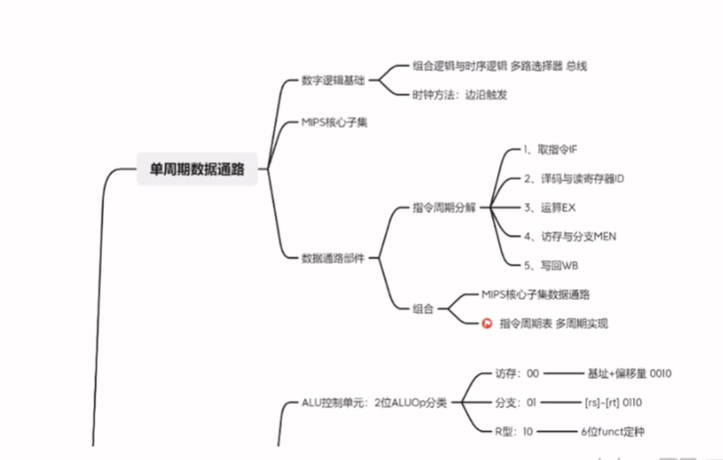

## CH5 存储层次

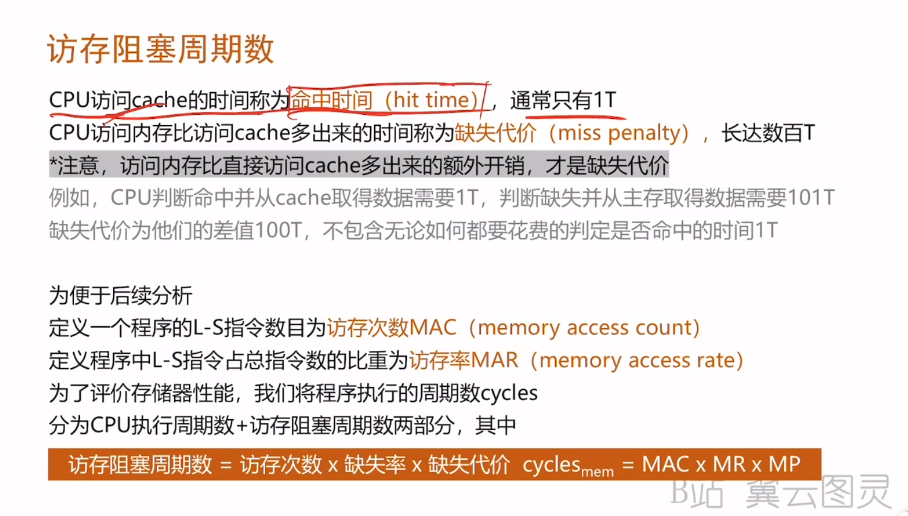

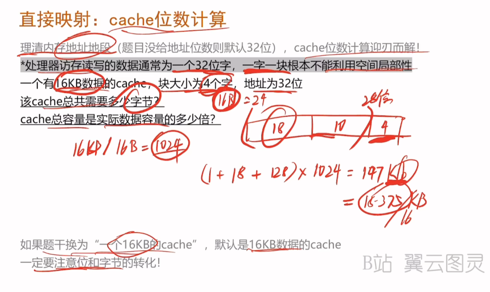

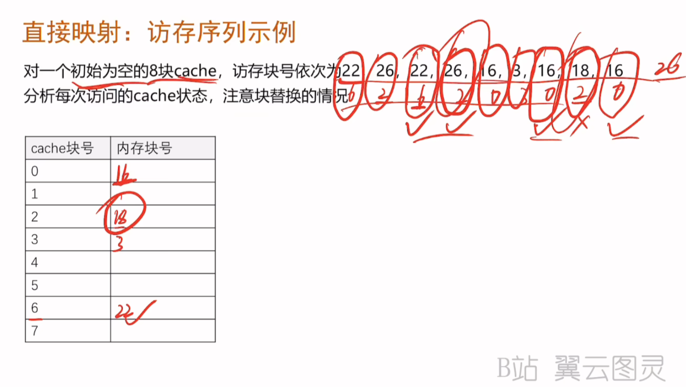

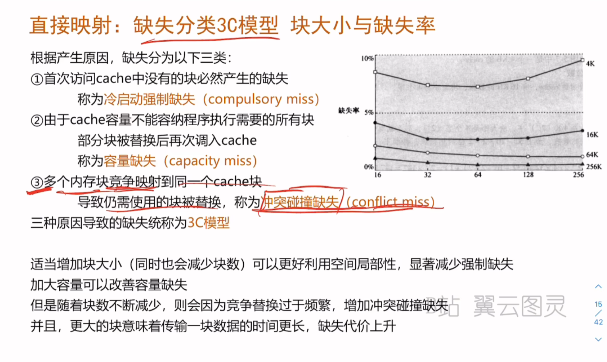

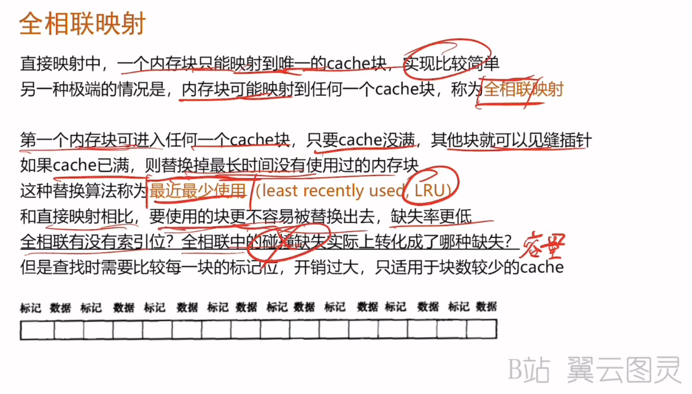

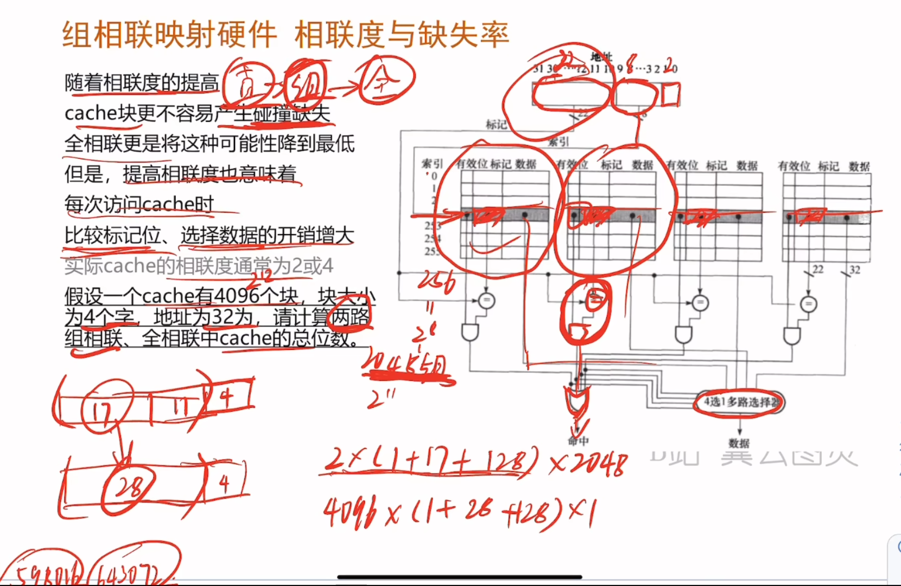

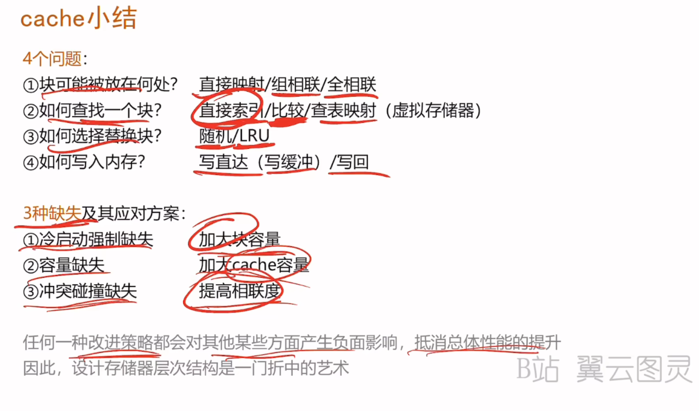

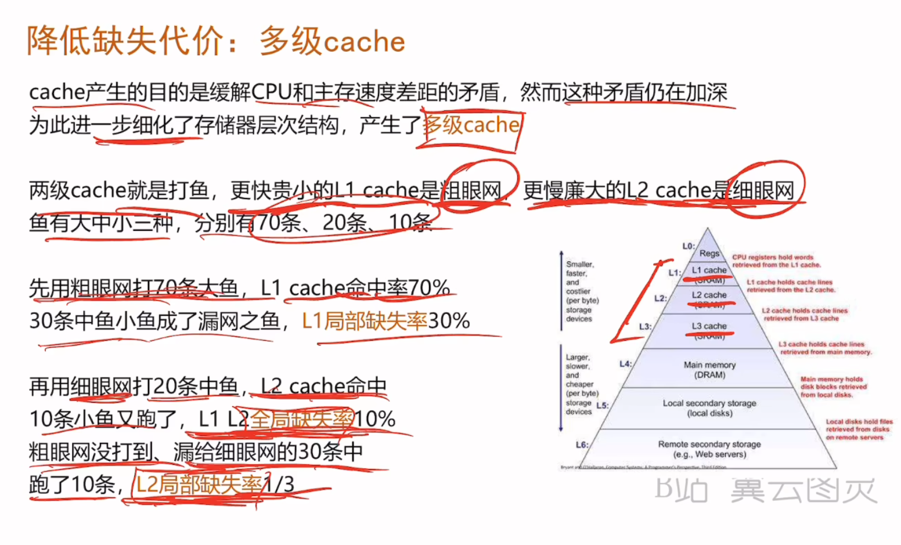

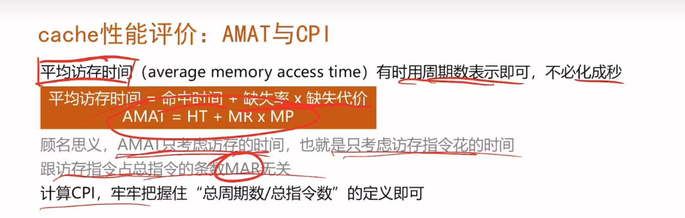

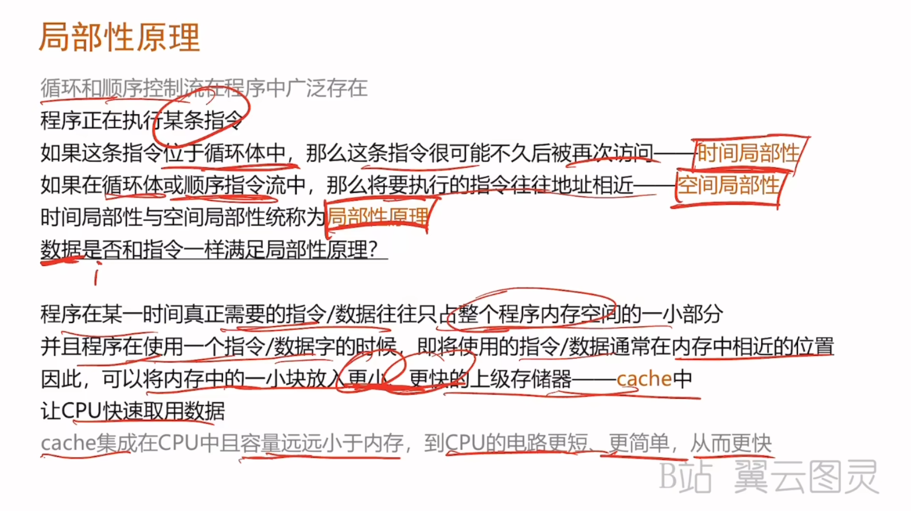

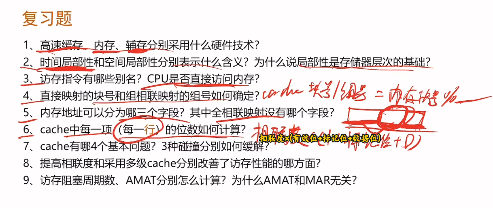

提高相联度：减少冲突碰撞缺失，降低缺失率

采用多级cache：减少缺失代价

访存阻塞周期数MAC×访存次数MAC×缺失概率MR×缺失代价MP

实际CPI=基准CPI+平均每条指令产生的存储访问周期数

---

**虚拟存储器**

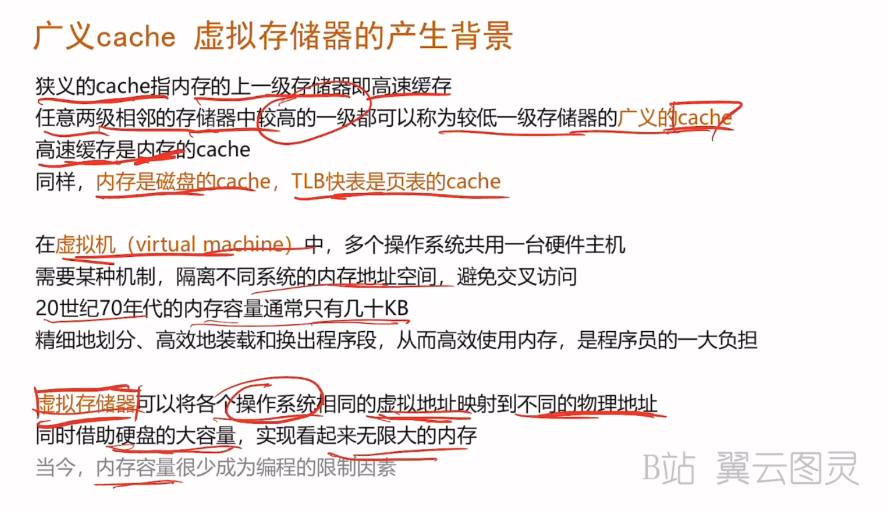

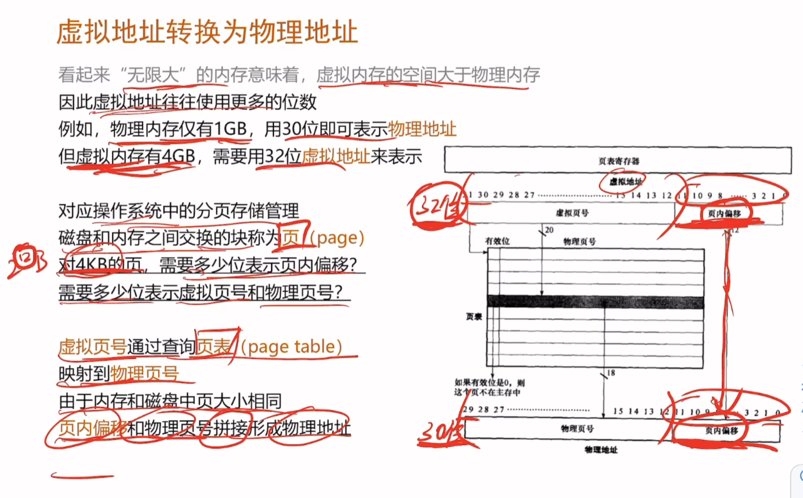

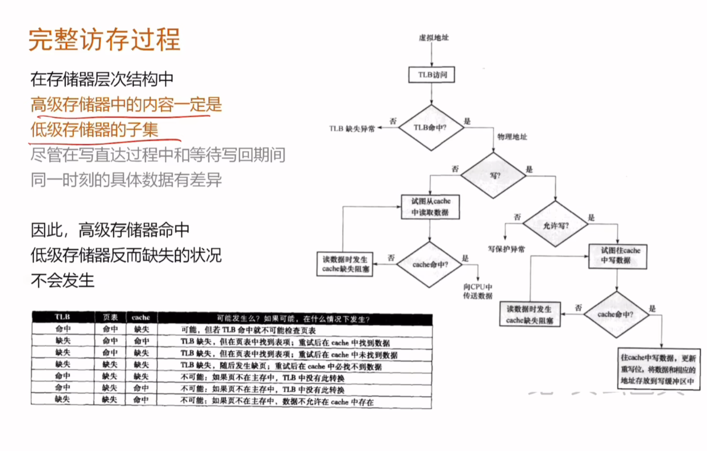