# 计算机网络

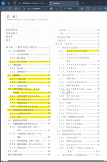

## Chap 01 计算机网络概述

> 基本概念、计算机网络结构、网络核心
>
> 网络性能、网络体系结构、发展历史

计算机网络基本概念

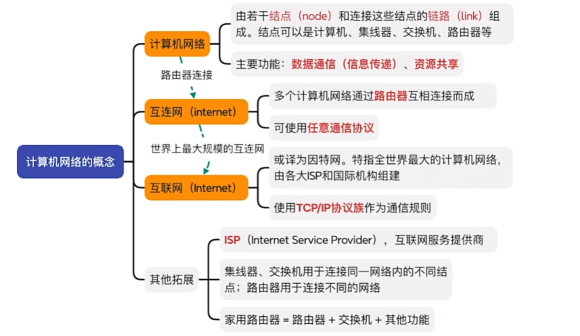

- 数据包的分组交换靠路由器和交换机进行

计算机网络的组成（结构上）

- 硬件
  - 主机（端系统）
  - 通信设备（e.g. 路由器）
  - 通信链路（e.g. 网线）
- 软件
  - 实现数据交换的软件
- 协议
  - **规定计算机网络的通信规则**
  - 硬件、软件共同实现

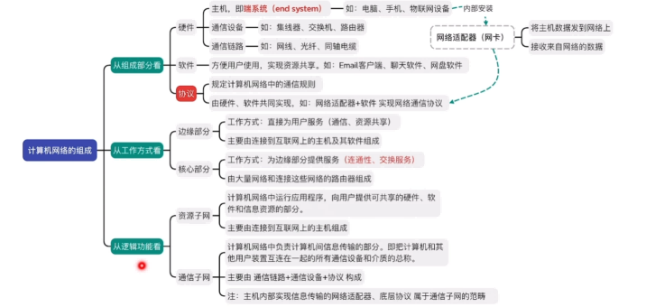

计算机网络的功能

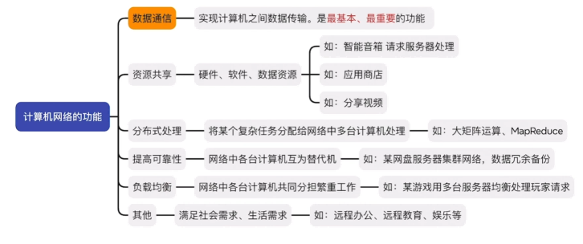

**网络协议**

- 定义：简称为协议，是为进行网络中的数据交换而建立的规则、标准或约定。
- 作用：规定了通信实体之间所交换的消息的格式、意义、顺序以及针对收到信息或发生的事件所采取的“动作”
- 组成：三要素，语法、语义、时序

**数据交换**

- 电路交换
  - 三个阶段：建立连接 $\to$ 通信（传输数据） $\to$ 释放连接
  - 特点：独占资源，没有存储转发时延，不支持差错控制
    - 共享中继线技术：多路复用
    - 频分（占用不同带宽资源，aka 频率范围/频道）、时分（分为等长的时分复用帧，每个人占用一帧的固定序号时隙）、波分（光的频分复用）、码分
- 报文交换
  - 特点：无需建立连接，以报文为单位在交换节点间存储转发，支持差错控制，不定长，存在存储转发时延
- 分组交换
  - 特点：在报文交换的基础上拆分为定长的分组在交换节点间**存储转发**，转发时间、缓存开销小，控制信息占比增加

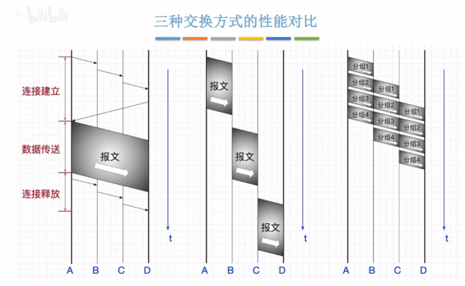

- 电路交换

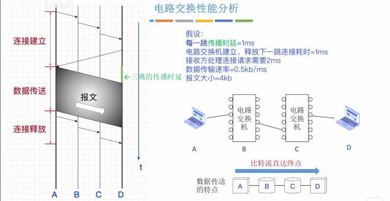

- 报文交换

 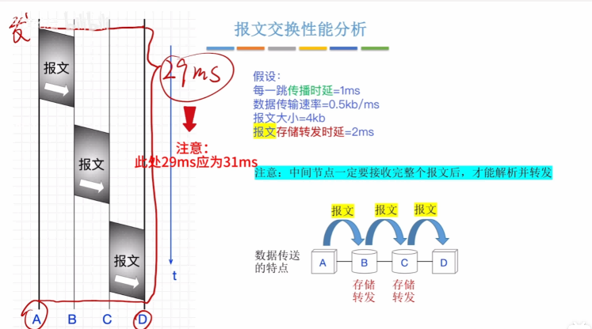

- 分组交换

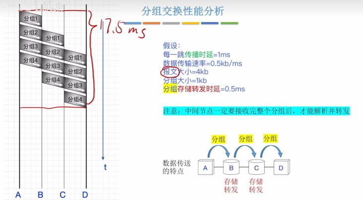

**计算机网络的性能指标**

- 速率：数据率/数据传输速率/比特率
  - b/s bps kbps Mbps Gbps（B/s = 8 b/s）
- 带宽：某信道的最高数据率
  - 节点间通信实际能达到的最高速率，由带宽、节点性能共同限制
- 时延：数据（/报文/分组等）从链路一端到另一端所需时间
  - $总时延=传输时延/发送时延_{节点将数据推向信道}+传播时延_{信道传播时间}+处理时延_{路由器处理时间}+排队时延_{数据排队进入到排队发出路由器时间}$
  - 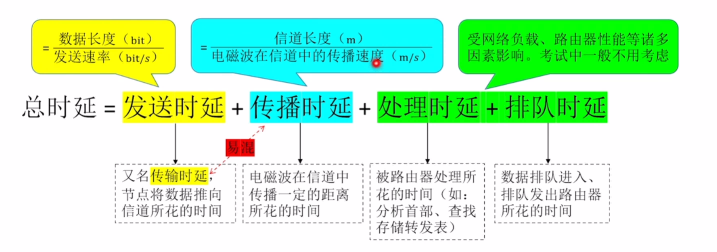
  - 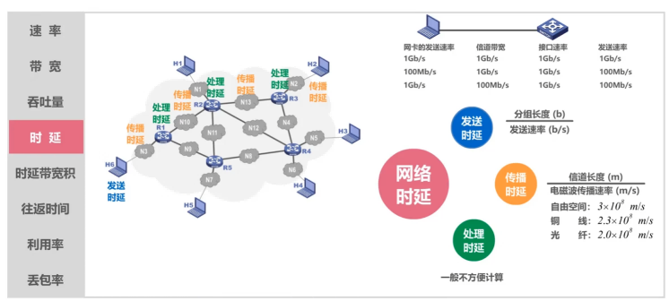
  - 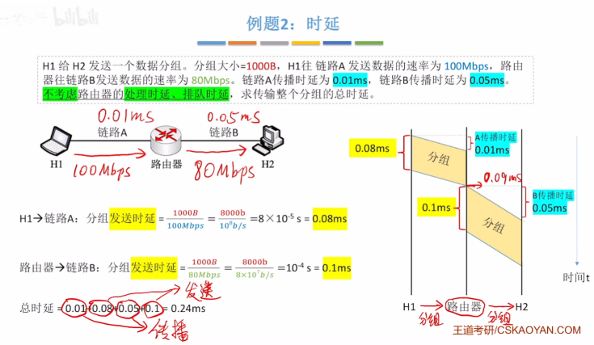
  - 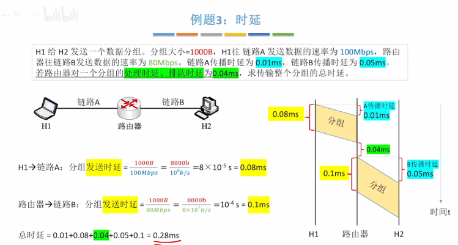
- 时延带宽积：一条链路中，已从发送端发出但尚未到达接收端的最大比特数
  - $=传播时延\times带宽$，单位 bit
- 丢包率
- 吞吐量：单位时间内通过某个网络（/信道/接口）的实际数据量
  - 吞+吐

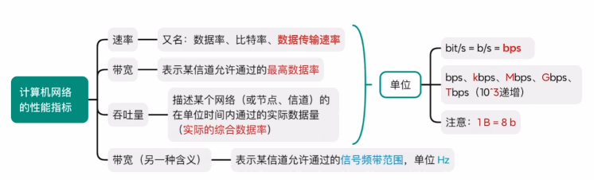

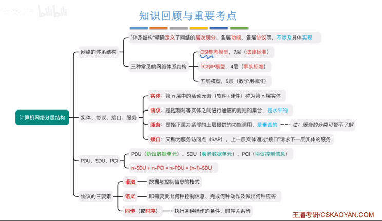

**OSI 参考模型**

物（物理）联（数据链路）网（网络）叔（传输）会（会话）使（表示）用（应用）

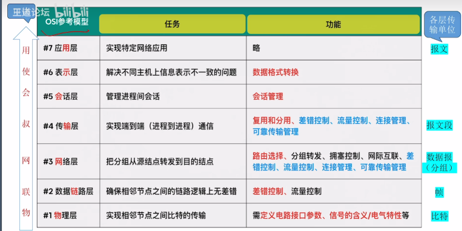

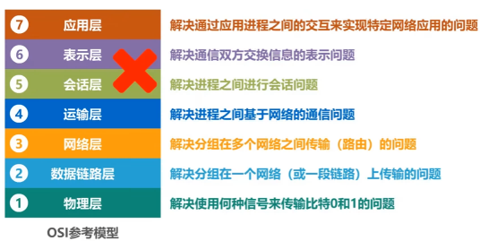

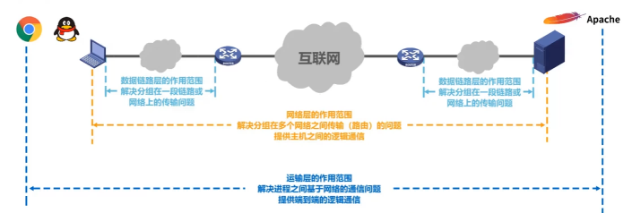

**TCP/IP 参考模型**

接（网络接口）网（网络）叔（传输）用（应用）

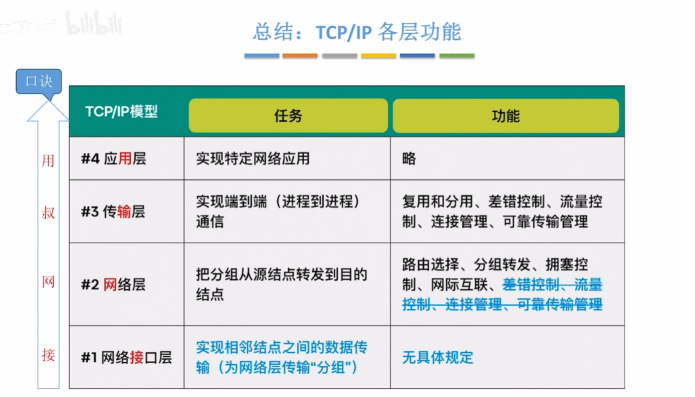

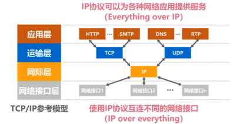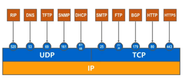

## Chap 02 应用层

> 概述、基本原理
>
> Web、Email、DNS、P2P、Socket 编程
>
> *FTP SMTP HTTP*

**网络应用的结构**

- C/S 客户机/服务机结构 P2P 点对点结构

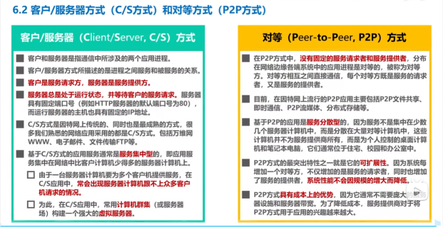

**域名系统 DNS**

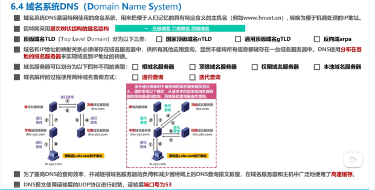

**文件传送协议 FTP**

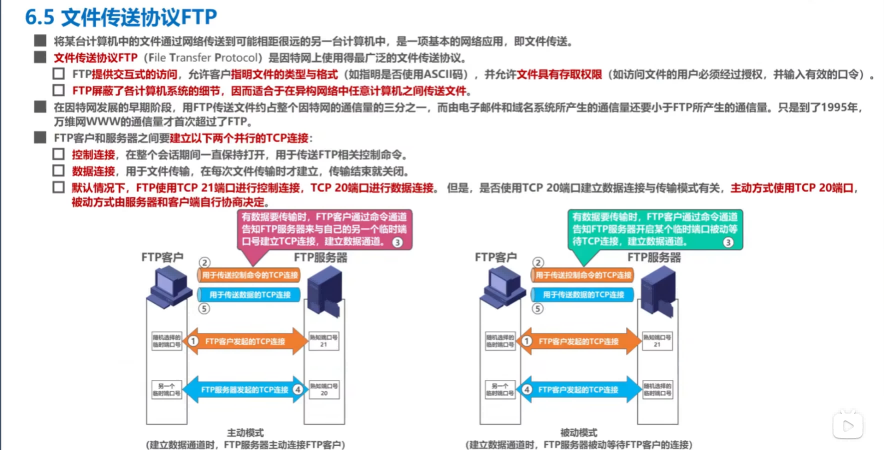

**电子邮件**

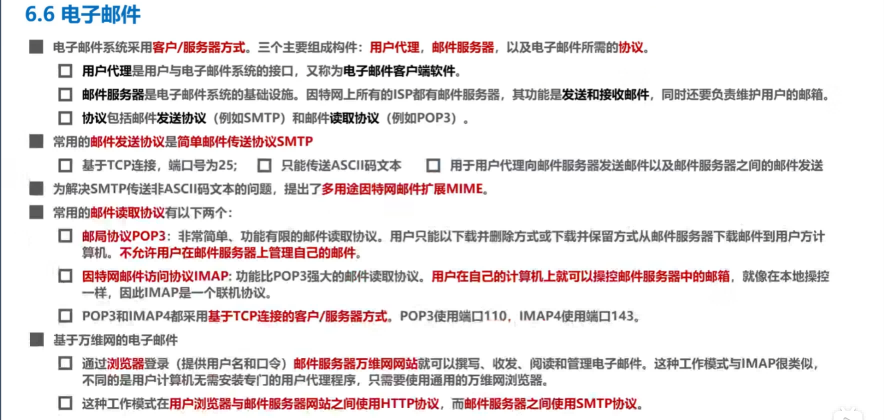

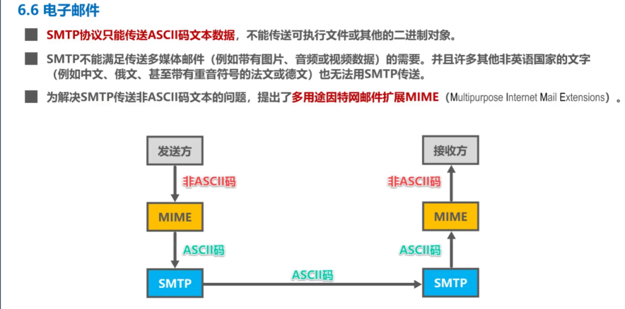

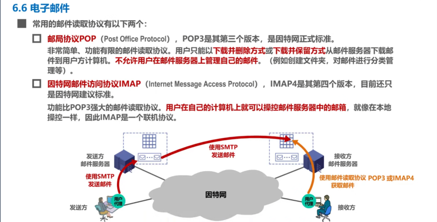

**HTTP 超文本传输协议**

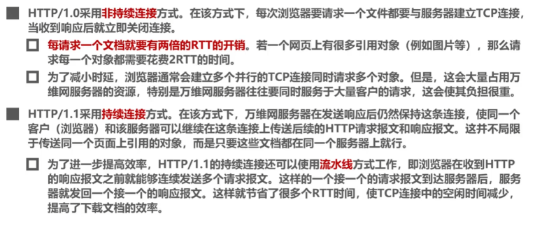

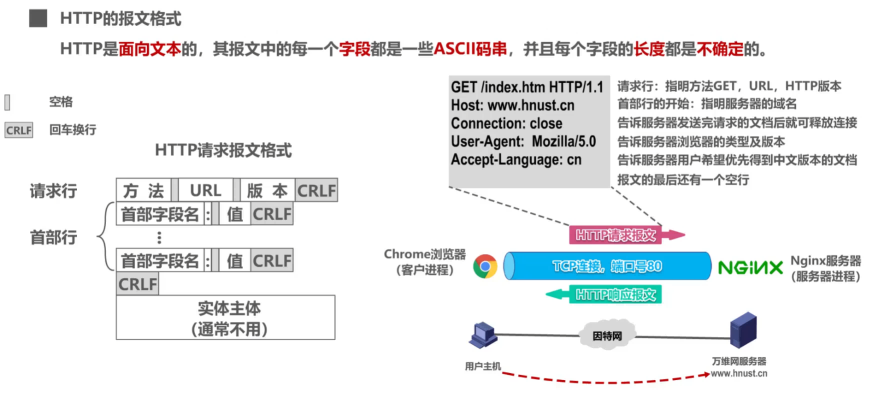

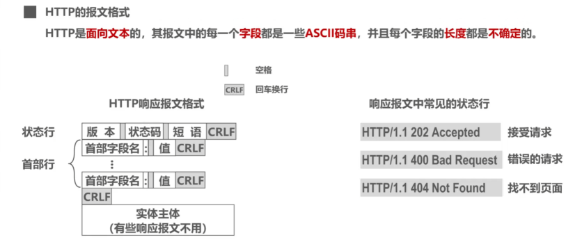

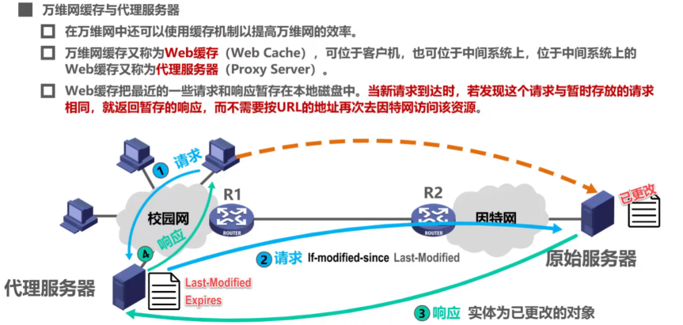

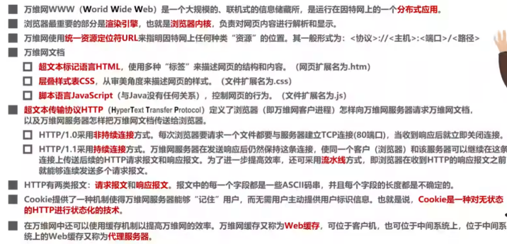

## Chap 03 运输层

> 传输层服务、复用和分用、无连接传输协议 UDP、可靠数据传输、滑动窗口协议
>
> 面向连接传输协议 TCP、拥塞控制
>
> *TCP UDP*

传输层概述

- 功能：进程和进程之间的逻辑通信；复用和分用；对收到的报文进行差错检测

TCP 传输控制协议

- **面向字节流**、面向连接、可靠、时延大、适用于大文件

UDP 用户数据包协议

- **面向应用报文**、不可靠、无连接、时延小、无拥塞控制、适用于小文件和实时应用

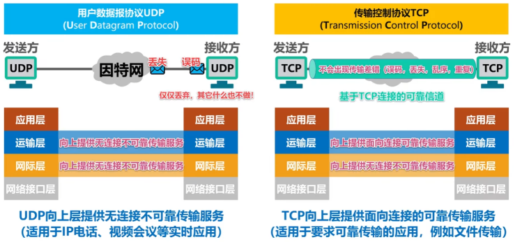

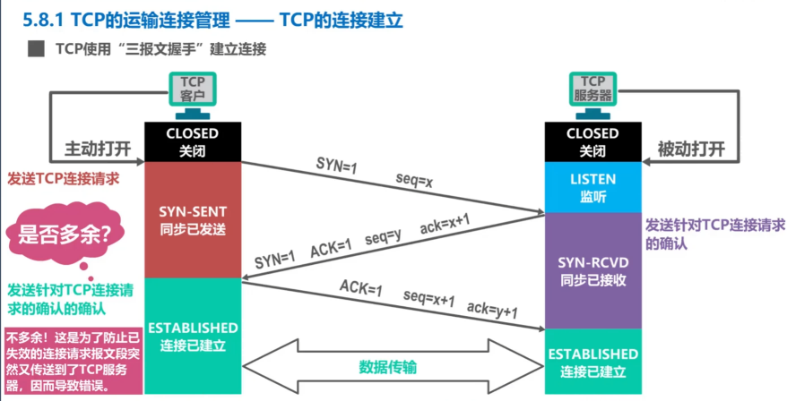

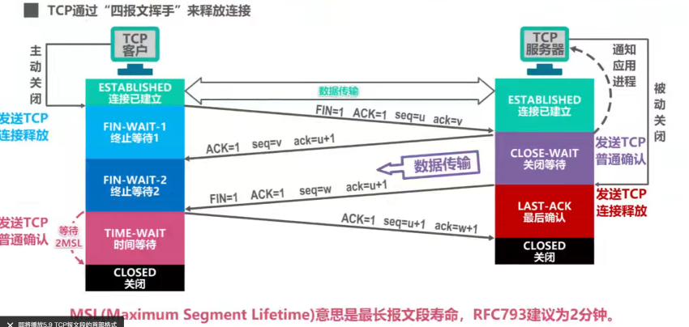

复用和分用

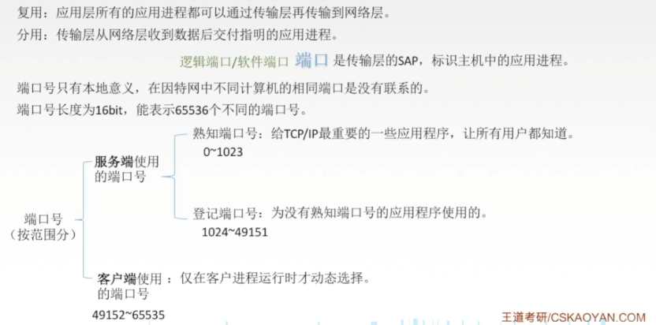

- **流量控制方法**
  - 停止等待协议
    - 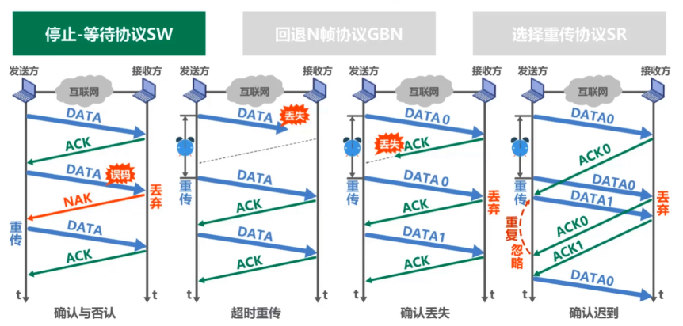
    - 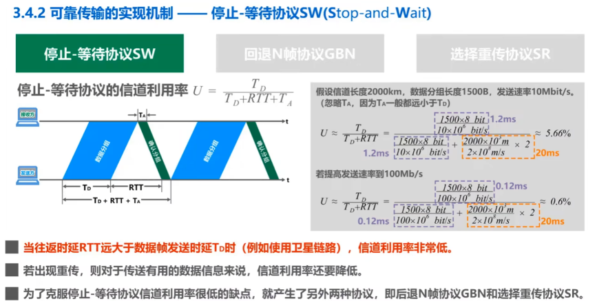
  - 滑动窗口协议
    - 后退N步协议
      - $n$ 个比特编号，发送窗口尺寸为 $[1\leq W_t\leq2^n-1]$，接收窗口为 $1$
      - 累积确认；接收方只按顺序接收帧；确认序列号最大的、按序到达的帧
    - 选择重传协议 
      - $n$ 个比特编号，发送窗口 $W_{T\max}$ 最好 $=W_{R\max}$ 接收窗口 $=2^{n-1}$
      - 接收方对窗口内的帧来者不拒；只重传出错帧
      - 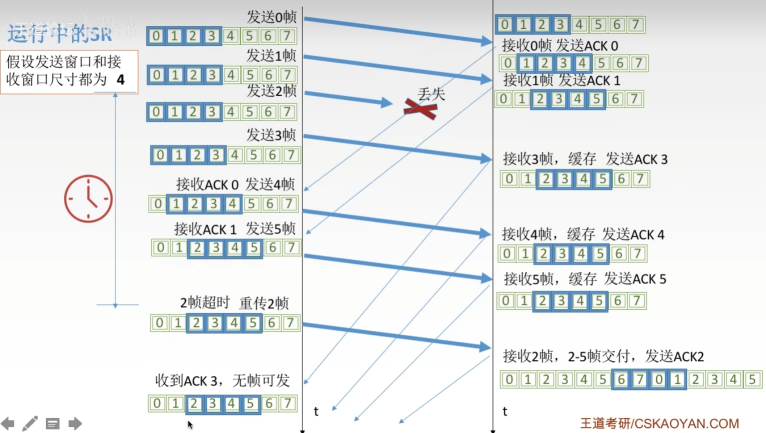

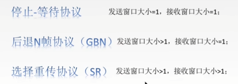

