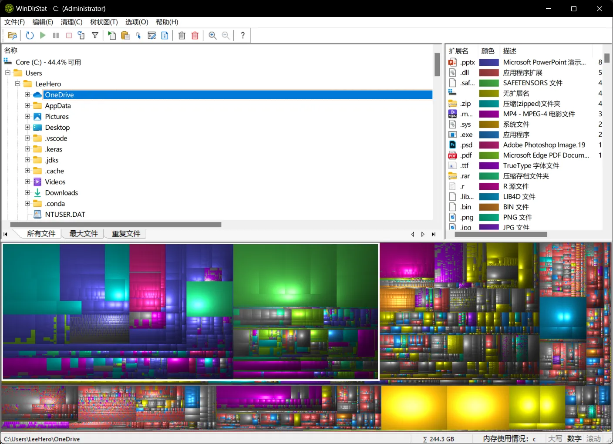

这次折腾起因很简单：OneDrive 越塞越满，本地空间不足。最近购入了一块希捷 4T 的 HDD，刚好有机会把工作文件夹留一份离线、可控、可随时拔走的冷备份；备份完，还得释放本地空间。一步步做下来，顺手把过程复盘成一篇简短笔记。

## 快速可视化看清「谁在占地」：WinDirStat

我需要一个「方块块」的可视化去看硬盘里谁最大块，我用的是 WinDirStat——Windows 上的老牌免费工具。

打开磁盘或文件夹，等扫描结束，下方可以通过方块大小一眼锁定大文件，并且定位、删除、打开所在目录。比资源管理器更能显著定位资源大小情况，方便清理空间。



## 增量备份：采用稳定、可重复、可校验的 `robocopy`

备份策略的核心是**不删历史**。我主要有三种策略：

1. **镜像完全备份**：让备份盘和源完全一致，连删除也同步。适合「纯镜像」，但我不想误删老东西。
2. **增量追加备份**：新增的内容复制到备份盘、修改的内容在备份盘覆盖、删除的内容也**不**在备份端删除。
3. **增量快照**：类似「时间旅行」，每次把结果落到一个按日期命名的目录；相同文件通过硬链接/去重共享存储，只为变化额外占用空间。恢复体验好，但工具与流程更复杂。

直接保留全部 OneDrive 文件夹到本地后，文件夹太大无法在文件管理器 UI 中直接复制，考虑使用更稳当的命令行工具。

考虑到备份频次不多，文件体积可以接受，采用**增量追加备份**是我的诉求。

🔹 这次采用 Windows 自带的 **robocopy**。它能稳定地处理大目录，支持断点续传、增量复制，校验备份一致性也很方便。

### 常用参数

- `/E`：复制所有子目录（包括空目录）。；
- `/XO /XC /XN`：跳过较旧、大小相同、时间相同的文件（只复制变化的）；
- `/MIR`： 镜像模式，保证源和目标目录结构一致；
- `/XJ /SL`：跳过或按链接处理重解析点（解决 OneDrive 的虚拟占位问题）；
- `/R:0 /W:0`：遇错不重试、立刻跳过，备份不中断；
- `/MT:16`：多线程复制，加快速度（取决于机器性能）；
- `/FFT`：容差时间戳精度，避免毫秒差异导致的误判；
- `/L`：只列出差异，不真正执行（非常适合校验）。
- `/LOG:xxx.txt` ： 把输出保存到日志文件。

### 增量备份命令

```cmd
robocopy "C:\Users\LeeHero\OneDrive" "F:\Fortress\OneDrive-Backup" ^
  /E /XO /XC /XN /FFT /R:0 /W:0 /MT:16 /XJ /SL ^
  /LOG+:F:\Fortress\Logs\robocopy.log
```

**效果**：新增文件会被复制，修改过的文件会被覆盖，源端删除不会波及备份端。日志会累积保存，便于事后追踪。

### 校验备份一致性

#### 快速静默检查（推荐日常）

```cmd
robocopy "C:\Users\LeeHero\OneDrive" "F:\Fortress\OneDrive-Backup" ^
  /MIR /XJ /SL /L /R:0 /W:0 /NJH /NJS /NP /NS /NC /NFL /NDL
```

**效果**：如果没有任何输出，就说明源和目标完全一致。

#### 生成差异报告（推荐归档/审计）

```cmd
robocopy "C:\Users\LeeHero\OneDrive" "F:\Fortress\OneDrive-Backup" ^
  /MIR /XJ /SL /L /R:0 /W:0 /LOG:DiffLog.txt
```

**效果**：会生成一份差异日志，可以长期保存，用于追踪某一天到底变了哪些文件。

## 一些小细节和收尾工作

1. 如果发现备份目录的图标变成了 OneDrive 的「小云朵」，那只是 `desktop.ini` 被复制过去了。把它删掉或自定义图标即可，**不影响数据和真正的 OneDrive 备份目录**。
2. 在冷备前，我对 OneDrive 右键选择 「始终保留在此设备」，来让云端的文件完全同步到本地。冷备完成后，右键 OneDrive 文件夹 → 选择 **释放空间**，只留云端占位，不占本地容量，文件按需读取。
3. 任务计划程序可以把整件事自动化。后续如果备份频次多，可以把上面的命令写成 `.bat`，配上定时、唤醒、失败重试策略。