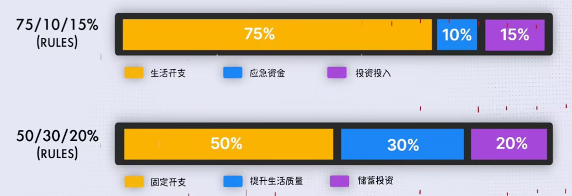
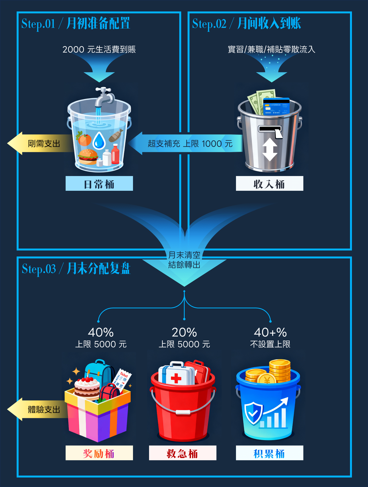
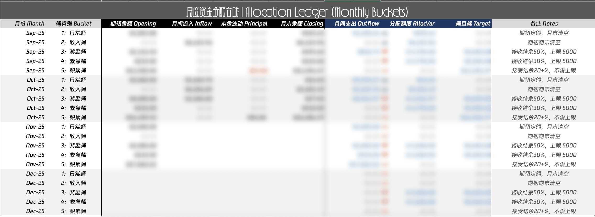

建立一个「可持续」「可追溯」的理财系统，是我在华为实习期间冒出的想法。相比之前课余兼职饥一顿饱一顿的收入，实习让我能够在相对稳定的一段时间有较大的一笔可以支配的资金。在各种场合见到「长期主义」和「复利思想」的关键词后，我开始重新思考我的金钱观。

## Why：为什么要理财？

首先需要明确一下理财的定义。可能有些人对理财的第一印象是四处可见的投资广告，乃至和诈骗挂钩。在这篇文章的语境下，理财 $\neq$ 投资，而是对手上的流动资金有规划，并实现可持续的增长，得以服务于更长远的目标。

最直接的契机是看到 [GilbertWuu](https://www.bilibili.com/video/BV1Xw4m1e7nz) 频道的一期视频：

> 在毕业后赚到自己的第一桶金，最笨的方法就是「存」。

虽然还没有毕业，但我认为「存」下一笔资金能够增加我生活的容错率。哪怕生活费固定，我仍然有一笔钱作为我的缓冲区，让我有底气动态调整我**当下**在「体验」上的投入，并增加我在规划**未来**方面的信心。

## What：建立什么样的理财系统？

这样看来，新的理财系统需要回答的核心问题是——

> 我应该如何平衡我在<mbr>**「存下」**<mbr>和<mbr>**「支取」**<mbr>之间的额度，让我在不牺牲**当下**体验的前提，能够有一笔稳定增长的钱用来投资**未来**？

在这个大背景下，以下是我更具体和个性化的需求：

1. 我是 P 人，试过记账每笔花费但没有坚持下去。我深刻认知到我做不到事无巨细记下每一笔钱，**月度的资金快照**是我能够接受的合理频次；
2. 上海的消费高，但我又闲不下来。每月生活费额度堪堪足够「吃穿用度」的日常类消费，无法覆盖「聚餐、礼物、演出、出游」等体验性消费。在不做过度妥协的前提下，我对这部分**体验性额外消费需要有所规划**；
3. 由于兼职等收入的金额和时间都不固定，在过去直接混淆到生活费中，到月底才发现「赚多少就花多少」。我希望新的系统能尽可能**将我的「收入」和「即时花费」隔离**；
4. 在过去我虽然也会存钱，但金额波动剧烈，看似存钱，不过是有「生活费不够花收入，收入不够动储蓄」的优先级罢了，支取依然盲目。我想要**让存下来的钱要真正存下来**，不轻易动用，并作为「投资学习」的本金，慢慢建立**健康的「让钱生钱」的复利思想**。

## How：如何建立这样的理财系统？

Inspired by 前文提到的那期视频，他提到了收入可以有两种分配模型：

> 
>
> **75/10/15 法则**
>
> - $75\%$：生活开支（负责总体开支，包括吃、住、交通、娱乐）。
>
> - $10\%$：应急资金（负责必要备用，存下 3–6 个月的生活费）。
>
> - $15\%$：投资投入（负责长期目标，比如买房养老、财务自由）。
>
>   👉 适合刚工作、收入不高、还要照顾生活开支的人。
>
> **50/30/20 法则**
>
> - $50\%$：固定开支（负责日常消费，包括房租、伙食等必要开销）。
>
> - $30\%$：提升生活质量（负责短期奖励，包括旅游、兴趣等）。
>
> - $20\%$：储蓄投资（负责长期目标，比如买房养老、财务自由）。
>
>   👉 适合收入相对稳定，想要兼顾生活品质和未来积累的人。

总体来看，虽然比例和职责有一定区别，本质无非就是同时存在三个桶：

- **开支桶**：保证基本生活不焦虑
- **救急桶**：随时能用，缓冲意外
- **投资桶**：长期增长，积累财富

结合我对「收入与开支隔离」「奖励与日常隔离」的需求，我进一步作出如下调整：

- **将「开支桶」拆分为「日常桶」和「奖励桶」。**<mbr>前者负责日常固定开支、后者负责短期奖励目标；
- **引入「收入桶」。**<mbr>月间零散的收入在「收入桶」积累，月间零存整取，月末统一分配。

进一步明确资金分配节奏和比例后，我建立的「五个桶」理财系统细节如下。

### #1. 系统定义

**日常桶（Daily Bucket）**

- **用途**：随取随用，覆盖当月基础日常开销（餐饮、交通、日用等）。
- **目标**：生活消费的「边界尺」。管控短期刚性支出。
- **存放**：微信 / 支付宝 [余额宝 / 零钱通]

---

**收入桶（Income Bucket）**

- **用途**：承接生活费以外的所有零散收入（实习、兼职、补贴等）
- **目标**：资金分配的「中枢站」。避免「来一笔花一笔」。
- **存放**：工资卡 [银行卡 A]

---

**奖励桶（Reward Bucket）**

- **用途**：可控的非刚需、体验性支出（数码、旅游、演出等）
- **目标**：消费自律的 「正反馈」。花得安心，保证生活质量。
- **存放**：储蓄卡 [银行卡 B]

---

**救急桶（Emergency Bucket）**

- **用途**：应对短期、不可预测的突发且必要的支出（看病、设备维修等）
- **目标**：突发风险的「安全垫」，避免因意外打乱整体财务计划。
- **存放**：实体形式 [现金]

---

**积累桶（Growth Bucket）**

- **用途**：投资账户，长期复利增值
- **目标**：长期财富的 「增值器」，按 $8:2$ 比例配置稳健和进阶理财。
- **存放**：支付宝 [基金产品]

### #2. 结转步调

1. **月初准备配置**

- 行为：生活费 2000 元到账。补满日常零用桶至 2000 元。

2. **月间收入到账**

- 行为：收入零散流入。全部进入收入桶。
  - 零存：月间零散收入进账积累
  - 整取：用于支持日常桶临时超支和垫付（上限 1000 元）
- 底线：保证月末收支为正，不出现赤字。

3. **月末分配复盘**

- 行为：收入桶 + 日常桶结余统一清空，流向外部三个桶。
- 推荐分配比例（具体执行会灵活调整，固定上限约束）：
  - **奖励桶：40%**：目标上限 5000 元
  - **救急桶：20%**：目标上限 5000 元
  - **积累桶：40%**：无固定上限，接受「溢出」资金

### #3. 复盘台账

目前这套方案我已经实行了两个月，每月初整理上月资金流转分配与当月初始值，填写数据到资金分配台账 Excel 表格：

- 需要手动填写的字段包括：`期初余额 Opening` ；`月间流入 Inflow`；`本金波动 Principal` 与 `月末余额 Closing`；
- 自动计算生成的字段为 `月间支出 Outflow`；`分配额度 AllocVar` 与 `桶目标 Target`。

经过两个月试行，现在的财务管理能够实现：

- **日常开销有纪律**（日常桶 + 奖励桶，定时定额）；
- **突发情况有缓冲**（收入桶 + 救急桶，独立保障）；

- **长期积累有盼头**（资金的最终积累于长期投资）。

在可以接受的复杂度下得以有效管理资金。只需一月一总结，当月总收入、当月总支出、资金积累情况都一目了然，很好的满足了我预期的「系统性」「可持续」「可追溯」。看到钱钱越长越多，是一件成就感满满的事。

---

## P.S.：未来有待商榷的执行细节

- 需要设置不同平台的支付顺序，比如取消抖音、美团、大众点评对收入桶对应工资卡的绑定，不然维护表格填写数据的时候需要先回溯到资金原始状态；
- 大件商品分期和月付的扣款位置归类到哪个桶？目前暂定是奖励桶；
- 短期目标的预算可预测，奖励桶支取相对频繁，与日常桶职能也有一定重合。未来考虑与日常桶一样按月度整存分配；
- 日常桶定额但还是容易超支，暂时不清楚日常开销的大头在哪些方面。是否有通过记账的方式管理支出结构的必要呢？虽然这样势必会增加执行的复杂度。