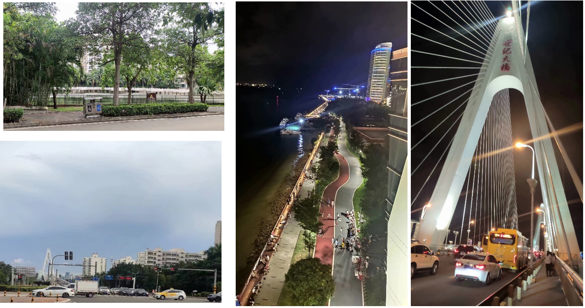

暑期前，幸获菁菁赠与的《一个人的村庄》。

> 《一个人的村庄》，我超级喜欢。

茶余业后，在八月的阳光下，与《一个人的村庄》共度一个人的时光。时间在书页指尖悄然滑过，阖上书页，余味无穷。确是好书无疑。

虽说书名是《一个人的村庄》，但刘亮程并没有仅仅把他当做一本自传，枯燥的写下他自身在村庄生活的种种。字里行间所流露的，更多是他的灵魂、与他所熟悉的周遭的一场对话——

他曾在阡陌交通中迷失自我，他曾用自己的方式改变一些事物；他曾以狗的视角度过一生，他曾以朝暮相处的驴自比；一草一木、一门一院，有生命的、没有生命的一切，被他用文字赋予新的质感、新的理解、新的意义。

走过半生，再次回到故土，已然物是人非，留下家园荒芜。道路弃掷，坟堆又添一座；故人不再，余下一片尘土。 “当家园废失，我知道所有回家的脚步都已踏踏实实地迈上虚无之途。”这后半本书的基调是灰暗的。这本散文集更像是一册回忆录。面对家园破落的现实，在熟悉又陌生的周遭中，回忆过往的点滴，对话深处的自己。他以村庄中种种熟悉的事物为基底，以时光的流转为准线，浩浩汤汤生长起郁郁葱葱的文学森林、连绵不绝的哲思山丘。

黄沙梁见证了刘亮程的成长。即便如此，对这片土地，刘亮程的遗憾仍然难以弥补：

> 我走的时候，我还不懂怜惜曾经拥有的事物......
>
> 我走的时候，还不知道想那些熟悉的东西去告别......
>
> 我走的时候，我还不知道曾经的生活有一天，会需要证明。

这让我想起这座我已生活逾六年的城市——海口。从小学到高中，它又何尝不是见证了我从幼稚走向成熟？时间的年轮悄然转动，蓦然回首，不过不到两年光景，我便要离开这个与我息息相关的地方，可我，真的熟悉过它吗？

回顾这些年，我总是忙于追逐，忙于奔波，忙于处理学习的困惑，忙于解决青春的苦恼。学校—家—补习班，三点贯穿固定的路线，串联起学习与生活。人生仿佛被按下了倍速键，吃的是方便的快餐，坐的是迅捷的计程车，无暇感知周遭的变化，无心发现周围的美好。走出海甸岛，我竟如身处迷宫一般，不知方向。

我决定一人用步迈丈量这座城市，去探索这熟悉的未知。8月16日，小雨。午后，从侨中出发，走过上邦、阳光、明珠、望海、万国、东方与友谊，这是海口最繁华的街道；途径义中、九中与一中，最后来到实验初中，这个梦想开始的地方。

此时已近傍晚。雨后的天空瞬息万变，海边的水塔在夕阳下被映成剪影。这样的景象与一年前某个充实的下午相重叠，恍惚一瞬，我周遭又充斥熟悉的欢笑，毕业显得如此不真实。

8月25日，七夕，晴。华灯初上，我第一次真正踏上无数次坐车路过的世纪大桥，身旁车水马龙不息。居高临下眺望，远处是鳞次栉比的高楼，桥下是盘曲缦回的步道；霓虹灯与道旁灯共同绘就人们夜生活的一支缩影。沿溯步道，与好友有一搭没一搭侃太空，聊过往，不由得感受到一股前所未有的放松与宽慰。

渐渐的，我开始喜欢上这种没有目的地的漫行。漫步，让我浮躁的心灵慢下来，感知到熟悉事物的微小变化；独行，让我有反省自己，对话自己的机会。虽然情景不同，我的心境仿佛与刘亮程产生一种奇妙的相遇。

我涉世未深，学识尚浅。这可能便是这本书，在我现阶段带给我最大的财富：

在家园在记忆中废失之前，在熟悉的周遭中，去感知与珍惜，这种实实在在的拥有感。

<mbr>