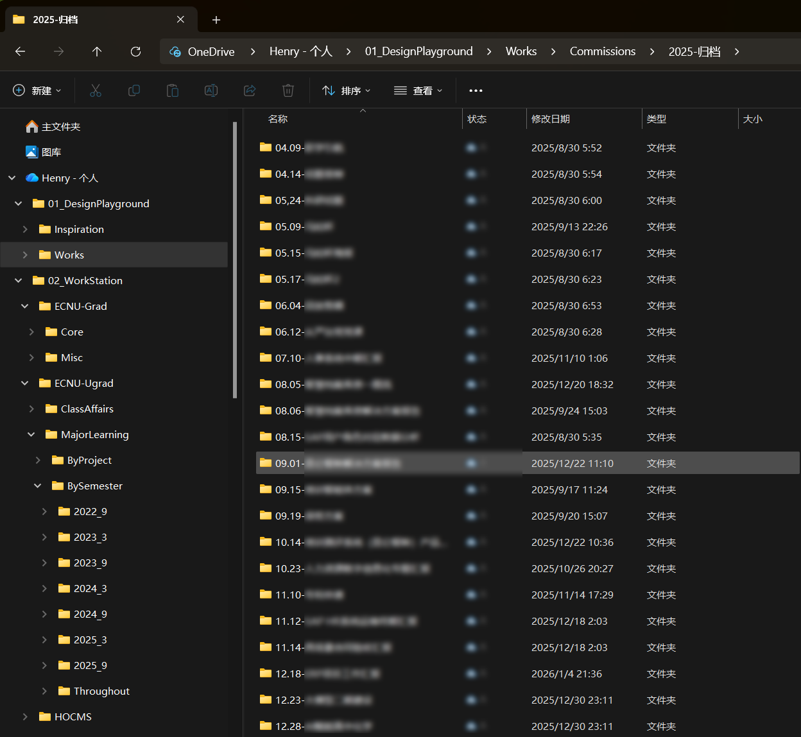
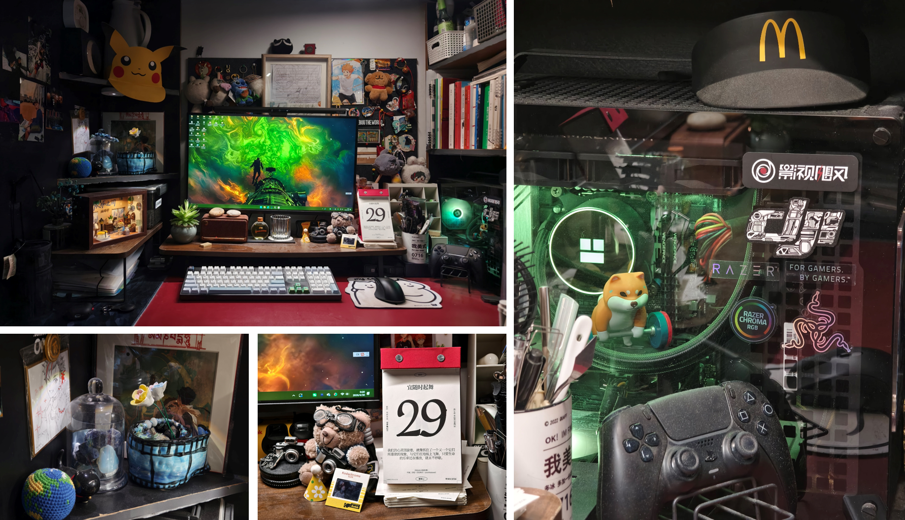

## 难以抵达的秩序

「秩序」「计划」—— 两个在先前文章中反复出现的关键词。

先前的 [年终总结](https://leehenry.top/posts/moment_memos/mms-vol06/#q13-面向-2026-年您最希望实现的三个目标或愿望是什么) 中，我评价自己是一个「计划永远赶不上变化的 P 人」，定下的新年目标之一便是「重新找回对生活的『掌控感』和『秩序感』」。我用*找回*这个字眼，正是因为我的生活总是会经常失去掌控 ——

- [健身笔记](https://leehenry.top/posts/step_by_sense/ss-vol02/) 的随笔，我标签拟定为「我与秩序」，期待通过培养定期健身的*日程秩序*，重塑日常生活的*规律秩序* —— 结果上看竟坚持了高达 2 个星期；
- [财务规划](https://leehenry.top/posts/hack_n_track/ht-vol04/) 的系统，我把流程规划得足够具体，设计了月度账单的每个字段，用笔笔清晰账目平衡*存下*和*支取*的步调 —— 最后数据永远停留在第 4 个月份。

维护秩序的三分钟热度是我的底层代码，在这个话题上，**我好像永远活在「生本能」与「死本能」的钟摆中**。
$$
混乱\to抗拒混乱\to直面混乱\to回归混乱
$$

---

我在 [论文致谢](https://leehenry.top/posts/moment_memos/mms-vol08/) 回顾我整个本科生涯，用这样一段话总结四年来最大的「教训」：

> 以前那个沉迷长远规划的我盲视了太多不能步履如一的可能性，正是这些不确定的变量让我的每一步都成为了无法求解的不定式。在这个过程中，[以终为始的信念，成为我长久痛苦的根因。](https://leehenry.top/posts/words_in_wildness/ww-vol02/#被迫与不确定性对抗的一生)

我总说我「不擅长计划」，更确切的说，其实是「不擅长*执行*计划」—— 四年前如此，现在仍是如此。

整个中学时代，我习惯在周末回家前，心里默念清点着一本本*可能*会读的课本、一册册*可能*会写的材料，不知不觉把书包塞得鼓鼓囊囊。不到两天的周末指缝间溜走，回校前才发现原来连书包拉链都没打开过。数不清在多少因推翻计划满心悔恨、第二天就要上课检查的晚修，匆匆忙忙、连滚带爬地把拖延的作业应付了事。

现在的我，相较以往最大的改变，与其说更会「完成计划」了，不如说是更能「坦然悦纳计划完不成的事实发生」了（~~AKA 杀不死我的只会让我脸皮更厚~~）。但与此同时，我也不因为计划的流产否决过程中尝试努力的意义，我会这样劝自己：**当我尝试的价值不由结果定义，我就有了更多勇气去鼓励自己*试试看***。这样的心态下，我的经历也用一次次的正反馈告诉我：做不到着眼未来，把握住当下已经足够。

这看起来是足够正确的道理，但一细究会很快发现，这则「鸡汤」有些空泛笼统。换句话说，如果一个人什么目标都完不成、什么规划都做不到，那他无疑是缺失了一项重要且基础的社会化能力。

## 混沌的表象之下

或许我没有想象中那么混沌？

在一些方面，我确实很在乎细节和秩序。我的博客不止一次被人评价过「[整齐的像 J 人](https://leehenry.top/guestbook/#1eba9eeabf5248eaa3847dc9c95fb647)」，写下的月刊和年终总结，在结构的规整全面上也收获过类似的赞许。生活中，当我谈及我的文件管理观念、我的桌搭与收纳策略，复杂程度也常让人怀疑「你真的是 P 人吗？！」。

:::fold{summary="聊到文件管理与桌面收纳，如果你也好奇……"}

:::

尽管对于 MBTI，我只当做一种快速描绘大致印象的社交货币，并不在意人格标签和实际情况是否完全对应，但我认可的点在于，哪怕作为「P人」，[我也总是难以在完全混沌的环境中开展工作](https://leehenry.top/posts/words_in_wildness/ww-vol02/#%E6%B2%89%E6%BA%BA%E4%BA%8E%E5%88%9B%E4%BD%9C%E7%8E%AF%E5%A2%83%E7%9A%84%E7%BB%B4%E6%8A%A4%E4%B8%AD) —— 无论是*物理*生命、*精神*生命亦或*数字*生命。

除此之外，鉴于我所担任的学委、乙方、比赛负责人等等复杂而交缠的身份，每学期不鲜遭遇 DDL 密集的高压环境。但就目前来看，我极少出现心态爆炸的时刻，也没有犯过什么渎职的大错。至少在团队协作与时间控制方面，我想我算得上合格。

---

当 W 君读完我的致谢，他这样评论：

> 虽然你说不设计划，可能我们对计划的态度差不多呢！感觉可以细聊一下，你是怎么样贯彻不设计划原则的。

:::fold{summary="W 君对计划的理解"}

W 君把「计划」这件事分解得更细致一些：

1. **被动计划**。比如考研、四六级、毕业论文，这种被动的 DDL，必须要设置计划，一般是根据 DDL 倒推几个关键的节点安排任务，这种计划很难不做；

2. **主动兴趣**。能凭借兴趣废寝忘食地主动研究下去自然是最好，然而大多数人是懒散的，所以也需要借助计划的力量。

   我觉得兴趣爱好方面有两种学习方式。一种是参考教科书、上课的节奏，规律性地学习。一种是自己先捣鼓起来，开启一个小项目的实践，然后去对比一下自己和别人做的有啥不同，如何改进。在这个过程中缓慢成长的同时，也积累了更多「下一个项目做什么」的线索。

   两种方式也未必是互斥的，可以互相穿插。我觉得你提倡的「不做计划」应该就是后者那种。

3. **旅游计划**。我自己觉得旅游也不可能完全不做计划，我猜你会稍微搜索一下目标城市的标志性景点，然后松散地安排一下？我自己觉得旅游计划不能做太满，要充足留空以应对各种意外，不然旅途会很疲惫，一直在赶 DDL，精神难以放松。
4. **讨厌但必要的计划**。指那种，我没有兴趣，但不得不做，而且没有明显的 DDL 的东西。比如求职简历的经验累积。这种事情，会让人觉得又痛苦又茫然。
5. **计划的失败**。计划失败后不应该辱骂自己，而是应该分析一下为啥失败了，调整后续的计划，比如一天 100 个单词的量是不是对目前的自己压力太大了，如果是的话那就减少。

:::

为什么不认真对待计划还能把事做好？这确实是个很值得细聊的话题。

## 钟摆摇晃的轨迹

我回忆了一些我比较符合「P 人」刻板印象的点，大概有这么一些方面：

- 无法把事情做在前面，是「DDL 任务驱动型人格」；
- 不做日常日程规划，无法把时间分块得事无巨细并执行；
- 没有非必需每日习惯，从来坚持不下来手账、记账和日记；
- 生活、学业和职业上没有且不信任长远规划，更愿意过好当下；
- 支付能力范围内的消费品，从有购买冲动到下单付款一般不超过 24 小时；
- 不介意生活被打断，可以说走就走 —— 小到下床吃夜宵，大到拎包出远门；
- 旅行上随遇而安，可以定下机酒落地再做攻略，对计划变数的接受能力极大；

:::fold{summary="写到这里现实世界发生的插曲，有情绪发泄的碎碎念成分，和文章本身不完全相关"}

背景是写到这里时开始删删改改，不断纠结这小节文本的叙述线索，直接导致这篇文章陆陆续续写了三天依然难产。所以今天本来的计划是出门换换心情，然后依次完成以下任务：

1. 吃饭；
2. 健身（是的，空窗三个月后我用意志力逼自己重启，今天是第二天）；
3. 找个有插座的奶茶店把本文剩下的内容写完；
4. 回实验室把导师要求*周末前*需要汇报的事情推进一下（这意味着当下离导师要求的 DDL 只剩下不足 48 小时，即将发下最后通牒）

实际情况是一下午开着电脑但没憋出来几个字，但不断消耗着精力槽的能量，由于第三个步骤阻塞，直接导致了第四项任务流产。

**我又一次摧毁了我的计划。**

一事无成的结果叠加上晚餐并不好吃的油炸食品令我油光满面且心情烦躁。带着这样的心情我并不想睡觉。突然意识到这件事本身和文章的话题形成了一种奇妙的互文，于是在深夜重新打开文档敲下了这一些字。

在以往我不会如此烦躁，我想这次可能是由于计划的破坏和 DDL 的紧迫交织在了一起，导致了我心理层面的混沌与失控。

计划有变，现在的我决定熬夜把这篇文章写完，然后明天用一整天时间集中完成「晚点」的第四项任务。祝我成功。

:::

要对以上的现象的动机提炼一个共性，我想也许在于我总是讨厌「闭合的时间」—— 保持开放，随机应变，拒绝提前锁死。 如果说我的 P 体现在时间轴上的灵活，那么我的 J 会体现在：我在乎在空间和形式的截面是否被结构化。

---

### 认知结构的秩序

我在做事的第一步，总是希望*亲自*建立一个*自顶向下*的图景。我脑海中需要一张「地图」，以确认我未来的发展路线能在我的掌控之中。**地图不一定要在开始就完整正确，但它必须以一种足够具体的结构存在，我需要这份结构来让我安心。**

具体的，在「伏枥之间」建站早期，我最先构想的是文章分类的方式 —— 最后敲定了有侧重、不重复且不遗漏的四大专题概括未来内容创作的所有方向。还没写文章，先自娱自乐地设计了一堆 Logo 和视觉物料。

月刊「漫想与杂谈」的创刊也是如此，最先考虑的是栏目名的组织；年终总结也是如此，最先思考的是需要回答的问题。对于其他的事项，我同样会先梳理清楚子任务的顺序和优先级。如此「结构先行」的思维也进一步影响了我的措辞习惯。

### 空间结构的秩序

因为我任务的启动更多靠瞬时动力和 DDL，那么对「低熵」创作系统的要求自然被我放到了更高优先级的位置。为了降低更多创作噪音，视觉上我会更加在乎形式和细节的规整。这体现在我生活中的多个方面：

- 博客设计，追求版式和谐，保持色调一致与视觉统一；
- 物品收纳，兼顾视觉美感，契合分类逻辑与使用直觉；
- 资料管理，遵循严谨逻辑，平衡可控管理与长期维护。

生发于一种审美驱动的结构化习惯，我在乎我生活中的一切的*呈现*方式，尝试用自己的努力为我所接触的世界增加一层「可读性」。

### 意义结构的秩序

我是一个有「收藏癖」的人。现实中，我会收集票据与旅行信物，还有每到一个新的城市都给自己寄出一张明信片的习惯。数字世界中，「伏枥之间」也成为了我收纳想法与数字创作的容器。

抽象的讲，我需要并享受于这套内在的归档系统。我因这些「无用的仪式感」感到舒适与安宁。从结果上来说，哪怕在做的时候并没有抱着多么功利的心态，我也真切的因此而收益。

---

这大概就是我与秩序共处的方式。我与未来的时间流打交道的方式是开放的，我允许它成为一个随时覆写的变量。但想让事情仍保持正轨，我需要引入一些秩序感为我的自由度服务。

未知的未来会发生什么？我不知道，但我现在真切拥有的东西 —— 一个平和清晰的内心、一个整洁有序的桌面，一个掌控范围内的工作区、一个大脑中有完成头绪的进程。它们是否能被我的秩序感安置妥当，我会更加关心。

我想，收拾好*现在*的自己，才有对*将来*不设防的底气。

<mbr>