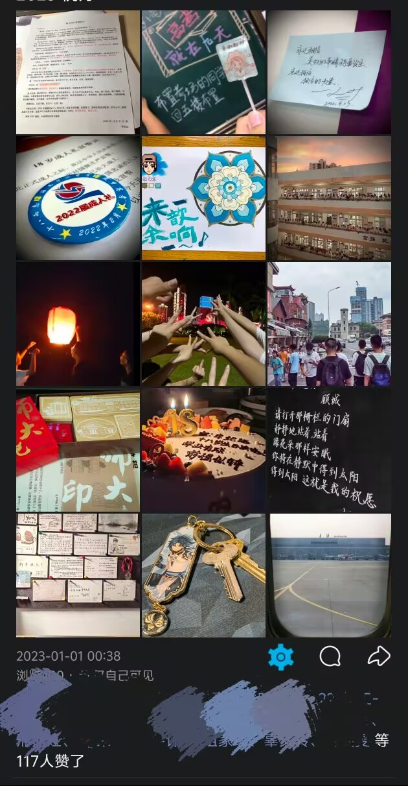

用什么去形容这一年？

是美术结课作业的畅想

还是成人礼颁授的徽章

是高考前老师送的棒棒糖

还是在心愿墙留下的纸张

是喊楼时背景绚烂的夕阳

还是七人书写放飞的梦想

是和初中老友难得重聚诉说过往

还是与高中兄弟在长沙背起行囊

是华东师大赠与的书签印章

还是生日蛋糕上的荧荧火光

是把新宿舍的钥匙挂在包旁

还是独自一人前往家的方向

平凡吗？也许不平凡。

是什么让这一年如此不平凡？

是这独一无二的青春

更是青春路上遇见的你们

---

2023 祝好

