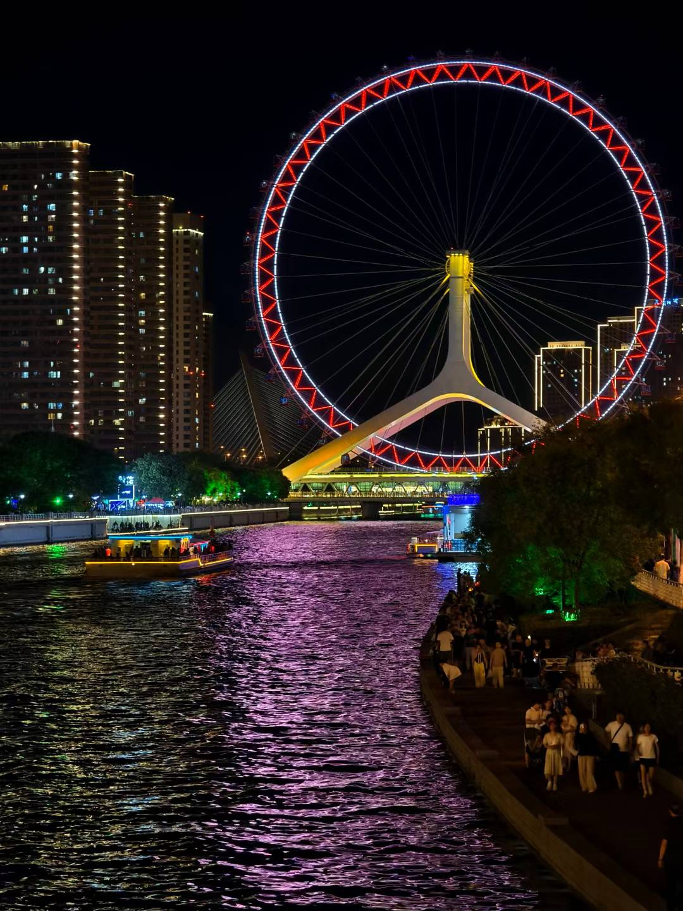

晚上来海河走走吧。

爱上天津这座城市，只需要一个晚上的时间。

---

我曾和朋友评价，上海什么都好，但总是觉得，少一些城市的「烟火气」。

那什么是「烟火气」呢？也许是深夜路口的夜宵小车？也许是公园广场的老歌金曲？也许是街边小贩的叫卖吆喝？似乎总是差点味道。

然而当我来到这里，我想我找到答案了。
「烟火气」来自扎根市井的、处处皆舞台的一种自信与生机。

在海河的岸边，我看到了形形色色的自信生发。一个配备卡拉ok机的小三轮，搬上几座小马扎，便打造成一场独家小型巡回演唱会。一台音响加上一袭横幅，便化身一隅露天的探戈教室。
桥上相依相偎的夫妻，岸边随性牌戏的男人，江中浮沉自得的孩子。

在这里，每个人都可以站在属于自己的舞台中央。人们欢迎来自周遭的一切目光，哪怕这些目光是或审视或无言或赞赏或喝彩，都将化为氛围的一部分。这不会影响他们在自己缔造的这一片，自然自由自信的乌托邦。

**这就是这座城市的「烟火气」。**

---

换句话说，我喜欢这座城市，是因为他愿意牺牲一些所谓的「市容市貌」，容忍一些「变数」的发生。这些「变数」脱身于市井人民的创造力。**而人，往往才是一座城市气质最根本的塑造者。**

---

