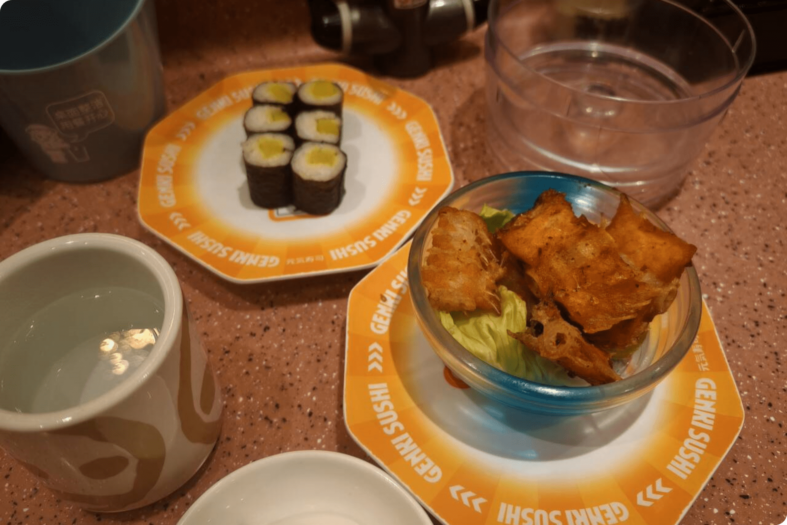

我馋这一顿寿司很久了。

 自选五盘，金碟，二十元。限时、限量、限日。

 它在某个角落等我，只在周五晚市出现。

 第一次买到它的时候，错过了使用时间

 红字退款冷冷地飘在订单记录上

 一点点拉扯出某种不甘。

---

所以，这次刷到它，我毫不犹豫地下单，只等着赴约。

 失而复得的满足在一整周的日子里盘旋。

 可这次抵达才发现，它只在晚市出现。

---

手中拎着汉堡王的新品，走在回程又折返的路上

 我咬着薯条也咬着忍耐对自己说：

 「今天，我一定要吃到。」

---

为此推掉亲戚本来晚饭的邀约，再次出门。

 偶遇的晚霞很美，像是某种神明的铺垫。

 小小的门口挤满了食客的期待。

 等位十分钟，终于落座。

 与预想不同的是，金碟区域小得可怜，

 在回转带上像一块尴尬的拼图。

 青瓜小卷、金大根、炸鱼翅、螺肉军舰

 ——看起来廉价又疲惫，

 转了一轮，只有失望在增加。

---

人声汹涌的店里，我扫了桌上的二维码

 看见手机里亮出许多我盼望的名字。

 我犹豫着要不要下单。

 却在下一秒，把手机放下。

---

因为我再次预设了一个「肯定不行」的答案。

 预设了一句：「活动不包括这个。」

 预设了别人的皱眉、否定，甚至轻轻一声：

 ——「你别想了。」

---

我犹豫着拿了一盘金大根小卷，

 再后来，是咸得发苦的螺肉军舰，

 鱼翅寡然无味，剩下半盘沦为摆设直到离开。

 五盘之中，两盘重复。没有惊喜，只有咀嚼的无力。

---

直到临近离开之时，猛然发现隔壁那桌，大快朵颐。

 他们桌上摆着的，正是我犹豫能不能点的那些盘子。

 像是反讽一般，让这顿失败的晚餐更加令人沮丧：

 ——期待落空的原因，仅仅是因为我没有开口。

---

那晚，我从寿司店灰溜溜走出来，去了萨莉亚。

 化悲痛为食量。

 披萨、冰激凌、寿司，叠在胃里，像叠在心里的遗憾。

 我笑着跟 W 君说，今天我吃了三个二十块

 更远离了那个为了省钱而出门的初衷。

---

以前，也有太多这样的瞬间。

 不是只有这几盘难吃的寿司。

 那些没去投的夏令营，

 那些没主动说出口的邀约，

 那些在关系中一次又一次的沉默。

 似乎全都因为怕？

 怕努力后仍然失败，怕空，怕确认自己不够好。

 有多少次，没问，就没有，没试，就错过。

 也许不是机会不给你，

 是你太快说服自己不值得拥有。

---

原来我一直以为，

 只要我不去做，就不用为努力后的失败负责；

 失败可以被虚化，可以说服自己：

 「本来就不行，不如及时止损。」

---

但今天，一件再普通不过的小事

 轻易推翻了这种预设。

 所谓「被拒绝的演练」，

 其实并不总是必要。

 它只是我留在舒适圈的借口。

 只是我替自己筑起的墙。

---

我想试着多问一句，多走一步，

 哪怕答案仍旧未知。

 世界，也许就在那一问之间，

 悄悄，宽阔了一点。

---

我们想起高中写过的一封信

 一段「我想成为的我」，

 还有那些「我不喜欢被情绪绑架」的坚定，

 那些「我能建立健康关系」的笃定，

 都像是我曾努力许诺给自己的远方。

---

驻足徘徊于一个遗憾的夜，

 胜过醒于一个追悔莫及的黎明。

 这顿寿司，吃得并不愉快，

 但意外成为了一封生活亲手塞给我的信

 就像出门偶遇的晚霞，

 位置不够完美，时机不可预料……

 但同样很美。

