## 引子

> ⛰️秋行北境，7 天 6 市，3212.9 km
>
> **「当我听到风从我耳旁呼啸着掠过」**
>
> 从赤峰的红山到阿尔山的金林，
>
> 风卷草浪，车窗装满可触摸的远方。
>
> 当白桦林的金叶拂过额尔古湿地，
>
> 才懂得「苍茫」二字该怎样丈量。

保研成功后的第一次远行。冒失如我，在确认录取的当天夜里便登上了驶向北方的列车。我们将在北京汇合出发——那是我第三次踏上这座城的土地，心境却已与以往全然不同。

对我来说，这趟旅程几乎等同于一场毕业旅行。久别重逢的高中旧友，紧张与期待交织。我想用文字留下这一路的心情，为记忆备份。纵然失真，也足以成为日后追索的锚点。

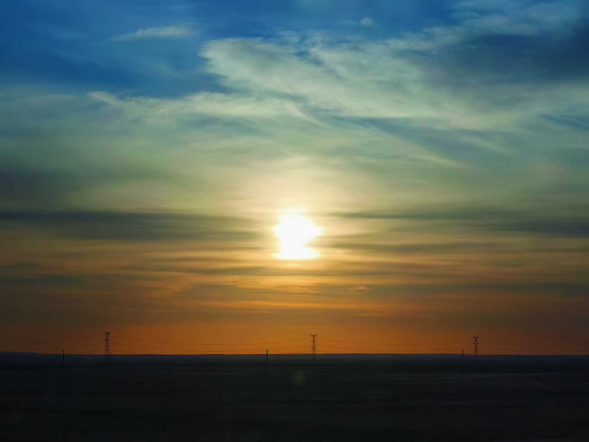

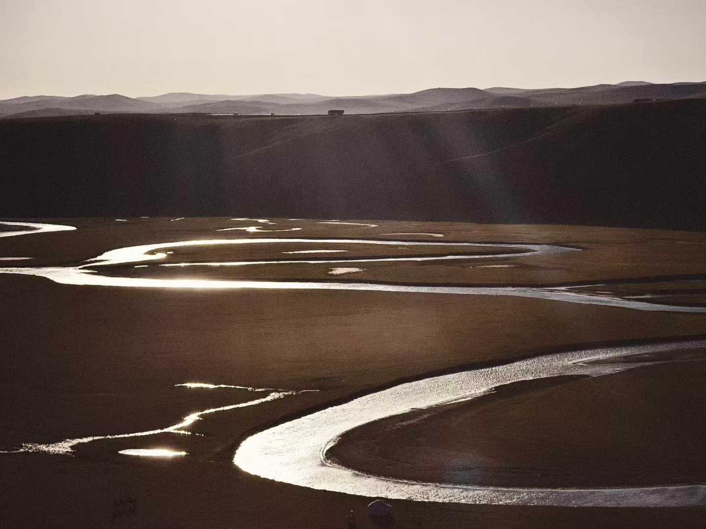

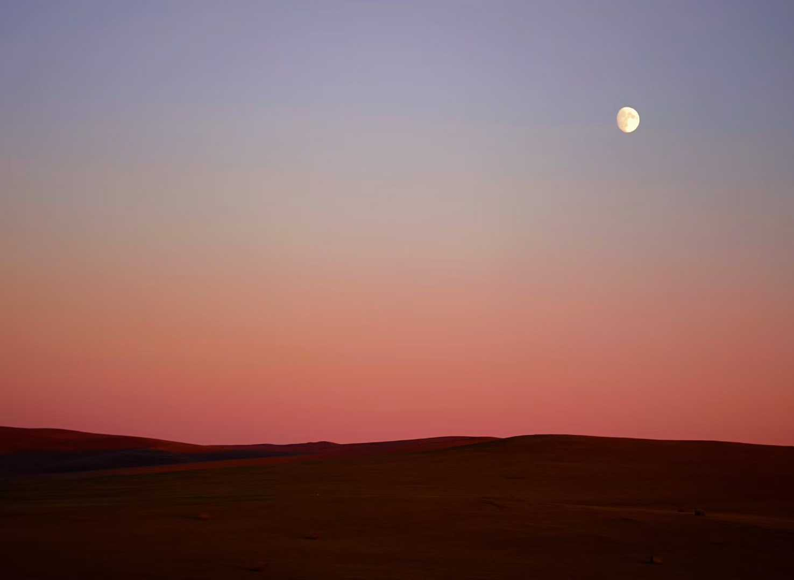

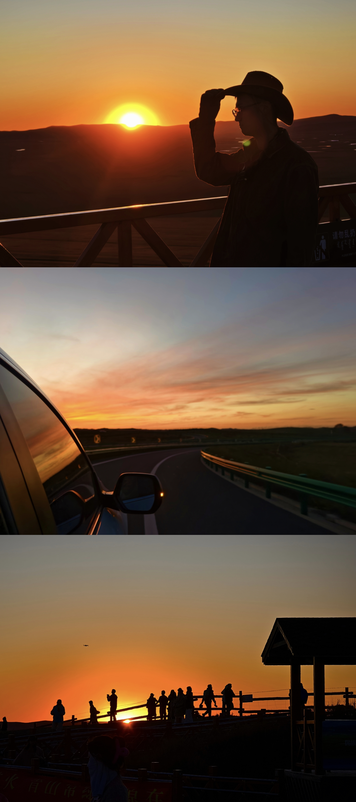

## Day 01🔸09/30

### 🗺️丨去了哪？

📍红山国家森林公园

- 赤峰的山，真如其名，赤峰赤峰，处处尽是赤红的山峰。
- 这是一个免费景区（或者说公园）。内部所谓景点设立草率，但可以一路登高，俯瞰城市与丘陵。来到这里才真正从视觉和温度感知秋天的实感——秋意正浓，层林尽染。
- 哪怕景区本身略显乏味，同行的人让路途不再煎熬。真好啊——那种不必刻意营造气氛的安心感。每个人都很有趣，没有人被边缘，也没有人需要特意照顾。沉默时自在，喧闹时热烈，情绪都能被稳稳接住。

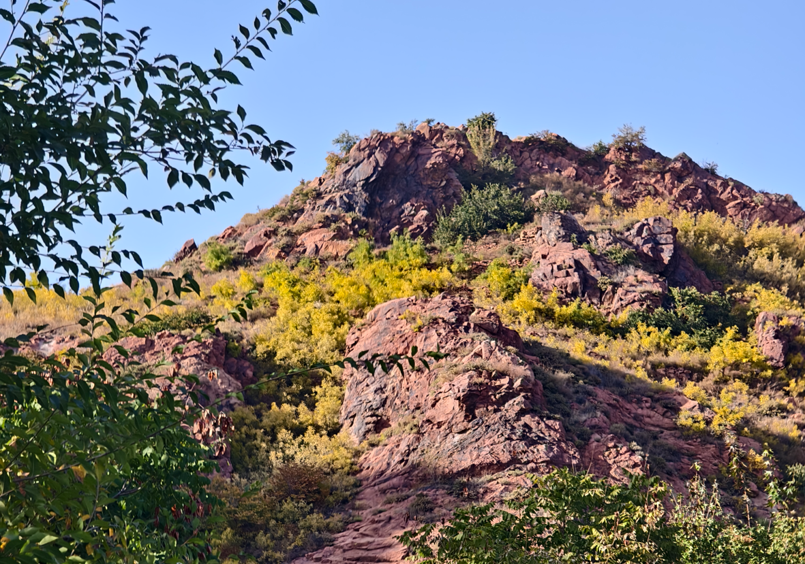

### 🍴丨吃了啥？

- 热情的出租车司机推荐了我们第一顿蒙餐。人均四十的三四人餐，足够五个人吃到撑。看菜单时眼大肚子小，才发现人均 150 的餐标预算根本花不完。
- 这里把奶茶当水喝。蒙餐厅不主动提供茶水，只卖咸奶茶——壶装。味道像低配版的霸王茶姬「乾隆一号」，奶味浓烈，乳糖不耐受者的噩梦。
- 晚上来到了一条看不到尽头的夜市，摊位售卖全国统一模板的烤冷面、章鱼小丸子、烤鱿鱼……意外在中国几乎北方的尽头发现最南端家乡的小吃——清补凉！价格 15 元一碗，殊不知价格成了它唯一的优点？不信邪的我们连买两家，无一例外创新添加了椰蓉、红枣、爆珠——亵渎之作。虽然西瓜现切、冰沙现打，充满了手工的匠心，但最后只剩纯粹的液体物尚且能入口。
- 夜市没吃饱，加餐是赤峰名物「对夹」。三块上下一个，看起来完全像缩小版的肉夹馍。皮炸得很酥脆，但肉居然是冷的……虽然肉量很实诚，可惜口感像没加热透的汉堡。对食材的暴殄天物，评价一般。

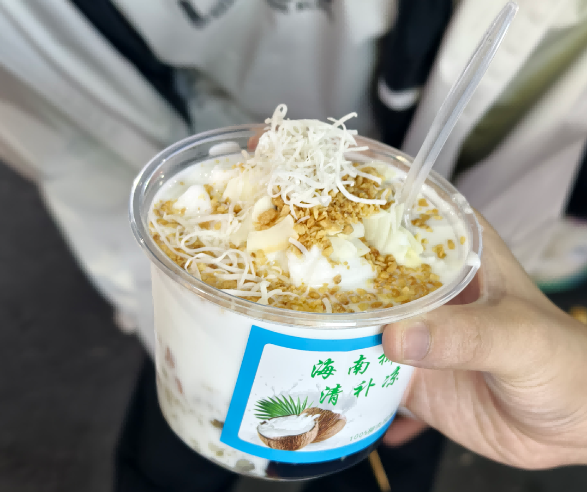

### 💭丨还有吗？

- 下午逛完景区回到民宿瘫着刷小红书，突然一个帖子提醒我，今天是纸质乘车凭证生命的最后一天。没来的及打印这一路的车票，特意打车来到火车站。这是唯一不是为了火车而专程前来的一次，只为给一种仪式感的终局送行。
- 这里打车便宜的不可理喻。起步费六块，三公里十块钱！离开北上才发现外面根本没下雨。
- 从苏州往返两次，再到北京、赤峰，共六张车票，赶在十月一号前完成了纸质车票最后的葬礼。甚至从赤峰回北京的车票，由于是在国庆期间的行程，已无法打印，只剩一张薄薄的白色行程单。熟悉的一切就这样慢慢离我们远去。

## Day 02🔸10/01

###  🗺️丨去了哪？

📍塞罕坝国家级自然保护区（塞罕塔）
📍乌兰布统景区（影视基地 公主湖）

- 见识到了传说中的草原瑞士卷。

> 每年秋季，草原进入打草季，牧民们用打捆机将鲜嫩的牧草紧实地裹成圆润的草捆。 这些草捆不仅**方便储存和运输，还为牲畜提供了过冬的口粮**。
>
> （草原瑞士卷，牛马小零食，非常贴切的名字。）

- 阳光斜照，SUV 在笔直的公路上驰骋。车载音响正在播放朴树的《空帆船》——

> 我迎着风，我迎着风，
>
> 金山银山，繁华云烟，温柔之夜，我什么也不带走。
>
> 那狂风，那不知吉凶的前程，
>
> 我还是要扬起帆。

- 自驾真的很辛苦。国道的恶劣超出想象——慢车有单车道拦路的小三轮和小电驴，快车有急转弯不愿减速的大巴和大运。那一刻才明白，原来高速确实属于更好开的那种路。感谢三位劳碌整日的司机。
- 所谓「稀树草原」——像是忘记添加植被贴图的地形，黄红相间的山体之上只有集中且零散的一团团树木。南方完全无法见识到的景致。
- 天气很好，登高望远之时恰巧是一天中傍晚时分的 Golden Hour。金黄的白桦树点缀在一望无垠的草原画卷之下，So Breath-taking。

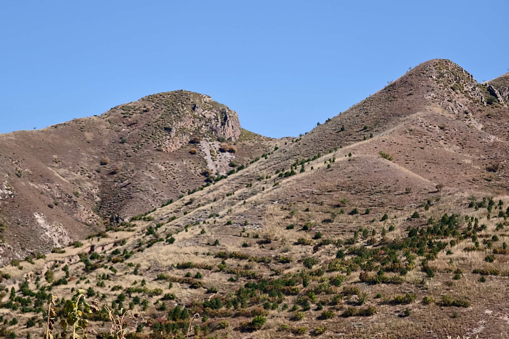

### 🍴丨吃了啥？

- 去吃早餐，刚下车被后面的鞭炮声吓了一跳，三种颜色的烟花直冲云霄，响彻整个街区。这才真正意识到，今天正是国庆。
- 不要过度相信团购的推荐人数，吃一堑吃一堑，依然自以为是的加点太多……又是过于豪华，没吃完打包的一顿早餐。
- 这次奶茶直接上了一锅，和炒米&奶皮（神奇奶酪状切片）混合在一起，用碗装，陪着牛肉馅饼或果条（看起来像mini花卷，吃起来像面包的一种主食）或奶豆腐饼（有软的奶味夹心的另一种方形主食）一起吃。更适合内蒙古宝宝的豆浆配油条。
- 这里真的很喜欢沙葱这种配料，在这之前一直没有把这种食材和韭菜分的太清楚。烧卖是沙葱羊肉馅的，昨天的鸡蛋也是和沙葱一起煎炒的。烧卖很多汁，几乎完全无法作为一个整体夹起。真的是很扎实的分量。
- 在一个跑马场的路边停下，刚好是承德和内蒙古的交界。被路边的香气四溢吸引——巨大一串羊肉串居然只卖十块钱！此时还没意识到下一顿正餐将在六个小时后。
- 几乎一天都奔赴在路上。在景区走走停停，最后比预计晚了四小时到达克什克腾旗，跑空两家蒙餐馆，最后九点多才在一家烤肉店解决了晚餐。真的饿了，平时套餐最嗤之以鼻不屑一顾的米饭都成了至圣美味。

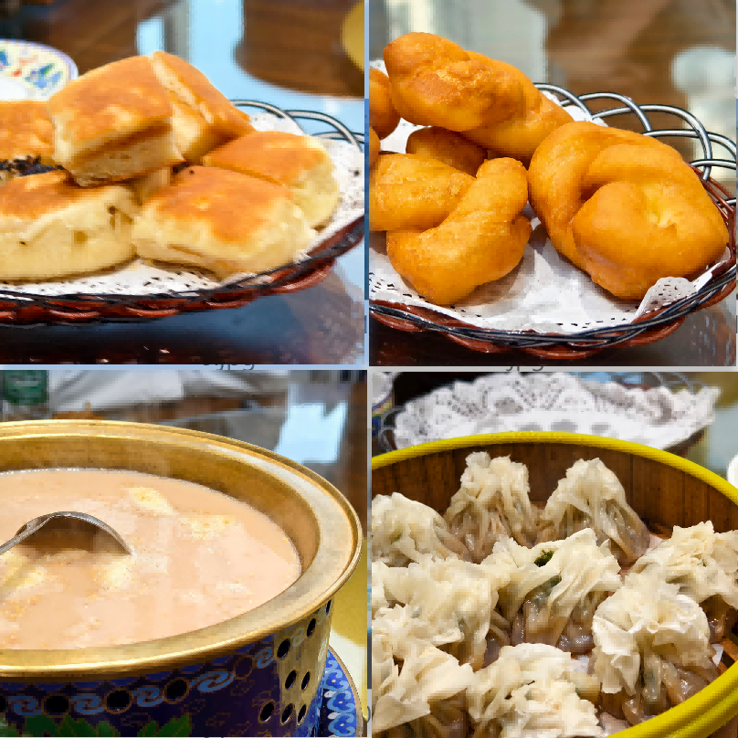

### 💭丨还有吗？

- 如烟花炸开的火烧云下，我们奔驰在落日大道，美得窒息。
- 当太阳落山，空气迅速收回全部热量。从26度到6度只需不到半天时间。于是外卖点了一套秋衣……45块钱，虽然包装像是唐朝出土，但保暖性能姑且还不错，先凑活着吧。
- 没想到第一天 Action 就面临存储卡告急！迁移了一部分到 TX 的 U盘。另外发现自己相机的连续几张照片都在同一个地方有小黑点，在留白比较多的构图尤其明显。开始担心是遇到了镜头刮花的问题，然后换了镜头情况仍然存在，看来是 COMS 进灰了（气笑了）
- 路线穿过了河北承德，在路边的路牌上看到了那句经典的河北文旅宣传标语「那么近那么美……」
- 细节和机动平衡的计划，靠谱踏实的领航员，相互扶携不过度计较的同行人，这些因素让过去这两天的体验都相当不错。不过由于是第一次自驾，行程确实安排的有些紧张，明天会面临更加漫长的驾驶任务，祝我们成功。JX 正式加入队伍，一行九人正式完成最终会师。

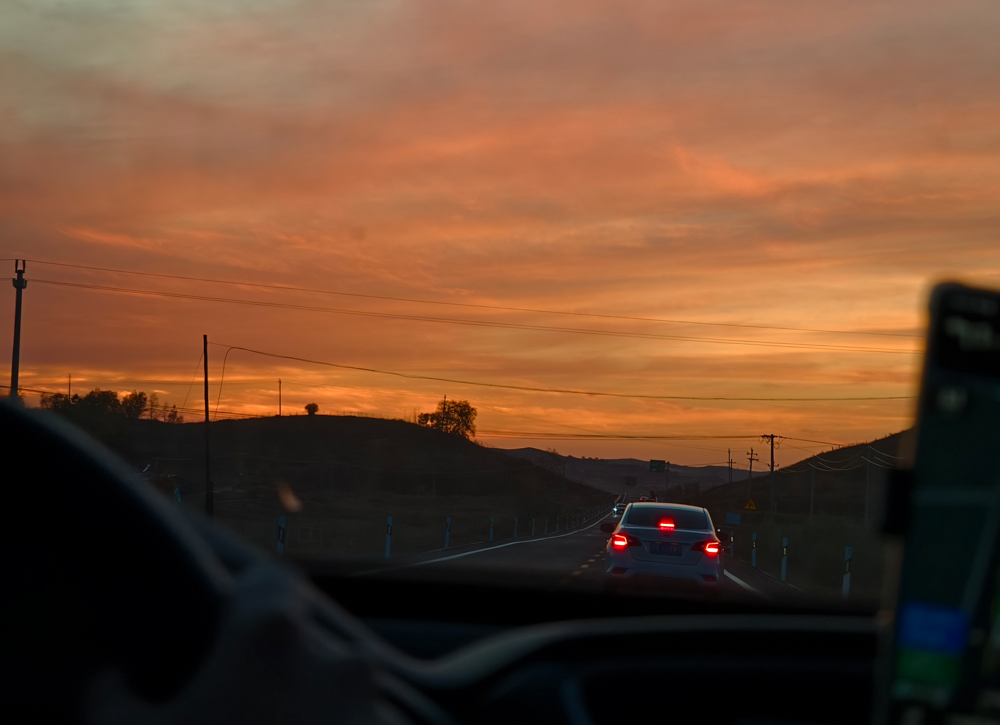

## Day 03🔸10/02

### 🗺️丨去了哪？

📍热阿线（黄岗梁国家森林公园）
📍G303（热阿线调头改道）-G306（觅食西乌珠穆沁旗）-G331（从夕阳西下到披星戴月，直指阿尔山）

- 早9晚11，赶路900公里。
- 旅游公路热阿线堵得水泄不通！及时调头止损，即便改道如此，也满满当当奔驰一整天。后来才知道，热阿线这条路不仅堵死到下午，更堵死完整个国庆……中国人还是太多了！

### 🍴丨吃了啥？

- 将就两顿，蒙餐再次+2。
- 查重率很高。早上的烧卖这次没有牵肠挂肚的肉皮分离，下午的肉馅饼很香很香，让人比较印象深刻。小伙伴说在这里从老板交谈中第一次听到蒙古话。
- 十一点半到民宿，饥肠辘辘，唯一还接单的外卖只有一家荷叶烤鸡。商家在下班前十分钟发现来了一笔三只整鸡的新单的崩溃感可想而知~~送到时还是热腾腾的，锡纸锁住鸡肉的温度和多汁，味道不错。

### 💭丨还有吗？

- 笔直的公路顺着金黄而无垠的草原地势起伏，一马平川，风吹草低见牛羊。最像公路片的一集。
- 夕阳是水波的形状，将远处的信号塔映成剪影。车窗框住天空的蓝橙渐变渲染出一杯橘子汽水风味鸡尾酒特调。
- 前不着村后不着店的夜路，断断续续的微弱信号，告急的燃油提示灯，甚至一车人已经做好了抛锚郊外度日的心理准备。撑过两家歇业和倒闭的加油站，用最后的血液驱动车辆到达市区最后的希望。榨干了最后一滴油，彻底熄火，无法继续前行哪怕一米——在加油站喷枪前。如有神助，虚惊一场。精确计算的像是小说的剧情。

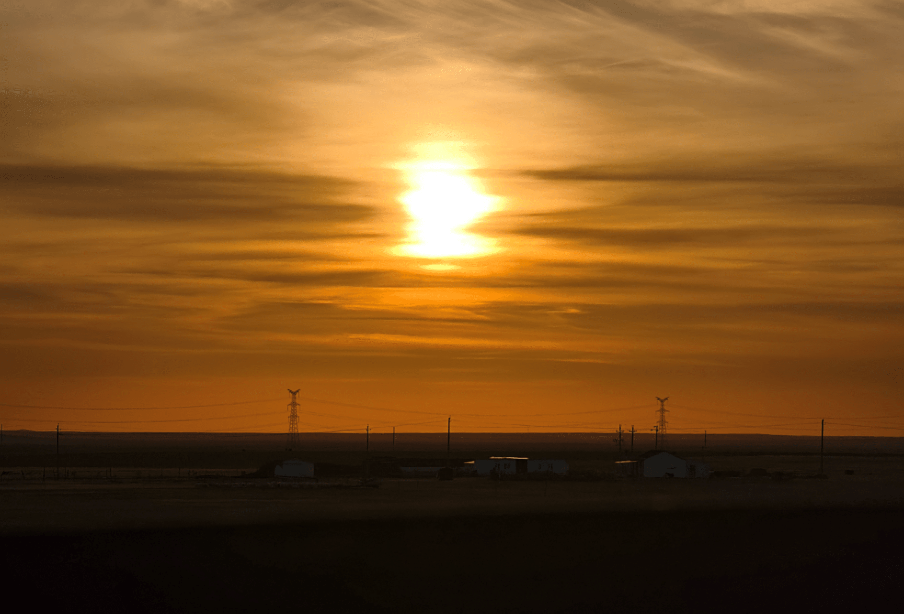

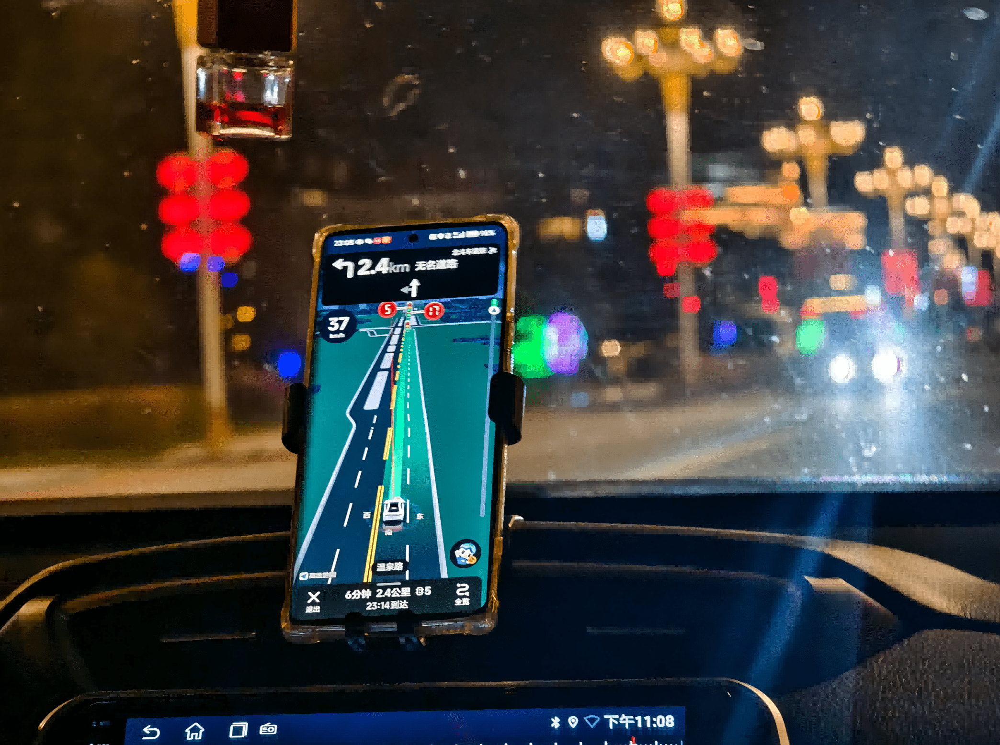

## Day 04🔸10/03

### 🗺️丨去了哪？

📍阿尔山国家森林公园（石塘林 杜鹃湖 驼峰岭天池）

- 这里的建筑已经开始有比较显著的风格了（也许是俄罗斯风格？）外墙的涂装颜色丰富和谐，主体是鲜亮的红/蓝/黄/白撞色，多而不杂，赏心悦目。建筑的构成有鲜明的几何特征，有高耸尖顶也有温润圆顶，和内地拼贴式火柴盒式的平房最大的不同在于：视觉的整体性很强，从建筑单体到整个街区。像小时候搭的积木城堡，组成了一整套小镇。哪怕是集合宾馆餐饮的商业化建筑都，同样符合这样的特征。

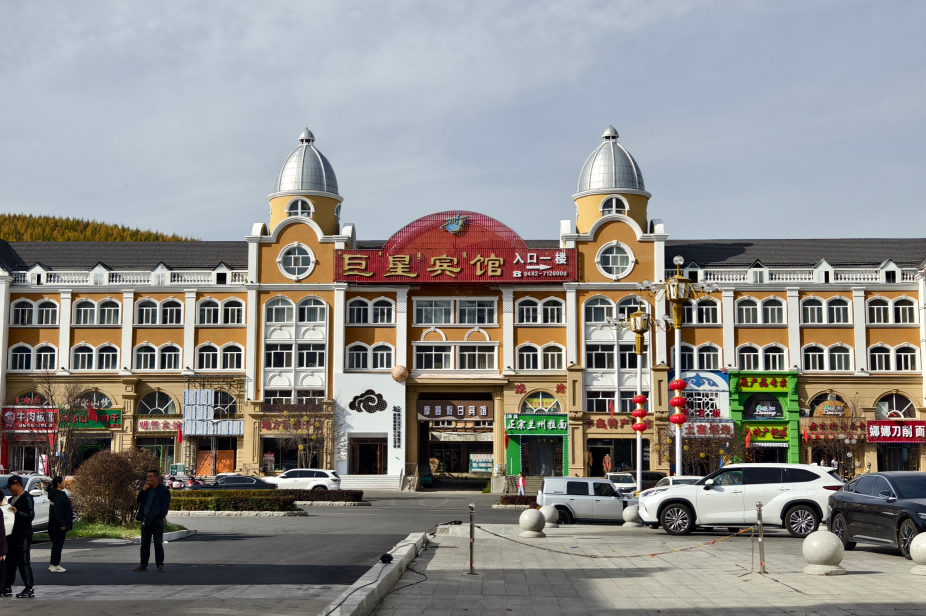

- 阿尔山一日游，是本次旅行活动半径最短、最集中的一天，更是纯玩的时间比例最淋漓尽致的一天。这里分景点很多，沿观光车的路线有选择的打卡，3 out of 8。
- 石塘林，很像以前春游去的演丰镇红树林湿地公园。人们通过蜿蜒的栈道穿梭于原生态的树林与溪流之中。溪水顺着山势潺潺，风吹芦苇荡。树木大多笔直高耸，扎根于黢黑的乱石之上。除了松树一系，大部分树叶已经零落殆尽，只剩肃杀冷寂的秋意。这里还有岩浆熔铸后突起的石堆，现在已经成了鸟类和松鼠天然的庇护所。

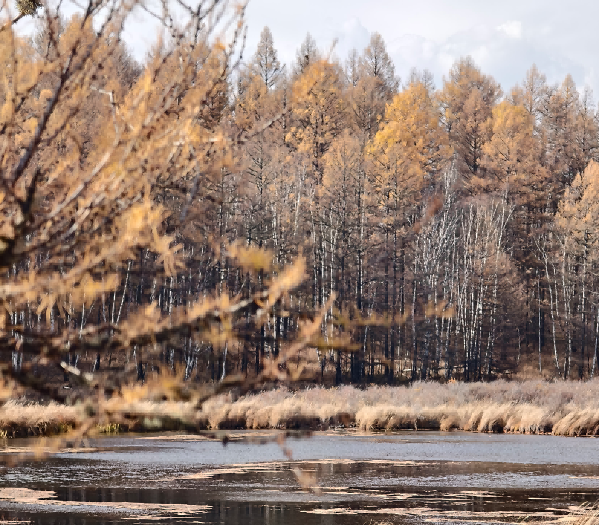

- 景区里“林中秋千”的翻译——Autumn Thousand In Forest😆
- 秋天的杜鹃湖杜鹃缺席，湖面冷滞。难道不酷吗？很符合我对开放世界的想象。非常像《荒野大镖客》会出现的场景，想把我的马召唤过来横渡到湖对岸。
- 天池，最震撼的一集。拾级而上，视野逐渐开朗。远处雾气氤氲在金灿灿的林中，漫山的森林又将壮阔的天池包裹，傍晚时分的阳光刚好斜照湖面散射到整个山间，目力所及的一切由此镀上天然的光影滤镜。不由得感慨，在真正自然的鬼斧神工面前，第一次觉得其他人类造物竟能如此苍白无聊。

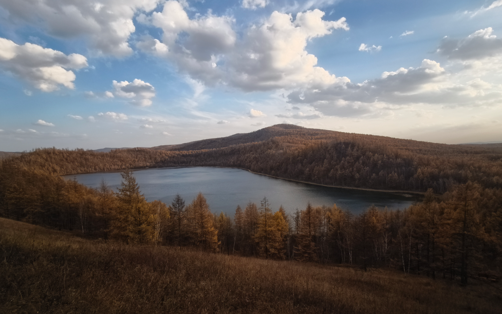

### 🍴丨吃了啥？

- 早餐，蒙餐++。到这里应该已经是第五顿蒙餐了，平平无奇，没有太多记忆点。
- 晚餐的冰煮羊，非常非常好吃。火锅本来应有的汤底被换成了一层厚厚的冰块，鲜切的羊肉覆盖其上，加热到冰化为原汤再直到沸腾，最大程度保留肉质本真的鲜美。另外还有足足五盘另外涮煮的牛羊肉。整体流程和火锅差不多，主打一个肉量多肉质好，裹满麻油麻酱库库炫，蛋白质炸弹，就这个战斗爽。

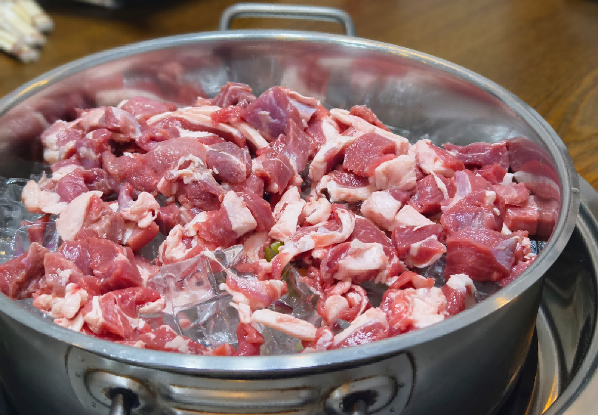

### 💭丨还有吗？

- Airpods 4 ANC · 2024.09.27 - 2025.10.03 R.I.P. 不辞而别，令人费解的突然蒸发，本次旅程最大损失……😭过去的一年我不能没有它，回去我将补写一篇追悼文。出远门必丢东西定律（1/1）

## Day 05🔸10/04

### 🗺️丨去了哪？

📍呼伦贝尔莫尔格勒河景区（No.3 浩林温都日驿站 No.2 阿吉奈驿站 No.1 莫尔根驿站）

- 在这里给自己寄了一张明信片。和邮政合作的蜜雪冰城居然是绿色的主色调！

> 此刻我正站在地球的绿肺上呼吸……
>
> 脚下是八万平方公里的草浪，
>
> 耳边是马头琴揉碎的星光。
>
> 牧民家的铜壶煮着落日，
>
> 手把肉的香气裹着露水生长。
>
> 当白桦林的金叶拂过额尔古的湿地，
>
> 才知道「苍茫」二字该怎样丈量。

- 这里是作家笔下的「天下第一曲水」。我们用 40 元承包了大自然千年的奇迹。草浪之上，八级大狂风恶狠狠的拍打着我的脸。阳光透过云层透射出梦幻的丁达尔光影，莫尔格勒河在直射的光线下如银缎一般。

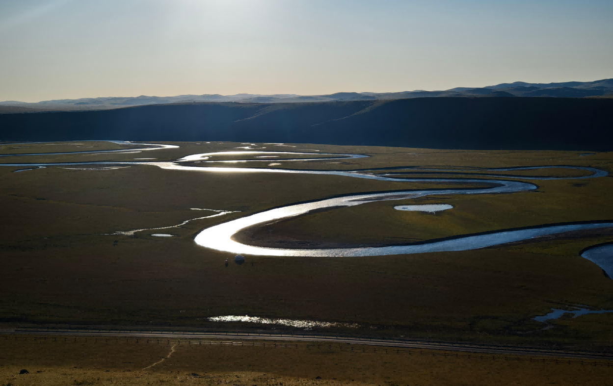

> W：有趣的是，我坐在上海的闭塞的小房间里，看着你发的图片。开阔的，没有任何阻挡的大片大片的风景，天际线没有被楼房切割而是用山峦那些起伏的线条来表示，阳光没有任何遮蔽地让蜿蜒曲折的河流反射出耀眼的银光——可惜这些风景也是被相机的取景器框选的部分而已，一想到整个天地包裹着你的眼球，就感到由衷的羡慕呀！

### 🍴丨吃了啥？

- 晚餐又是九点才吃上，久旱逢甘霖的一顿——**炭火烤羊腿**！……巨香，好吃到晕厥，内蒙古的牛羊肉权威这一块无人能敌。刚好和在北京出发前的那一顿做了对照实验，从服务、口味到性价比都无可指摘，全面秒杀（三块一串的羊肉串，肉是不要钱吗？！）

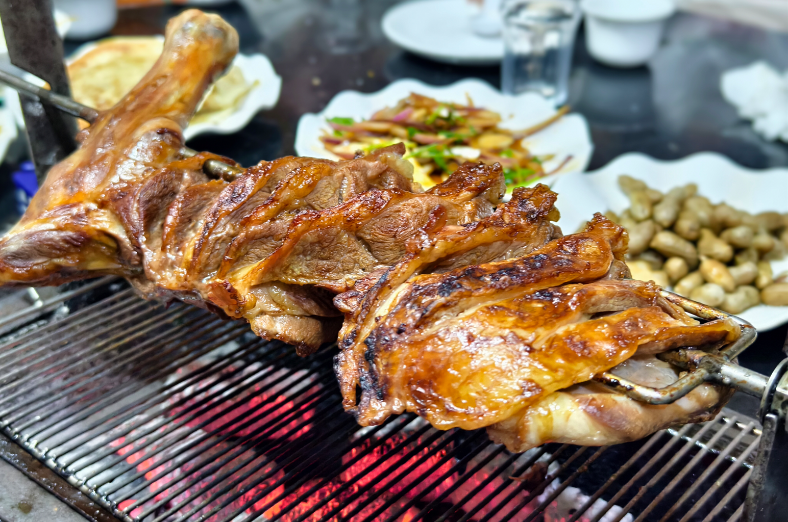

### 💭丨还有吗？

- 今日迷思：蒙古包是草原的乳头！（“难怪奶制品这么多”）

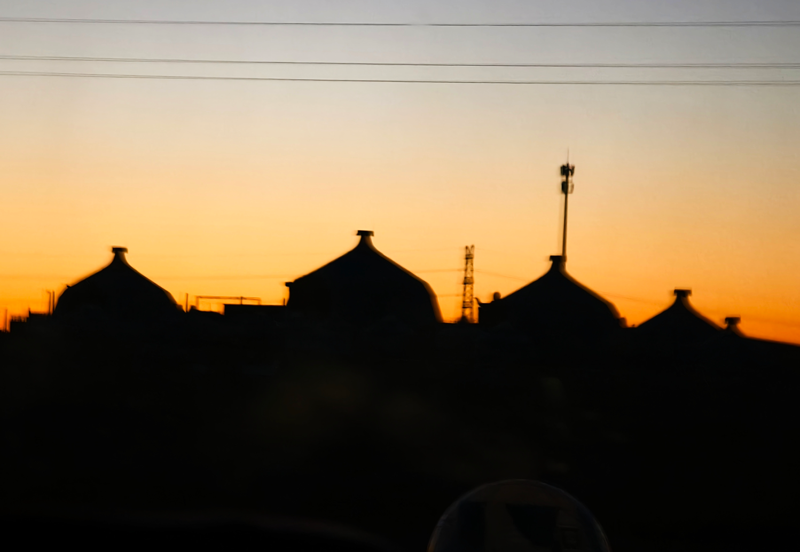

- 今晚住的是别墅！有按摩椅（硬控我半小时）、麻将桌（根本没精力玩）、好多个独立的床和房间。关键还很便宜，和阿尔山的一比性价比简直绝杀。
- 完了，不对劲，好像感冒传染到我这里了。热水器羸弱，今天洗不了澡。睡前一杯 999 下肚，但愿人没事。零下的气温，无情的狂风，夸张的温差，低估的保暖。我是一行九人中招的第四个。
- 路上看了大半本《被讨厌的勇气》，曾经实践的一些理念有了更具体和全面的表达，很有启发。读书笔记酝酿中……

## Day 06🔸10/05

### 🗺️丨去了哪？

📍满洲里国门

- 这里是三国交汇之处——俄罗斯、蒙古、中国。国门确实非常雄伟，但是否值得 5A 级存疑……周围几乎每十步一个小商品店，浓缩成一个超大型集市。

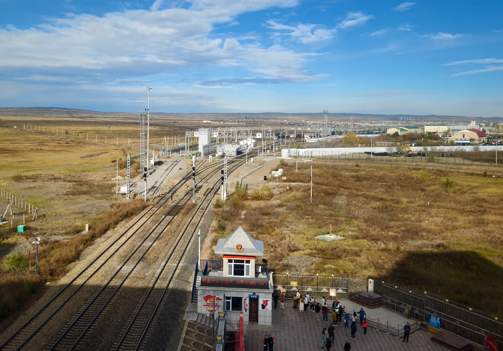

- 俄罗斯巧克力便宜得离谱！各种进口品牌堆满货架，最便宜的一块只要一块钱。打包了很多，准备日后分给朋友尝尝。

### 🍴丨吃了啥？

- 一锅热腾腾的牛肉砂锅炖，肉量实在，汤底浓香。很满足的一餐。第一次尝试「气饼」，鼓鼓囊囊，中空，吃起来有一定韧性，有点淡雅的甜，好吃。

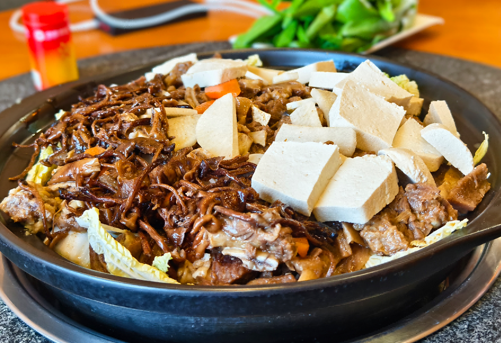

- 晚上夜宵加餐是华莱士。没有喷射，完美收官（win！）

### 💭丨还有吗？

- 早上起床时身体发热，路上也昏昏欲睡。遇冷鼻涕止不住，看样子感冒更重了。好在已经沿袭回程的路线——从早十点到晚十点几乎都在赶路。希望明天快快好起来。
- 旅途接近尾声，明天的这个时候就已经在北京了，真的很快😭难忘的国庆假期，难得的毕业旅行。

## Day 07🔸10/06

### 🗺️丨去了哪？

📍返程赤峰

- 信号塔、光伏板、重工业工厂、风力发电机，草原的辽阔上时不时能看到人类以工业的秩序向自然昭示的存在感。直耸入云的烟囱亦是人类造云的机器。人类以他的姿态在苍茫的自然之中留下自己的痕迹。

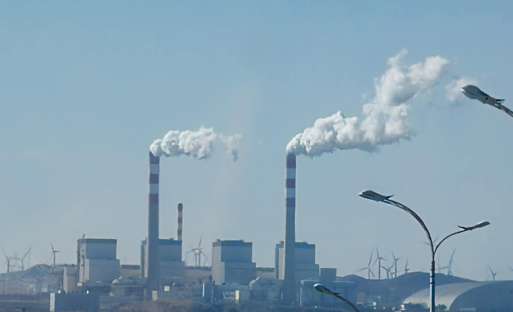

### 🍴丨吃了啥？

- 第七顿蒙餐。奶制品给我吃到有抗体。浅浅戒断两天奶茶好了~
    最后一餐是羊蝎子火锅。一大锅羊蝎子，一大锅牛筒骨。香而不膻，唇齿留香。

### 💭丨还有吗？

- 今天起床感觉身体好多了😋 终于回血。
- 车被刮到导致多花 1300。逆天误工费条款，要把修车的日子也算上，400+1100，就当是交学费了。
- 最后在赤峰站换回两辆租的车，用了租车老板的相机留下了临别前最后的合照。谁知道他用的是没有原图的微信原相机。CCD 质感，不赖。

---

- **返京路上恰逢中秋。在月圆之夜，我们的旅行画上句点。草原的风、河的光、奶茶的咸香、同行的笑声，都留在了那片辽阔的北方。**

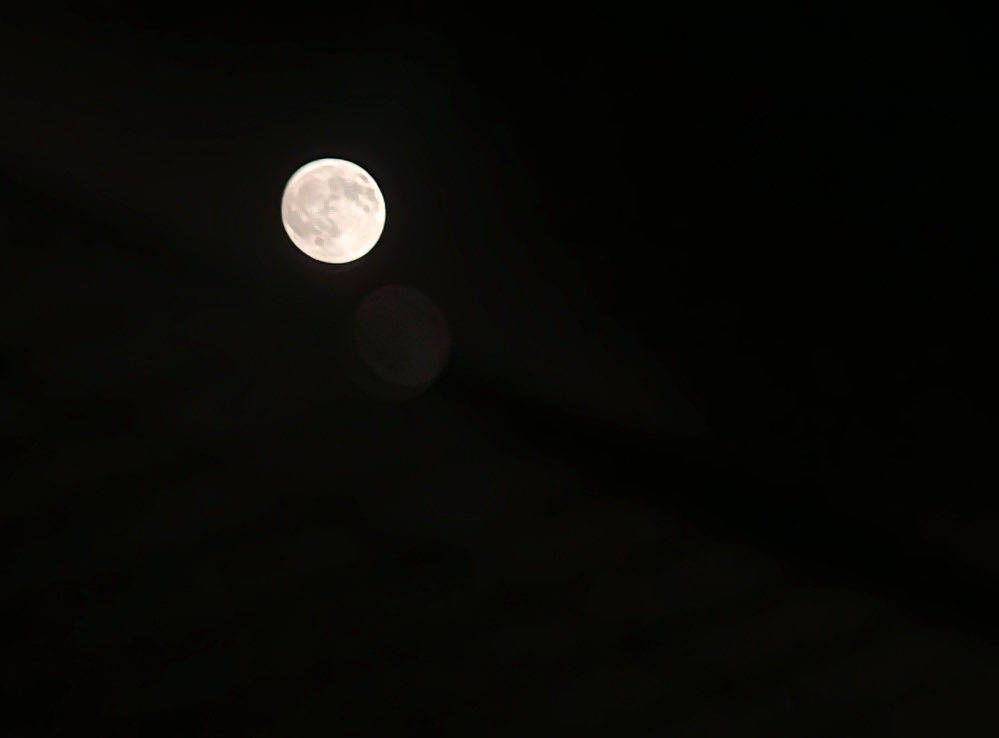

## 🏁丨旅程总结

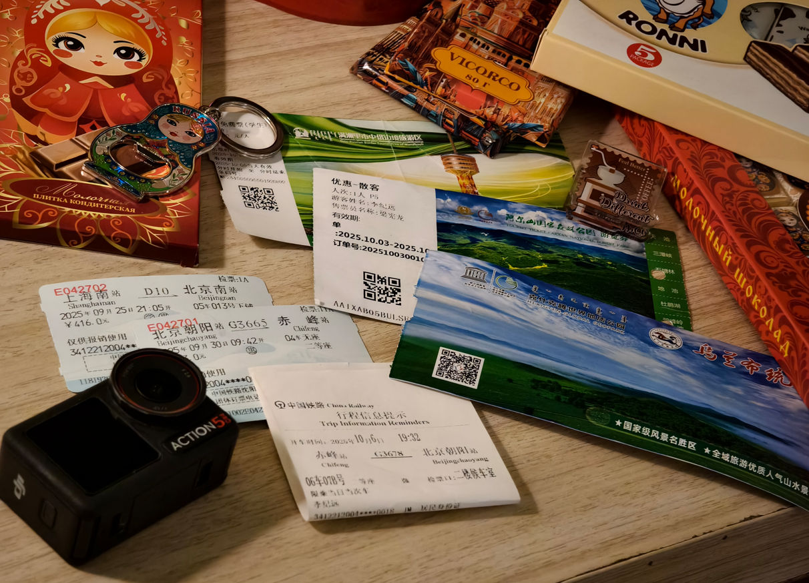

> 从 **09.30 到 10.06**，七天六夜，驶过 **6 座城市、21 个区县**。

从赤峰到呼伦贝尔，从丘陵到草原，从密林到河谷，车轮刻下 **3212.9 公里**的轨迹。这是一条由风连缀的路线。

> **总里程：3212.9 km**，**驾驶净时长：41 小时 6 分**
>
> 一路跨越 30 段国道、5 段高速、13 段省道、5 段乡道、4 段县道、5 座桥梁与隧道。

腾飞大道的落日、丹锡高速的群星、海拉尔河上的特大桥……这些地名是草原辽阔的注脚。每一次转弯都连接着一种新的风景。

> **总支出：¥27824.30**， **人均支出：¥3091.59**
>
> - 🚙 交通（包车 / 高铁）：¥16356.40 · **58.8%**
> - 🏠 住宿（酒店 / 民宿）：¥4408.00 · **15.8%**
> - 🍽️ 餐饮（正餐 / 零食）：¥5364.90 · **19.3%**
> - 🎟️ 门票（景点 / 活动）：¥1555.00 · **5.6%**
> - 💧 公用（水 / 食材 / 药品）：¥140.00 · **0.5%**

数字背后，是沿途一顿顿热气腾腾的大快朵颐，是油门与风声的交替。

---

当返程的高铁驶入熟悉的站台，导航上的终点终于又变回“北京”。窗外的草浪退去，取而代之的是城市的光影。我们回到生活，但那片辽阔和苍茫的记忆，会在每当有风吹过耳边时，恍惚间在眼前重新闪回。

欲买桂花同载酒，终不似少年游。幸甚至哉，在还有勇气奔赴远方的、最好的年纪，有你们同行。
