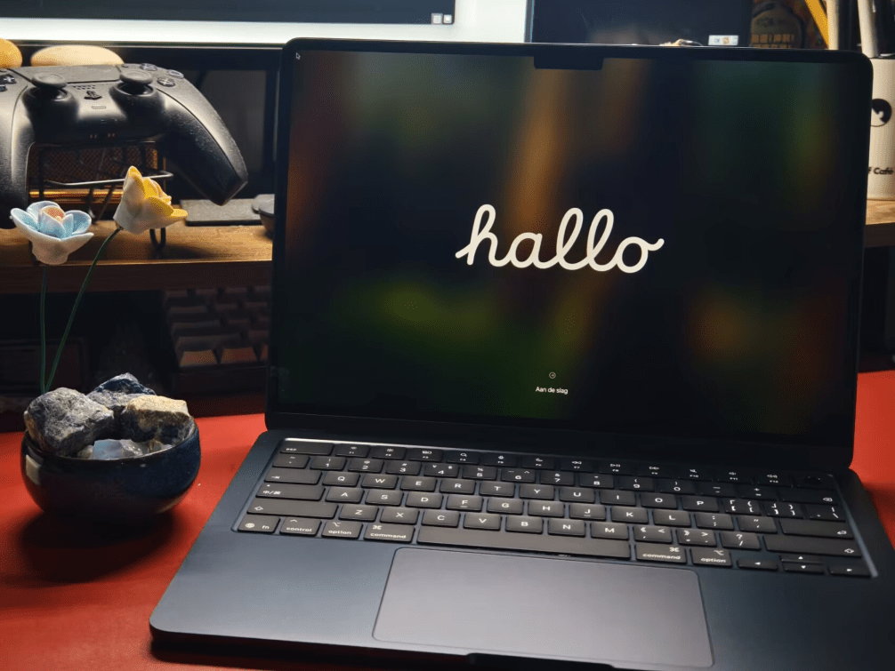
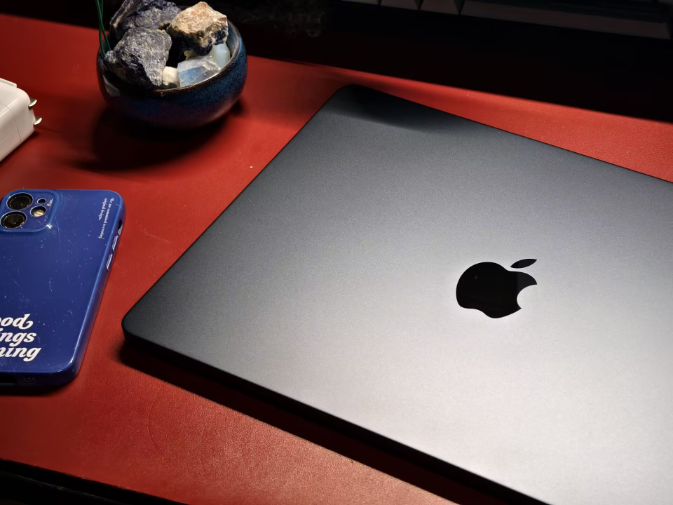
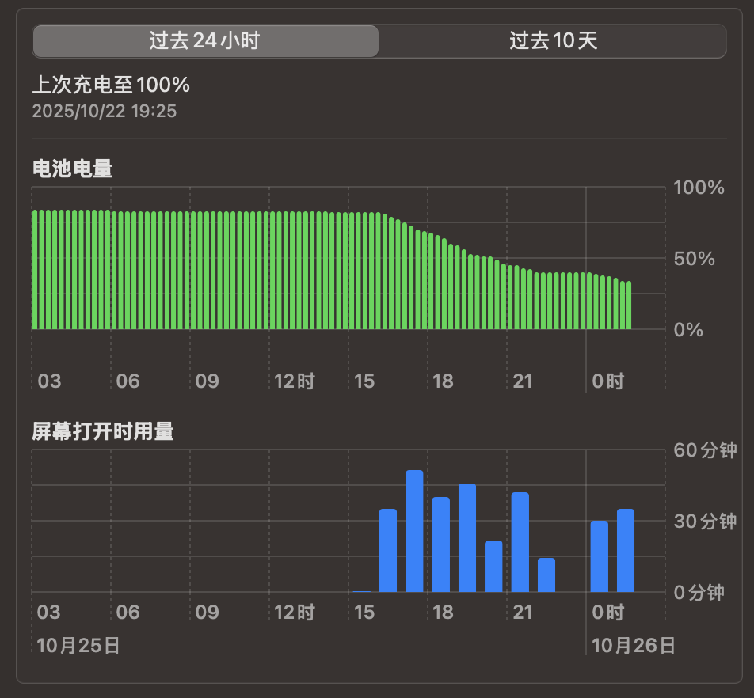
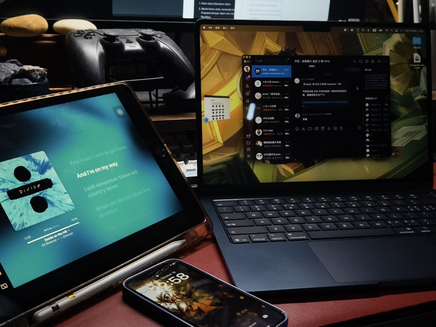

## I want it, I got it.

为什么要切换设备，这就不得不提到我的前笔记本「联想 ThinkBook 14+」了。从大学开学至今服役已满三年的它，已经失去了所有便携的特性：

> 只要待机放在包里面，就会激活电烙铁形态，至多二十分钟即可快速耗干一切电量，变身一块有且仅有增加负重功能的高密度金属砖头。配合我断掉的单肩包，哇谁家铅球落在这里了～

让我们恭喜它光荣退伍。

所以购入 MacBook Air （13 英寸 M4）的初衷呼之欲出：

1. **「我要轻便与续航兼得」**。这是最大的原因。这两个需求是并列相交的，毕竟续航好，意味着我短途出门就可以彻底丢掉增加负重的重要同谋：电源适配器。由此以来 13 英寸机身本身的轻巧得以最大化，没有任何拖累的桎梏。

   我是一个不喜欢固定工作环境的人，在任意一家咖啡店乃至餐厅，不用在乎是否有插座，随时都可以拿出电脑开始码字，太优雅了。

2. **「我要试试看 Mac 的软硬件生态」**。也许很多人纠结 Mac 的原因是因为 Windows 系统的独占软件。于事实上 Win 和 Mac 双持的我有了更多冗余的容错空间。

   抛去这个缺点不谈，堪称标准的屏幕色准、优雅的动效设计、丝滑的苹果生态是想让我想要试试看的重要理由，助力我的摄影爱好不说，甚至也许可以进一步激活我目前已经有些闲置的 iPad？

3. **「我要还不错的性能表现」**。为了预备 Apple Intelligence，全系 16 GB 内存起步配上 M4 芯片，哪怕是丐中丐版本机器也有了性价比。相比往年机器加量不加价，日常工作已然绰绰有余。

对我来说，有些事情似乎只要有了想法，最后总会覆水难收。看到上海国家补贴的尾巴当时不用摇号抢购，可以立减 1000 加上 12 期免息贴息，月供最后来到 500 左右。这个数字我目前存款足以 Cover，而每个月的兼职收入也完全可以覆盖月供要求。等不到双十一了，早买早享受，拿下。

## 有些意料之外的体验

### 第一印象

云对比了若干不同配色，最后选择了「午夜色」。因为键盘的配色只有黑色，所以唯一的深色系「午夜色」的 C 面色看起来最和谐的。当收到货的那一刻，我得以肯定：「我没选错」。



是我见过的一体化最强的笔记本。除了左右两侧的电源、耳机和雷雳接口之外，没有任何出风口和扬声器的开孔存在。拿起来比计算机教材轻薄，可以单手开盖。整体上是质感很好的铝金属，深色看起来尤其具有工业的高级感。是经典的苹果美学。



### 系统交互

触控板巨大而丝滑，这决定了 MacBook 和一般笔记本电脑交互习惯的最大区别：可以彻底解放外接鼠标，甚至解放一些键盘的快捷键。围绕触控板有着一整套成熟的操作逻辑，包括但不限于以下操作：

- 「三指向上滑动」可以让所有程序和桌面在屏幕上铺陈开，可以精准定位、快速切换到其他的任务中。类似 Win 的 `Windows 键 + Tab `。

- 「三指左右滑动」可以快速在不同的「桌面」之间切换，我习惯将当前生产工作内容、参考的网页与 PDF 文件、社交媒体与聊天软件分别放在三个桌面，这样切换起来条理清晰，不会相互影响。

  值得注意的是，macOS 把「全屏」的 App 窗口也看作与其他「桌面」同级，我发现这样切换桌面就不会影响本来的窗口摆放方式。在 Win 可能需要取消全屏-找到最小化按钮-点击最小化-回来后再重新全屏……多了很多冗余的步骤窗口也乱了。macOS 把这条路径缩短到了最小。

- 「四指张开（拇指和其他三指）」就是「回到桌面」。或者用触控板在窗口之间的缝隙中点一下，所有的窗口也会全部为你避让。再点击任意桌面空白位置就可以恢复。很适合在需要在工作过程中打开桌面文件的场景。

- 「四指捏拢」就是打开「启动台」——macOS 的应用中心。

- 记得打开「设置-触控板-辅助点按」的功能，这样「单指轻点」相当于左键点击，「双指轻点」相当于右键点击。

- 「双指从最右侧往左划」可以打开通知中心，我用这个快速查看设备当前的情况和时间。

- 选中内容后在内容上「用力点按」，会感受到很解压的二段触感反馈，有点像相机的快门。这是「划词搜索」（虽然在功能上有很大程度被豆包取代）。

---

我很喜欢 Spotlight 聚焦搜索功能。这是一个 All in one 的快速索引开关，在任意地方只要点击 `⌘ command + 空格` 即可呼出一个搜索框，在这里你可以搜索应用程序、文本、图片、文档，乃至查找设置功能、直接搜索网页还有翻译。在 Windows 端我已经习惯不把任何图标放在桌面，应用程序使用 `Windows 键` 呼出开始菜单后直接搜索、文档使用 Everything 快速定位（因为 Windows 默认的文件搜索功能懂得都懂）。Spotlight 把这两个功能合并到了一个系统级的接口，适应起来非常自然。本应如此。

---

安装软件我觉得是 Mac 和 Win 区别最大的地方之一。首先，Mac 上软件主要是一种后缀名为「.dmg」的格式，这是一种磁盘镜像文件，类似于 Windows 的「.iso」。每次启动这样的一个软件，macOS 看起来像是真的插入了一个软件磁盘一样，安装后你需要手动弹出。

macOS 的 app 是一个个沙箱。一般安装流程只需要三步：

1. 用户下载后双击打开「.dmg」格式的软件；
2. 将里面的「.app」 文件拖动到 「应用程序」 文件夹；
3. 完成。

不需要复杂的选项和路径管理，开箱即用。卸载也不需要像 Windows 系统中被卸载程序一步三回头的挽留，稍有不慎就踩到文字陷阱再次诈尸。直接把 「.app」从「应用程序」文件夹直接删除就可以，一键挫骨扬灰，非常省事。

> [!NOTE] 
>
> 很多非 App Store 下载的软件会被默认设置拦截。包括但不限于 Clash 和 Typora。所以为了能舒适使用，需要先彻底打通「下载来源」的任督二脉：
>
> 1. 先在终端执行下列命令（输入电脑密码）
>
>    ```bash
>    sudo spctl --master-disable
>    ```
>
> 2. 设置 - 隐私与安全性 - 安全性 - 允许以下来源的引用程序 - 选择「任何来源」
>
> 3. **重启**

---

苹果选的默认字体真的很舒服。不管是「苹方」还是内置的几款英文字体都相当深得我心。typora 默认的几款主题配上内置字体就足以让我审美高潮。要知道原来在 Win 上默认主题我没有忍受到第二天就已经全部打入冷宫。

### 硬件使用

最惊艳我的没想到是扬声器。打开 Apple Music 随意打开一首歌外放，感觉音乐瞬间立体的包裹住我。由奢入俭难，现在再回到 ThinkBook 评价只能说略好于「呕哑嘲哳」。

---

原本以为 60 Hz 的屏幕会是最大不适应的点，然而实际体验完全没什么太大的感知。可能一方面是苹果的动效调教足够成熟，一方面在 MacBook 上屏幕内容相对来说比较固定，暂时没有类似 FPS 游戏的高刷需求。分辨率和像素密度可观，姑且算是资金用在刀刃上了吧……

---

续航没让我失望。待机耗电几乎可以不计，一般情况两天一充没有什么问题，高强度使用也可以撑一天。可以感受一下下面的耗电量的斜率：



### 生态联动

由于苹果手机不是主力机，所以这一块体验不算特别深入。除了 iCloud 同步图片和剪切板外，目前我觉得不错的功能是：以窗口为单位，有一个非常方便的捷径可以将窗口「移到 iPad」上显示。它不止是屏幕投影，而是真正的「副屏」，你可以将鼠标滑动到 iPad 上无缝进行操作。其间你需要在 iPad 上做的只是将它解锁而已，就可以让你的屏幕多了至少 50% 的工作空间。



## 有待「自适应」的地方

上面好像全是优点（笑），像是库克派来的销售。因为确实整体体验确实还不错。「陟罚臧否，不宜异同」，下面是我觉得有些蛋疼的点。

1. 千万、千万、千万不要升级 macOS Tahoe 26（就是那个主推液态玻璃的版本），尤其是当你是一个内存入门的 air 的时候。我在第二天更新了 macOS Tahoe 26，续航瞬间血崩，从十小时续航到四小时续航只在一念之间。

   那为了动效值得升级吗？体验下来，对我来说觉得不值得。喧宾夺主，形式大于内容，以续航为代价的花里胡哨实在是蠢。

2. 想要在血崩的基础上让大动脉上再来一刀，只需外接一个拓展坞。接口真的不够用，而拓展坞又需要机身的电量来驱动，电量进一步哗哗的流，拓展坞本身也很快升温成电烙铁。我需要重新审视一下曾经料想的长期外接硬盘工作的方案了。

3. 对 Office 套件的支持仍然有很大缺憾，特别是我赖以生存的 PowerPoint 插件系统。展示和浏览尚可，处理和制作，Windows 端还是最佳实践。

4. Safari 浏览器的性能问题。明明是主打的默认系统浏览器，却贡献了这一周所有的未响应和卡顿。这在 macOS 26 中尤其容易复现，卧龙凤雏。因为代理问题加载时间长导致未响应也就算了，我的小博客的最简单的 css hover 动画都会卡顿，tell me why？

5. 想要去天才吧降级系统，到了现场发现还需要服务预约，需要再等三个小时，然后按时提前签到后才能接受售后。像 Apple Vision 这类体验类服务要预约可以理解，但售后还要走这一套形式实在是匪夷所思。明明取号排队是最灵活、效率最高的方式，这和国产手机厂商的服务逻辑高下立判。

## 小结

### 总体评分

- **8.5 / 10.0**
- 轻便性、续航能力、系统交互以及硬件质感，符合我最初的期待，很好地满足了我当初购买它的主要需求。但软件兼容性与系统的学习成本仍然存在，还有围绕着 macOS 26 难以差强人意的表现，使得我不能给到过于完美的分数。

### 选购建议

如果你的核心痛点是轻便与续航，注重苹果的软硬件生态，对性能有一定要求且日常工作主要是文档处理、网页浏览、简单的图片处理等的用户，MacBook Air M4 是一个非常不错的选择，尤其是开发相关的工作，类 Linux 架构可以提供很不错的原生开发环境。

如果你是一个重度游戏玩家，或者对 Windows 系统的独占软件有很强的依赖，并且只有一台电脑的考虑，MacBook 将不适合你。个人认为 macOS 与 Windows 系统双持是最合适的。MacBook 不适合作为年轻人的第一台 PC，更适合作为在主力 Windows 系统电脑基础上填补轻便空白的第二台 PC。

---

## 附：macOS 开发环境配置

### 包管理工具 Homebrew

Homebrew 是 macOS 最流行的包管理工具，对开发者而言几乎是「必备工具」，核心价值在于：

1. **便捷安装开发工具**：快速安装 Git、Python、Node.js、Docker 等开发依赖（一行命令搞定，无需手动下载安装包）。
2. **统一管理软件版本**：支持一键更新、卸载软件，避免手动管理多个工具的版本混乱。
3. **扩展系统功能**：通过 `brew cask` 安装图形化软件（如 Chrome、VS Code），通过 `brew services` 管理后台服务（如 MySQL、Redis）。

---

1. **安装 Homebrew**

   ```bash
   # 方式一：官方脚本（适合网络通畅，能访问 GitHub）
   /bin/bash -c "$(curl -fsSL https://raw.githubusercontent.com/Homebrew/install/HEAD/install.sh)"
   
   # 方式二：国内镜像脚本（推荐，解决网络限制）
   /bin/bash -c "$(curl -fsSL https://gitee.com/ineo6/homebrew-install/raw/master/install.sh)"
   ```

   按提示输入密码，等待安装完成（默认路径：`/opt/homebrew`，M1/M2 芯片）。

2. **验证安装是否成功：**

   ```bash
   brew --version # 输出版本号即成功，如：Homebrew 4.2.17
   ```

3. **配置国内镜像：**

   默认官方源在国内访问较慢，替换为国内镜像（以中科大为例）：

   ```bash
   # 1. 替换 brew 核心仓库
   git -C "$(brew --repo)" remote set-url origin https://mirrors.ustc.edu.cn/brew.git
   
   # 2. 替换 homebrew-core（软件源）
   git -C "$(brew --repo homebrew/core)" remote set-url origin https://mirrors.ustc.edu.cn/homebrew-core.git
   
   # 3. 替换 homebrew-cask（图形化软件源，可选）
   git -C "$(brew --repo homebrew/cask)" remote set-url origin https://mirrors.ustc.edu.cn/homebrew-cask.git
   
   # 4. 配置预编译包镜像（加速下载）
   echo 'export HOMEBREW_BOTTLE_DOMAIN=https://mirrors.ustc.edu.cn/homebrew-bottles' >> ~/.zshrc
   source ~/.zshrc  # 立即生效（如果用 Bash，替换为 ~/.bash_profile）
   ```

4. **基础使用与验证：**

   ```bash
   brew update  # 更新仓库索引（首次执行会克隆必要仓库）
   brew doctor  # 检查环境是否正常（可能有镜像源警告，忽略即可）
   brew install git  # 示例：安装 Git


### 虚拟环境工具 Miniconda

Anaconda 或 Miniconda 是针对数据科学的环境管理工具，支持 Python 及其他语言（如 R），适合复杂依赖场景。

1. **安装 Miniconda（轻量版，推荐）**：

   从 [Miniconda 官网页](https://docs.conda.io/en/latest/miniconda.html) 下载 macOS 版本，或用 Homebrew 安装：

   ```bash
   brew install --cask miniconda
   ```

   安装后重启终端，执行 `conda init` 初始化。

2. **创建虚拟环境**：

   指定 Python 版本（如 3.8）：

   ```bash
   conda create --name project1 python=3.8  # 环境名为 project1
   ```

3. **激活环境**：

   ```bash
   conda activate project1  # 终端前缀显示 (project1)
   ```

4. **安装依赖**：

   ```bash
   conda install numpy=1.21  # 用 conda 安装（优先）
   pip install pandas==1.3  # 也可混用 pip
   ```

5. **切换 / 退出环境**：

   ```bash
   conda activate project2  # 切换到其他环境
   conda deactivate  # 退出当前环境
   ```

6. **管理环境**：

   ```bash
   conda env list  # 列出所有环境
   conda remove --name project1 --all  # 删除环境
   ```
