抬头，桌面的单向历留下了它的最后一页：

> 我仿佛看见了一点点未来，并非多么美好，而是它的糟糕程度，我恰好可以完全忍耐。
>
> ——《逍遥游》作家，班宇

12 月 31 日，星期三。宜再见明天。

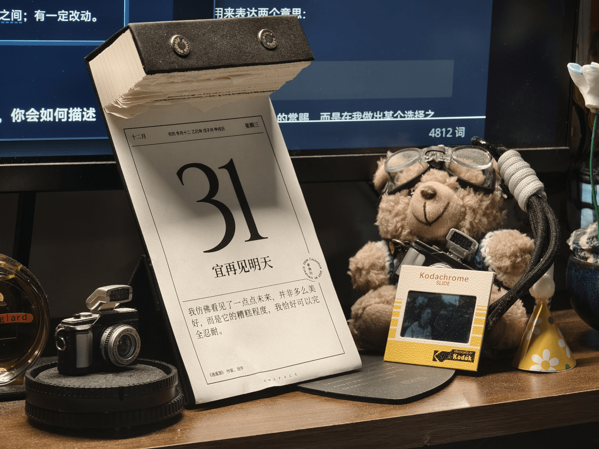

**而明天，21 世纪与我，都将正式开始属于他的夏天。**

---

> *🔗 Reference*: [一起用 15 个问题总结这一年吧！ - 伏枥之间](https://leehenry.top/posts/words_in_wildness/ww-vol04/)；有一定改动。

## #1 轮廓 The Overview

### Q1. 如果用一个**字/词/短语/句子**来概括这一年，你会如何描述它？

$\bold{serendipity}$ $\text{n.}$ 机缘巧合；意外之喜

> *: the **ability** to find valuable or agreeable things **not** sought for*

今年很多意外之喜的时刻，生长于我没有预设的尝试之中。它不是没有来由的赏赐，而是在我做出某个选择之后，等待在道路延伸后的某个路口，现身在迷雾中摸索前行的我面前。

它之所以能够被发现，是因为我正在前行。

> *also : **luck** that takes the form of such finding*

不是每一份尝试都能得到与之对等的回报，所谓「成功」总是需要一些运气。但「意外之喜」的喜正是来自于「计划之外」。

当我抛弃以终为始的追求，过程中每一份运气的馈赠都更加值得珍惜。

---

### Q2. 这一年是否面临了对你而言**重要的人生变化**？

应该是保研吧。

重要吗？当然重要。它见证了我人生迈入下一阶段的重要时刻，它意味着我未来三年有了一个具体的去处。它是一个看起来很闪亮的勋章，让我能够向别人证明，我现在正在做着正确的事。它让我能够稍微停下来喘口气，回望已经走过来的三年本科生活，之后用这样一句来自别人之口的话来概括自己：

> 无法在迷雾中构建蓝图，那就在行走中辨认足迹。

但我的生活真的改变了吗？好像也没有。

我还是我，我的世界并没有因为迈入一个新阶段陡然变得宽广。九推落定，短暂的 Gap Month 后，我开始了每周需要抽出一天来开组会的生活。但除此之外，我仍然还有大把的人生可以支配，一如之前的我那样。

那就带着这样的我，继续走下去吧。

---

## #2 支柱 The Pillars

### Q3. 日常的**生活节奏**如何？在锻炼、饮食、睡眠方面，有哪些变化与反思？

啊，**稀碎**。

已经数不清今年有多少天的深夜，顶着一张爆痘的脸熬到凌晨四五点，毫无睡意地沉溺在社交媒体瀑布流，然后昏昏沉沉一觉睡到午后。一边赖床一边点外卖，一天的第一顿饭被拖到日上三竿又下三竿。清醒时间被昼夜等分，午夜成为了我的下午。各种紧急急迫的事件拖到拖无可拖，愧疚、焦虑、困倦，裹挟着追赶着我失去动力的一天又一天。

我意识到我所有不规律的根源正是来自于睡眠。

和高中老友 VV 聊起，她的一个理念令我非常受教。她认为生活的秩序感由心理与生理共同组成。而如何培养秩序感，靠的是两个字，一个是「吃」，另一个是「动」。

**吃**，尤其是美食的大快朵颐，生理上能提供充足与全面的能量供给，心理上能促进**多巴胺**的分泌，带来最直接的快乐；

**动**，可以是通过固定的运动来锻炼身体，让**内啡肽**驱使快乐的自循环；甚至只是出门散步也足够。只要从一个固定的、逼仄的空间中走出来，让自己多多活在阳光之下，自然会觉得世界晴朗，万物可爱。

两点启示：

- 薛定谔说：「生命以负熵为食」。持续的运动带来能量的消耗，能量的消耗带来胃口的增加。人体的代谢但凡健康的流转起来，生命自然会回归到正确的节律之中；
- 快乐的来源是 [多元](https://leehenry.top/posts/words_in_wildness/ww-vol05/#得到快乐的奥秘) 的。即时满足、体育运动、亲密关系带来的幸福感由不同的激素驱使。当快乐的支点越丰富，人越容易达到自足的心理状态。

**新的一年，我希望重拾生活的掌控与秩序。**

---

### Q4. 在**财务管理和储蓄方面**是否有变化，有什么有意思的支出吗？

今年在三天打鱼两天晒网的的规划下，储蓄有所增加，还学习并实践了一些基础的投资知识。尝试精心构筑了 [自己的理财系统](https://leehenry.top/posts/hack_n_track/ht-vol04/)，但又一次次把系统颠覆和推翻，似乎总是摇摆在对「死本能」的对抗与顺应之中。好在从总体来看，基本达到了我期望的初衷：「不降低生活体验，也能让钱生长」。

关于支出，大头的花销应该是一些数码玩具。

- 一颗二手定焦镜头「VILTROX AF 56/1.7 Z」。现在我的 Nikon Z30 一共拥有三颗镜头：一颗大光定，拍人像和人文；还有两颗原厂的大小套头 16-50 和 50-250，从焦距范围到光圈，镜头群基本能全面覆盖日常需求。大光圈带来的质感立竿见影，今年用这颗镜头拍了很多有点意思的小照片~

  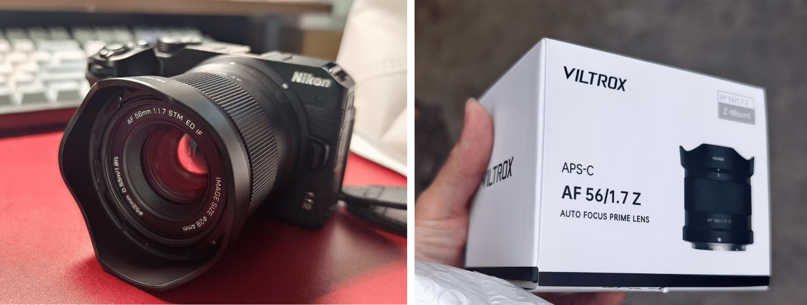

  

- 一台运动相机「DJI Action 5 Pro」作为我第一次参与实习的礼物，为的是记录一些实习生活的片段。这个相机是从高中的朋友 Z 手中收的，他说希望这台设备能在我身上延续它的生命。

  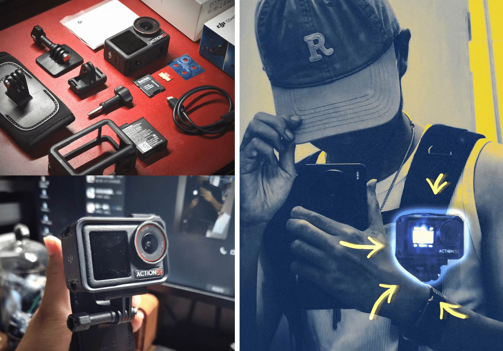

- 一张机械硬盘「Seagate ST4000VX015 HDD, 4TB」，实习期间购入。相比相机，以视频这种媒介记录的内容，对存储的要求堪称指数级上升。想着除了有存储底片的即时刚需需求，还有很多工作学习的数据需要再留个备份，因而以￥598 RMB 的价格高位购入。年底因为 AI ，让内存联合硬盘的价格再次如火箭般起飞，现在再看又涨了三百块，这倒完全是意料之外。当时把 OneDrive 的工作数据备份到硬盘上后，写了一篇 [备份指南](https://leehenry.top/posts/hack_n_track/ht-vol03/)。

- 一台笔记本电脑「MacBook Air M4」。我现在很不愿意提起它。

  为什么？这是我的第一台苹果电脑。在我刚到手两个星期，我开心的作文以记之。这篇[使用体验分享](https://leehenry.top/posts/moment_memos/mms-vol05/) 仍是本站当前最受欢迎的文章。再后来，一个平凡的晚上，我像以往一样带着他它出去写作……

  它 **失！窃！了！**

  <mbr>**[这是见证我 Adulting 的重大时刻。](https://leehenry.top/posts/words_in_wildness/ww-vol03/#切片-二之一)**<mbr>这是我用自己的实习工资为自己买的礼物，也是自身疏忽的直接导致的失窃，我甚至不敢把这件事情诉诸父母。

  在那两天，请假组会、推迟进度、跑了上海两个区域的公安局三次、奔波超过五万步，想尽也用尽了一切办法。明明监控可以清楚看得到是谁偷的电脑，面孔清晰可辨，但民警依然直言：「你这算遗失，不能立案。」「没办法，人脸比对不上，就是找不到。」看着 iPad 上「查找」软件永远停滞在失窃当晚的设备信息，我心想：「我此后应该不能和别人说：『我从小就没有遇见什么真正的坏人了』」

  在此依然非常感谢，那两天陪我四处奔波的朋友 Lulu 和 G。
  
  那段时间，一方面，我油然而生一种之前从未有过的、非常强烈的「不配得感」。我似乎开始更舍得把钱花在能带来即时满足的事物上，一顿放纵餐不会给我带来太多心理压力，但对于一些贵重的、随身携带的数码玩具，消费开始变得犹豫再犹豫。另一方面，我意识到我的感官似乎总是只能单线程运行，当注意力集中在当下的某件事情上后，其他一切外部事物我会完全、彻底的屏蔽。我以前从出门总是把一切可能用上的都带上，把电脑、耳机和相机统统塞满沉重的包包。而现在的我出门总会让随身物品最小化，以达到遗失概率的最小化。只要不带，就不会丢吧。
  
  这种心理……反而让我的钱更容易存下来了……会是好事吗？

---

## #3 主线 The Focus

### Q5. 工作或学习上，这一年取得了哪些对你而言具有阶段意义的**里程碑**？

- 第一篇论文发表并正式见刊；

- 第一次负责的国家级大学生创新项目优秀结题；

- [第一次租房](https://leehenry.top/posts/moment_memos/mms-vol001/) 与 [第一次实习](https://leehenry.top/posts/moment_memos/mms-vol01/)；

- 本科阶段 [最后一次 Presentation](https://leehenry.top/posts/words_in_wildness/ww-vol03/#%E4%B8%80%E4%BA%9B%E5%87%86%E5%A4%87-presentation-%E7%9A%84%E5%AE%9E%E7%94%A8%E5%BB%BA%E8%AE%AE)；

- 本科阶段最后一次闭卷考试；

  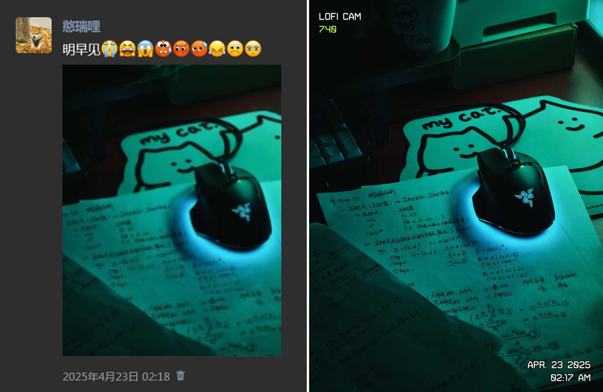

- 最后，成功 [保研](https://leehenry.top/posts/words_in_wildness/ww-vol02/#%E8%A2%AB%E8%BF%AB%E4%B8%8E%E4%B8%8D%E7%A1%AE%E5%AE%9A%E6%80%A7%E5%AF%B9%E6%8A%97%E7%9A%84%E4%B8%80%E7%94%9F)。

---

### Q6. 是否发展了一些**个人副业或长期兴趣项目**？目前的进展与收获如何？

**摄影。**<mbr>从 Lightroom 上的数据来看，相比去年留下的 674 张底片，今年的底片数量来到了 4205 张，可见主打一个只管按快门不管后期死活。最后经过合并和精选，留下了 184 张姑且勉强可以称之为「作品」的东西。在想用什么形式展示比较好🤔。

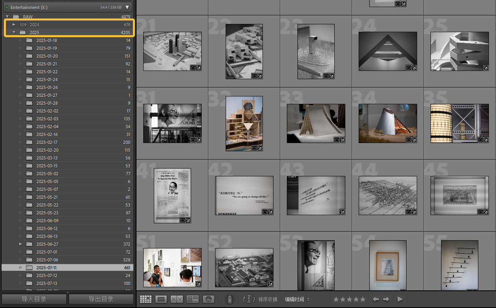

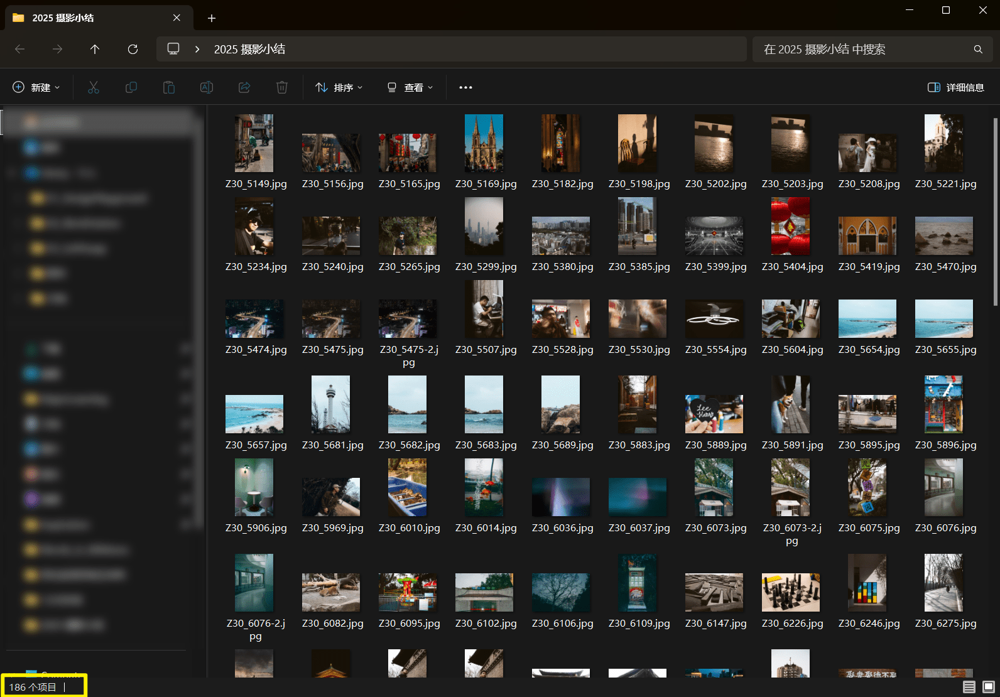

**PPT。**<mbr>这是我已经做了四年的长期副业项目，如果讨论兴趣的话可以追溯到十年前。它是我接触设计学最亲切的跳板，也是我经济相对自由的重要支撑。今年共完成了 24 个委托项目。

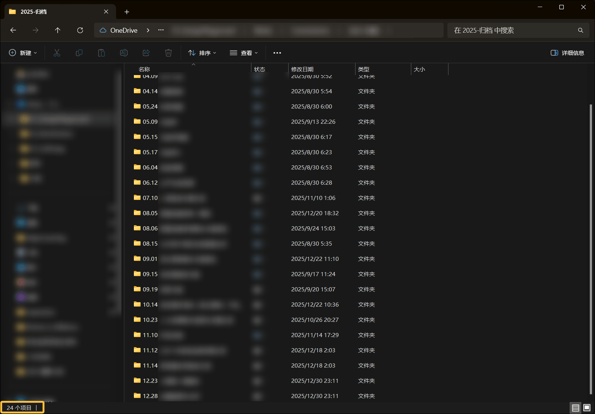

**博客。**<mbr>今年是我真正借助博客平台，培养表达习惯的元年，不知不觉已经过去了 131 天，从一个简单的想法开始走到今天，其间的收获实在是难以悉数。

[Eltrac](https://www.geedea.pro/) 和 [五月七日千緒](https://ttio.cc/)  是本站的启蒙灯塔，在设计和文辞上让我惊呼：「原来博客还可以做成这样！」。后来，修修补补，笔耕不辍，首发于本站的文章在 4 个月之间来到了 15 篇。

书写这些文字的过程中，意外触及了一些志同道合的灵魂。特别感谢[薯泥](https://blog.marshuni.fun/)、[小倪](https://bioez.xyz/) 和 [Cry](https://cry4o4n0tfound.cn/)，在这个注意力稀缺的当下，仍然愿意保有对真诚表达的理想主义，相会于文字，友善的回应，建立起纯粹而有力的友谊。这些留存在「伏枥之间」的，友好、真诚、深入的交流，是伏枥非常难得的思想财富。

---

## #4 心跳 The Resonance

### Q7. 有哪些让您**情绪起伏**的瞬间？是否**落泪**过，为什么？

我在现实中自认为是一个比较情绪稳定的人，现实中很少有人让我不安、生气、恐惧、过度焦虑，我认为一切都在我自己的掌控之中。唯独亲密关系可能是一个例外。

爱，似乎总是意味着一种自我的让渡，让渡于你无法控制的他者。

在总是我主动尝试去修补问题的时候，当我的理性表达听不到回音的时候，在心理距离和物理距离导致双重的疏远，但我好像束手无策的时候，他突然打来电话。面对着镜头，我居然有些语塞，不安夹杂着委屈让眼泪翻滚而下。

最后分开的时候，我反而没有什么波动。因为我知道，我已经努力过。[当他不再向我靠近，这会是双向的放手](https://leehenry.top/posts/moment_memos/mms-vol035/)。

---

### Q8. 尝试了哪些**未曾体验**的事情？

- 第一次独立出车；

  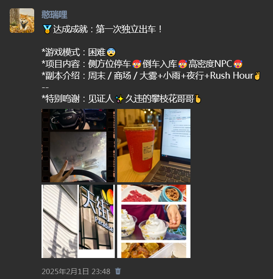

- 第一次做家教；

  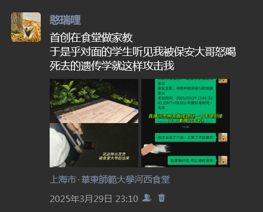

- 第一次去 [演唱会](https://leehenry.top/posts/moment_memos/mms-vol02/)；

- 第一次去 [Live House](https://leehenry.top/posts/words_in_wildness/ww-vol05/#%E5%8D%97%E4%BA%AC)；

- 第一次独自在外度过生日；

  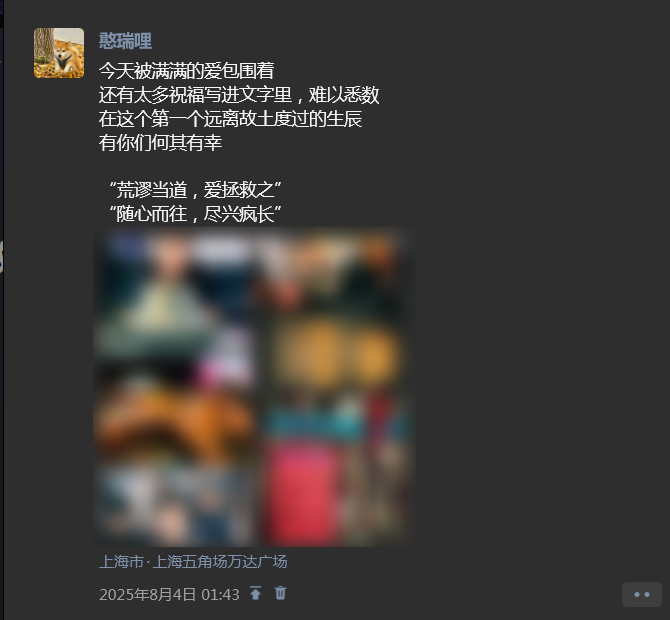

- 第一次捏 [陶瓷](https://leehenry.top/posts/words_in_wildness/ww-vol05/#%E6%99%AF%E5%BE%B7%E9%95%87)。

  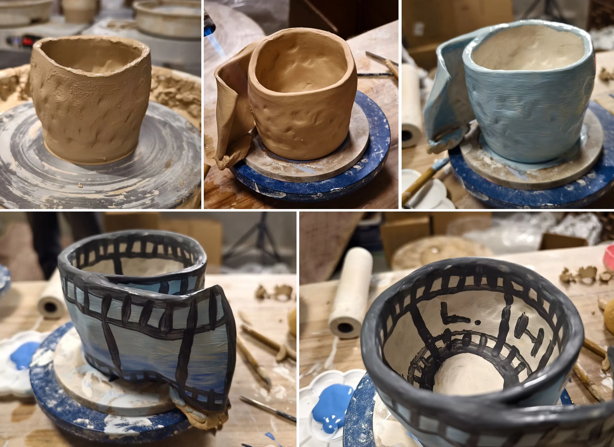

---

### Q9. 去到了哪些**未曾涉足**的空间？

按时间顺序（斜体为故地重游）：

- 1 月：广州、深圳；
- 3 月：西安；
- 5 月：郑州、开封；
- 8 月：*苏州*；
- 10 月：[内蒙](https://leehenry.top/posts/moment_memos/mms-vol04/)、*北京*、*天津*；
- 11-12 月：[*合肥*、黟县、黄山、景德镇、*南京*、*杭州*](https://leehenry.top/posts/words_in_wildness/ww-vol05/#%E6%96%B0%E7%9A%84%E8%A1%8C%E8%BF%B9)；

每一趟旅行都串联起一系列城市，不知不觉真的去了很多地方。

总的来说，广州是最食指大动的地方；开封是最具性价比的地方；内蒙是最接近自由的地方。

---

### Q10. 有哪些对您产生影响的**书籍、影视、音乐或游戏**作品？其中是否有特别令您**印象深刻的人物、角色或观点**？

[单依纯](https://leehenry.top/posts/mindlight_maze/mm-vol02/)：

> 我不是证明我有多能唱，而是因为我有非常强烈的表达欲望。
>
> 我不想做绝对讨好的事情，我想做自己内心认为有价值的东西。

[《喜人奇妙夜》外星从](https://leehenry.top/posts/words_in_wildness/ww-vol03/#%E5%88%87%E7%89%87-%E4%BA%8C%E4%B9%8B%E4%BA%8C)：

> 我们不追求赢，也不追求输。我们不追求快乐，更不追求哭。
>
> 我们什么都不追求，我们上去梆梆就是两拳。🥊🥊

---

粗略统计，今年看了 25 部电影（按时间倒序，⭐为特别推荐；💩为特别不推荐）：

- ⭐[**《夜班》**](https://leehenry.top/posts/words_in_wildness/ww-vol05/#%E7%94%B5%E5%BD%B1%E5%A4%9C%E7%8F%AD-heldin)：一部洞察真实且深刻的「生活流纪实电影」；
- 🎞《疯狂动物城2》
- 🎞《震耳欲聋》
- 🎞《茶啊二中》
- ⭐**《还有明天》**：手握选票，就像握着情书。值得推荐的女性主义电影；
- ⭐**《F1：狂飙飞车》**：纯粹的工业级爽片！节奏太舒服了；
- 💩《侏罗纪公园：重生》
- 🎞《春潮》
- ⭐**《深海》**：大哭，特哭，狂哭……被低估的好电影；
- ⭐**《雄狮少年 2》**：电影想要表达的主题反而和电影外的舆论完成了讽刺的艺术互补；
- 🎞《海边的曼彻斯特》
- 🎞《死神来了：血脉诅咒》
- 🎞《刻在你心底的名字》
- 💩《我的世界大电影》：感觉不如 Sora 生成的抖音短片有意思；
- ⭐**《姥姥的外孙》**：实在是哭到不行了……杀我别用亲情刀；
- 🎞《二手杰作》：朋友醒过推荐的一部蛮有意思的作品，现实主义讽刺喜剧；
- 🎞《向阳·花》
- 🎞《人生大事》
- ⭐**《初步举证》**：一切问题被解决的前提，都是先被看见。
- ⭐**《普罗米亚》**：顶级的配色、运镜和演出；
- 💩《唐探1900》
- 🤔《哪吒之魔童闹海》：片本来是好片，但这个 IP 已经对我的生活侵入到了骚扰的地步；
- 💩《默杀》
- 🎞《年会不能停》
- 🎞《爱在黎明破晓前》

---

## #5 连结 The Connection

### Q11. 哪些**朋友**对您这一年影响最大？是否结识了新朋友，是如何结识的？

**相似的磁场下，我们相逢。**

今年不知从何时开始，我有些厌倦萍水相逢、只有广度没有深度的社交关系。我主动裁剪无意义的链接，从向外追逐转为向内沉淀，我发现我有了更多的精力去追问自我，去深耕更有价值的连接。

这样的态度，反而成为了与很多旧友重逢的机缘。当我始终在我自己的频道，无需刻意迎合，能够听懂和回应的人自然会彼此靠近，曾经自己没有留意到、来自他人独特的人格底色，也从未如此鲜明的凸显出来。

在合拍的关系之中，我得以确认：自己仍然具备进入他人世界、也允许他人进入自己的能力。以前总是担心会「麻烦别人」，但今年我越来越能够认识到：「需要」与「被需要」，才是关系不可或缺的组成部分。

---

### Q12. 有没有参与到一些**社区或圈子**的建设、维护或互动，对您而言意味着什么？

我想，那应该就是「中文博客圈」。

之前看到一句话，大意是世界上大约现存 2620 只大熊猫，而中国现存的独立博客数量可能不超过 2000 个。

坚持用中文博客这种方式来表达的人，我想多少带有一种「明知不可为而为之」的理想主义：带着一种身为创作者的高傲，在浩大的互联网世界中，像是不断发出自己频率的鲸鱼，微弱但持续。哪怕在世俗的真实世界里充满了妥协、丑恶和偏见，但在互联网的一角还有这样一处私密的花园，它不必受到平台、算法和审查的裹挟，你就是它的造物主，拥有它全部的所有权。

精心装修、挑选来客，通过友链或互动为孤岛之间架设桥梁，共襄于文字。多么纯粹而美好。

谢谢 [开往](https://www.travellings.cn/)、[十年之约](https://www.foreverblog.cn/) 等一切便利大家沟通与汇聚的归处。**川流入海，川流不息。**

---

## #6 展望 The Outlook

### Q13. 面向 2026 年，您最希望实现的**三个目标或愿望**是什么？

作为一个计划永远赶不上变化的 P 人，这里就留下一些宏观的期许吧。

1. 我想继续磨炼表达的「精准力」，把承载「我之所在」的文字写下去；
2. 我想重新找回对生活的「掌控感」和「秩序感」；
3. 我想与「底色相似」的朋友保持联系，保持更深刻的联系。

---

谢谢你读到这里。2026，祝你新年顺遂。

<mbr>
