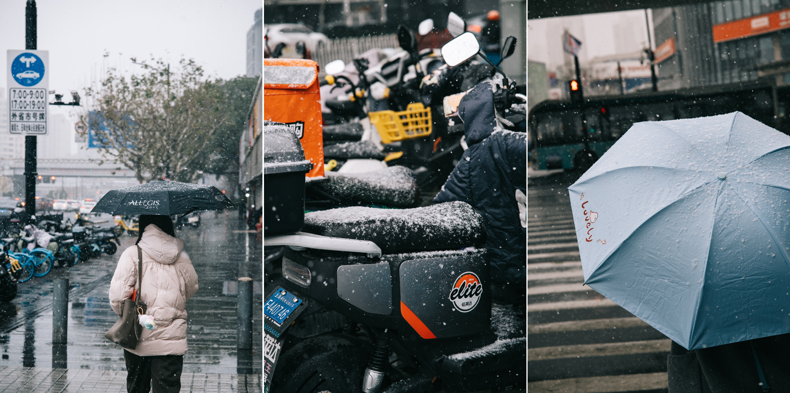

上一次有关雪的回忆已经模糊了。

好像是去年年初。彼时刚考完期末考试。在凌晨的上海，和舍友一起走出龙之梦的海底捞，抬眼看见路灯下飘出似有若无的星星点点。肃杀的冷风倏忽从身旁穿过，我不由得紧了紧臃肿的羽绒服。

再之前呢？好像只剩下一些童年记忆中零散的轮廓。在安徽阜阳老家，某个清晨，睡眼惺忪的往窗外一瞥，只见世界在睡梦中悄悄变成一片白皑。饭都没吃就冲到桥头的公园，放任柔软的大地与我相拥。

---

这天一早拿起手机，社媒的四处充满了溢出屏幕的喜悦。上海的人们在天还未亮的通勤路上，摄下雪花在路灯光线中翻转的剪影。

下床、洗漱、望向窗外，雪似乎开始变大了起来。戴上手套、拿起相机，刚好今天要应赴友人子陵无锡之行的邀约。

绕卷翻转，迎面倾泻，像是飞舞漫天的银色流苏，像是一场可以被看见的雨。它落到地面就无影无踪，于是我将镜头对准路边的车座、行人的雨伞，尝试留下更多它的痕迹。

从上海到无锡，只有一小时的路程。而这段距离，意外让我从一个雪落地消融的地方，来到一个雪可以簇拥堆积的地方。从小在海南长大，上次能亲眼见到这般景致的时候，大抵还没记事。

### 惠山古镇

这里人称江南「最低调」的古镇，其间散落着数座唐代到明清兴建的园林与祠堂。相比之前苏州拙政园、狮子林给我的人头攒动、嘈杂混沌的印象，兴许因为这里一夜大雪、寒风刺骨，此时人迹罕至带来的静谧，反而更能让人静心欣赏这份古朴的意趣。

因为雪迹不规则的覆盖，黑瓦上的白雪与白墙相衬，雾凇沆砀，恍惚间好似置身水墨画之中。

> 

>  取欢仁智乐，寄畅山水阴。
> 

> 

>  ——王羲之 《答许询诗 其一》
> 

来到「寄畅园」，园林借景、迭山、理水的手法在此臻入化境。廊腰缦回，依地势而建，凭直觉游览，每每穿过一门墙一景廊，总能豁然开朗，一片新的洞天映入眼帘。

在此地还捕获了一些小小可爱雪人。

### 鼋头渚

又一夜过去，拨云见日，带来了另一种好天气。日上三竿，路面上的积雪在静默中几已化尽，只剩草地里、花坛中的零零散散的白色小团，告诉行路人它曾来过。

来到阳光下的鼋头渚，我在这里领略了另一种生机。

这些冬日来客是数以千计的红嘴鸥。它们来自遥远的西伯利亚，漫漫迁徙路上，它们仅凭天性的指引，不约而同停驻于太湖湖畔。这里温润的气候与生态让它们的冬天得以在自在惬意中度过。

红嘴鸥们簇拥着叫嚣着环抱着我们，叽叽喳喳地衔去游客手上的面包。（~~好羡慕这种白吃白喝的生活……~~）

---

冬日骄阳漫洒归途，车窗外的景致渐次归为熟悉的模样。

这一程雪落过上海的街灯，积过无锡的黛瓦。也许，终将与童年的白皑一同模糊在记忆里。

<mbr>
