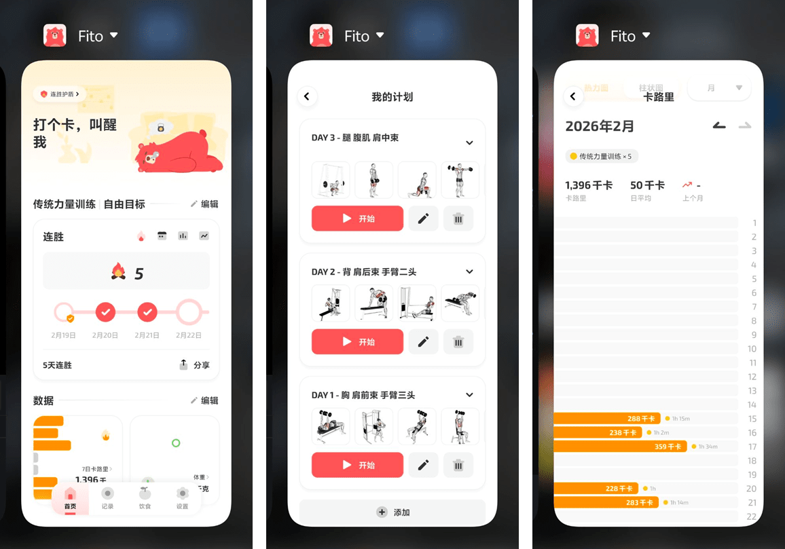
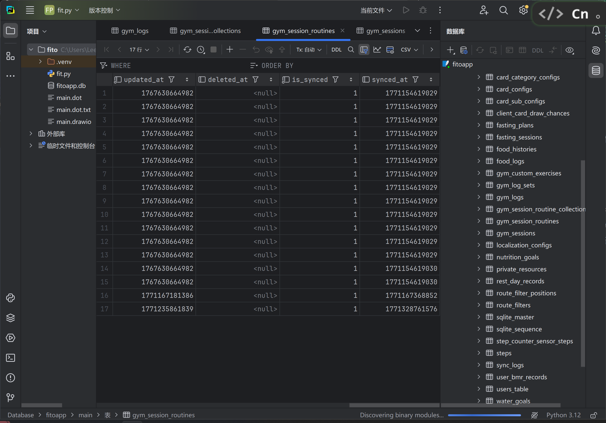
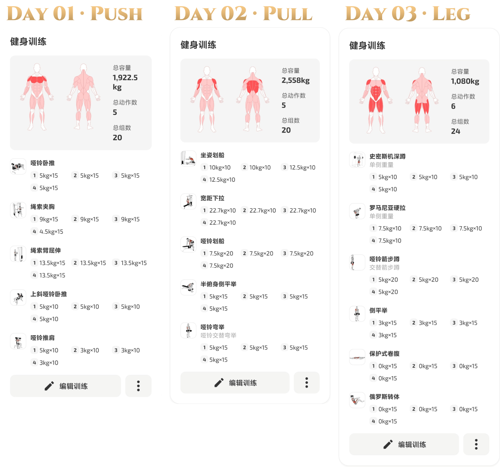

大年初五的下午，相较前几天，健身房的拥挤程度同比显著增加。坐姿划船做到一半，有人在身旁幽幽出现，请求插队一组；组间休息一个没看住，面前的哑铃险些被练瑜伽的小姐姐顺走。

**暗流涌动，虎狼环伺。**

时隔 [114 天](https://leehenry.top/posts/words_in_wildness/ww-vol03/#%E4%B8%80%E4%BA%9B%E5%85%B3%E4%BA%8E%E8%BF%90%E5%8A%A8%E7%9A%84%E6%9C%80%E5%B0%8F%E5%BF%85%E8%A6%81%E7%9F%A5%E8%AF%86)，重启健身。作为我 2026 年度目标之一 —— 找回生活「[秩序感](https://leehenry.top/posts/moment_memos/mms-vol06/#q13-%E9%9D%A2%E5%90%91-2026-%E5%B9%B4%E6%82%A8%E6%9C%80%E5%B8%8C%E6%9C%9B%E5%AE%9E%E7%8E%B0%E7%9A%84%E4%B8%89%E4%B8%AA%E7%9B%AE%E6%A0%87%E6%88%96%E6%84%BF%E6%9C%9B%E6%98%AF%E4%BB%80%E4%B9%88)」 —— 的开始，我在家附近的 24h 健身房办了月卡，希望在离岛前能习惯日常锻炼的步调。（~~¥126.96/月，相比之下上海永远在抢我的钱……~~）今天是重启后的第 7 天，三分化训练计划刚好来到第 2 个周期。

## 心态准备

还是那句老话，万事开头难。**总找一堆理由粉饰对各种事情「启动困难」的懒惰，但实际上真正需要的也许只是一点咬牙开始的决心。**

早上嗦粉的时候，听完了树老师的第 296 期博客：练一千小时瑜伽给我生活带来什么改变。

> 首当其冲的难关，是前 100 个小时的「新手期」。
>
> 第一大任务，是**建立基础的身体素养与运动素养**。在新手期，最大的目标不是什么体式，而是「**去了解自己的身体**」，让身体告诉你发力的感觉。像儿童学习刷牙一样，把运动变成生活方式前，需要一段时间建立与适应新的习惯。
>
> 第二大任务，是渐渐接受「运动」成为自己的生活的一部分 —— **运动是正常的，不运动反而是不正常的**。这个过程往往需要「意志力」来去逼自己一把。树老师在每次准备运动前，开大耳机音量，播放 Lady Gaga 和凤凰传奇，跨上单车冲入波士顿的寒冬。这个动作可以让她从学习思考的模式中强行隔离开来。后来，它成为了一种肌肉记忆与条件反射的提示：当战歌一响，心态已经开始热身，随后身体自然而然就会进入运动状态。
>
> ---
>
> 新手期非常漫长。直到第 250 个小时，随着柔韧性提升，树老师才真正迎来量变引起质变的转折，解锁了各种关键体式。
>
> 进入到 250-750 小时，来到了运动的甜蜜期。此时的树老师真切的感知到每一次运动自己都在变得厉害一点。她不断地尝试新的动作，并成功完成，她从中获得了强烈正反馈。**这种感觉极其美妙，也让她因此真正成为一个热爱运动的人**。与此同时，瑜伽也带给她一种新的社交方式，她自然而然地结识了一批志同道合的好友，这条路就是运动之路。
>
> 750 小时后，树老师对各种动作已经不再有「神秘感」。一方面她在旅行的过程中通过与世界各地的瑜伽老师接触，持续维持对瑜伽的「新鲜感」，一方面她也意识到瑜伽这种运动存在局限性，于是拓展其他互补的训练。**她不再追求频繁地解锁新动作，而是让运动嵌入到生活的呼吸线中。**
>
> ---
>
> 对树老师而言，运动对她最大的礼物不是高级体式，而是在维持身体素质的同时，能够**重新认识身体，让身体从陌生人重新变成亲密的伙伴。**
>
> 🔗 *Link:* [296 - 练一千小时瑜伽给我生活带来什么改变 - 独树不成林](https://podcasts.apple.com/cn/podcast/296-练一千小时瑜伽给我生活带来什么改变/id1711052890?i=1000747052409)

## 运动记录

与主流软件「训记」和「练练健身」对比后，我选择了「Fito」。这是一个借鉴了多邻国打卡形式的运动记录 App，支持体重、饮食和健身计划的追踪。但最终打动我还是它的交互和颜值，在人性化与现代化上与同类软件显著拉开了差距（~~是了，我总是容易溺爱一些好看好用的东西~~）

值得一提的是，在数据控制上，Fito 支持把所有运动数据（包括自定义训练计划）以数据库（`.db`）的格式全量导出。这比其他的数据闭塞的竞品多了一份安心。

## 训练计划

> 三分化训练（PPL Split）是一种受欢迎且高效的训练方案，它按照动作模式来安排训练：
>
> - 推日（Push Day）锻炼上半身所有的推力肌肉，包括胸部、肩部、肱三头肌；
> - 拉日（Pull Day）锻炼上半身所有的拉力肌肉，包括背部、肱二头肌；
> - 腿日（Leg Day）锻炼整个下半身，包括股四头肌、腘绳肌、臀肌、小腿肌。
>
> 它通常被安排为 3 天（每周一次）或 6 天（每周两次）的循环，通过在针对同一部位的训练之间留出 48-72 小时的时间，促进最佳恢复和肌肉生长。
>
> 🔗 *Link:* [The Push/Pull/Legs Routine for Muscle Gains | Aston University](https://www.aston.ac.uk/sport/news/tips/fitness-exercise/push-pull-legs)

目前遵从的计划主要参考这个 [B 站视频](https://b23.tv/Tympo15)。

每次先在跑步机上坡度 12、速度 4.5 热身 10 分钟，然后开始正式我的 PPL 循环。练三休一，具体动作安排如下。

一周下来，每次的训练时间基本都在一小时上下。具体的动作顺序取决于我能抢到什么器械，而重量要不要加取决于当时的体力状态。

当然，对于现在的我来说，找准发力位置会比上重量更重要。经过两轮适应期，稍微能找到了一点正确发力的感觉。以下动作要领的记录收集于小红书的各个角落。你可以在我整理的 [专辑](https://www.xiaohongshu.com/board/69982479000000002502c9ce?xhsshare=&appuid=62b6b60e000000001b02a0f7&apptime=1771695805&share_id=bdde8abd03db49c9a4b3825048333dae&share_channel=copy_link) 里索引到它们。

### Day 01 · Push Day

> **主要部位**：胸 · 肩前束 · 手臂三头；5 个动作

**哑铃卧推**、**上斜哑铃卧推**（30°）、**哑铃推肩**（75°-80°）：4 组 $\times$ 每组 10 个

- 哑铃先垂直放在大腿上，蹬地顺势带起；
- 双脚外八，向后蹬住地；臀部夹紧；下背部反弓；
- 从动作顶端开始；起始为「一字形」，通过**沉肩**带成「八字形」；
- 下放时哑铃保持水平；保持小臂垂直于地面；
- 感受胸肌充分拉伸时举起，肘部往里夹；**向上向内**还原；
- 动作顶端的时候不要送肩，保持**沉肩**；保持大小臂微屈即可；
- 往下时吸气，往上时吐气；

**绳索夹胸**：4 组 $\times$ 每组 10 个

- 胸大肌分为上中下三束：
    - 下束：卡扣调高，略微俯身；手肘从两侧找上腹；
    - 中束：卡扣与胸齐平，往前一弓步；肘窝朝前，手肘水平向内找胸；
    - 上束：卡扣与膝齐平，往前一弓步；大臂与身体夹角 60°，保持手臂微曲，斜下往斜上靠近。

**绳索臂屈伸**：4 组 $\times$ 每组 15 个

- 卡扣调整到最高，换成「双马尾」把手
- 后退一步微微附身；大臂夹紧；
- 保持身体不动；以肘部为圆心，用小臂画圆往下压。

### Day 02 · Pull Day

> **主要部位**：背 · 肩后束 · 手臂二头；5 个动作

**坐姿器械划船**：4 组 $\times$ 每组 10 个

- 挺胸收腹；**沉肩**；
- 把手握在中间；整个脚掌踩住踏板；
- 屁股向后坐到感受大腿后侧拉伸；
- 收肘拉，往肚脐方向拉，感受背部发力。

**高位宽距下拉**：4 组 $\times$ 每组 10 个

- 手张开到 1.5-2 倍肩宽，全握；
- 踮起脚尖卡住**大腿**；
- 避免弯腰含胸；脊柱向上回到中立状态；
- **沉肩**；手臂与绳索力线一致；略微后仰；
- 充分打开背部缓慢还原。

**单臂哑铃划船**：4 组 $\times$ 每组 10 个

- 腰背挺直；**沉肩**；
- 找到直臂下压的感觉；背部收紧；
- 往上提拉到胯两侧顶峰；
- 下放时保持**沉肩**；**完全送出背部**；

**附身哑铃提拉**：4 组 $\times$ 每组 15 个

- 坐在训练凳边缘，往前踩一步；
- 顺势附身下来，保持**含胸**，不要夹背，沉肩；
- 旋转哑铃到虎口相对；沿着正侧面画弧线；
- 大臂与身体同高时缓慢还原；

**哑铃交替弯举**：4 组 $\times$ 每组 15 个（左右算 1 次）

- 初始状态自然垂直于地面；
- 启动时先外旋后弯举；到达顶点时肘曲往前倾，充分收缩二头；
- 下放时保持手面朝下；到达底点后再还原，不要提前垂式；

### Day 03 · Leg Day

> **主要部位**：腿 · 肩中束 · 腹肌；6 个动作

**史密斯深蹲**：4 组 $\times$ 每组 10 个

- 杠铃压在斜方肌上；双手握距略比肩宽；
- 拿起杠铃后手肘往里收，保持垂直地面；
- 双脚往前迈一步，略比肩宽；微微外八，膝盖始终朝脚尖方向；
- 吸气下蹲，直到大腿与地面保持平行；
- 吐气发力，保持臀部中立位；
- 结束膝盖不要完全锁死，保持屈膝屈髋的状态；

**哑铃屈膝硬拉**（罗马尼亚硬拉）：4 组 $\times$ 每组 10 个

- 双脚与髋同宽；脚尖向外转收紧臀部；
- 微微屈膝；哑铃转向大腿外侧；全程贴紧大腿；
- 重心保持在脚后跟；不要挺胸，收下巴；
- 下放时臀部向后水平推出；哑铃下放到尽可能低；
- 起身不用站直，保持臀部张力；

**哑铃交替箭步蹲**：4 组 $\times$ 每组 10 个（左右算 1 次）

- 吸气下蹲，直到前腿大腿与地面平行，后腿大腿接近但不接触地面；
- 前腿膝盖应与脚尖保持一致，不超过脚尖；
- 呼气发力还原；

**哑铃侧平举**：4 组 $\times$ 每组 15 个

- 哑铃放置在身体斜前侧，口袋的位置；
- 身体微微前倾；保持肘部微微弯曲向斜前方发力；
- 肩与手肘同高后缓缓还原；
- 发力呼气，还原吸气；

**仰卧卷腹**：4 组 $\times$ 每组 15 个

- 吐气收紧核心；下巴微微内收；
- 向斜前方发力，发力时呼气；还原时回到收紧状态。

**俄罗斯转体**：4 组 $\times$ 每组 15 个

- 略微屈膝收腿，脚后跟着地，上半身后仰；进阶把脚抬离地面，臀部支撑；
- 收腹挺胸抬头，收紧核心；
- 双手合十放在身体前侧，保持躯干稳定利用胸椎旋转，把手旋转至身体两侧；

> **2026.3.4 补充：**
>
> 抖音刷到的关键动作的**健身邪修**
>
> ---
>
> 沉肩：想象你电瓶车快没电了拧到底。
>
> 屈髋：想象去坐一个很脏的马桶不想碰到。
>
> 收腹：自己轻声默念哈利波特，并且每个字都吐一小口气。
>
> 硬拉：想象成你穿个紧身裤使劲提裤子。
>
> 收肋：想象的咳一下，肋骨保持内收的状态。
>
> 高位下拉：想象自己腋下有个鸡蛋要去夹。
>
> 控制离心：想象和孩子拉皮筋，你要对抗他的拉力，缓慢放回，以防突然松手弹到他。
>
> 坐姿划船：想象双手拿枪要收到腰间的枪套里。
>
> 核心绷紧：想象有人要来挠你痒痒。

---

以上。希望能对读到这里的你有一些参考和帮助~

<mbr>
