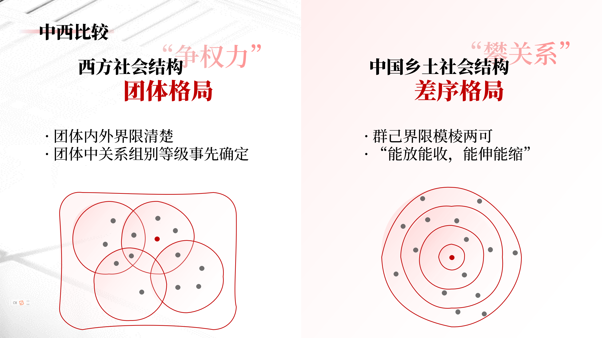
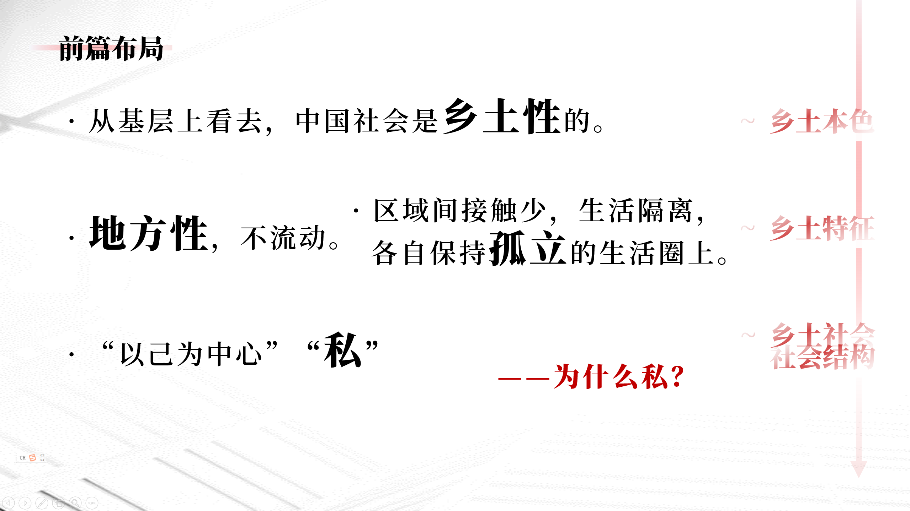
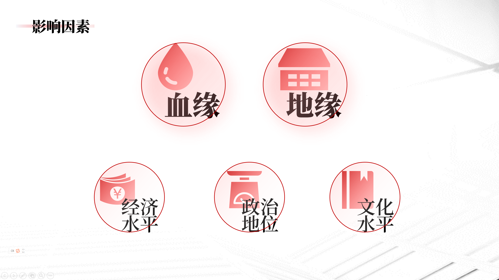
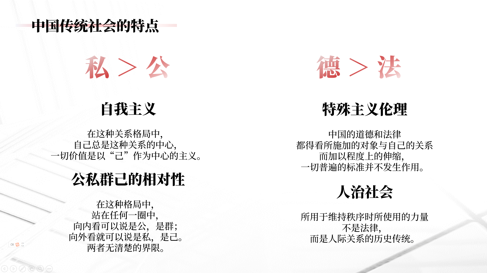
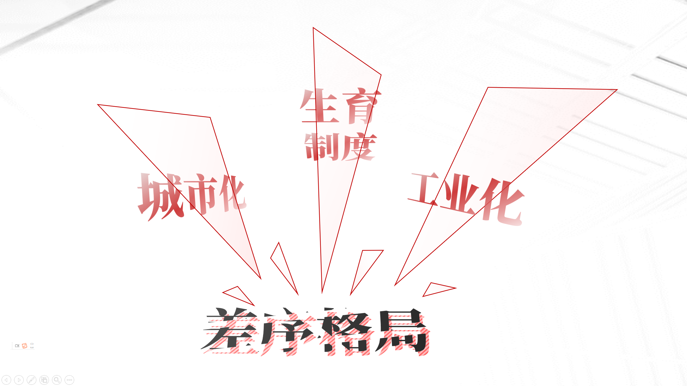
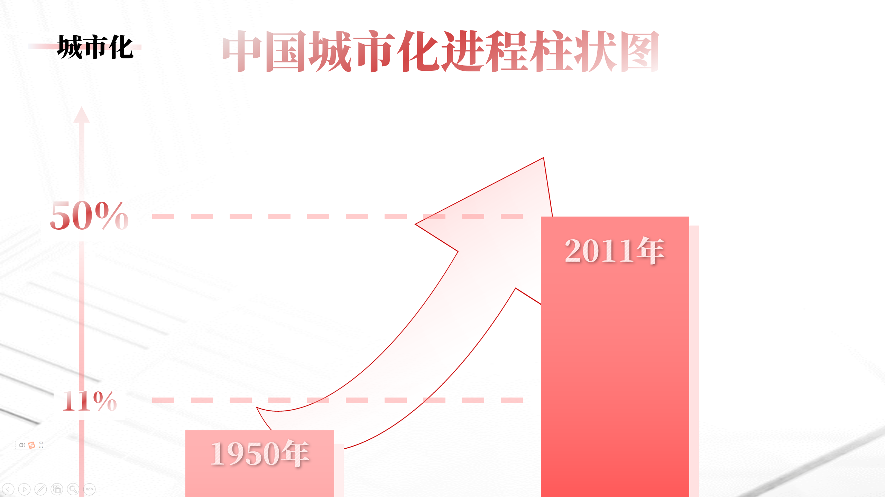
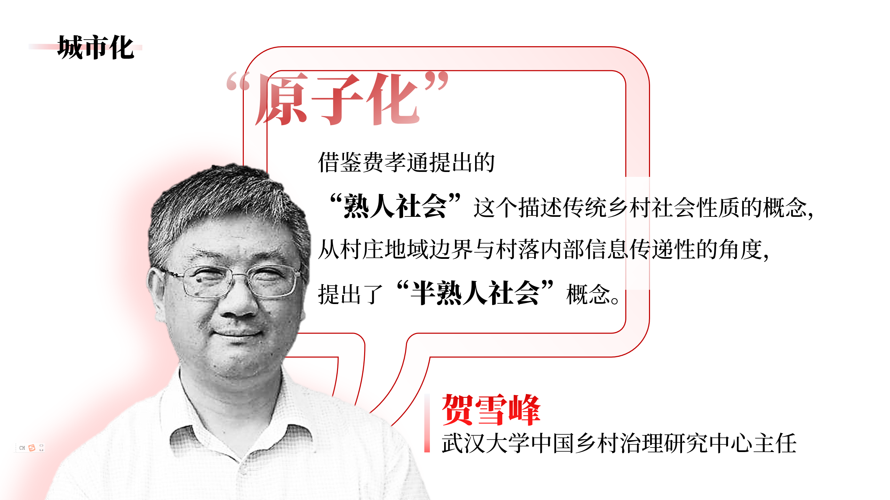
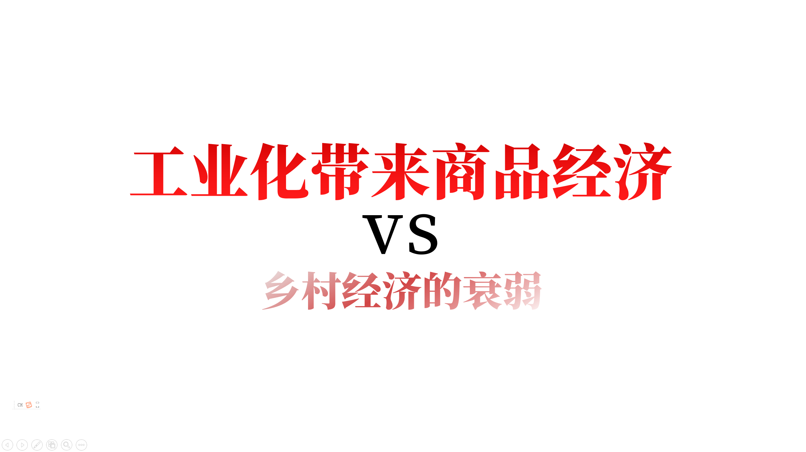

---

《乡土中国》成书是在上世纪四十年代，距今已有六十多年的时间。这六十多年里，中国社会也发生着它的变化。

「差序格局」概念是整个中国社会结构的缩影，但它如今也遭受了一些冲击。 

---

首先是**城市化**。

1950 年以前，中国的城市化进程十分缓慢，城市化水平只有不到 11％，2011 年中国城市化水平已突破 50％。城市化不仅是一种地理意义上的乡村转变成为城市的过程，也是文化意义上的乡土生活方式向现代城市生活方式转变的过程。

城市化增加了年轻家庭的独立性。以我自己为例，我从小生长在海南，自幼和父母生活在一起，每逢节假日才回老家。因此在我的印象里对除父母外的家庭关系是十分模糊的，从小认知的家庭范围就是由爸爸、妈妈和我组成的三口之家。不会说阜阳话，对安徽文化的了解不深，这就在某种程度上隔断了我与安徽老家的地缘和血缘联系，我的家庭更像是一个独立的个体。相信在我们的身边，我身边的同学也不缺乏这样类似的例子，与乡土社会带有浓厚血缘色彩的人际网相比，我们的人际网更多地来源于周围的同学、朋友和同事。

这就是贺雪峰教授提出的「原子化」。他借鉴费孝通提出的「熟人社会」这个描述传统乡村社会性质的概念，从村庄地域边界与村落内部信息传递性的角度，提出了「半熟人社会」概念。「半熟人社会」中地缘和血缘的地位被削弱，上文已经提到，地缘和血缘是差序格局的两个重要基础，在城市化的进程下它们的作用已经不那么明显了。

---

其次，中国特有的**生育制度**减弱了血缘纽带的人际圈。

费孝通先生在《差序格局》中形容差序就像「水波纹」，一圈圈推出去，越推越远，越推越薄。

就像儒家最考究的人伦，《释名》中说：

> 「伦也，水纹相次有伦理也。」

熟人社会中的人际关系网是有差等的，血缘纽带最亲密的关系圈是自己的父母和亲兄弟姐妹。然而随着 1981 年计划生育的开展，这层最核心的关系圈被破坏了。没有兄弟姐妹的人，很难再像传统中国人那样看重血缘，而削弱了中国人的血缘观念，就等于抽掉了差序格局的根基。

---

再者，随着建国后**工业化**范围的扩大，农村经济格局发生了很大变化。中国的工业化与西方有所不同，它不是在工业革命的基础上自然发起的，而是带有一定的政策强制性。政策强制性的手段就是牺牲了农业利益。

建国前30年，国家利用计划经济的特殊手段，将农业利润转化为工业资产，为中国的工业化和现代化积累原始资本，

改革开放后的30年，城市利益集团和工业经济利益集团仍然通过廉价使用农村和农业资源来发展工业，打造城市经济。这除了表现在廉价使用农村的矿产资源、农业资源以及人力资源之外，更表现在廉价地使用农村土地资源之上。

土地是乡土文化的根基，乡土文化中，许多人一辈子「生于斯，死于斯」，依靠着土地生活。经济是文化的基础，乡村经济的衰弱和工业化带来商品经济的兴起形成巨大反差，使乡土文化无法与城市文化相抗衡，加上西方文明的冲击，乡土文化正在逐渐衰弱。

## 结语

通过对《乡土中国》中「差序格局」的探索，从小生活在城市，未经过乡土文化洗礼的我，对中华民族的文化有了更深刻的认识。「乡土」所蕴含的中华文明代代相传的传统文化与自然法则，带有一种亲切的质感，这是每个中国人骨子里具有的天性。随着社会的进步和发展，乡土文化与西方文明也将从冲突过渡到包容，再从包容中孕育出具有二者特质，更适合现代社会的文化。这不是对文化的背叛，传统与现代的结合，是神奇而令人期待的。

<mbr>