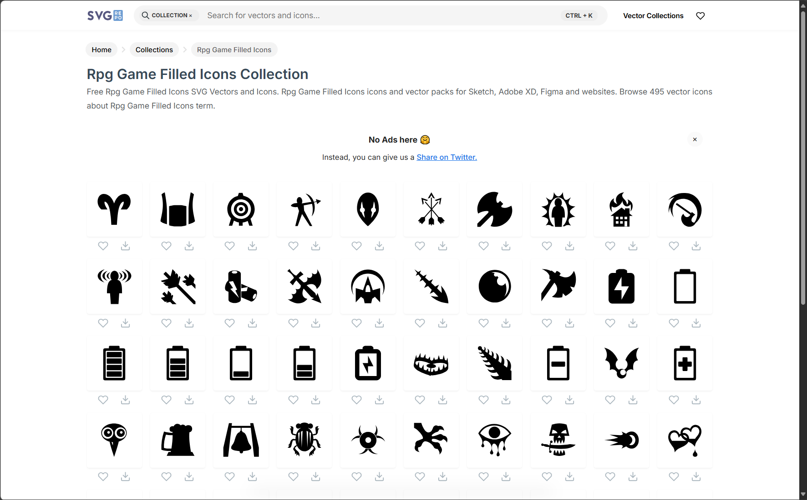
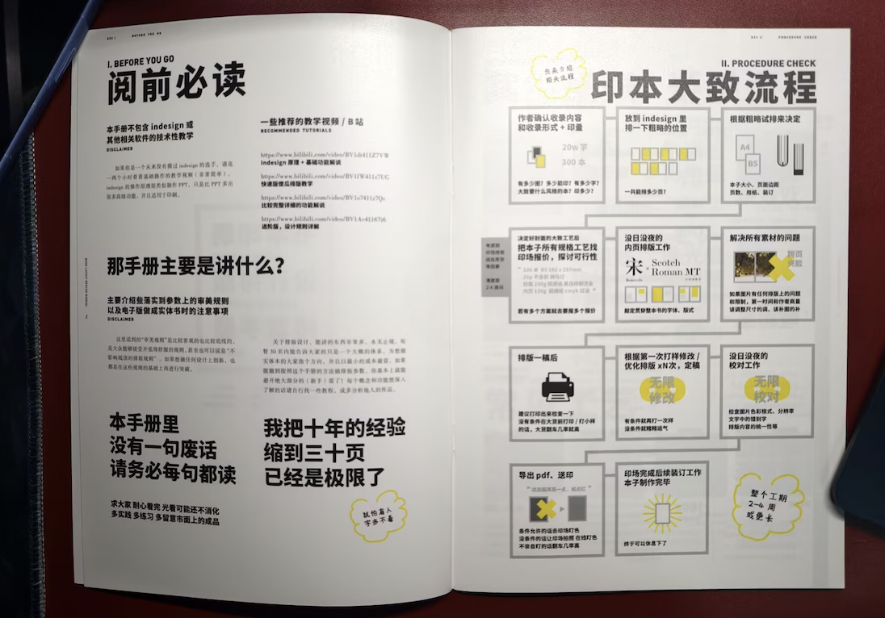
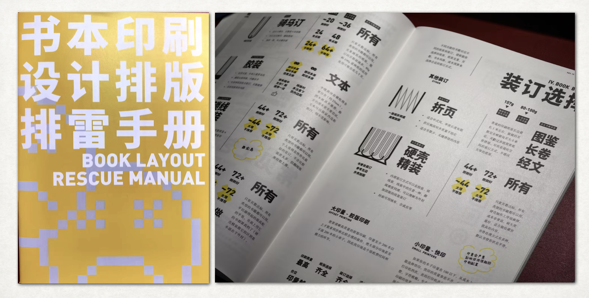

## 写在发刊之前

> 恭喜你发现了我的新栏目！**「漫想与杂谈」**
>
> 这是一个**摘抄与随记**性质的月刊，旨于分享近段时间的生活、收获与随想。**不成文、非线性、碎片化。**

灵感来源是 [Eltrac](https://www.guhub.cn) 的 [稻草人周刊](https://www.geedea.pro/categories/稻草人周刊/)。它以一周为期，把最近遇见的有意思的事情划分整理到`当下`、`连接`、`星群`、`妙语`、`切片` 五大分类下。内容启发我非常多，推荐阅读。

总之，我觉得这样对知识分类清晰、全面，非常优雅。我平时偶遇各种领域的新知识，由于没有落实到笔头，这些知识被镇压在无人问津的收藏夹废墟，轻易流淌出海马体，这样的分类方法刚好能够帮我把四处散落的知识收纳起来，落实成自己的理解和文字，完成费曼学习法的最后一块拼图，知识由此慢慢产生复利。

当然，我没打算照抄，实话实说我暂时也没有每周一篇的决心和能力。因此，定位为月刊的基础上，我基于稻草人周刊的思想做了一些个人化调整。总之，我的栏目大致分为以下五个模块：

- ◈ · `断点 Track`：「我的当下与在场」
- ↯ · `信号 Flash`：「我的洞察与思考」
- ☨ · `探针 Probe`：「我的偶遇与好奇」
- ❏ · `快照 Quote`：「我的拾句与留痕」
- ✲ · `脉冲 Spark`：「我的即兴与火花」

形式上我采取抽象概念 + 动词单词作为栏目分类，平衡我内容输出的私人化与利他性。现在你看到的是我的阶段性成果。欢迎常来看看！

## ◈ · 断点 Track

### 沉溺于创作环境的维护中

自从博客正式部署上线后，总是反复陷入「看起来还不够好」的形式完美主义，像是已经买好了房子，就一刻不停的调整屋内的软装陈设。包括但不限于推敲配色方案、头图背景、分类名称、栏目介绍、内容组织……虽然有在刻意练习结构化思考的习惯，但在内容的输出上花的时间仍然不够多。

人们似乎在折腾生产力工具的热情总是容易大于生产本身。最近看到的一个说法很好的概括了这种心理。

> **Productivity Porn，生产力色情**
>
> 形容沉迷于「看起来高效的形式」，而非实际产生价值的行动，在 「高效的表象」 中获得心理安慰，却忽略了真正需要完成的核心目标。常见表现有：
>
> - 沉迷工具仪式：花几小时挑选、装饰笔记本 / 效率 APP（如排版字体、分类标签），却没写下任何实质性内容；
> - 执着形式流程：反复制定精细到分钟的时间表、画复杂的思维导图，却难以真正按计划执行，或计划本身脱离实际；
> - 回避核心困难：用 「整理桌面」「分类邮件」 等简单、易出效果的小事填充时间，以此逃避需要真正涉及深度思考的核心工作。

我的审美趣味不齿于「形式大于内容」甚至「有害于内容」。在博客上，大致就体现在折腾外观远远覆盖内容输出，把时间大力花在点击特效、动态背景这些装饰性的组件，复杂到甚至干扰到正常内容的阅读，抑或是博客的文章有且仅有博客站点本身是怎么建起来的……我认为这是愚蠢的行为。

我倾向于在必要的功能基础上，做到美与克制。「Less is More」做减法往往比做加法要难得多。作为一个输出导向的文字类站点，内容扎实无疑是最最重要的事情。是的这些道理我都明白，但就像前面所说的，我依然容易沉迷于生产力色情之中。

不过还好，目前花时间增加的功能自认为还没有到「走火入魔」的地步。基本符合「克制且必要」的定义（真的吗）。具体来说，这段时间围绕着本站的建设，包括但不限于以下工作：

1. 在主页简介卡片的公众号 icon 绑定到一个弹窗，点击会跳出公众号二维码；
2. 调通了 RSS 订阅功能，可以用 Feedy 等工具订阅本站最新文章了（目前图片嵌入还有问题，还是建议访问站点阅读以获得最佳体验）；
3. 在归档页面「旧简」的顶部增加了文章热力图卡片，现在可以年度为单位，俯瞰总体的写作频次情况；
4. 在友链界面「友邻」增加了友情链接的四大分类：现实的朋友、网络的朋友、好站单向链、加入的组织。调换了友链申请信息和友链本体内容的顺序，更符合信息接收的一般逻辑；

我的「生产力色情」还体现在对细节有一些匪夷所思的偏执追求，特别是在这个站点，我想让我独家的痕迹多一些、再多一些。比如……

1. 高度重写了 Fuwari 主题样式。包括：
   - 配置全局配色，取消所有非必要的高亮色；
   - 取消了从所有圆角设计，用锐利方形作为内容的分隔；
   - 卡片化引用块的设计（包括派生的一系列特殊引用块），现在看起来更像一个「块」了；
   - 调整各级内文字体大小与「超链接」「粗体」样式，通过减少视觉跳跃、规范内容层次逻辑，优化了正文内容可读性。
2. 在关于页面「一隅」增删改查了很多描述，除了自我介绍，关于内容栏目的定位与介绍也反复推敲了很多版本；
3. 各种角落都统一为符合「伏枥之间」调性的名称。除了前面提到的「初见」「归档」「友链」和「关于」，还有「标签」「分类」乃至「版权标识」等等等等（~~都多大人了怎么还这么中二~~）；
4. ……

**我想我是一个对生产环境要求很高的人。我无法容忍我工作于一个混乱的、丑陋的、厌倦的环境之中。**<mbr>一个足够优雅的环境，是我说服自己开始全心投入工作的先决条件，乃至有时候，由于折腾环境需要耗费比任务本身更大的精力开销，导致迟迟无法启动，成为拖延的理由。

关于我与我所处的生产环境的认知，有很多可以聊的，先存档一下。

而至于本站，我想我会尽快回归到创作本身之中，最近真的发生了太多事情，有很多可以展开讨论的话题。再好看的容器没有内容承载也是毫无意义的。这篇月刊就是我的开始。

### 被迫与不确定性对抗的一生

九月的最大成就，也许就是保研终于尘埃落定。成功争取并上岸本校梦导，也算得上是给我的本科生涯提前画上一个还算圆满的句号。

过程其实不算那么顺利。面临又一次首当其冲的政策改革——学硕取消、专硕涨价、夏令营失效、预推免升 Bar、系统更新、时间压缩……在无法预知的变化之下，一切过去经验的参考都失去了信效度。如三年前的高考那般，22 届，又一次面临新的不确定性，又一次摸石头过河。

从准备与投递推免材料开始，再次迷茫、焦虑、意外、落空，也再一次自我重建，并重燃踏出新的一步的勇气。熬到志愿确定的一步最后时刻，总算是得到了一个还算好的去处。

起笔在入学，落笔在当下，现在这些文字省略了太多。但总而言之，我想我是度过了幸运的、幸福的、快乐的、对得起自己、完满且充实的三年。

> 「我无法在迷雾中勾画蓝图，只能在行走中辨认足迹。」
>
> 🔗 *Reference:* [实现自我价值顺便保研的碎碎念 - 小红书](https://www.xiaohongshu.com/discovery/item/68c15420000000001d017307?source=webshare&xhsshare=pc_web&xsec_token=CBs2c21vPjgKVXUSqJi1aNJVicqO1X9NKNBpk1M8x9-ww=&xsec_source=pc_share)

我不擅长计划，我信仰活在当下。

我曾经也会沉迷于长远的规划，信奉自己最后真的如自己料想那样坚定走下去。然而越长远的规划意味着越多意想不到的变数，真正到了我规划的那个时刻，我发现我似乎并没有那么多预料的选择权，期待落空的失败感席卷而来。以终为始的信念，是长久痛苦的主旋律。

其实未来永远是不确定的，计划赶不上变化才是常态，预支对未来失去掌控感的痛苦来放大当下的焦虑是没有必要的，借助未来的快乐的海市蜃楼填补当下的空虚同样不可取。过强的目的性，反而不利于我觉察到当下周遭的风景。

未来积累于由无数个当下，我们能把握住的只有当下的切片，只有当下触手可及的机会与切实可感的快乐。

如果用两个词去定义未完全完成的本科生涯，我想正是在这个当下语境下的「体验」与「尝试」——这是我得以对抗不确定性的武器。

- 去拥抱**体验**，我得以具体感知我活在幸福的事实；
- 多**尝试**一步，世界会在我的轻叩后悄悄宽广一些。

## ↯ · 信号 Flash

### 西贝与罗永浩之争，我的想法

所谓预制菜，我认为大家的诉求无非就是三点： 

1. 公开透明化，使用预制菜/预制程度的情况消费者应有知情权
2. 政策规范化，半成品菜肴的保质期、添加剂使用情况、赏味期应该有限制
3. 价格合理化，我出来吃是想吃一口新鲜，我有权利质疑你不是现炒的凭什么卖比现炒的还贵

而罗永浩这次所谓的顺风局，诚然他的幽默、较真、直肠子是讨喜的重要原因，但就像他说的，在这次几乎一边倒的支持背后，重点并不在于他本身的辩论智慧有多高超，更多在于他这次站对了队，占到了千万沉默的大多数——「消费者」的一边。

西贝老板针对老罗的发帖字眼咬文嚼字，也许可以辩驳预制菜定义的文字游戏，但动摇不了老罗站在消费者一侧的核心立场：我不在乎一岁的西兰花是不是属于你们定义上的「预制菜」，我只想我每一口都吃的明白，吃的健康。

## ☨ · 探针 Probe

### 一个有趣的 RPG 图标库

> 🔗 *Link:* [「极客死亡计划」的设计哲学](https://www.geedea.pro/posts/极客死亡计划的设计哲学/)｜[Rpg Game Filled Icons Collection - SVG Repo](https://www.svgrepo.com/collection/rpg-game-filled-icons/)

除了文字，图标一类的视觉元素也是一个网页快速建立整体印象和态度的重要工具。Eltrac 把点赞功能的图标是一颗写实的心脏 🫀，配字「为这篇文章献上心脏」玩的是巨人梗。这种淡淡的中二的幽默感实在是太对我电波了。

### 一本超浓缩易读的排版教材

> 🔗 *Link:* 《书本印刷设计排版排雷手册》老累 Rei 著｜[淘宝寄售链接](https://e.tb.cn/h.S8MFq66t81K1b6f?tk=q7iVfXPJP0X)

最近慢慢升腾起这辈子想要出一本属于自己的书的想法（在[后面](/posts/words_in_wildness/ww-vol02/#--脉冲-spark)我也会谈到），也许是文集、摄影集、平面作品集？谁知道呢。W 君推荐给我这本名为「手册」的「排版教材」，篇幅不长，却从装帧选择、字体分类聊到对齐版式、整体结构，几乎面面俱到。哪怕没有出书的想法，也可以得到一些平面设计思想的启发（比如我学会了整体结构的留白原则之后，马上尝试用在了发朋友圈 9 图的组织上 XD）。书是全彩印刷，排版本身也很赏心悦目，却只卖十块钱 😱！

## ❏ · 快照 Quote

### 张辽止啼

> 「出社会这么挑食看有没有人管你」，社会这个东西真的很坏。起到一个**张辽止啼**的作用。
>
> - 出处：东汉末年，张辽随曹操镇守合肥，以数千兵力击退东吴孙权的十万大军。张辽的勇猛与威慑力由此深深烙印在东吴军民心中。此后东吴地区若有孩童哭闹不止，家长便用「张辽来抓你了」之类的话吓唬孩子，孩童因惧怕张辽的威名，往往立刻停止哭闹。
> - 用法：常被用来形容某人威名远扬、令人敬畏，其威慑力足以让对手或他人心生忌惮。

🔹 和朋友谈起累子和丝瓜汤，进而聊到了东亚家庭教育。

### 「是但」和「求其」

> 随便啦～
>
> - 「是但」在粤语中通常表示「随便」或「怎样都可以」。它传达了一种对事情不太在意、不拘小节的态度。
> - 例如，当别人问你想吃什么时，如果你没有特别的要求，可以说「是但啦」，意思是随便吧。
> - 此外，「是但」和「求其」是近义词，但「求其」略带贬义，表示对所有的东西都不太满意，而「是但」的词义则比较中性。

🔹 来上海的广东土著好朋友 C 君衣服上印着「是但」，于是燃起了一些探索欲。（他还有一件印着「Delay No More」的衣服，专在组会上穿。非常高级的谐音梗）

### 「纹身」的正确写法应该是「文身」

> - 在商务印书馆出版的《现代汉语词典（第6版）》同时收录了「文身」和「纹身」两个词条，并将「文身」作为主词条，释义为：「在人体上绘成或刺成带颜色的花纹或图形。也作纹身。」这算是给了「纹身」一个名分。而在第六版之前的《现代汉语词典》中，只收录了「文身」、「文眉」等例词，没有收录「纹身」词条。
>
> - 有意思的是，外研社版的《现代汉语规范词典（第3版）》，明确在「文身」条中注明：「不宜写作『纹身』。」其他如《新华字典（第11版）》、《汉字应用规范字典》等，只收录「文身」，没有注明两词是否通用。
> - 大多数专家认为，较正统的写法应为「文身」。早在2006年，《咬文嚼字》杂志还专门请专家对这两个词的使用情况进行讨论，大多数人并不赞成「纹身」。专家认为，「文身」一词历史悠久，《庄子·逍遥游》中即有「越人断发文身」的说法。从文字的源流上看，「文」是「纹」的本字。虽然现代人已疏远了「文」作动词的用法，但「文身」一词的正统地位并未动摇。
>
> 🔗 *Link:*  [咬文嚼字‖「文身」还是「纹身」](https://mp.weixin.qq.com/s?__biz=MzA3NjIxNjUwMA==&mid=2664540045&idx=1&sn=83d45cc11054f1f2c65065f096df6585&chksm=8441a656b3362f40b7b8a8638fb3f9cf57c45d11c0e661eb34b4fa60c5f6a5ca038566403e84&scene=27&poc_token=HAms9Gij7-HUa8r489ravbeZy_x3tWdoigCIzpDz)

### 北京烤鸭居然是南京的

> 北京烤鸭的起源最著名的南京说：「金陵烤鸭」。
>
> - 明朝初期，朱元璋建都南京，御厨选用南京肥厚多肉的湖鸭，用炭火烘烤，鸭子口感酥香、肥而不腻，这道菜被宫廷命名为 「烤鸭」，也就是金陵烤鸭。明成祖朱棣迁都北京时，将金陵烤鸭的工艺带到北京 。
> - 此后，北京地区结合气候特色以及食材供应，对原有工艺进行改良。如选用北京填鸭，采用挂炉独特烤制方法，形成片皮蘸酱卷饼的吃法，最终演变成独具特色的「北京烤鸭」。

### 语言反映思想的边界

> 换句话说，语言就是主观的。**一个人的措辞方式和行文方式就反映了这个人如何思考，通过定义不明确等形式体现出来的语言模糊，也就反映了一个人思考的模糊。**<mbr>为了清晰地思考，人必须要在阅读和写作时，谨慎地对待词汇，至少要形成自己的理解。
>
> 🔗 *Link*: [从主体性的用词看用词的主观性](https://www.geedea.pro/posts/从主体性的用词看用词的主观性/)

### 好奇心的分类

> - **感知性好奇心（Perceptual Curiosity）**： 这是对新奇、复杂或令人惊讶的感官刺激（视觉、听觉、触觉等）的直接反应。比如，你路过一条小巷，听到里面传来从未听过的音乐，忍不住想走进去看看。这是最原始、最直接的好奇心。
>- **认知性好奇心（Epistemic Curiosity）**： 这是对知识和理解的渴望，追求的是填补认知空白和解决智力上的难题。比如，当你读到黑洞理论时，渴望了解更多关于引力、时空扭曲的知识。这种好奇心是科学研究、哲学思辨和深度学习的核心驱动力。
> - 好奇心产生于我们所知道的（what we know）和我们想知道的（what we want to know）之间的差距。这个差距会带来一种类似「认知瘙痒」的不适感，促使我们采取行动去获取信息，从而消除这种不适并获得满足感。
>
> 🔗 *Link*: [收集的一些摘录 | Limboy](https://limboy.me/quotes)

### 关于年龄与思维

> - **OnoJyun：**<mbr>我以前一直以为自己是一个想象力驱动的人，因为我在第一次五百日写作的时候，大部分时间都在使用意识流的方式创作。结果到30岁之后，前额叶皮质发育完毕后，我的想象力被遏制了，从而变成了血清素驱动。这种想象力的丢失我还一度自责过，总觉得是自己没有好好坚持，丢失了这种能力。期间还试过各种方式来迫使想象力不受控，比如服用思诺思、性瘾、香烟、大麻啤酒……结果后来发现，真的就是生理结构的变化，不是说想象力不存在了，而是它用来辅佐「洞察」背后的「为什么」了。
>
> - **BigCoke233：**<mbr>突然觉得在三十岁之前尽可能多收集想象力产生的灵感是一件很值得做的事情。
>
> 🔗 *Link*: [如何获得取之不尽的写作灵感？](https://www.geedea.pro/posts/如何获得取之不尽的写作灵感/)

> - **bosswnx：**<mbr>我一直觉得相比于用从刚出生的那一刻开始计算到现在的时间作为所谓的「年龄」，**一个人的心理思维深度才更能配得上「年龄」这个词语**。我有一个很好的小我一届的学弟今年过年才刚成年，但我认为他甚至比很多同年级的同学更为成熟。而对于那些二三十岁了还沉迷在虚拟世界中逃避现实的所谓成年人，称他们为「巨婴」真的完美符合。
>
> - **BigCoke233：**<mbr>心理年龄难以量化，所以大部分人还是更喜欢看生理年龄。不过我觉得心理年龄也是有可能通过时间来量化的，只不过这个时间指的是**「获取高质量人生体验」的时间**。沉迷虚拟世界的巨婴之所以幼稚，可能就是因为这样的时间太少了。
>
> 🔗 *Link*: [我从未被允许做个小孩子](https://www.geedea.pro/posts/我从未被允许做个小孩子/)

## ✲ · 脉冲 Spark

### 切片 一之一

为了给朋友买礼物，去了一趟西西弗，惊喜发现中国 Boy 的书上了畅销书架。继续在书店里游荡，发现很多作者的本职工作其实是自媒体，在社交平台上首发的生活散文与小诗集腋成裘，得以集结成册，出版成书。

想起最近拜读的一系列优秀博客，一种高山仰止、努力输出的动力油然而生。除此之外，W 君分享一本的老累关于出版刊物的教材，还有周末看的第二场《活在爱里面》购入的《生活瞬间》——一个以生活碎片串联的小册子。在这些事情反复催化下，「这辈子要出版一本自己写的书」的想法坚定的加入我的人生清单。

谈到创作，看了这么多优秀创作者，我内心又有了新的小目标。在未来我希望我尽量脱离 AI 工具，哪怕文笔稚嫩也要尝试独立写作。用 AI 当做思维的脚手架固然方便，但亲自敲出来的文字才是真正融入我的血肉。

诶，说起来我好像还没有人生清单这种东西，那这段时间抽空写一下好了。进而想起了之前看过的《遗愿清单》这部电影，还有《白日梦想家》的第 25 号底片，这两部都是我很喜欢的电影。追求自由和自我实现是我写在基因里的终极目标。最近刚好也聊到了关于自我实现的话题，打个锚点，日后整理成一篇比较完整的思考吧`（依然 Flag）`。

前段时间有类似「这是我此生必做的事情」的想法还有「我一定要出一趟国」和「我一定要和朋友去自驾旅行一次」。现在后者马上就要实现啦~至于出国，希望我在十月前能平稳落地，Gap Year 的一大块时间我要好好做我想要做的事情。`（依然 Flag*2）`

其实规划着想做的事情真的有很多，比如相机里还有很多没修没发的底片，运动相机的影片导出来也没来得及剪辑。十月初的旅游还有新的照片和视频素材；再比如流产两个月的健身计划，本来想着来了华为就要好好利用免费健身房的资源，直到离职了计划还没正式开始做，我不行了。`（依然 Flag*3*4）`

至少我记下来了，嘻嘻。从自媒体平台的起步、博客的维护、再到现在这篇月记，我已经开始了！还有时间好好调整生活状态，来日方长。

