秋去冬来，凛冬已至，不知不觉又过去了一个月，2025 也步入尾声。11 月是气温骤降、流感高发的时节。天干物燥，读到这里的朋友请多多注意身体！（~~*And in case I don't see you for a while*，顺祝春祺夏安，秋绥冬禧😉~~）

## ◈ · 断点 Track

### 网站建设小报

本站在过去一个月依然「苟日新，日日新，又日新」（~~成语错误使用示范~~）地大兴土木中，繁杂的细节调整、Bug 的小修小补就不一一列举了，这里和大家整体介绍一些大改动与新功能 :)

1. **✨阅读体验更纯粹！**

正文功能布局优化！听取了 W 君的建议，当进入文章正文页面时，侧边栏的「名片、栏目、标签」的信息理应不再重要，内容目录更应该占据显眼的位置。原先 Fuwari 主题处于右侧的目录在浏览器窗口变得稍窄一点点，就被正文区域挤占得不可见，我针对这个功能布局问题做了一些优化。

现在当点进文章正文，左侧的位置将自动替换目录栏，现在快速总览、定位章节就更方便啦。

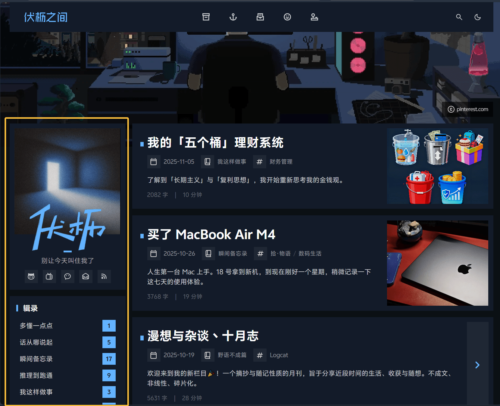

另外正文的右侧除了「回到顶部」按钮，增加了一个「想法泡泡」图标带你快速来到讨论区。此后上天下地，无所不能~

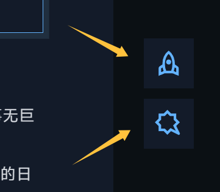

2. **🔥 留言广场已竣工！**

接入了 Twikoo 留言系统，现在读者可以在任意文章和主页的 [留言板](https://leehenry.top/guestbook/) **免登录、即时地**留下任何想法！大家留下的每一个脚印都让「伏枥之间」这方园地变得更加生机盎然。

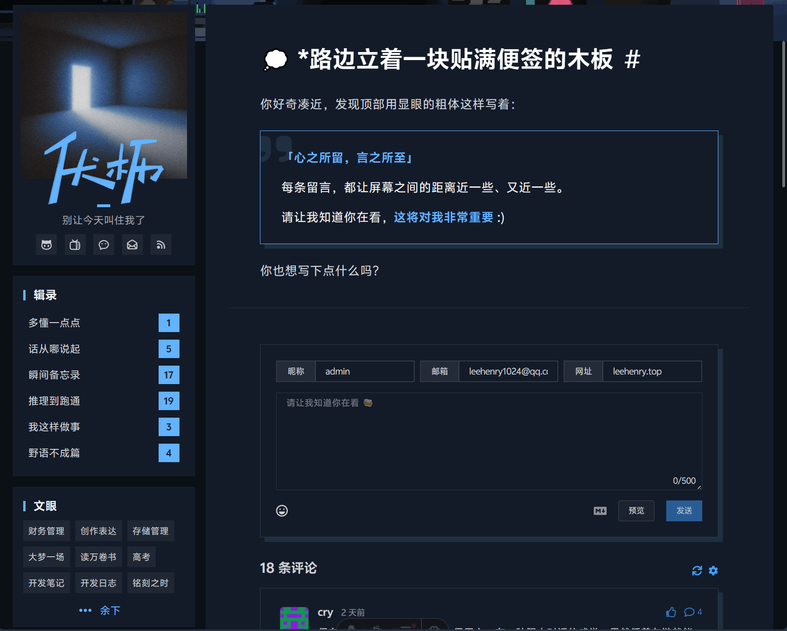

3. **🗨 友链卡片更丰富！**

**[友链页](https://leehenry.top/friends/) 是我非常珍视的一隅。**<mbr>这里的站点（以及背后的站长）都是启发「伏枥之间」建设与坚持的重要灵感与动力。

来到友链页面，细心的朋友会发现，卡片现在多了一些丰富的角标。除了<mbr>**「⭐」**<mbr>是我特别推荐阅读的星标之外，现在还会通过<mbr>**「❌」**<mbr>和<mbr>**「🕊」**<mbr>标记来对无法访问和停更过久的朋友做个小提醒~

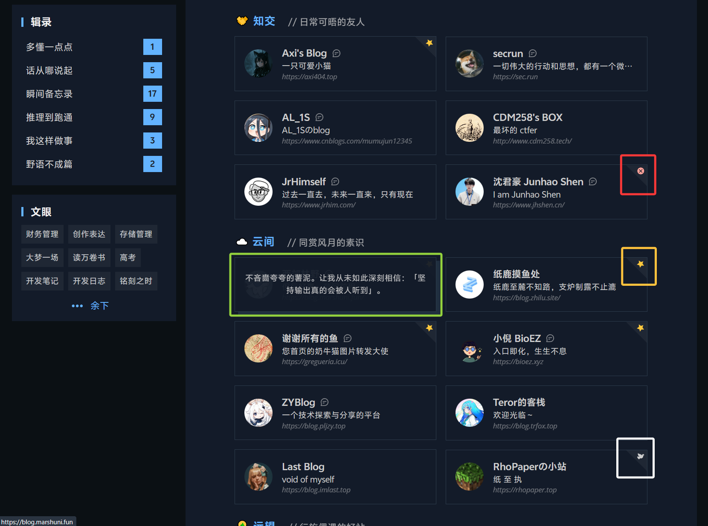

除此之外，有些友链卡片名字旁边会出现一个小<mbr>**「🗨」**<mbr>。点击时，会看到我留下的一行文字。这也是我对印象深刻的朋友与站点留下的一点小彩蛋~

4. **👀 其他不值一提的视觉优化……**

- 修改了包括图标体系在内整个网站的视觉格调，让一切看起来锐利、端庄；
- 优化顶部导航栏的显示与交互效果，并弱化搜索模块的存在感；
- 优化首页的名片页显示样式，在 Procreate 绘制了「伏枥」的手写签名；
- 优化浅色模式的色板体系，现在看起来更鲜明了；（依然更推荐在深色模式下浏览~）
- 增加首页标题的「马克笔划线」交互；分割处理主副标题，并在文章正文页突出视觉层级；
- 增加删除线的模糊 Hover 交互（~~就像这样~~）；修改分割线样式为点式；
- 微调文章内容的行距与间距，并针对移动端做了响应式优化；
- ……

小站持续建设中……装修真的很快乐！另外关于网站的任何体验的反馈有任何建议，也欢迎随时在 [留言板](https://leehenry.top/guestbook/) 向我提出，感谢！ :))))

## ↯ · 信号 Flash

### 理性讨论似乎只能小范围存在

> **o0筋斗云0o：**<mbr>拥抱高质量小共同体、远离低质量混沌大空间，是一种自我保护的策略。毕竟这样活得开心，其次时间宝贵。
>
> 🔗 *Reference:* [影视飓风的舆情，说明互联网已经烂完了 - B 站丨老蒋巨靠谱](https://www.bilibili.com/video/BV1NCCkBKEaU)

很多公共议题讨论的失控，似乎也都经过类似的演变逻辑。这里是 「影视飓风 Tim」，换个场景，它也可能是 「AI」「苹果」「王源」或「预制菜」。我尝试归纳一种舆论恶化的传播模型，论证为什么理性讨论在现今公域的互联网广场难以建立：

1. **原始提出：**<mbr>某人基于某事实、经验或设定的限定下，做出某种行为或得出一个结论。这原本依附于一个清晰、特定的「前提」或「语境」；
2. **观点符号化：**<mbr>但在传播中，前提被淡化甚至遗忘，观点或行为本身被简化乃至曲解，变成了一个可流通的「符号」。这里是「微服私访、扮猪吃老虎的 Tim」；
3. **立场极化：**<mbr>符号本身的模糊性吸引了更多人参与讨论，也不同立场的人撕裂分化为对立的两端；
4. **投射替代：**<mbr>当符号丢失「原始前提」，参与者就会把各自的经验和认知投射进去，填补前提（语境）的空白。
5. **讨论失焦：**<mbr>于是，攻击观点变成了攻击经验和认知、乃至人格和过去。每个人都在为自己「投射的意义」辩护，实际上并不是在讨论同一个问题，共识也因此更难被重新建立。

到这一步，双方早已不是在争论某个事实或观点的价值判断，「看起来很热闹，都认为自己很正确，实际上彼此各吵各的，谁都没听懂谁」，讨论由此趋于非理性和失控。

当然，也不是所有的讨论都会滑向失控。在其中任意一个环节，只要双方中的一方（如果存在的话）能认识到自身视角的局限，仍然有机会重建共识，回归理性讨论。只不过当讨论参与的对象越多，讨论越容易趋于标签化和情绪化，大家的经验和认知也将有越悬殊的云泥之别。

由此看来，共情更多是一种奢望，理性讨论已是一种稀缺。哪怕存在，也许注定只能小范围或在大范围暂时的存在。关于我为什么选择**以博客的方式尝试坚持表达**，之前在[一篇文章](https://leehenry.top/posts/mindlight_maze/mm-vol03/)中提出一种向内的视角，以上也许是着眼于大环境的、向外的另一种补充。

### 叔本华的钟摆

> 叔本华认为，人类本质是 「意志」，一种盲目追求生存、欲望的本能驱动力。当意志未被满足时，人会因 「需求未达成」陷入痛苦 —— 比如渴望财富却贫困、追求爱情却孤独，此时痛苦是生存的主要感受。
>
> 若意志暂时得到满足，如财富到手、爱情圆满，痛苦会短暂消失，但很快会陷入 「无聊」。因为意志的本质是 「持续追求」，一旦没有新的目标，人会因存在失去意义感而感到空虚、乏味，无聊便成为新的折磨。
>
> **人类的一生就像在「痛苦」 与「无聊」之间摆动的钟摆：需求未满足时摆向痛苦，需求满足后摆向无聊，二者不断交替，没有真正的「幸福」或「安宁」作为终点。**

### 戒断快乐、工作与满足

> 既然人生如同叔本华提出的**钟摆理论**一样，在欲求不满的痛苦与欲望满足的无聊之间摇摆，那为何不直接接入快乐机器，一劳永逸呢？
>
> **你会选择接入这台机器吗？**
>
> 我不会。
>
> 我需要承担起自己的责任，不管是对我的家庭，还是对社会。责任感让我觉得自己是一个有益的人，可以为人类的未来做出属于自己的一点微不足道的贡献——对社会整体可能微不足道，但也足以向我自己的良心交代。
>
> 为了承担自己的责任，我**自愿**签署了戒断快乐的协议书。
>
> 这不代表我放弃了获得快乐的权利，而是我希望自己的快乐能建立在一个更高的层面，不仅是生物性的快乐，更是人性的快乐，像屈原在《怀沙》里所写的那样，**怀瑾握瑜**。
>
> 这不是我一个人的志向，在拥挤的地铁里，每一条被调侃为没有活力的“罐头沙丁鱼”都是如此。他们披星戴月，早出晚归，做着远比我实习辛苦的工作，为了承担自己的责任，放弃了许多快乐的体验，忙忙碌碌，奠基了整个时代。**我佩服他们。**
>
> 总有沙丁鱼是在大洋中自在遨游的，也总有沙丁鱼被包装成了罐头。罐头很残酷，但罐头还蛮好吃的。
>
> 🔗 *Link:*  [通勤与沙丁鱼丨小倪 BioEZ](https://bioez.xyz/archives/tong-qin-yu-sha-ding-yu)

很喜欢博友小倪的文风。刚好最近有一些相关的思考，于是我就着这个有关「工作和满足」的话题，在这篇文章下做出了一些主观的过度解读，展开了一段应该还算有些意义的讨论，摘录在此。

> **伏枥：**
>
> - 投身于 Career（虽然更多人只是被迫投身于为了养家糊口的 Job），并在 Career 中得到人生意义的自我实现，与其说是「自愿戒断快乐」，我更认为是一种「投资快乐」：**将现在的精力和时间放到了一个更有价值的「杠杆」中，在未来撬起的快乐基于自己过往的选择与积累，这样基于「自我实现」的快乐也许更高级、更持续。**（BTW，我觉得当下的快乐也很重要~人是由当下的片段组成的，当下过得好，才会对「我正在稳步迈向更好的未来」有更大的信心。不过这是另外一个话题了）
>
> **小倪：**
>
> - 这篇文章也是对马斯洛需求层次理论的一种反思，在他的理论中，人的需求从底层到高层分为五类：生理需求，安全需求，归属感，自尊，自我价值的实现。很高兴看到你在忙忙碌碌的生活中还能保持着自己的初心，朝气蓬勃，说明了咱的需求已经迈向了自我价值的实现而非简单的“求生”
> - 但我在考虑这样一件事：马斯洛的理论似乎把人的需求分成了泾渭分明的若干类，仿佛在底层需求的满足中挣扎求生的人很难接触到最高层次自我实现的需求。考虑到这一点，我希望自己的文章倾向于：人们并非只是麻木的求生，而是在责任感这种“高层次”需求的基础上兼顾生存需求与安全需求。
> - 当然，这样写显然也有缺点，一是大部分人对快乐与幸福的理解都有所不同，而且各有道理（光是一个古希腊和希腊化时期，就有斯多亚学派、伊壁鸠鲁学派和怀疑论等），又比如伏枥同志你的观点。其实都没错，只要能足够指导自己的生活实践，就都是好的；二是我只是阐述现象，似乎并无对本质的讨论，我认为简单归因于个人或是归因于社会都是不负责任的，毕竟没有详实的调查，也就没有发言权，只能对刨根问底的读者说一声抱歉啦~
>
> **伏枥：**
>
> 好认真和全面的回复！谢谢小倪！
>
> 说的非常有启发，提供了一个我忽视的视角：除了诉诸自我的「人生理想的实现」，诉诸他者的「责任感的满足」同样是一种自我价值实现的方式。再我原来观点重新一读，似乎把「养家糊口」与「自我实现」做了武断的对立，是有些片面了。感谢补充！
>
> 前段时间考古「独树不成林」播客的一期《小县城出生如何塑造我的思考》，播主仲树有个类似观点也让我印象深刻：
>
> > 用城市里「尊重独立的生活方式」指责小县城的人们「尊重家庭的生活方式」，同样是一种傲慢。
>
> 就像小倪说的，每个人有指导自己生活实践的不同方式，这是个高度主观的事情，价值判断仅存在每个人自己身上。但重要的是可以认识到，所谓「诗穷而后工」，生存需求和安全需求哪怕得不到满足，也许更高层次的需求也能成为建构存在意义的重要出口。😼

### 书籍提供体验的上下文

> 语言是理性思维的外延，一个作者在阐述知识的上下文的过程，就是他思维方式的具象体现。
>
> 除了只适用于特定领域的思想，有一些思维方式是普遍适用的，并且这些思维方式会在各种阅读材料中反复出现，从各个角度不断地塑造自己的认知。此时，这些思维方式就不再是形如「你应该……」的说教，而是已经内化于心的东西了，成为了自己人格或者说灵魂的一部分。一本书对你认知的塑造，也会影响你阅读下一本书的方式，甚至会影响你写作、发言、吃饭和睡觉的方式。
>
> 人生苦短，当有人已经将一段你或许不会有机会亲自经历的体验提炼到一本小小的书里，你为什么又要嫌弃这体验不能变得更加短平快？这也是我认为小说、传记和散文可能比科普、自助类书籍更有价值的原因，它们不关注知识，而是关注一个人能从书中获取的最具价值的东西——体验，以及读者能从体验中获得的自我的升华。
>
> 🔗 *Link:* [阅读的目的从来不是获取知识丨极客死亡计划](https://www.geedea.pro/posts/阅读的目的从来不是获取知识/)

非常深入我心的一篇文章。事实上，当我自己借助 AI 学习一些理论和知识的时候，也对剥离语境的知识有一种有些虚假的「学习快感」，实际上不求甚解，遗忘迅速。结合这些经历，我在文章的评论区发表了一些想法。

> **LeeHero0803：**~~←这是我的 Github ID ^^~~
>
> Can't agree more. 这让我联想到现在的人工智能，提供的往往就是一种剥离语境的捷径，知识也许正确，可以让人有「掌握知识」的幻觉，但省略了知识的背景和论述的过程，Easy come, easy go。
>
> 「体验的上下文」是一个很有意义的视角。所以书籍之所以无法替代，对作者而言，也许「怎么得到这些知识」会比「知识本身」更重要；对广泛的读者而言，辩证思维的和长期记忆的形成是很难脱离语境孤立存在的。可惜现状是，从短视频到大模型，大家似乎在主动放弃这种能力。
>
> **BigCoke233：**
>
> 换一个角度想，当大部分人都在放弃这种能力的时候反其道而行之，自己的能力就以更快的**相对**速度提高了😉

## ☨ · 探针 Probe

### 一个丰富可商用的无缝纹理库

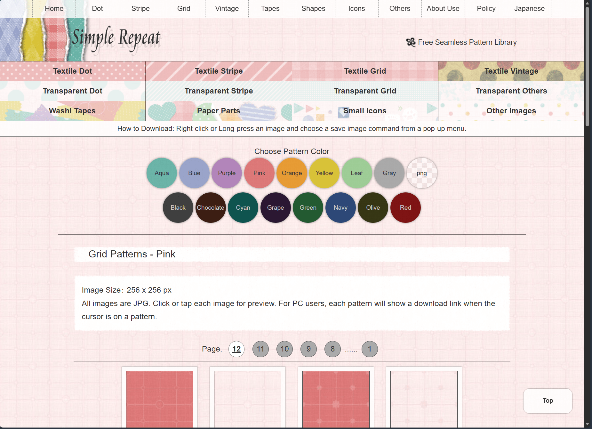

> 🔗 *Link:* [Simple Repeat](https://simple-repeat.com/en/)

囊括不同形态、大小和颜色的无缝纹理资源，分类细致且全面，还可以在网页即时浏览效果。下载的纹理资源是`jpg`与`png` 格式，支持修改、细化与商业使用。暂时没有用于本站的建设，先马克一下。

这个网站是在博友鱼鱼的 [书签页](https://gregueria.icu/bookmarks/) 发现的，感谢她！

### 一个高质量免费照片共享网站

> 🔗 *Link:* [Beautiful Free Images & Pictures | Unsplash](https://unsplash.com/)

发现这个网站同样来自[小倪](https://bioez.xyz/)！小倪每篇文章精选的首图很有美感，跟着 Credit 顺藤摸瓜找到了这个高质量免费摄影网站。摘取一段 [Unsplash 的 Wiki 介绍](https://zh.wikipedia.org/wiki/Unsplash)：

> **Unsplash 是一个免费的照片共享网站。**<mbr>摄影师可以将照片上传到 Unsplash，照片编辑者们会对用户上传的照片进行整理。Unsplash 使用了较为自由的著作权许可条款，这让 Unsplash 成为了互联网上最大的摄影照片供应商之一。截止至 2020 年 4 月，该网站拥有超过 18 万名摄影师，图库中储存了超过 160 万张照片。

**互联网精神万岁！**

### 一些关于运动的最小必要知识

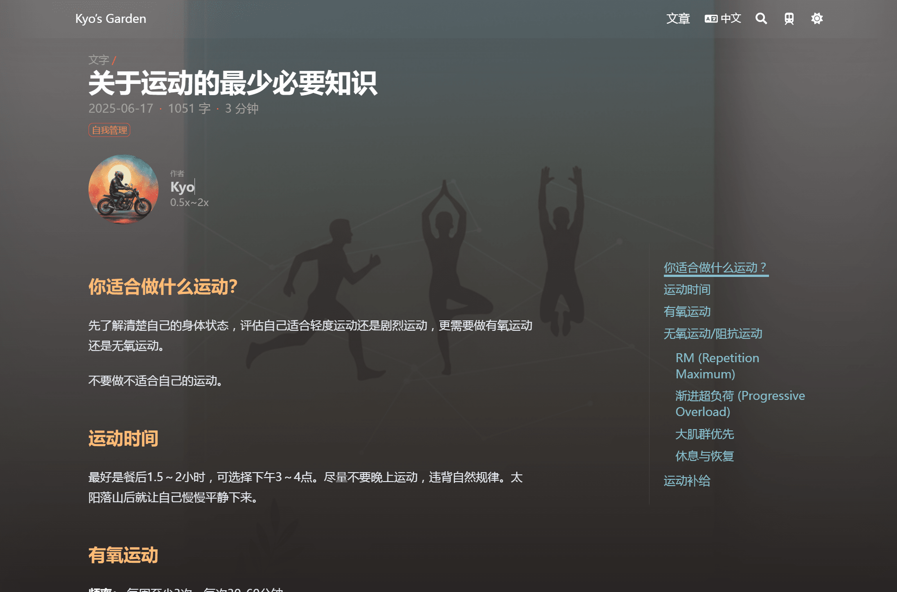

> 🔗 *Link:*[关于运动的最少必要知识丨Kyo's Garden](https://www.heykyo.com/zh-cn/posts/2025/06/the-essential-basics-of-physical-exercise/)

「开往」项目博友的一篇关于运动/健身入门的实用文章，刚好最近在尝试和学习健身（~~指友人 G 送了我三天乐刻体验会员~~），有在寻找一些相关的知识。这篇涉及到的点解答了我关心的很多疑惑。

体验会员只有三天，所以我尝试了三分化健身，这样「三天打鱼一天晒网」成为了正规的训练节奏，很适合我。虽然健身的过程中手会被器械「困住」，却让脑子留下很多思考空间。过程中听了几期《独树不成林》《咸柠七》与《罗永浩的十字路口》，虽然不好说真正听进去或内化了多少，但这种身体和精神同步「增长肌肉」的体验还不错。

上海的健身房真的好贵！结束了体验会员虽然意犹未尽，但还是在千元的年费面前望而却步……

### 一些准备 Presentation 的实用建议

> **小型发言：「PREP」框架，可以在短时间清晰、结构化的表达观点。**
>
> 1. **Point（观点）：**<mbr>开篇直接抛出最核心的结论 / 立场，避免铺垫冗长。
>    - 「我建议咱们部门从下月起，新增每月 1 次的 15 分钟小型分享会。」
>
> 2. **Reason（理由）:** 用 1-2 个关键原因支撑观点。
>    - 「一方面能快速同步各岗位的工作亮点，避免大家只盯着自己的任务；另一方面也能帮新人更快熟悉团队业务，减少信息差。」
>
> 3. **Example（证据）:** 提供一个具体的例子来说明观点。
>    - 「上周我跟运营岗的同事聊，发现他们做的活动数据，产品岗的同事完全没了解到；而且新来的实习生也说，想知道其他同事的工作内容，但一直没合适的机会。」
>
> 4. **Point（总结）:** 回归并强调观点，强化记忆
>    - 「所以从同步信息、帮助新人的角度出发，新增月度短分享会很有必要，建议咱们先试点 1 个月看看效果。」
>
> 这个框架可以做到最小化逻辑闭环、重点突出，一方面能帮发言者快速组织思路，另一方面也让听众轻松跟上逻辑，避免混乱。

> **大型展示：准备、讲述与台风**
>
> 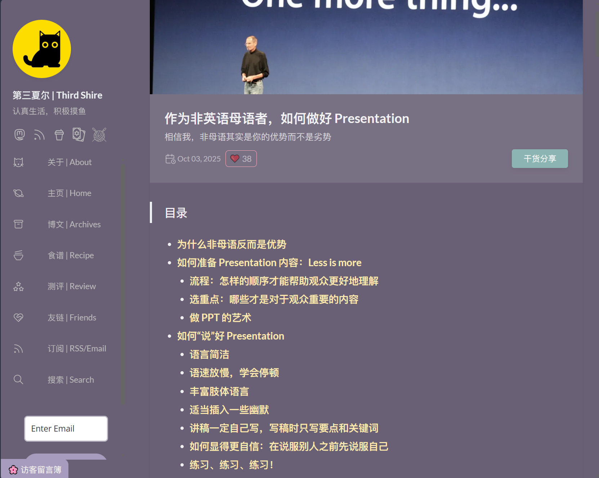
>
> 🔗 *Link:* [作为非英语母语者，如何做好 Presentation](https://thirdshire.com/presentation/)

夏尔的这篇文章写的非常切中肯綮。我非常认可的是，**Pre 本质上是一种沟通方式，而 PPT 的用途应该有且仅有辅助观点内容的传达。**<mbr>作为大学生以「小组汇报作业」为基本背景的 Pre 任务，很多时候最终都沦为组员各做各的，拼成 PPT 大杂烩，最后让组长照着朗读全是字的可翻页 Word。

就像文中想要表达的那样，<mbr>**「Less is More」不仅是设计领域的哲学，在 Pre 展示中更是删繁就简、梳理主线、把握演讲重心和节奏的艺术。**<mbr>这篇文章给出了很多实操性很强的建议，也让我本科阶段的最后一次 Pre 作业得以（自我感觉）比较完美的完成，也得到了老师比较高的评价😊。

## ❏ · 快照 Quote

### 你永远无法到达「完美准备」的真实！

> 面对艰巨任务或充满不确定性的项目时，人们常因恐惧陷入一种踌躇不前的状态。人们告诉自己“等准备好了再开始”，于是选择花费大量时间收集资料、学习技能、规划细节，试图消除所有的不确定性，等待那个“完美准备就绪”的时刻降临。但这个完美的“准备好”时刻永远不会到来。
>
> 以写作为例，你可能立志创作，却总觉得需要先上完所有写作课、读完所有经典著作、构思出完美的大纲才敢下笔。于是，你迅速下载无数写作教程，买了几本名家写作心得，报名各种线上课程，十分忙碌。一年过去了，网课没上完，也仍未动笔。这种“等待准备好”往往成了精致的逃避借口，让我们躲在“准备”的舒适区里，用看似合理的忙碌掩盖内心的恐惧，却也在不经意间错过机遇与红利。
>
> 勇于跳入未知，边做边学。**勇敢地拥抱“未完成”的状态，不必等到万事俱备才开始行动。**<mbr>有时，正是“未知”反而带来行动的魄力 (“无知者无畏”)。**行动的结果，无论是成功还是失败，都是最直接、最深刻的老师。**<mbr>在行动中淬炼出的自信，远比“准备充分”的幻想更为可靠，也更能支撑你走向更广阔的天地。
>
> **以“行动-反思-优化”替代“准备-等待”，行动是解药，未知即沃土。**
>
> 🔗 *Link:*  [你不需要准备好才开始丨雅余](https://yayu.net/5374.html)

> **Owen：**<mbr>看到一个说法：笔记是一种无限游戏，没有结果，只有过程；而博客是一种有限游戏，因为它产出了完成的作品：博文。这说明我们不能当一个完美主义者，只在脑海或草稿箱中保留想法，我们应该尽可能完成作品，公开它，然后不断的练习这个过程。
>
> **Owen：**<mbr>不要完美主义，如果是可逆决定，就不要花太多的时间去分析，往往分析过后你会继续观望。最好的办法是行动去尝试，可以不断试错，但是要多尝试，因为每一个行动都会产生新的信息，从而让你有更好的判断。
>
> 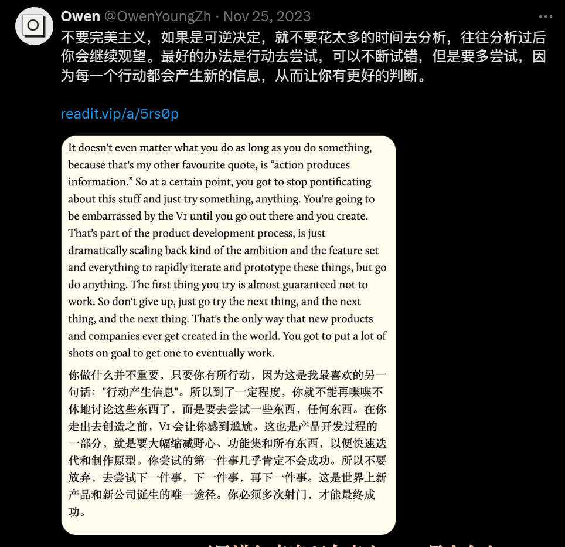
>
> 🔗 *Link:*  [Owen (@OwenYoungZh) / X](https://x.com/OwenYoungZh)

「完美主义」和「启动困难」真是一对苦命鸳鸯🐧！

想起 [Eltrac](https://www.guhub.cn/) 之前在某处的评论区还提到了<mbr>**「飞轮效应」**<mbr>理论。一开始推动「飞轮」时，需投入极大精力才能让其缓慢转动；但随着持续推进，飞轮会因惯性积累动能，后续转动会越来越轻松，甚至无需额外用力就能自主向前。就像骑自行车，起步阶段往往最困难，但凡骑行起来，保持住平衡和速度并不需要额外费太大的力气。

很多习惯培养工具，还有在做事前期的过度准备，也许本质上只是让人有尽快启动的动力而已（甚至很多时候这种动力本身也只是一种幻觉）。

~~这篇文章的产出也是最大的例子。一拖拖一月，拖到十一月的尾巴。第二天要出远门，新建文件夹再熬了个通宵，一晚上肝出来一整个月的分量。但凡开写，其实很快就进入了「心流状态」，写完还刚好能赶上早班车。~~

### 注意力如奢侈品

> **追求注意力自由而不是财富自由。**
>
> 虽然财富自由会有更大的机率获得注意力自由，但是追求注意力自由却不一定非要财富自由。
>
> 注意力自由并不意味着我们完全不会收入，恰恰相反，只有注意力自由之后，我们才能发挥真正的创造力，没有边界的探索任何事情。而且，在这个过程中，我们非常有可能获得一些未知的财富。即便 10 年过后没有获得任何财富，在经历 10 年的闲暇时间之后，我们一定在各方面都成为了一个更好的自己，从而拥有更多的能力去做任何事情。
>
> 🔗 *Link:* [关于我和这个博客 - Owen的博客](https://www.owenyoung.com/about/)

> **能自由选择将自己的注意力放在任何有价值的地方，就是一种奢侈。**<mbr>当自己拥有这种宝贵的奢侈时，如果只求把事情做得又快又方便，就是在暴殄天物，例如：用 AI 总结一篇好的文章，只为自己能更快更方便地读完。你有没有想过，书之所以写那么长，人类的所有知识迄今为止之所以还没有被总结为一个快捷方便的大纲，就是因为真正的智慧就存在于这种奢侈当中？
>
> 🔗 *Link:* [稻草人周刊 Vol.53丨极客死亡计划](https://www.geedea.pro/posts/weekly/53/)｜[Attention is a luxury good丨Seth's Blog](https://seths.blog/2025/10/attention-is-a-luxury-good/)

### 艺术品市场的 3D 定律

> **松松發文物资料君：**<mbr>艺术品市场「3D 定律」：Debt（债务）、Divorce（离婚）、Death（死亡）。
>
> 一切顶级藏品的流通，往往是由藏家生活中的重大变故所驱动的，鲜有例外。每一次重磅拍品的出现，背后都可能有一个关于人生变故的故事。

### 音律与电影艺术

> 【**视频章节：（诺兰电影）时间的结构**】
>
> 要想弄清楚诺兰从几位大师那里汲取了什么，得先弄明白他们作品的绝妙之处。
>
> 我们现在听到的是巴赫最著名的作品之一，《G小调四声部赋格》。它由一个声部的旋律先行奏出，随后几个声部以特定的形式模仿、并且复用前面的片段。这首曲子最多的时候可以达到 4 个声部一起演奏，感觉就像是跟刚才完全不一样的一个曲子。**这种创作方法也被称为赋格。**
>
> 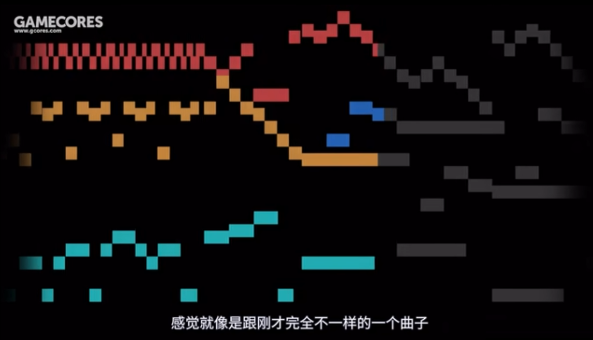
>
> 我觉得它最好玩的地方在于，每一个音符既是自己旋律的一部分，也是下面和声的一部分。当几个声部错开时间相互角逐，听者需要在自己脑海中调整他们的位置，才能领会到全局的奥义。
>
> 这种感觉听起来熟悉吗？陆地一周，海上一天，空中一小时（《敦刻尔克》）；梦里一个星期，现实十个小时（《盗梦空间》）。观看诺兰电影的体验与收听赋格的方法多么的相似。
>
> 下面这首曲子来自巴赫著名的螃蟹卡农，一条旋律正向演奏，一条负向，两者对位，形成一个永恒的莫比乌斯环。
>
> 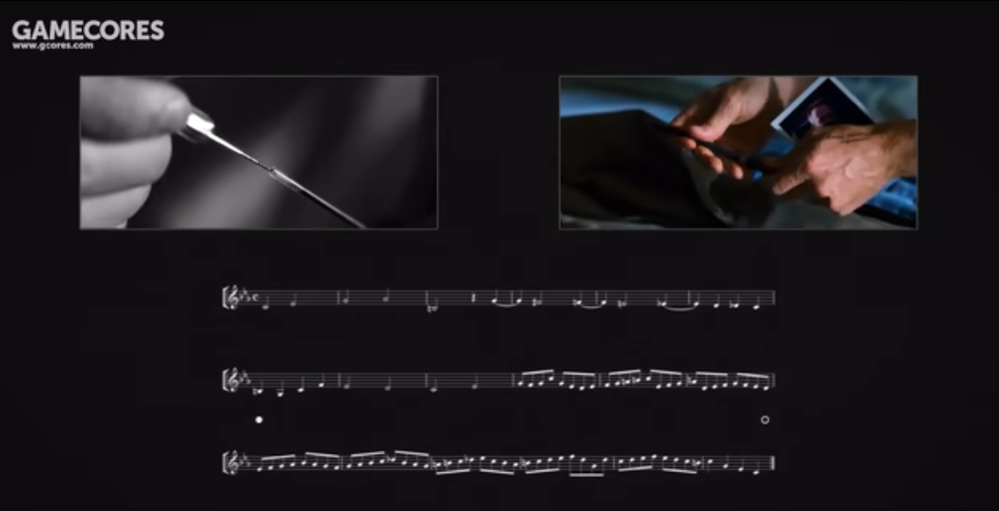
>
> 没错，这也是《记忆碎片》的故事结构，黑白的部分正序讲述，彩色的部分逆序讲述。当黑白变成彩色，影片完成首尾相接，主角也陷入了自己制造的命运循环。
>
> 如果以上例子还不能说服你，那么巴赫还有一首非常玄妙的「无限卡农」，这首曲子影响并且催生了后来的「谢波德音阶」，而这种音阶就是《敦刻尔克》整部电影所遵循的剪辑逻辑。
>
> 和「赋格」有点类似，谢波德音阶也是由三条外形相似的旋律线组成，每条旋律相隔一个完整的八度，它的奥秘之处在于，当低音部分渐强的音量逐渐升高，中音部分保持不变，而高音部分，则以渐弱的音量逐渐淡出。
>
> 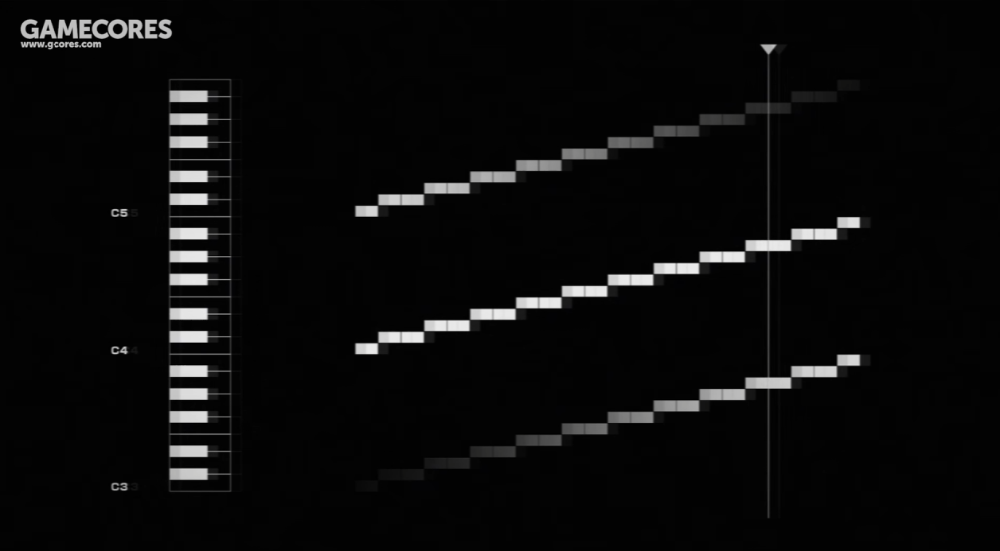
>
> 所以当我们把三个连起来循环听，就能得到一个永不完结永远上升的曲调了。现在我们把这三条旋律线呢，分别想象成海、陆、空，就能理解敦刻尔克持续带给我们紧张感的奥秘了。
>
> 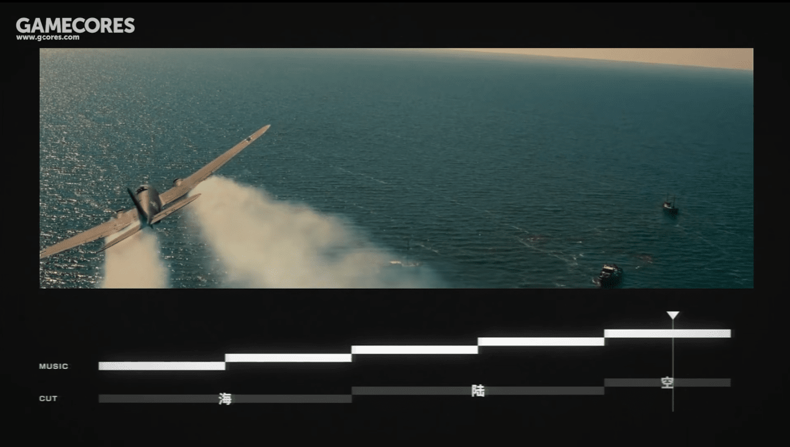
>
> 🔗 *Link:* [我花两个月时间重看诺兰电影，终于搞懂了他的3个秘密武器 - B 站丨银屏系漫游指南](https://www.bilibili.com/video/BV1iD4y1m7it/?share_source=copy_web&vd_source=13124edee9a4b745937af2c37bdad50c&t=65)
>
> ---
>
> **沐紫漓：**<mbr>其实赋格这个词也很有意思，它不仅是对外语的音译，也可以理解为「文赋的格律」。 两汉魏晋时期的文赋讲究句式工整，两句一押韵，并且跟随每章主题而转变主要韵律，形成句与句的交相辉映。我觉得这也正是赋格的特点。
>
> **mRandMr：**<mbr>赋格的中文翻译来自于中国作曲家黄自先生，是真正使外语本土化并且信达雅的例子。赋格有主题，对题，答题等等。其中还有变种，比如双对题，多主题赋格等，短小的主题或为种子，或为地基，向上发展成枝繁叶茂盘根错节的大树和巍峨的建筑。在行进过程中感受到逻辑的巧妙和结构的严谨，在纵向的声部碰撞中感受到音符火花的迸发和瞬间的美好，相互追逐，相互模仿，时而共同前进，时而放飞自我，是感性和理性结合的至高杰作，也是复调音乐的最高形式。
>
> 🔗 *Link:*  [赋格 - B 站丨东方鲈鱼王](https://www.bilibili.com/video/BV1WS4y167bE)

### 是正在失去主语的句子

> 「　发现一些失首的躯体。/　翻起眼白。/　张牙舞爪。/　都舍弃了气息。」
>
> 「　让观者久久伫立。/　无法琢磨。/　没有头绪。/　弄不清作案的动机。」
>
> 「　联想到日全食。/　仿佛是蛇尾巴。/　拙劣地模仿刑天。/　或许很难以启齿。」
>
> 「　不是传奇故事。/　更不是志怪小说。/　无法逾越生活的目光。/　同样需要假装认真。」
>
> 「　藏着可能的真相。/　是失去第一小节的乐谱。/　变换着 shuffle 和 swing 的节奏。/　把它演奏。」
>
> 「　没有一处离调的编排。/　涂掉装饰音 。/　不知为何地使用五声调式。/　弄混了利底亚与多利亚。」
>
> 「　不停地冷嘲热讽。/　虚发着子弹般的唾沫。/　恢复挣扎后的平静。/　把乐谱翻过来。」
>
> 「　记录了一个病句。/　竟然没有主语。/　值得硏究 。/　但是无从下手。」
>
> 「　其实不能说没有主语。/　也许不需要一个主语。/　也许不需要第一小节。/　也许不需要一颗头颅。」
>
> 「　开始发出声音。/　开始演奏旋律。/　开始起身漫步。/　本来就未曾停止。」
>
> 「　想象一个没有月亮的晚上。/　渐渐变暗了。/　轻轻地，再把病句读一遍。/　『是正在失去主语的句子。』」
>
> 「我们 **正在失去主语**<mbr> / 我们 **却也仍是主语** 」
>
> 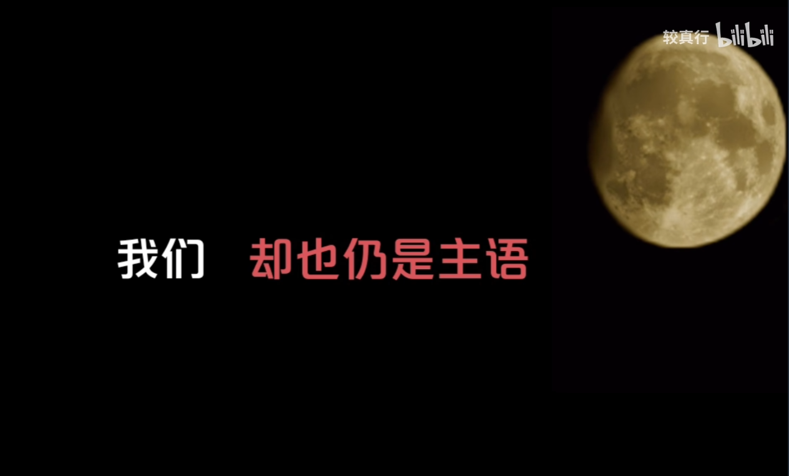
>
> 🔗 *Link:* [“ 是正在失去主语的句子。” - B 站丨较真行](https://www.bilibili.com/video/BV1Q6t6zsE6C)

首先最直接能够 Get 到的，是这种在文字游戏中运用的比喻，带来可意会却难以言说的震撼感： 

- 当句子失去主语，像失去头颅的躯体，像失去前奏的乐谱。躯体开始起身漫步，乐谱开始演奏旋律，没有主语的句子有些 Confused，同样能够模糊的自洽。 

- 这首诗符合我之前看到的关于艺术的一种意义——用某种形式让我们审视早已被习惯的事物本身——比如这里就是我们日常以直觉进行使用的语言。

- 有趣的是，评论区进一步对这个话题展开了从理性到感性交织的讨论： 

  1. 西方与东方语言表意重点的区别之处；

  1. 在信息时代下人们表达方式的抽象与简化；

  1. 对语言本身的用途的思考：形式优先 vs 功能优先；

  4. 中文这种形式带来的语义婉转与表意精确的中庸平衡；

  5. 语言的留白引申到生活的留白，虽然失去主语，但句子本身具有主体性；生活没有主角但是其中的每个人都具有主体性。Ta 会自己找到自己的注解。

## ✲ · 脉冲 Spark

### 切片 二之一

说实话，这个十一月过得并不好。甚至让我一度有些害怕出门。当遇到一些足够糟糕的事情，理智甚至开始让位给玄学。

不过从某种可能有点自我安慰的角度上来判断，这些糟糕的事情能让我从平时盲视的方面更深刻的认知了自己，不失为一种好事。

发生了什么？我可能还需要一些时间来沉淀和整理。每遇到一些深刻到足够认知到「我是什么样的人」的事情，我现在开始前所未有的想要留下这些时刻。也许以后会用一个新的标签来汇总这个专题，叫什么呢？<mbr>**「找自己」**<mbr>？这个名字听起来不错。

总之，希望大家事事顺遂，平日快乐。

### 切片 二之二

我们不追求赢，也不追求输。我们不追求快乐，更不追求哭。

我们什么都不追求，我们上去梆梆就是两拳。🥊🥊

<mbr>
