细心的读者会发现，与开始的「漫想与杂谈丶X 月志」相比，现在月刊标题统一加上了**递增的期号**，用**二十四节气**代替了月份的标识。如此一来，如果月刊能坚持至少一年，标题也不会出现重复啦\~（~~希望能有这一天~~）

这里节气不会严格对应，而是选取离发布当天「最近」的节气。按我浅薄的理解，节气的意义不在于划定某个严格的瞬间，更多是作为认知物候变化与自然节律的「阶段性」标记。用节气冠名文字，也许会让在记录下字面含义的同时，进一步压缩保存在写下它们时，具身感知到的温度。

**以刚过去的冬至为界，往后每一天白昼都持续生长，往后每一步都坚定迈向春天。**

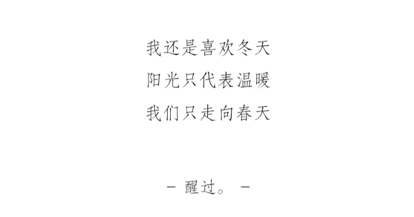

## ◈ · 断点 Track

### 网站建设小报

月刊的一些小惯例。相比前两月，本月在网站建设的投入不算大。以下是一些值得一提的小细节。

1. **亮色模式的小改动**

为照顾不同主题倾向的读者，进一步优化了亮色模式下的一致性体验。其中头像和手写签名的色调在亮色模式下做了更细致的主题色适配。亮暗两版的头像均来自艺术家 [@textrnr](https://x.com/textrnr)。


2. **RSS 订阅友好**

以前在 RSS 阅读器中文章内的图片路径会解析失败。目前该 Bug 已修复，现在您可以在任意 RSS 阅读器通过 [此订阅链接](https://leehenry.top/rss.xml) 获取最新文章推送。

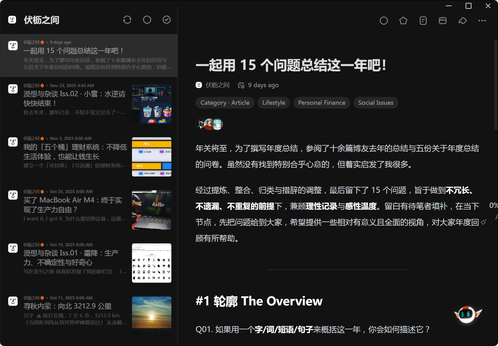

这个功能实际在建站之初就已经上线，但因为在过去我没有 RSS 阅读的习惯，早期 RSS 功能的 Bug 就任由它存在着。意识到它真的有人在用，完全因为留言板 [@cry](https://cry4o4n0tfound.cn/) 兄的一则留言：

> [**cry**](http://cry4o4n0tfound.cn/)：很有趣的主页，里面的内容也很用心，有一种跟人对话的感觉，果然循着友链就能找到一些很有意思的网站
>
> [**伏枥**](https://leehenry.top/)：热烈欢迎！也谢谢你的留言(/ω＼)！贵站建设从设计到内容也非常丰富，很值得学习，我会经常看看的。
>
> PS. 点进归档页才想起以前早有缘拜访过，当时读了《我，状态机》这一篇，入题的角度很有趣，特别认同「不确定同样是一种力量」。
>
> 总之欢迎常来！
>
> [**cry**](https://cry4o4n0tfound.cn/)：好哦，真是有缘呢，还是该说中文博客圈子太小呢😂，我也会常常来拜访的，已经订阅 rss 了(￣▽￣)」，希望能和博主成为朋友！

借着这个机会，我下载了 [Folo](https://folo.is/) 阅读器，键入「伏枥之间」的 RSS 链接，历史文章列表旋即弹出。随意点进最近的文章，出乎意料的是，标题下陡然弹出一大列头像。

**这些都是真实的读者。**

是的，在某些我都不知道的角落，我的声音已经渐渐被越来越多人听到了。这对我无疑是非常大的动力。就像我在[《在撕裂的网络语境里，说话还有意义吗？》](https://leehenry.top/posts/mindlight_maze/mm-vol03/) 中所想象的那样：

> 我相信内容输出本身带有一种「吸引力法则」：真诚的表达会吸引来同样真诚的人。

从那时起，RSS 聚合阅读悄然改变了我的阅读习惯。我将这段时间常读的博主加入 RSS 阅读器，借助聚合阅读器作为中转坞，我消费内容类型的占比发生改变。主动选择的内容增加，而被动推送的内容减少。

在现在碎片化和幻觉信息泛滥的时代，从事实到观点，磨砺判断力的锋利变得越来越重要。主动选择有价值的信息我认为是一个好的开始。

**输入带动输出，我更加相信我走在正确的路上。**

### 新的行迹

说走就走，这个月去了一些新的地方。

#### 合肥 · 黟县 · 黄山

> 逃离上海重度污染的尘嚣
>
> 遁入高墙深宅、白墙黛瓦
>
> 再沿乱石险峰向上，向上
>
> 诗意与磅礴在此叠成一片

我自幼在阜阳生活。作为皖北偏远的一座县城，家乡给我的印象更多是接壤天际的一马平川、乡音不改的中原烟火。如果说皖北的一面是平淡、内敛而绵长的，那么皖南的这一面在磅礴壮阔山水的衬托之下，从气候、地理、口味到人文，显得无疑更为浓重和热烈。


现在来到一个新的地方总会尝试看看本土的一些奶茶品牌，合肥的卡旺卡更是在之前各个地方有所耳闻。提前请教朋友撒汤，得到了一些卡旺卡单品的美味推介列表。整体体验都很不错，其中尤其喜欢茉莉绿雪。

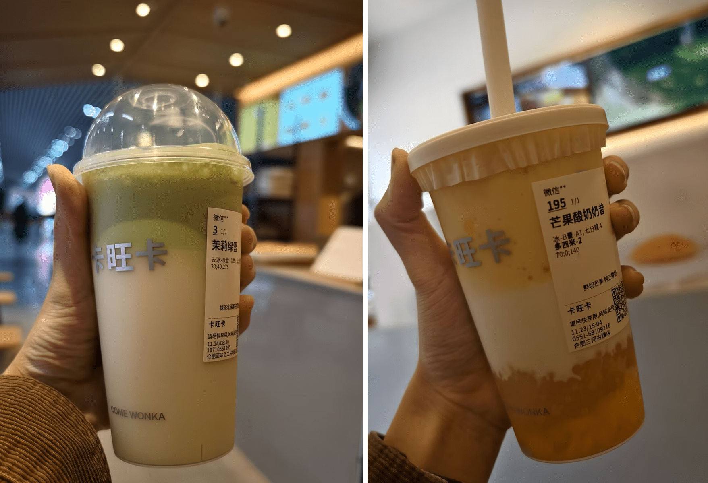

在合肥两天喝下三杯卡旺卡后（~~上图还有一杯手剥大橘没拍ww~~），来到黟县宏村又驻足一家茶店门前。我不懂茶叶，但被门口挂着的石墨奶茶的招牌吸引，这才知道原来石墨茶是黟县这边一种特别的品类。

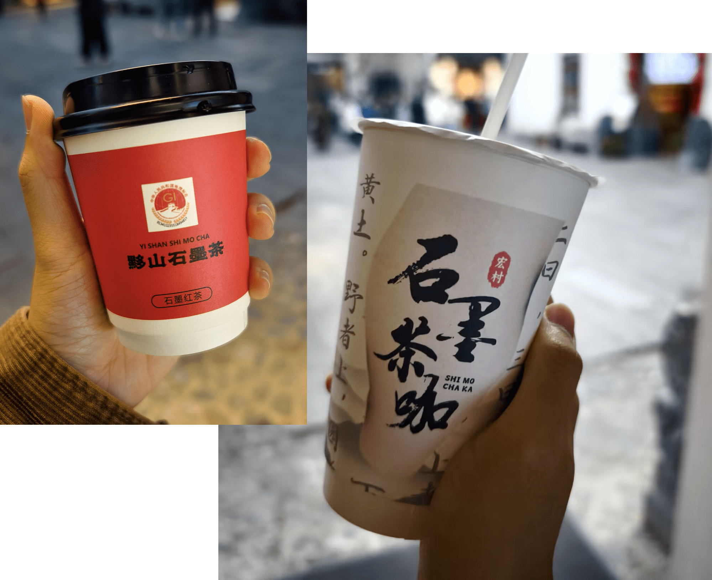

石墨奶茶是店主近两年拓展的新业务。配料非常简单，一小撮茶叶冲泡成茶，注入纯牛奶加点果糖，便成为一款长盛的单品。因为奶茶而吸引进店的客户不止我们一行人，这一点业务扩展让他们的流水相比以往提升了至少三成。店主向我们展示她微信的好友列表，备注从黑龙江到海南，她的茶客遍布五湖四海。

从茶叶开始聊起，得知她的祖籍正是黄山，她平日里在山上的茶园采茶卖茶，依时律起作。后来提起前几天在清晨上山，她用当时的照片告诉我们这里的雾凇和云海很美。

她还说她因为卖茶曾经来过上海，这也是她感情非常深厚一座城市。后来谈起她土生土长的地方，这让我对安徽这座熟悉又陌生的城市有了更深刻的了解。

皖北地处黄淮平原，平坦的地形适合大规模种植小麦、玉米等旱作作物，直接催生了以面食为主的饮食结构，譬如格拉条、撒汤和煎包已然成为一方特色，生活方式也更接近华北地带给人的印象。而皖南多属皖南山区，山地丘陵为主的地形更适合水稻、茶叶种植，饮食便以米饭为核心，清淡的口味与追求食材本味的烹饪方式，足见江浙一带的南方城市的痕迹。

地形阻隔让皖南皖北竖起一道交流的壁垒，一方面让本地饮食特色有所分化并得到保留，另一方面更造成了「隔山不同音」「十里不同音」的现象。想起前两天到合肥，当地人操着一口和皖北老家完全不同的方言，这也不足为奇了。

最后，我在发在朋友圈的游记的结尾中这样写下：

> 或许这就是家乡此方水土为我滋养的另一种人格特质：从烟火而来，到山海中去。在平原的温润之下，其实早已悄悄藏下属于山川的锋芒。

#### 景德镇

景德镇离安徽很近，于是顺理成章成为了行程的下一站。口味很明显浓烈非常多，中辣及以下的水平是我的极限。

第一次吃到夹在饼里的鱼香肉丝。除此之外最印象深刻的是这个脆皮茄子的做法，好吃到不可理喻……


还尝试了玩泥巴！意料之外的成功，艺术细菌最繁盛的一集。


入窑出窑最后到手等待了刚好一个月。


#### 南京

南京是第三次的故地重游。这次 Reconnect 了从今年开始真正熟络的老朋友中立小鼠。她带我去了人生第一场 Livehouse——漾应的火塘。


#### 杭州

初与大梦结识时他当时还在高三，不知不觉已经一年过去了，高考后他来到了杭州。这是我们第一次见面，相似的磁场会让命运交汇在共同的地方。


匆忙离开的路上打包的 Shake Shack 同样遭受了类似的命运……


## ↯ · 信号 Flash

### 我的脑袋也是空空如也

> 每次刷抖音都有一个想法在我眼前盘旋，「我是不是有些装？」
>
> 短视频如瀑布般从视线进入，冲刷着我的脑海，带着似是而非的观念与绮丽宏大的话语，比如「勇敢的人先享受生活」；比如「XX 太权威了」。这些就如同 MC 里的幸运方块，充满诱惑，但不知道是什么。
>
> 我理解拼写这些字词其实并不是要表达它的字面意思，大概只是因为它们所代表的某些东西与那一刻的情绪契合，与我们真正想表达的相似。只是在我眼中，它们如同短视频广告（尤其是美食类）的话术般充满着不和谐。Spelling is fun。
>
> 也许我是一个无法在语言膨胀的现今做到自洽的保守派。连回复别人都要斟酌打几个「ok」才显得亲切，不敷衍也不严肃，因而我更喜欢面对面交流即便我会紧张找不到话，其实也没好到哪去了。我不喜欢某些在互联网上很流行的词组，例如「爱你老己」、「我真服了」等等，可我并非因为它们是「流行词」而有偏见，只是觉得自己没有必要用如此强烈的词表达此刻。
>
> 话说回来，我是不是很装呢？你知道的，那种「特立独行」的人，理中客。虽然我觉得这般如此，可在聊天打趣中其实也会说「我不行了」，那一刻我还真想不出什么回答了。
>
> 也许只是因为抖音的演算法给我推了太多这样的视频才让我觉得如此；也许只是因为我没有臭味相投的朋友用这些字词；也许只是因为我的脑袋空空想不出更好的表达却又不甘接受。
>
> 我的脑袋也是空空如也。
>
> 🔗 *Link:* [我的脑袋也是空空如也 - 抖音丨撒汤](https://v.douyin.com/-ONDVlG9x8M/)

> **-伏枥：**
>
> 语言在这个时代面临着严重通胀，为了表达同样程度的喜悦和惊讶，我们面无表情的将「哈」和「啊」无止境的叠用，用流行语的情绪标签轻易概括细微不同的想法。喧器的网络梗迅速腐朽，留下的只有越来越情绪化和两极化的讨论环境，以及当代人更加难以精准达意的语言沙漠。
>
> 我深刻意识到这种悲哀的契机是，我在整理资料时偶然读到了我中学时代的一些文章，尽管稚嫩，但在字里行间我仍然能和那时候的自己感同身受。被以前的自己激励，而再次提笔，却发现我写不出这样有生命力的文字了。
>
> 今年年初我在看完《初步举证》后努力憋出了一篇 [影评](https://leehenry.top/posts/mindlight_maze/mm-vol00/)，当时在朋友圈的评论区留下了我的一段注脚：
>
> **今年的目标是，我想尝试寻回对文字的感知与驾驭。**
>
> > 我理解拼写这些字词其实并不是要表达它的字面意思，大概只是因为它们所代表的某些东西与那一刻的情绪契合。
>
> 是的，文字化思想和生活是一种非常珍贵的能力。
>
> 愿我们都能找回这种能力。

### 舆论场的混沌会吞噬一切吗

> **W 君：**<mbr>我发现我从小学中学高中建立起来的学生思维，确实不适合这个世界了。这个世界不需要按部就班的教材，只有流量、风口。这个世界没有正确答案，只有立场。这个世界没有错题本（把错误的改正确就收获了一点），只有两极管（要么造神，要么毁神）。
>
> **伏枥：**<mbr>我想这也符合之前那套舆论恶化的 [模型](https://leehenry.top/posts/words_in_wildness/ww-vol03/#理性讨论似乎只能小范围存在)：博主发表的对事件的省流，本身也是对事件叠加了一定程度主观偏见的抽象，然后微博智搜这类 AI 把这些数据当做二次提炼的对象，又会加剧舆论的偏见。
>
> 因此，对于这种混乱的舆论我倾向于不参与，纯当做审视人类的一种样本。但可能我没这么悲观，把「这个世界」改成「简中舆论场」可能更符合我的认知。
>
> **W 君：**<mbr>你说的有道理，小红书的争论不能代表一切，但是我又想了一下，可能是这么个感觉：
>
> 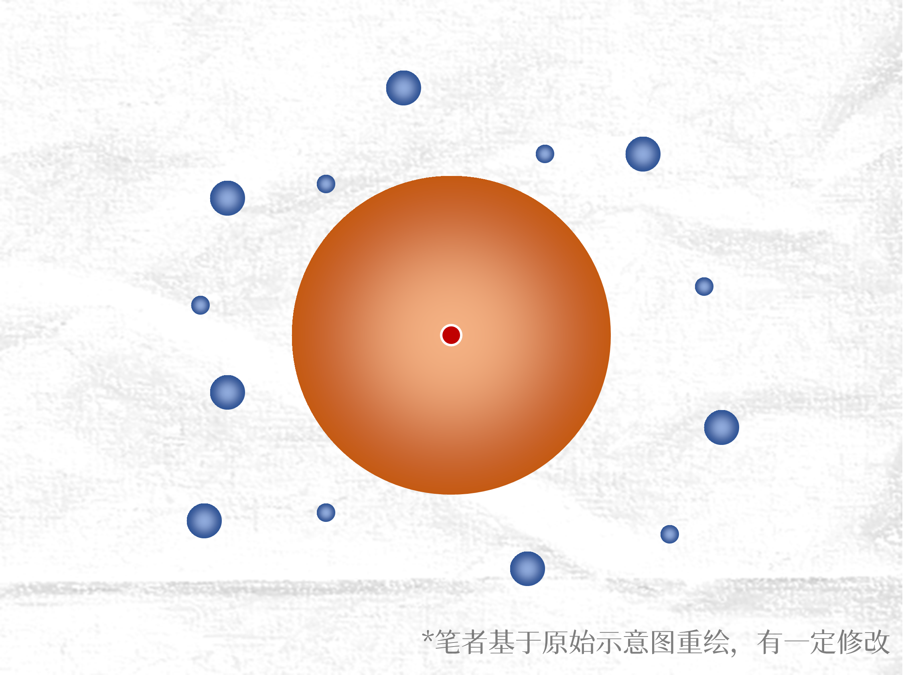
>
> **橙色圆代表舆论场，矛盾的核心，最活跃的地方。在舆论场外，有一些我画的笔画，他们是私人的、小组的那种讨论。白色是普罗大众，他们存在，但是没有对这个话题发生反应。**
>
> 我总是第一时间关注舆论场，可能是因为这个橙色圆是最活跃的、最大的、最显眼的，同时也是最混沌、最复杂、最情绪化和不理智的；白色的大众对这件事情可能根本不知道，他们虽然存在，但对这个话题来说有点像不存在。他们加入话题的话，可能也是把舆论场里面的那些已有的结论搬出来。小众的笔画有可能存在理性的探讨。
>
> 我觉得比较悲观的点可能在于，橙色舆论场热闹但是混沌，白色的空间安宁但是冷漠（并不怎么参与这个话题的讨论）。
>
> **伏枥：**<mbr>我可能会完善一下： **橙色圆有一个圆心，代表矛盾最开始的出发点**，圆心本身很小。当舆论场的半径变大，后参与的人将离矛盾核心越远，也离真实的情况越远。他们参与舆论场看到的内容更多是某种符号式的省流、切片、断章取义、抽象。这可能是造成舆论场混沌的根本原因。
>
> ---
>
> **W 君：**<mbr>如果没有周围笔画的存在，理性对话可能真的没意义了。
>
> **伏枥：**<mbr>确实如此。关于冷漠，我认为还有一点是：周围的小范围对象即使参与讨论，也是独立的讨论，并不抱有过多扭转整体舆论风向的倾向。最终理性的更理性，不理性的更不理性。
>
> **W 君：**<mbr>你这样一说我察觉到我的绝望也来自于，这种疯狂的舆论场是无法像错题集一样被改正的。它只是任性的发展，顽固地存在，最后留下一地狼藉。然后，几乎是每个话题，都是这样，没有通过辩论得出正确或者逼近正确的答案，只有争论留下来的残骸，像一大片太空垃圾漂浮在宇宙中。
>
> **伏枥：**<mbr>而且很难罪咎到底是谁的责任。是事态中心的主人公本身吗？是大环境吗？是简中互联网的特点吗？是中国人高语境文化置身于低语境场景的无能吗？难以得出一个精准的对象，进而无法从根本上解决。可能理性讨论真的只能小范围享受吧。
>
> **W 君：**<mbr>我觉得西方应该也是差不多吧。
>
> 我们必须放弃参与核心的主流的舆论场，才有可能进行理性对话。我们只能作壁上观，看着舆论场里的火越烧越旺，希望不要烧到自己身上，而做不了什么事情。而当有一天，我们真的不可避免地成为舆论场的起火点的话……世界会变好吗？
>
> **伏枥：**<mbr>我在想，也许离我们更近的是：**当舆论场的疯狂不断的毁灭我们所喜爱的事物，我们还能做什么？**

## ☨ · 探针 Probe

### 一个有趣的架空 IP 世界


Floor 796，W 君推荐的一个特别的网站。这个网站融合了各种 IP 的形象，信息量巨大，包括各种中西方著名 IP 作品、迷因图，还有很多可交互的彩蛋。于 2021 年开始至今，项目仅由一人作为兴趣独立完成。网站极繁主义的绘画风格让我想到小时候读过的绘本 *Where's Waldo?*

> 🔗 *Link:* [Floor796](https://floor796.com/)

### 一个推动重建中文排版的专栏

经营本站时，我是作者同时也是自己的读者，虽然内容不一定有多好，但注重阅读体验，至少能一定程度上彰显我对此有所追求的态度。

就拿行文举例：

- 中文和 English 混排，我坚持在其间增加一个空格，用 [「盘古之白」](https://github.com/vinta/pangu.js) 劈开全角和半角之间的混沌。其他具体的实践基本遵循 [中文字体排版指北](https://github.com/sparanoid/chinese-copywriting-guidelines/blob/master/README.md)；

- 永远使用「直角引号」代替“弯引号”。我知道这是 [一件吵了100多年的小事](https://www.bilibili.com/video/BV1GY411E7Jr/)（六蛋老师的这个视频考据了「直角引号」和「弯引号」实际都是舶来品，在正统性上二者并无过多高下之分），但对此我有我坚持的理由：

  **其一**，中英文的引号占用了同样的 Unicode 码位，使用全宽还是半宽显示完全由字体本身决定。

  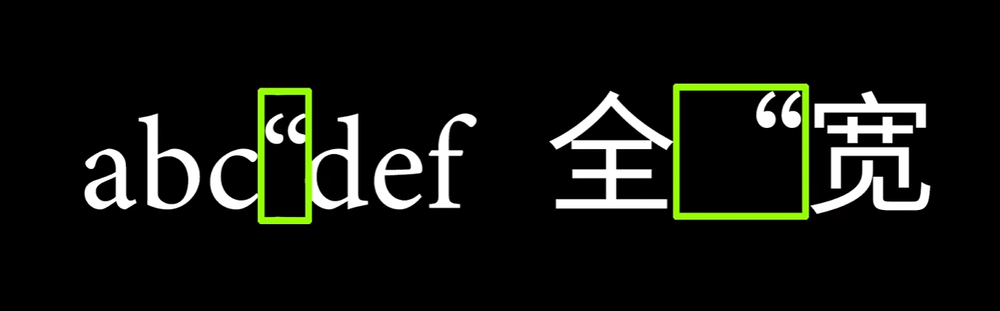

  而在现今几乎所有的网络媒介下，引号倾向于先匹配英文字形，否则才会 fallback 到中文字形。在一切使用弯引号的场合，这种全半角混乱的现象已经到了泛滥的地步。

  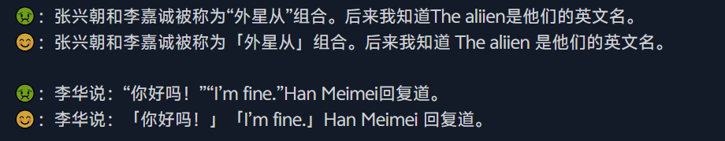

  **其二**，除了中西标点混用导致观感的丑陋，弯引号在包括但不限于 Windows 的默认字体下，极难通过肉眼区分前后。

  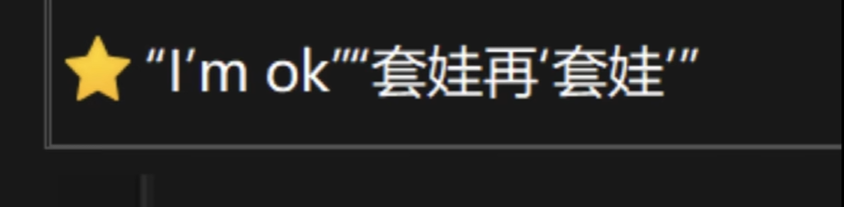

  取弯或直姑且可以看作是个人审美取向的选择，但引号的前后混用绝对 100% 可以鉴定为错误了。

  **其三**，中文是方块字，直角引号看起来一体性更强，也更醒目。我认为相比弯引号，它能更好的履行引号应有的职能。

> 🔗 *References:* 
>
> - [一件吵了100多年的小事…… - B 站丨oooooohmygosh](https://www.bilibili.com/video/BV1GY411E7Jr/)
> - [「直角引号」是用来装X的吗？ - B 站丨oooooohmygosh](https://www.bilibili.com/video/BV1wd4y1T73v/)
> - [不入流的文体｜关于「盘古之白」和「直角引号」 | ed](https://eddy.lu/posts/pangu/)

---

引号可能是对阅读观感影响最大的标点符号之一，但除此之外，大小各异的间隔号、长度各异的减号与连字符同样是重灾区。不止是标点符号，段落的排版、缩进的配合，基本各家也有着各家的使用习惯。

印刷术作为中国四大发明之一，从兴起到式微，见证了中文字体排印源远流长的历史。然而在中文排版「告别铅与火，走向光与电」的今天，却鲜少找到能系统讲解中文排版的学习资料。在搜寻各种关于中文排印的资料过程中，我找到了这个系列专栏。

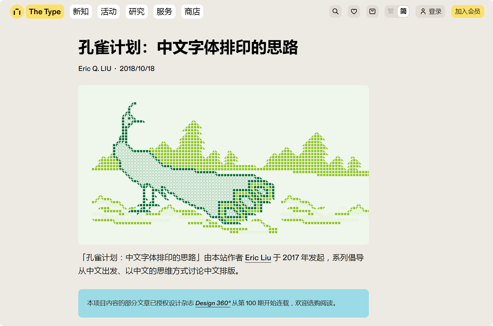

> 「孔雀计划：中文字体排印的思路」由作者 [Eric Liu](https://www.thetype.com/author/ericliu/) 于 2017 年发起，系列倡导从中文出发、以中文的思维方式讨论中文排版。

这个专栏始终从中文排印的角度，专业、严谨、全面的，从标点符号的规范谈到行与段的对齐缩进，乃至中西混排的区别与汉语拼音的规范。我认为尤其难得可贵的是，这个专栏并没有困在浩如烟海的大部头和典籍之中，而是提供了非常多在电子媒介时代仍然具有实践指导意义的视角。

> 🔗 *Link:* [The Type — 孔雀计划：中文字体排印的思路](https://www.thetype.com/kongque/)

### 两部以医护人员为主体的作品

#### 游戏《节奏医生 Rhythm Doctor》

| Steam 评测：好评如潮 | 个人评分：⭐⭐⭐⭐⭐ |
| -------------------- | --------------- |


> 
>
> 用一个按键拯救病苦疾患！
>
> 在《节奏医生》的世界中，随着心跳的节拍为病人心脏除颤能够产生神奇的医疗效果。作为医生，只需抓住完美时机在音乐第七拍处按下空格键。
>
> - 超过20个精心打造的关卡，包含丰富的剧情元素。
> - 每一关都循序渐进地引入音乐机制，让玩家易于掌握并享受成长的快乐。
> - 在包罗万象的故事线中，穿插上演医生和患者的精彩演出。
>
> 🛒 *Link:* [Rhythm Doctor - Steam](https://store.steampowered.com/app/774181/Rhythm_Doctor/)

用 Steam 评论区一个高赞玩家的话来说「**这是节奏游戏难以逾越的一座高山**」。

最初遇见这款游戏是五年前，那时我应该还在初三。在午休的教室打开 [逍遥散人的实况]()，一下子就被这款有着演出异常精彩的单键音游打动。不知不觉一个中午过去，上课铃打响，大脑仍然在回荡其中 Boss 关卡的 OST《All The Time 咖啡之歌》以及《One Shift More 轮班之歌》。

除了演出和剧情的适配度之高，尤其惊喜的是它的本地化。大部分的英文曲目被翻译为信达雅且完全适配音律节奏的中文版本，制作了专门的中文配音。本地化优秀到很大一部分人认为中文版的歌曲甚至优于原版，还有人直到通关都没有意识到这是来自国外的游戏。

今年十二月，时隔十三年（游戏试玩版发布于 2012 年），正式版终于上线。新增的关卡保持了一以贯之的优秀水准，演出效果更上一层楼。截至发布时冬促应该还没有结束，强烈推荐。

#### 电影《夜班 Heldin》

| 豆瓣评分：8.4 | 个人评分：⭐⭐⭐⭐ |
| ------------- | -------------- |

喜欢《节奏医生》除了演出和本地化之外，剧情也是很重要的原因。如果说这款游戏将医务工作者的困境——工作生活失衡、政策的压力、病人的误解等等——用了一种艺术化、童话化的方式来温和表达，《夜班》这部电影则用更加现实主义的锋利笔法白描出了医生（或者说护士、护工）危机四起、特殊而又平凡的一天。它没有类型片精美跌宕的剧本结构，但足以称作一部洞察真实且深刻的「生活流纪实电影」。

> 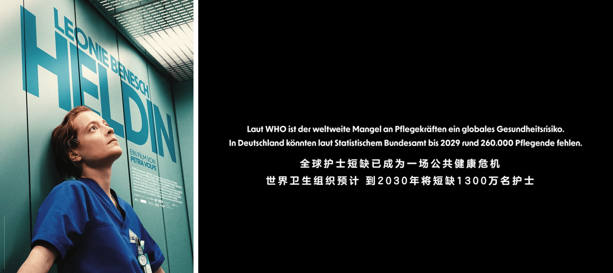
>
> 在瑞士一家医院的外科病房工作的 Floria（Leonie Benesch 饰）是一位充满热情与专业精神的外科护理师。她技术娴熟，即使在压力巨大的情况下也总能耐心倾听每一位病人的需求，在紧急情况下，她总能迅速到场——理想状态下是如此。然而现实情况中这份工作常常难以预料，情况远没有那么理想。
>
> 这一天，Floria 开始了她的晚班，但在这个床位已满、人手紧缺的病房里一位同事突然因故缺勤。尽管工作繁忙，她仍尽心照顾着一位重病的母亲（Lale Yavas 饰）和一位焦急等待诊断的老人（Urs Bihler 饰），同样细致周到地应对着那位私人病人（Jürg Plüss 饰）的各种额外要求。
>
> 然而，一场致命的错误悄然发生，让整个值班陷入混乱。一场与时间赛跑的紧张之旅由此开始。
>
> 🔗 *References:* [夜班 - 豆瓣](https://movie.douban.com/subject/36752929/)

如果归纳这两部作品的共同点，可能都将一个比较宏大的、系统性的困境落脚到了一个来自具体个体的、更容易共情的小切口。平凡人的伟大，正是彰显于每一个具有人性光辉的微小瞬间。

## ❏ · 快照 Quote

### Markdown 中失效的强调符号

前文讲到了我对直角引号的追求，实际上发掘出这个选题的开端是，我发现在 Markdown 中紧邻**引号、冒号前后**出现的**强调符号**有时会失效（Typora 本地会正确显示，但是上传到 GitHub 和博客网站的时候就会出现不渲染的问题。这个问题在生成式 AI 的回答中也非常常见），我尝试搞清楚背后的原因。

:::NOTE[强调符号失效的例子]

**比如：**这就是一个强调不起作用的段落，常见于各种大模型的中文回答中。

此外，当正文中出现**「这样」**的强调也会不起作用。但「**这样**」的就可以。

目前，我通过在<mbr>**「不起作用的强调符号」**<mbr>前后增加自定义标签 `<mbr>` 来迂回处理。标签本身不会造成任何实际效果，但能够使得强调符号被正确解析。

```就像这样
我通过在<mbr>**「不起作用的强调符号」**<mbr>前后增加自定义标签……
```

:::

根据 Markdown 的原始规范 CommonMark 文档，我们知道 Markdown 识别 `**` 能否加粗，靠的是一套复杂的「侧翼」规则。

> *A [left-flanking delimiter run](https://spec.commonmark.org/0.31.2/#left-flanking-delimiter-run) is a [delimiter run](https://spec.commonmark.org/0.31.2/#delimiter-run) that is (1) not followed by [Unicode whitespace](https://spec.commonmark.org/0.31.2/#unicode-whitespace), and either (2a) not followed by a [Unicode punctuation character](https://spec.commonmark.org/0.31.2/#unicode-punctuation-character), or (2b) followed by a [Unicode punctuation character](https://spec.commonmark.org/0.31.2/#unicode-punctuation-character) and preceded by [Unicode whitespace](https://spec.commonmark.org/0.31.2/#unicode-whitespace) or a [Unicode punctuation character](https://spec.commonmark.org/0.31.2/#unicode-punctuation-character). For purposes of this definition, the beginning and the end of the line count as Unicode whitespace.*
>
> *A [right-flanking delimiter run](https://spec.commonmark.org/0.31.2/#right-flanking-delimiter-run) is a [delimiter run](https://spec.commonmark.org/0.31.2/#delimiter-run) that is (1) not preceded by [Unicode whitespace](https://spec.commonmark.org/0.31.2/#unicode-whitespace), and either (2a) not preceded by a [Unicode punctuation character](https://spec.commonmark.org/0.31.2/#unicode-punctuation-character), or (2b) preceded by a [Unicode punctuation character](https://spec.commonmark.org/0.31.2/#unicode-punctuation-character) and followed by [Unicode whitespace](https://spec.commonmark.org/0.31.2/#unicode-whitespace) or a [Unicode punctuation character](https://spec.commonmark.org/0.31.2/#unicode-punctuation-character). For purposes of this definition, the beginning and the end of the line count as Unicode whitespace.*

左侧侧翼（Left-Flanking）是开启加粗的判定规则，必须满足：

- 后面**不能**跟着空格。
- 如果后面跟着标点符号，那么它的前面必须是空格或行的开头。

右侧侧翼（Right-Flanking）：结束加粗的判定规则，必须满足：

- 前面**不能**跟着空格。
- 如果前面跟着标点符号，那么它的后面必须是空格或行的结尾。

而这里的「标点符号」并非仅指英文标点。 CommonMark 明确指出其定义的标点符号涵盖了 **Unicode 全部的 Punctuation 类别**。

可见，中文习惯在标点前后不留空格，CommonMark 而是基于英文「空格分词」逻辑设计的。这种设计初衷是为了防止文本中（如公式、代码命名）出现的星号被误认为排版指令，但在中文语境下却成了障碍。

> 🔗 *Reference:* [CommonMark Spec - 6.2 Emphasis and strong emphasis](https://spec.commonmark.org/0.31.2/#emphasis-and-strong-emphasis)

### 关于引号的其他有趣事实

> 德文的引号别具一格，左引号看起来像特殊的逗号；
>
> - 例：Vater sagt: „Machen wir eine Pause.“
>
> 俄语、法语、西班牙语等语言采用角形引号，后来演化为汉语的书名号；
>
> - 例：«Beispiel in der Schweiz»
>
> 日语习惯使用引号来当做书名号
>
> - 例：『稲亭物怪録』
>
> 🔗 *References:* 
>
> - [引号 - 维基百科，自由的百科全书](https://zh.wikipedia.org/wiki/引号)
> - [Requirements for Chinese Text Layout - 中文排版需求](https://w3c.github.io/clreq/)

### 「全角/半角」的「角」为什么用来指代字宽

> 「全角/半角」的「角」又是从何而来呢？显然，这不是指牛角的「角」，也不是指「角度」的「角」。如果我们继续挖掘，会发现这两个词可能都不是中文，而是源自同样使用汉字的邻邦——日本。
>
> 翻开日文词典《大辞林》，「<ruby><rb>角</rb><rt>かく</rt></ruby>」作为名词有八项释义，第一项就是「四角。方形。或者四角的样子。」而「角度」这一含义放到了后面；与此对比，在《现代汉语词典（第六版）》里「<ruby><rb>角</rb><rt>jiǎo</rt></ruby>」虽然也有八项释义，却没有一项是「四角」「正方形」的意思。由于在日本「角」是正方形，因此「全角/半角」就是「整个正方形/半个正方形」的意思，既通俗易懂，也是日本人在活字排版中对相应尺寸铅字的称呼。
>
> 🔗 *Link:* [The Type — 文字 / 设计 / 文化 — 全角半角碎碎念](https://www.thetype.com/2018/02/14211/)

### 「睡」与「觉」是如何演化成「睡觉」的

> 根据《说文解字》的解释，「睡，坐寐也。从目，垂。」从字形结构来看，形象地描绘了人在打瞌睡时眼皮下垂的状态。这种坐姿睡眠的特殊含义，与我们今天理解的「睡觉」概念存在显著差异。
>
> 而「觉」的意思更与现在完全不同。《说文解字》中说：「觉，寤也。从见，学省声。一曰发也」。这里的「寤」就是睡醒的意思，说明「觉」字的本义是「睡醒」。
>
> 这样看来，「睡」字从某种特定的睡眠姿势随着词义的扩大化泛指到一切睡眠，而「觉」从本意「睡醒」到嵌入「睡觉」一词中形容「进入睡眠状态」，更是指向了与本意完全相反的方向。这样的变化是如何产生的呢？
>
> 在古汉语中，「睡」与「觉」的组合最初是一种动补结构，表达「睡醒」的意思。这种组合形式最早出现在中古时期的汉译佛经中，如「彼时迦蓝浮王睡觉，不见诸妇人」。在这一阶段，「睡觉」是一个动补词组，「睡」是动作，「觉」是动作的结果，表示从睡眠状态中醒来。
>
> 唐代诗人白居易的作品中，保存了大量「睡觉」作为「睡醒」义使用的例证。
>
> - 云鬓半偏新睡觉，花冠不整下堂来（白居易《长恨歌》）
> - 睡觉心空思想尽，近来乡梦不多成（白居易《早兴》）
>
> 来到是宋代，「觉」的新义开始萌芽。在这一时期，「觉」开始在特定语境下表示「一次睡眠」的意思，比如「眠一觉」。这种用法的出现，为「睡觉」的语义转换埋下了伏笔。
>
> - 卯饮一杯眠一觉，世间何事不悠悠（白居易《卯饮》）
>
> 其次是元代的过渡阶段。学者们推测，表「睡眠」义的「睡觉」可能在元代开始成词，但明中叶以后才普遍行用。在这一时期，「睡觉」的含义开始出现模糊和歧义，既可以理解为「睡醒」，也可以理解为「睡眠」。
>
> 最后是明代的完成阶段。根据统计，成书于明嘉靖、万历年间的《西游记》全书共有「睡」「觉」合用例 39 处，其中有 38 处表示「睡眠」义。这一数据充分说明，到了明代中叶，「睡觉」的语义转换已经基本完成，「睡眠」 义成为其主要含义。

### 「叶」为什么有年代、时期的意思

> 我们常常会读到「初叶」「中叶」「末叶」这样的表述，比如「唐朝初叶」「二十世纪中叶」等等。这里的「叶」，其实就是「时期、年代」的意思。
>
> 那么问题来了：「叶」为什么会有「时期、年代」的含义呢？
>
> 「<ruby><rb>叶</rb><rt>yè</rt></ruby>」的繁体字写作「葉」，而「葉」字初文为「枼」，并没有草字头。「木」即树，上面的「世」则是象形部分，描摹的是树叶的形状。
>
> 「世」与「枼」是同源字。就目前所见，「世」出现较早，「枼」出现较晚。篆文「枼」上树叶后演变为「世」，「葉」的「年代、时期」日益普遍。大家可以参看「枼」字最初的样子。
>
> 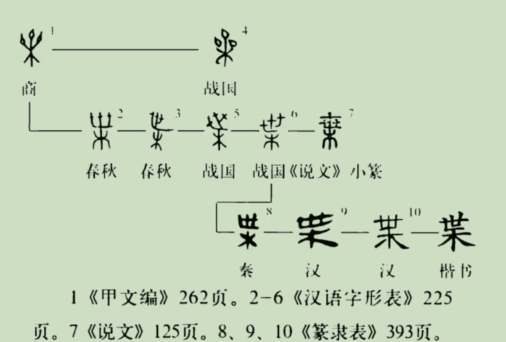
>
> 王孙遗者钟「枼万孙子」、邻王子钟「万枼鼓之」中的「枼」都是「世」的意思。因此，「叶」之所以可以表「时代」，可以追溯到其早期与「世」的同源关系。当然，人类繁衍如树叶散布，或许也推动了这一点。
>
> 🔗 *Link:* [“叶”为什么有“年代、时期”的意思？ - 小红书丨小叶栀子爱文史]( http://xhslink.com/o/5Eti8ZKekze )

> **樱前线无异常：**<mbr>所以日本的万叶集和万叶假名也是这个意思吗？
>
> **宝：**<mbr>对，万叶集中「叶」读作 you，而世界的世单拿出来的发音叫做 yo，二者同源意思应该一样的。还有一个佐证，君之代的代字的发音，也是 yo，就是时代的意思，可见万叶集的确可以理解成万世集。

### 得到快乐的奥秘

> 多种激素影响我们的快乐感受：多巴胺、内啡肽、催产素与血清素。
>
> - **多巴胺**：欲望激素，能带来短暂愉悦。当你有特别强烈的欲望去完成某件事情、做出某种行为时，你的大脑就会分泌大量多巴胺，驱使你继续追求欲望，并在这个过程中带来快乐和满足。
> - **血清素**：情绪调节剂，能帮人放松心情、缓解焦虑、抵抗悲伤。虽然血清素不生产快乐感本身，但它控制了能不能感受到快乐的那个**闸门**。血清素会影响⼈的胃口、内驱力（食欲、睡眠、性）以及情绪。
> - **内啡肽**：疼痛激素，容易在体育运动中分泌，有着「愉快的荷尔蒙」的称号。内啡肽是一种补偿机制，可以帮你隐藏身体的痛苦，让你坚持完成某个任务（比如跑步、健身后的让你能够坚持下去）。奋斗之后的快乐，自律后的愉悦，很多都是源自内啡肽的作用。
> - **催产素**：爱的激素，可以抑制负面情绪，降低防御和恐惧的感受，增进我们对他人的信任。催产素是人与人之间亲密的关系的起源，恋人们之所以会渴望拥抱亲吻与性爱正是由于催产素在起作用。另外，催产素在母亲喂乳时也会产生。
>
> 四种物质中，内啡肽带来的快乐最持久、最真实、最有意义，但同时它也最需要付出努力。
>
> 🔗 *Link:* [多巴胺，内啡肽，血清素，催产素（四大快乐激素详解） - 知乎](https://zhuanlan.zhihu.com/p/521620066)

### 为什么慢门会让照片变成星芒

> 光的衍射指的是光在传播过程中，遇到障碍物或小孔时，产生偏离直线传播的现象。
>
> 星芒就是光的衍射的一种体现，具体来说，**点光源发出的光线通过镜头光圈时，被光圈叶片边缘衍射，衍射光相互干涉，从而形成明暗相间的辐射状图案**。由于衍射在小光圈下更明显，星芒在小光圈下更容易出现。
>
> 那么问题来了，衍射不是扩散状么，为什么会变成星芒，这是因为控制通光孔径的是光圈结构。光圈是由数个叶片组成，理想的小孔可以理解为一个标准的圆形，但光圈显然很难做到标准圆，基本都会呈规则（或不规则）多边形，而衍射会以多边形的边（对于标准圆来说就是无数条切线）作垂线，形成以下的形态：
>
> 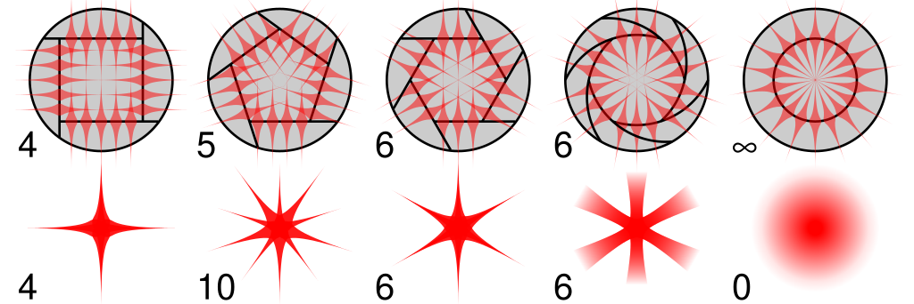
>
> 影响星芒的几个要素
>
> - **光源类型**：强光源。最好是点状强点光源或近似点光源例如：夜景中的路灯、 逆光中的水波反射等，光线比较强烈和稳定。
> - **光圈大小**：小光圈。星芒的锐利度和强度与光圈孔径成反比。小光圈（大 f 值，如 f/11、f/22 及以上）光圈孔径小，叶片边缘对光线的约束作用更强，衍射效应更显著，干涉形成的星芒射线更锐利、更长。
> - **光圈形状**：光圈的物理形状由叶片数量和排列方式决定。光的衍射特性决定了星芒的条数必定是偶数出现的，对于奇数叶片，星芒角数为光圈叶片的两倍（如上方的 5 片光圈叶出现 10 星芒）；而对于偶数叶片，由于逐边平行对称，星芒角数与光圈叶片数目一致。
> - **其他因素**：镜头焦距越短越容易出现星芒；如果是强光源且面积较大（如太阳），利用前景半遮半挡更容易出现星芒。
>
> 🔗 *Link:* 
>
> - [File:Comparison aperture diffraction spikes.svg - Wikimedia Commons](https://commons.wikimedia.org/wiki/File:Comparison_aperture_diffraction_spikes.svg)
> - [炫酷的星芒效果，如何拍？一篇长文教会你星芒的拍摄 - 知乎](https://zhuanlan.zhihu.com/p/145729953)

## ✲ · 脉冲 Spark

### 切片 四之一


第一份新年礼物来自很会写诗的醒过（序言引用的那句短诗也摘选于他）。他用自己的诗集做成了 2026 年的月历，配图甚至选用了一些我之前分享给他的摄影作品。

收到他留言「在每个清晨新生，保持故我」的贺卡之时，书桌上当天日历的题词正是「忌推翻自己」。

### 切片 四之二

未来文章选题：《于是，我又重新打开了 Minecraft》。


在深夜酣战的时候突然发现箱子的皮肤变成了圣诞节的款式，这才意识到原来当天正是平安夜。

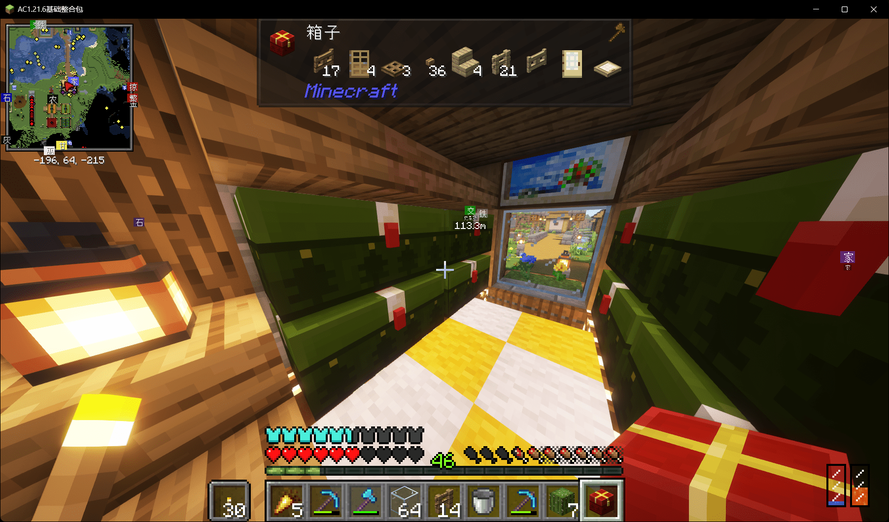

### 切片 四之三

抓好朋友 Z 君和 G 君陪我参加了《喜人奇妙夜 2》外星从的线下活动（周五在全家门店买酒，送冰杯和签名杯套）。


坐在店里的时候偶遇一位喜人全肯定的小姐姐，被超自然搭话于是借着微醺的酒劲从八仙子到五花八们突突突大聊特聊一小时……E 人和 E 人的化学反应，或将成为我年度奇妙际遇🤯

### 切片 四之四

最后，祝大家新年快乐！

<mbr>
