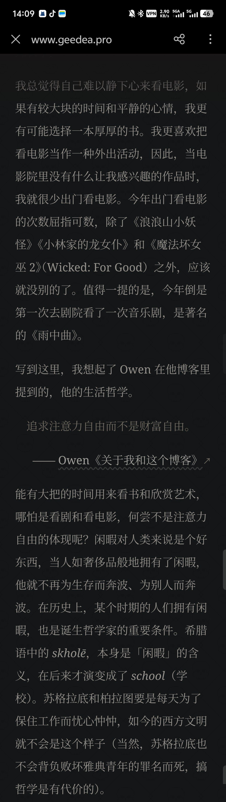
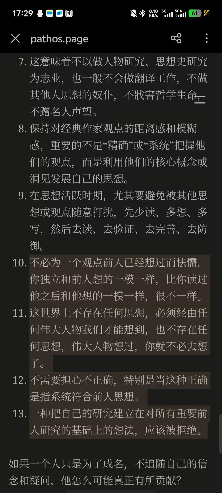
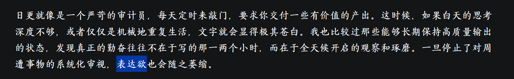
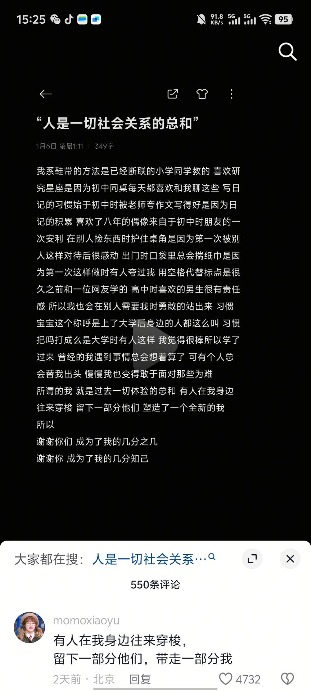
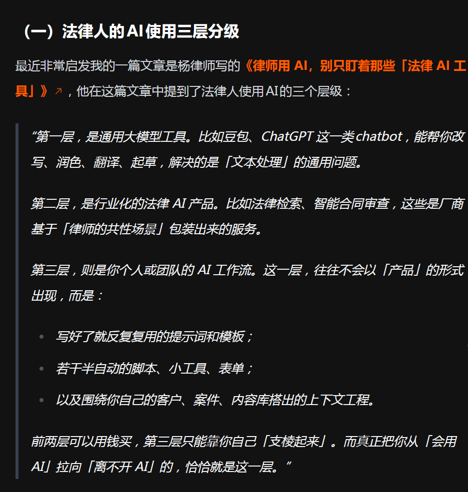
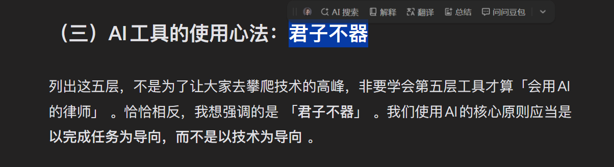
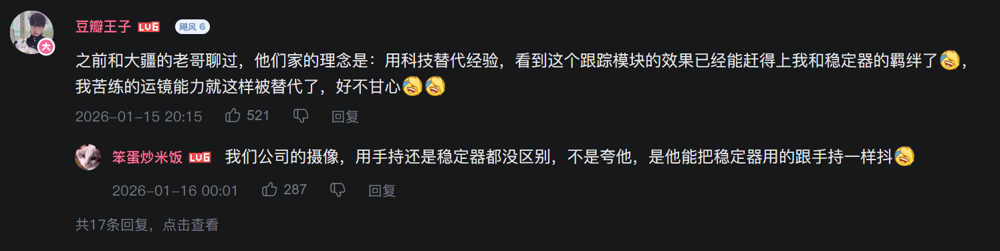
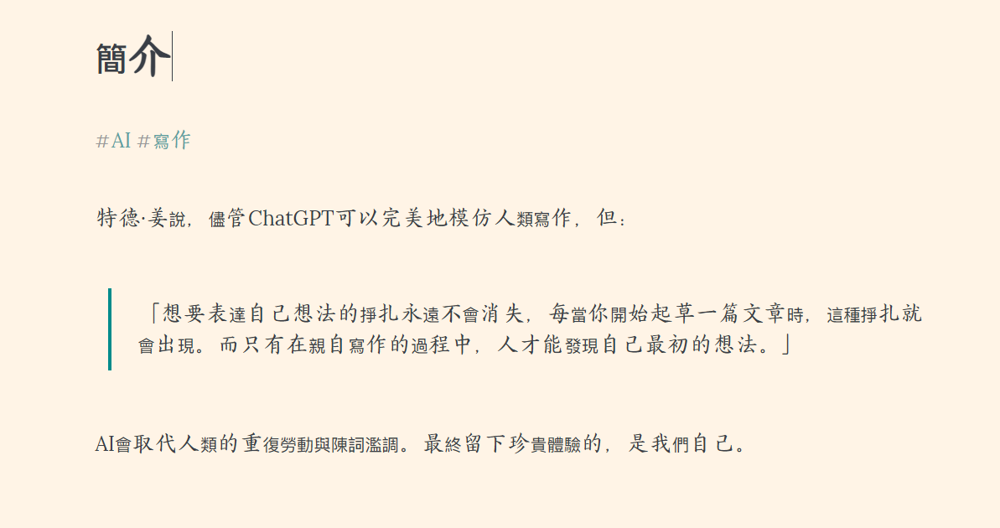
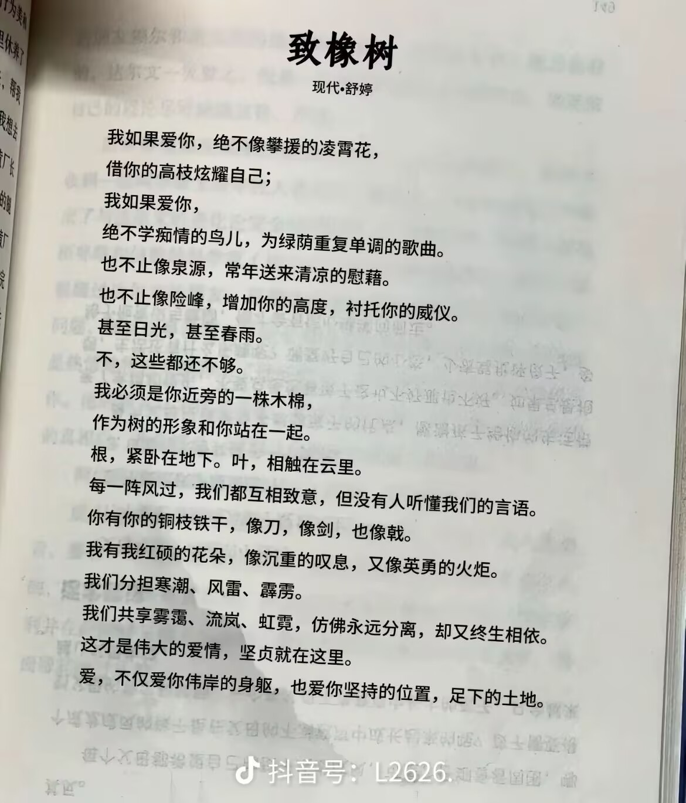

欢迎来到二〇二六年的第一期月刊。

最近忙着与现生 a bunch of bullshit 对抗，本期发布的比以往晚了一些。敲下这一行文字时，我正穿着松垮的 T 恤和短裤。23°C 的夕阳透过阳台的落地窗，斜斜的打亮昏暗的房间。

这是我回到海口住处的第六天。六天前，上海初雪。

**你所在的城市下雪了吗？**

## ◈ · 断点 Track

### 我们如此对抗时间

#### 油墨是永恒的温度


#### 信函是未知的浪漫


```
信件无法以多个对象为目标，但也不是双向的，总会产生时间差。
而且也无法指定收信人在何时、怎样的情况下去读。
一旦离手，就不能撤销或修改。
要求寄信人与收信人共有同样的时间和状况是不可能的。
充满误传和误解的麻烦媒介，这就是信。
正因如此，我才想在这个时代重申信件的重要性。
因为信件是单向的，所以写信者和收信者才能够达成共识。
也就是说，互相写信是对同理心、想象力的一种补充。
 ———— 小岛秀夫《创作的基因》
```

[alan-one@ENCOM](https://alanone.top/encom-os/)

#### 胶片是延迟的礼物


### 他们如此外化热爱

#### 十二海里编辑部


#### Agua señorita café


### 网站建设快报

月刊的一些小惯例。

最大的更新是**摄影作品页面**的上线，设在一级分类[「光影」](https://leehenry.top/gallery/)之下。这里是对 [年终总结](https://leehenry.top/posts/moment_memos/mms-vol06/#q6-是否发展了一些个人副业或长期兴趣项目目前的进展与收获如何) 的回应，遴选了整个 2025 年拍摄的一些「作品」陈列于此。暂时粗略的分为四大类：

- 人像：特写 · 眉间心上
- 风光：沧海 · 大塊假我
- 人文：阡陌 · 人间烟火
- 静物：物语 · 惟石能言


该页面仍在建设中，可以保证基础的访问。由于目前图片全部存储于服务器上，而图片体量较大、服务器带宽有限，有概率会出现加载问题。正在寻找更好的技术方案，同时在考虑时间地址、曝光参数、使用设备等信息的展示方式。

其他的是一些相对更「润物无声」的改动。

**友链卡片**。随着这里被更多人看到，友链的脚印也渐渐变多。我删除了第三行的网址，调整了头像的大小，整体看起来更规整紧缩了。在同样的显示比例下，现在可以看到更多的朋友 :)。


**阅读指示**。受到友链博友 [路明](https://luming.cool/) 和 [千绪](https://ttio.cc/) 的启发，为「回到顶部」按钮增加了一个用来指示阅读进度的标识。轮廓线会随着文章正文的滚动而增长，卒读后完全闭合。


**图片加载**。网站各处的图片资源现在加载的过程中不再闪现出现，多了一个淡入的动画。网站的访问体验更优雅了。

**评论表情**。通过自建表情 JSON，大大丰富了 Twikoo 评论系统中 Emoji 和颜文字的类别与数量，并增加了一些 Weibo、2233 和 Alu 的表情包~ 欢迎 [试试看](https://leehenry.top/guestbook/)！

对了，现

## ↯ · 信号 Flash

### 安溥 & 张悬 ·潮水与箴言


### 用哲学家的方式生活





## ☨ · 探针 Probe

### 这个月听了一些歌

为什么以专辑为单位听歌？

---

#### 《神的游戏》《9522》 · 张悬


#### 《纯妹妹》· 单依纯


#### 《跟着感觉走》· 张震岳


### 微电影《春晖》


https://blog.solazy.me/20260116/

关于表达欲


https://mp.weixin.qq.com/s/xGzA3edKRqPkQYFw0BtsQA


## ❏ · 快照 Quote

### 人是一切社会关系的总和

马克思在1845年春撰写的《关于费尔巴哈的提纲》第六条中写道：“人的本质不是单个人所固有的抽象物，在其现实性上，它是一切社会关系的总和”



### 文字在阅读中完整

艾布拉姆斯 文学四要素

### 去做 AI/LLM 主人还是奴仆

https://polebug.github.io/2026/01/18/plog_2025/
关于ai的思考



https://sspai.com/post/104638





关于 AI 辅助写作
https://www.geedea.pro/posts/weekly/62/

LLM 可以写出平均的「好」，但写不出真实的「坏」，更何况，LLM 生成的内容也逃离不了幻觉、错误，写出来的文章也绝非完美（写文章根本没有完美这一说！）。

https://axi404.top/blog/advise-epilogue-1
vibe

https://writee.org/atzoeash/jian-jie



### 横向镜头与纵向镜头、广角与长焦

【《无可奈何》调皮分镜设计原理】 https://www.bilibili.com/video/BV17GkeBhEvw/?share_source=copy_web&vd_source=13124edee9a4b745937af2c37bdad50c

横向镜头和纵向镜头，广角和长焦，3:42

### uppercase 与 lowercase 的起源

为什么711就用n小写？ http://xhslink.com/o/4TqXHXUcixR 
复制后打开【小红书】查看笔记！

upper case和lower case

### 关于爱与亲密关系




## ✲ · 脉冲 Spark

### 一之一

可爱小朋友


<mbr>
