欢迎来到二〇二六年的第一期月刊。

最近忙着与现生 a bunch of bullshit 对抗，加之有太多话题想写，本期发布的比以往晚了一些。陆陆续续写了三天，写到一半把游记宕开一笔单独成文。敲下这一行文字时，我正穿着松垮的 T 恤和短裤。23℃ 的夕阳透过阳台的纱窗，斜斜的打亮了昏暗的房间。

这是我回到海口住处的第七天。七天前，[上海初雪](https://leehenry.top/posts/moment_memos/mms-vol07/)。

**你所在的城市下雪了吗？**

## ◈ · 断点 Track

### 我们如此对抗时间

#### 油墨是永恒的温度

印刷制品与笔痕墨迹，似乎比数据流更能代表永恒。网站会关闭，数据会失效，在某个互联网角落留下的电子碎片会轻易佚失。而中学毕业时，曾经朋友们留给我的明信片与手写寄语，直到现在仍然静静居于书架一角，妥帖安放。

现在的我，对印刷与手写似乎有了更浓厚的感情。它代表一段物化定型的时间，一种不被数据量化的温度。

向我珍视的朋友们寄出明信片，成为我现在年末的固定项目。这次当我向朋友询问起地址，他的一个提议让我眼前一亮：

> 诶，是准备寄来你的摄影作品集吗？

OMG，我怎么就没想到呢，多么美妙而天才的搭配！

为了能赶在离开上海前把明信片寄出，彼时的我充满了少见的执行力。从过去一年数以千计的底片中遴选出 36 张、设计卡片样式、对比纸张参数、挑选印刷店铺，最后，在当晚凌晨一点提交了定制请求。

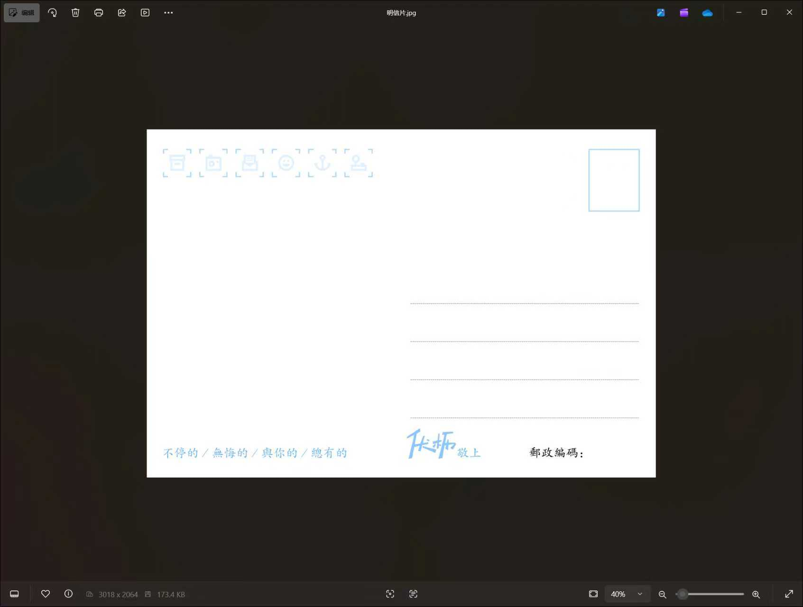

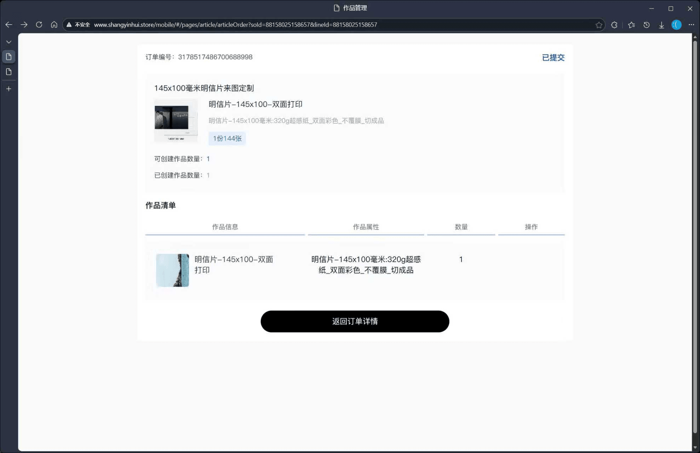

从下单至到手，仅用三日。

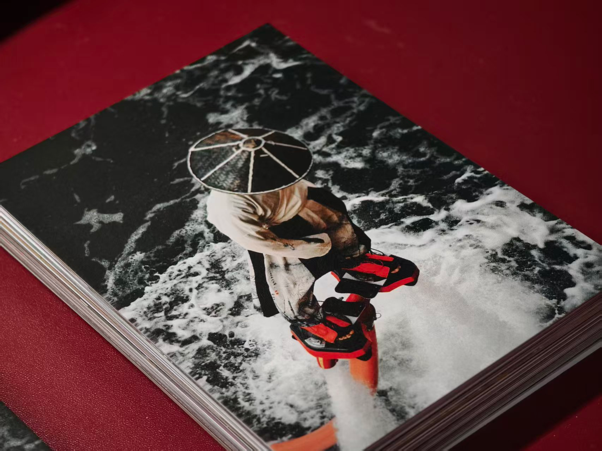

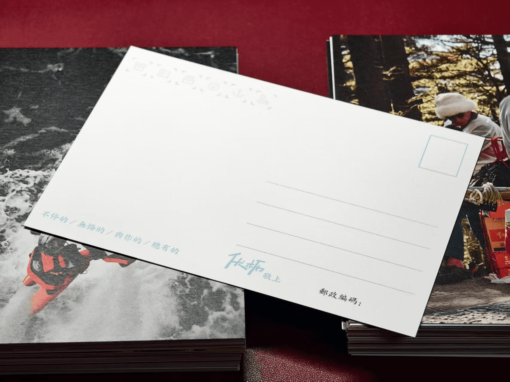

亲自抚摸到相片的感受，是任何高保真显示屏无法比拟的。当触碰到喷涂的颜色，过去一年那些为之心跳的人和事被凝固下来，再次被现在的我真实感知。

#### 信函是未知的幸福

信函，现今好像已经成为旧时代的象征。当我们诉诸这种形式时，我们在期待什么？

刚好前段时间在友链博友 [alan-one](https://alanone.top/encom-os/) 的主页看到这样一句话：

> 

>  信件无法以多个对象为目标，但也不是双向的，总会产生时间差。
>   
>  而且也无法指定收信人在何时、怎样的情况下去读。
>   
>  一旦离手，就不能撤销或修改。
>   
>  要求寄信人与收信人共有同样的时间和状况是不可能的。
>   
>  充满误传和误解的麻烦媒介，这就是信。
>   
>  正因如此，我才想在这个时代重申信件的重要性。
>   
>  因为信件是单向的，所以写信者和收信者才能够达成共识。
>   
>  也就是说，互相写信是对同理心、想象力的一种补充。
> 

> 

>  —— 小岛秀夫《创作的基因》
> 

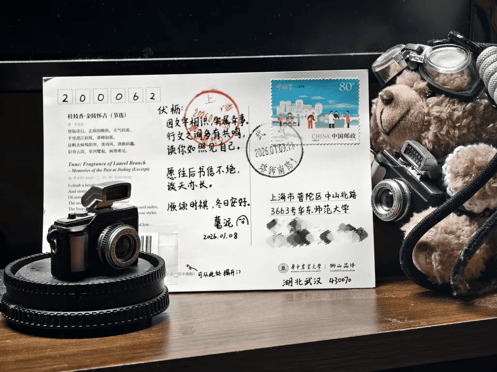

构思信函上应该写下什么的时候是幸福的，一笔一划写下文字后贴好邮票是幸福的，趁着邮局还没关门将信函投入邮筒是幸福的，想象着某一个未知的时刻，收到未知的回应也是幸福的。

在幸福来得太快太容易的现在，我分外珍视这些容许慢一些的幸福。

### 他们如此外化热爱

#### 十二海里编辑部

有段时间没见的老朋友小沐发来信息：「出来喝酒吗！」，旋即甩来一个小红书主页 —— 是一个叫做「十二海里编辑部」的小酒馆。白天咖啡，晚上精酿，在愚园路。

主页介绍说「这是一个乌托邦社群小岛 🏝」点进去几条推送，原来这家店的合伙人是 @老蒋巨靠谱，此外，@小鹿 Lawrence 来过，@王骁 也来过，他们都是我 B 站关注列表的熟人。这里会经常举办奇形怪状的活动，像是「PPT 乱讲大赛」「前任遗物拍卖大会」，甚至还有一个专门的角落可以录制播客。

确实是很有趣的地方！

小沐很有目标感，始终忠于自己，不囿于本科专业和学校的桎梏，早早探索并投身于自己热爱的方向。几经辗转，现在在快手工作。我很好奇他最近过得怎么样，于是欣然应允。

---

工作与理想主义，独立与亲密关系，我们天马行空聊了很多，细节已经记不太清。周日的晚上不算吵闹，周围零散坐着三两桌，角落有个店员趴在桌子上小憩。不同于白天喧闹的奶茶店和咖啡厅，深夜的酒吧更像是成年人的逃离。

我目光游离到周围。旁边有一面墙错落摆着 *Friends* 的设定集、*Call Me By Your Name* 的原声带、Lana Del Rey 的黑胶唱片、*EVA* 的原画集，还有若干花纹精致的酒杯，我想应该是店主的朋友们相赠的礼物，或是店主自己的收藏。

一旁垒砌的书堆顶部置放《宇宙探索编辑部》中的「宇宙功德箱」，而唐志军用来「接收宇宙诞生余晖」的老式电视，退居于另一个角落。天花板斜放的镜子反射着悬挂在墙上的打字机阵列，左下侧用宋体写下「愛是最小單位的共產主義」。

临走前，扫描了门口的社群二维码。等下次有活动的时候应该会再来凑凑热闹。

#### Agua señorita café

回到海口，探店了一家特别的咖啡店。

有趣的是，这个咖啡店的「主理人」是两位老师，开店是她们的副业。这次碰头，主要是回来后与高中的好朋友 Cityo 与 Chanary 碰头重聚，而这两位老师，一位是朋友 Cityo 初中的政治老师，另一位是朋友 Chanary 初中的生物老师，这两位老师也是合伙开店的好闺蜜。这一层层缘分混乱又奇妙。（~~为了交代清楚这一段改了好多版本！希望我说明白了 ::><::~~）

Anyway，在这里吃到了「老友记里瑞瑞和钱钱趴在地上也要吃完的」纽约芝士蛋糕！

烘焙、Hello Kitty、园艺、猫咪。这里是她们热爱的外化。大家或多或少都有「经营一个不会亏钱咖啡店/书店」的愿望，而这两位老师将它实现，在城市的寂静一角构建起自己的乌托邦。

最后，我选了三张明信片送给了店主阿比，其中一张是我心目中的年度照片。希望她们能一直一直做下去。

### 网站建设快报

月刊的一些小惯例。

最大的更新是**摄影作品页面**的上线，设在一级分类[「光影」](https://leehenry.top/gallery/)之下。这里是对 [年终总结](https://leehenry.top/posts/moment_memos/mms-vol06/#q6-是否发展了一些个人副业或长期兴趣项目目前的进展与收获如何) 的回应，遴选了整个 2025 年拍摄的一些「作品」陈列于此。目前，将摄影作品粗略的分为了四大类：

- 人像辑录：特写 · 眉间心上
- 风光辑录：沧海 · 大塊假我
- 人文辑录：阡陌 · 人间烟火
- 静物辑录：物语 · 惟石能言

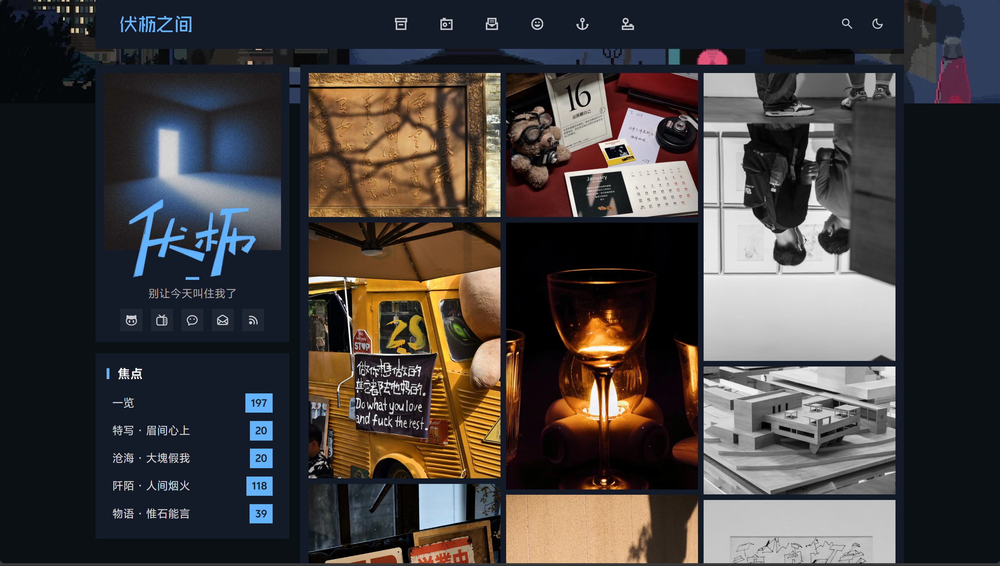

该页面仍在建设中，可以保证基础的访问。目前图片存储于服务器上，直接通过内部引用。由于图片体量较大、服务器带宽有限，有概率会出现加载问题。正在寻找更好的技术方案，在思考时间地址、曝光参数、使用设备等信息的展示方式。

- 目前考虑使用的自部署项目：[ChronoFrame](https://github.com/HoshinoSuzumi/chronoframe)（来自 [薯泥](https://gallery.marshuni.fun/) 的推荐，之前看到 [非理勿试](https://eachphoto.com/) 也在使用），看起来浏览体验相当不错。

其他的是一些相对更「润物无声」的改动。

**友链卡片**。随着这里被更多人看到，友链的脚印也渐渐变多。我删除了第三行的网址，调整了头像的大小，整体看起来更规整紧缩了。同样的显示比例下，现在可以看到更多的朋友啦。

**阅读指示**。受到友链博友 [路明](https://luming.cool/) 和 [千绪](https://ttio.cc/) 网站设计的启发，为「回到顶部」按钮增加了一个用来指示阅读进度的标识。轮廓线会随着文章正文的滚动而增长，读完全文后完全闭合。

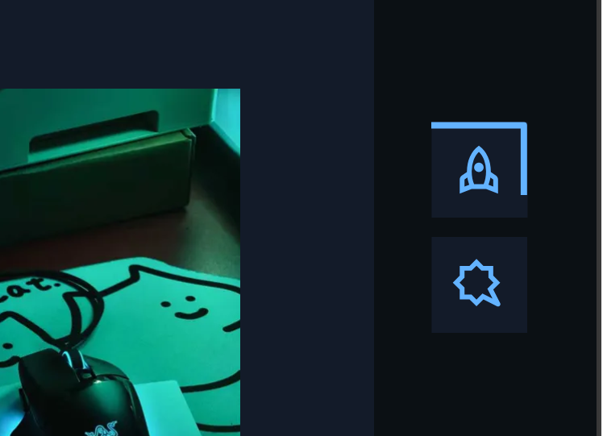

**图片加载**。网站各处的图片资源现在加载的过程中多了一个淡入的动画，不再闪现出现。网站的访问体验更优雅了。

**评论表情**。通过自建表情 JSON，大大丰富了 Twikoo 评论系统中 Emoji 和颜文字的类别与数量，并增加了一些 Weibo、2233 和 Alu 的表情包~ [来试试看](https://leehenry.top/guestbook/)？

对了，前两天收到 BlogClub 和博友圈的邮件提醒，才知道网站申请的 Let's Encrypt SSL 证书到期了。采纳了朋友 [secrun](https://sec.run/) 的建议，服务端部署了 [acme.sh](https://github.com/acmesh-official/acme.sh) 来自动管理证书签发，日后应该会省事得多。现在用的 CA 是 ZeroSSL。

## ↯ · 信号 Flash

### 潮水是人生，箴言是文字

最近听起安溥（前艺名「张悬」）的歌，进而刷到一些访谈。后来在和撒汤的交流中留下了一些思讨。

> **伏枥：**<mbr>（观访谈有感）安溥这个女人完全是生命的艺术家。
>
> 怎么能把抽象感受描摹得这么细腻，人生阅历勾勒得这么轻盈……
>
> **撒汤：**<mbr>她真的很厉害。
>
> 我觉得是因为她一直在扩充自己的生命吧。在早年的「公民对谈」里她就是一种谦卑兼容的姿态来与不同人讨论社会议题，一直在了解这个时代，观察社会沉浮，并且不断给出回应。她一直在践行自己说的那句「不想让自己变成空壳子」。
>
> 其实我觉得张悬更像一个社会活动家，从支持同性婚姻合法、到「公民对谈」，即便现在有些转变为赚钱养家，但她每一场演出的 Talking 以及《潮水箴言》的诗歌依旧在观察着、表达着。
>
> ---
>
> **伏枥：**<mbr>看到你这段话，结合这几天陆续了解的各种创作背景、访谈、Talking，我的脑海中渐渐浮现了三个词，用来勾勒出我眼中安溥的形象：
>
> **一个有生命厚度的人、一个有社会责任的人、一个有表达冲动的人。**
>
> **生命厚度**体现在她阅历的复杂与颠沛。我对安溥的人生不甚了解，但在知道她今年已经 44 岁了，一方面有些吃惊，另一方面倒是对她很多表达隐隐有了更多落脚的答案。昨天看的 [访谈](https://www.bilibili.com/video/BV1Z2CLBEEYm/)，印象最深的一段是她对「破碎」的理解：
>
> > 我自己觉得，自己在成为『中年人』的这个过程异常的颠簸，也体验了这个时代的破碎、自己的破碎、内心的破碎、生为女人的破碎……『破碎』对我来说，并不是要抓住这个字眼，一直不断的去形容它、去分析它或是解剖它……大家都在强调完整，我觉得只有诗歌或艺术的世界基本上比较有耐心，甚或是看似比较耽溺一点，想要去理解人的情感或者是生命经验的破碎。
> >
> > 破碎的确带来很多事物的缝隙，而那些缝隙说不定才是我们真正能够生存下来的空间，而不是大家以为完整的那个东西。
>
> 一方面，安溥相对颠沛和破碎的人生可能确实来自于命运的玩笑，另一方面我想更还来自她<mbr>**「愿意入世并发声」的使命感**。<mbr>
>
> 确实就像你说，我很能感受到她以一个谦卑兼容的姿态来观察社会沉浮，会被人们的声音所牵动，也回应着人们切实可感的呼声。她选择以歌手这个身份，将自己的爱、包容与支持付诸一个更宏大的语境之下。
>
> 比如一次次告诉人们「永远不要放弃独立思考」，比如《玫瑰色的你》，再比如很多次发声。我想她不是归属于某个刻板的立场，而是抱着「让这个社会变得向好向善」的初衷，做着切实的努力。
>
> 我时常对虚空的系统、庞大的机器、混沌的舆论感到无力和悲观，独善其身的「出世」是我能做到的最大的善意，做不到像安溥这样，但我知道社会向好发展，离不开像安溥这样的发声者。我很敬佩。
>
> 而生命的厚度，社会的责任，这些「裂缝和破碎」，让安溥的**表达冲动**从中生长。
>
> 有被潮水箴言的概念打动：潮水是人生，箴言是文字和经验的总结。她把演唱会的舞台当做一份装置艺术去雕琢，用不断扩充的生命去丰满。从思想到表达，她把自己活成了生命的艺术家。
>
> 文学、诗歌、音乐，这些构筑了安溥立体的精神世界，也鼓励着他人从裂隙中生长，永远不要放弃自己。这是最温柔但也最强大的支撑力量。
>
> ---
>
> **撒汤：**<mbr>当时在（「潮水箴言」演唱会）最后一首开始前的文字「破碎是生长」，结束词是「感谢人生无常，万物之间因此才有所联系」。看完你的话突然有领悟一点点其中的意义。
>
> **伏枥：**<mbr>最近还听到她的一句话：「谢谢这个世界给我们这么多触类旁通」，我想表达的应该是类似的意思。
>
> ~~高中的时候如果遇到张悬应该每周的摘抄作业会像呼吸一样简单……~~

### 用哲学家的方式生活

> 闲暇对人类来说是个好东西，当人如奢侈品般地拥有了闲暇，他就不再为生存而奔波、为别人而奔波。在历史上，某个时期的人们拥有闲暇，也是诞生哲学家的重要条件。希腊语中的 *skholē*，本身是「闲暇」的含义，在后来才演变成了 *school*（学校）。苏格拉底和柏拉图要是每天为了保住工作而忧心忡忡，如今的西方文明就不会是这个样子（当然，苏格拉底也不会背负败坏雅典青年的罪名而死，搞哲学是有代价的）。
>
> ……
>
> 我想，今年写博客的爆发式增长，和我日渐丰富的精神生活脱不开关系。那么，来年也要做一个思想自由的怪胎！
>
> 🔗 *Link:* [写在 2026 的开头 - 極客死亡計劃](https://www.geedea.pro/posts/almanac/2025-wrapped/)

注意力的自由决定精神的自由，而丰富的精神生活将直接催生创作欲与表达欲。我时常庆幸我仍对这个世界葆有好奇心。

> 什么是把哲学当作生活方式呢？就是对世界的意义保持好奇心，跟随自己的好奇心，自由地开展心灵之旅，面向问题、面向世界、面向自己的信念。
>
> ……
>
> 所以我选择的策略是：
>
> （1）对自己的信念负责，面向问题；
>
> （2）先写文章而不是写论文；
>
> （3）保持智识的诚实，绝不糊弄自己；
>
> （4）先完全用自己的思考写下来，写成一个体系之后，
>
> （5）之后再为了所谓的学术规范，深入研究和参考前人著作。
>
> 这些策略反映了我对哲学家如何度过一生的不成体系的思考，我把它们的要点罗列如下：
>
> 1. 把哲学当成一种生活方式而不是学科体系。
> 2. 永远面对问题，面向世界，只对自己的信念负责。
> 3. 追随自己的好奇心而不是追随大师。
> 4. 把哲学看成一段心灵之旅，使世界进入心灵，也使心灵成为世界的一部分。
> 5. 名利是做哲学水到渠成的副产品，而绝不是目标。
> 6. 像对待自己的身体一样地对待自己的思想，在恰当的时机让它成年，独自面对世界，面对问题，对自己的信念负责，珍惜时间，持续前行。
> 7. 这意味着不以做人物研究、思想史研究为志业，也一般不会做翻译工作，不做其他人思想的奴仆，不戕害哲学生命，不蹭名人声望。
> 8. **保持对经典作家观点的距离感和模糊感，重要的不是「精确」或「系统」把握他们的观点，而是利用他们的核心概念或洞见发展自己的思想。**
> 9. 在思想活跃时期，尤其要避免被其他思想或观点随意打扰，先少读、多想、多写，然后去读、去验证、去完善、去防御。
> 10. **不必为一个观点前人已经想过而怯懦，你独立和前人想的一模一样，比你读过他之后和他想的一模一样，很不一样。**
> 11. **这世界上不存在任何思想，必须经由任何伟大人物我们才能想到，也不存在任何思想，伟大人物想过，你就不必去想了。**
> 12. **不需要担心不正确，特别是当这种正确是指系统符合前人思想。**
> 13. **一种把自己的研究建立在对所有重要前人研究的基础上的想法，应该被拒绝。**
>
> 如果一个人只是为了成名，不追随自己的信念和疑问，他怎么可能真正有所贡献？
>
> 你只有不把一些东西当作目的，才有可能达到那个效果，这有什么矛盾吗？
>
> 最终能为人类的知识大厦做出贡献，那取决于很多的条件。
>
> 只对自己的信念负责，是你为人类知识增砖添瓦的必要条件，而不是充分条件。为人类知识大厦增砖添瓦，是对自己的信念负责的一个水到渠成的结果，但绝不应该成为目标本身。
>
> 🔗 *Link:* [哲学家如何度过一生 - 2750 words](https://pathos.page/blog/philosophy-declare/)

在这些「哲学家度过一生应该怎么做」的观点中，对我有思想指导意义的是 #8. #10. #11. #12. 与 #13. 就此和 W 君展开了一些交流。

> **伏枥：**<mbr>我想这些要点也可以解释为什么就一个「主体性」有着五花八门的解释方式和适用范围。因为这三个字只是为了拟合背后哲学家某种思想与体系的符号罢了。（此处 callback 先前对话围绕 Eltrac 文章中关于 [主体性](https://www.geedea.pro/essays/%E4%BB%8E%E4%B8%BB%E4%BD%93%E6%80%A7%E7%9A%84%E7%94%A8%E8%AF%8D%E7%9C%8B%E7%94%A8%E8%AF%8D%E7%9A%84%E4%B8%BB%E8%A7%82%E6%80%A7/) 的讨论）
>
> **W 君：**<mbr>我没看他的前后文，我感觉要分情况吧，比如研究某个人或者做综述，当然要系统和精确地把握他们的观点；如果要设计一套自己想要贯彻的生活哲学的话，没有完全服从于某个人的理论的必要。
>
> #10 和 #11 #12 没有语境，我可以笼统模糊地认可一下，到分析具体问题的时候可能有不一样的结论。#13 的话可以想到一个简单的反例，比如数学研究就必须建立在所有重要前人的研究上。
>
> **伏枥：**<mbr>说到数学，我认为也不一定吧，只要建立一套公理系统，在自洽的公理系统和数学规范的框架之下推演得到的结论，并不一定要依附于「所有重要前人的研究」才能开展。从数学到物理，有的是例子，让新的理论成为对过去理论的颠覆。
>
> 前后文我认为类似于：「作为哲学家，发展哲学的姿态是什么」他的哲人定义并不局限于狭义的文科和哲学，而是泛指的真理、知识、意义。
>
> **W 君：**<mbr>整个看完的话我觉得离我有点远，哲学话题上的储备我还不足以 re 这篇文章。
>
> 他想做的肯定不是混个铁饭碗教大学生马原没事写写论文赚赚经费的那种哲学学者，而是想要让哲学「有用」，想要在哲学方面做出一些建树、成就，想成立自己的体系什么的。
>
> 这篇文章主要是表达了他对一些国内学者风气的反感：
>
> 1. 反对胸无大志，立志于做一些不感兴趣的外籍的翻译这种浪费自己时间的事情；
> 2. 反对照本宣科，尽信书，不敢挑战权威质疑权威，尤其是「迷信」西方知识体系的； 
> 3. 否定文献翻译、人物研究、知识的整理教学等工作的重要性。（*\*此条笔者存疑*）
>
> 然后我觉得，一个人确实有可能自己一个人闭门造车去建造一个体系，哲学体系也好，数学体系也好，或许康德就是自己一个人捣鼓出自己的哲学学派出来的。但是更可能发生的是：个人的头脑是有局限性的，容易成为井底之蛙。所以研究前人的重要结论是必要的。
>
> **伏枥：**<mbr>当然，我不否认站在巨人的肩膀上的重要性，这反而是非常必要的，完全从零开始当然是空中楼阁，容易沦为「民科」。我主要同意的观点是：
>
> 1. 尽信书不如无书，提出观点的前提和资格不是吃透前人所有观点，而是选择性吸纳，哪怕距离感和模糊感也是对自己观点的形成有益；
> 2. 无需过于迷信权威，不用过于用「我想要说的前人们都说过了，我想要做的前人们都做过了」来否定自己思考和研究的意义；
> 3. 我敬佩他不拾人牙慧，不做别人思想的奴仆的态度。
>
> **W 君：**<mbr>嗯，大部分的都认可。距离感和模糊感，这个用词比较暧昧。
>
> 我的话，如果开始学习某知识某体系，那理论上应学个透彻，准确把握此知识。但是学海无涯，人的时间有限，这种理想情况达不到，一个合理的选择是退而求其次。这样的距离感和模糊感不是一种罪过，不过我也不觉得是特别好的好事，正负相抵吧正好。

为什么我尤其推崇「不迷信权威、哪怕稚嫩与不成熟，仍然珍视自己表达原创性」的态度，因为我在现实中时常会听到这样的言论：

> - 我的想法不成熟、我的思考很可笑、我不过是对前人的复读。在我完整透彻研究这个领域所有前人学说之前，我没有「关公面前耍大刀」的入场券；
> - 我表达欲缺失的原因有时候来自于「眼高手低」 —— 鉴赏力高但笔力弱。意识到「我怎么写都难以逾越这些高峰」，没必要直面自己的平庸，不写得了；
> - 多有才情的文字工作者都是有的，人外有人、天外有天，但他们往往都非常谦卑；他们的创作好像都只为自己服务、只取悦自己，追随他们的同时，感到羡慕又难以望其项背。

坦诚的说，有时候我自己也会和这样的想法做对抗。对此，我现在能做出的回应是：**无论别人有多厉害，也没人能取代自己去写出当下的某种热忱、感受与洞察**。

权威和大家不应该成为束缚自己脚步的桎梏。珍视不可多得的思考与表达的欲望，悦纳自己表达的不完美，也许是勇气的第一步。

要为自己而生活，要为自己而创作。

## ☨ · 探针 Probe

### 这个月听了一些歌

在朋友 Redgreen3 的提议下，填补上「书影音游」中「音」的拼图~

#### 《亲爱的…我还不知道》《城市》《神的游戏》《9522》· 张悬

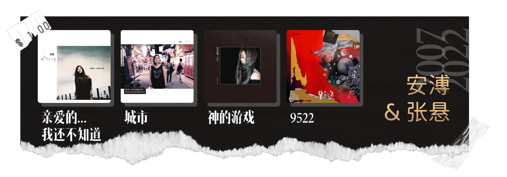

| Selected Tracks ❤                     |
| ------------------------------------- |
| 我想你要走了（You Were Here With Me） |
| 如何（Through Our Lives）             |
| 艳火（Pyrojewel）                     |
| 蓝天白云（Sky Inside the Eyewall）    |
| 关于我爱你                            |
| 城市                                  |
| 儿歌                                  |
| 天高地阔                              |
| 最好的时光                            |
| silence of desire（无言的渴望）       |
| 没有寄的信                            |
| 模样                                  |

初听张悬的歌，我想多少带有一些浮躁的心情。它们没有刻意讨喜的流行旋律，无法让我一下子全身心投入其中。后来，走在暮色漫开的街道、坐上末班无人的公车，再点开她的歌，这才发觉已经被她铺陈的情绪包裹。

我很享受独处，她的歌也确实很适合一个人的时候听。

再后来，发现自己开始不自觉哼唱一段没有刻意去记的旋律。我再读起张悬的歌词，这才发现在结识她之前，一些表达早在他处留下印象。

> 

> 于是你不停散落 我不停拾获
>  
> 我们在遥远的路上
>  
> 白天黑夜为彼此是艳火
>  
> 如果你在前方回头 而我亦回头
>  
> 我们就错过
> 

> ——《艳火》
> 

> 

> 去挥霍和珍惜是同一件事情
> 

> ——《关于我爱你》
> 

#### 《纯妹妹》· 单依纯

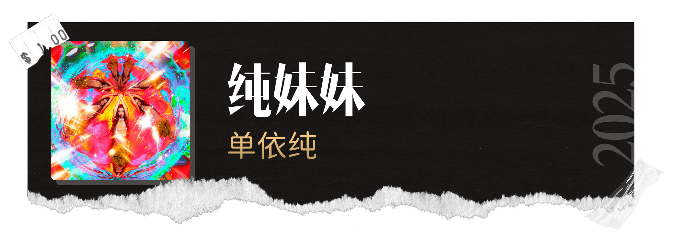

| Selected Tracks ❤ |
| ----------------- |
| 纯妹妹            |
| 珠玉              |
| 向日葵朝着夜      |
| 还有什么更好的    |
| 有趣              |
| 还你茉莉          |
| 假如我们还爱着    |
| 我表示理解        |
| 我管不住我自己    |

本月循环最多的专辑。

从《歌手 2025》结识，很开心能看到她的音乐人格趋于完善。以先锋而独立的态度，带给华语乐坛一股气势如虹的新鲜血液。就像她所坚持的那样，这张专辑没有一个音符唱的不是她自己。

怎么能这么会写、这么会唱……她说「这里没有一首歌不是我的主打歌」，于我而言，名副其实，这里没有一首歌不对我的胃口。我想我会把人生第一张黑胶唱片用来支持《纯妹妹》（~~如果能抢到的话……~~）。

> 

> 随着命运挑战 挑战我
>  
> 然后花就开到一样多
>  
> 满了我的眼睛
> 

> ——《向日葵朝着夜》
> 

> 

> 假如我还爱着你
>  
> 我又说远了
>  
> 谁也不许太可怜
>  
> 我们的相处 已经还给时间
> 

> ——《假如我们还爱着》
> 

#### 《跟着感觉走》· 张震岳

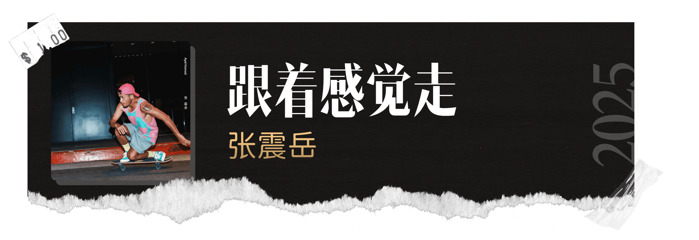

| Selected Tracks ❤ |
| ----------------- |
| 梅雨季            |
| 跟着感觉走        |
| 妈妈的眼睛        |
| 搬家              |
| 浪人的…           |
| 答案              |
| 好糟糕的派对      |

在之前的印象里，张震岳有一种把某种歇斯底里的情绪咀嚼消化之后，表达得轻描淡写的慵懒感。而在《跟着感觉走》，更是带给大家一种共同的感慨：

> 怎么做到一把年纪唱出一种扑面少年感的？！

「收集普通人的牢骚，偷渡普通人的情感」阿岳带着录音设备冲浪、喝酒、派对，玩出了这张专辑。当下放下，无需答案。「我其实也不喜欢他们说的大道理」没有说教的老人味，无需太多的思考。这是能带给人单纯开心的一张专。

> 

> 五十岁之后，答案没比较多，疑问不那么急；
>  
> 不急著去哪里，也不需要什么指引；
>  
> 浪慢慢冲，山慢慢爬，
>  
> 感觉对了，就走吧！
> 

> ——《跟着感觉走》专辑介绍
> 

---

去年开始，遇见感兴趣的歌手或单曲，下一步我往往会以专辑为单位整体欣赏。

### 为什么以专辑为单位听歌？

我认为这种方式可以类比成：我愿意花时间读完作家一本「独立著作」，而不是止步于一首单曲或一段副歌的「文摘片段」。

- 从一般性的标准来讲，全长专辑的数量和质量，基本是音乐奖项与乐评人们**评价歌手创作能力的核心维度**。这在重要性上远胜单曲 EP。EP 的精彩和流行具有各种偶然因素，而专辑展示了一个歌手沉淀后的音乐厚度，仍然是展现歌手创作能力的重要形式。

- 为什么专辑的地位如此重要？我认为**专辑显然是有概念性的**，这体现在专辑的主题、单曲顺序的考究。

    比如碧梨的《HIT ME HARD AND SOFT》其中一些歌曲的 outro 和 intro 可以无缝衔接到一起，由此带给人流动的连续情绪体验；陈致逸的纯音乐专辑《幻想乐园 Fantasyland》在专辑中虚构了一个幻想的游乐园，曲目排列的顺序展现了入园的浏览过程；黄绮珊的《小霞》三部曲，光从曲目的名字上就可以看出非常明显的叙事性，用年龄为界限的一段段往事串联起专辑的章节。而在张悬的《9522》 ，作为她「青春练习册」的二次创作，每一首单曲的风格做到全然独立，以此回答童年词曲创作的每一种侧写。

    当然，当下乐坛为了迎合流媒的宣发特点，流行起一种新的趋势 —— 先发单曲引流，再用专辑汇总 —— 专辑的概念性因此有所降低。但即便如此，相比于单曲，**专辑也更能完整的代表一位歌手「一段连续时间」的创作能力与音乐人格**。

- 这似乎也有种复古感，像以前的人们逛音像店，购买心仪歌手的专辑唱片或磁带，带回家抱着期待的心情放入音放机，从头听到尾。当然，不一定每一首都精彩。那时的人们会在第二天和同好讨论，昨天的唱片哪一首最喜欢，今天的我们会在专辑中挑选并点亮红心，加入自己的歌单。

    但不管以前还是现代，对待作品的态度是一致的：**在初见你的时候，我愿意尊重你的完整性**。

- 而在短视频的碎片解构一切的当下，我想这可以成为一种对抗，更是一种重新寻回注意力自由的方式。以专辑为单位听歌，可以**重新构建起音乐的语境**。你知道马上开始的是流畅连续的音乐体验，不会被不速之客打扰，像是以纯粹的声音形式开始的一场音乐剧或电影，足够沉浸。

## ❏ · 快照 Quote

### 文字在阅读中完整

> M.H. 艾布拉姆斯（M.H. Abrams）在其经典著作《镜与灯 —— 浪漫主义文论及批评传统》中提出的 「文学四要素」，是文学理论领域极具影响力的分析框架，核心是认为任何文学活动都围绕四个关键维度展开，四者相互关联、共同构成文学的完整系统。
>
> **作品（Work）**
>
> 四要素的核心与枢纽，指作家创作出来的、可供读者阅读的具体文学文本（如诗歌、小说、戏剧等）。它是连接其他三个要素的载体 —— 既是作家 「表现」 意图的产物，也是反映 「世界」 的媒介，同时还是读者 「接受」 和解读的对象，其语言形式、结构、意象等自身特质，直接影响文学活动的展开。
>
> **世界（World）**
>
> 指文学所关联的外部客观现实或主观经验世界，包含两层含义：一是客观存在的社会生活、自然环境、历史事件等 「现实世界」；二是作家或人类共有的情感、理想、想象等 「经验世界」。传统现实主义文学常强调 「模仿世界」（如巴尔扎克的小说再现 19 世纪法国社会），而浪漫主义、现代主义文学则更侧重表现作家内心的 「经验世界」，但无论哪种，「世界」 都是文学创作的重要源头或参照。
>
> **作家（Artist）**
>
> 文学活动的创作者，即通过思维、情感和艺术技巧将 「世界」 经验转化为 「作品」 的主体。作家的人生经历、思想观念、审美趣味、创作能力，直接决定 「作品」 的内容与形式 —— 例如杜甫的忧国情怀塑造了其 「诗史」 般的作品风格，卡夫卡的荒诞体验催生了《变形记》这样的现代主义文本。艾布拉姆斯认为，「作家」 是将 「世界」 转化为 「作品」 的关键中介，其 「表现」 意图是文学创作的重要驱动力。
>
> **读者（Audience）**
>
> 文学活动的接受者，指阅读并解读 「作品」 的群体（包括个体读者、批评家等）。读者并非被动接收 「作品」 信息，而是通过自身的知识背景、审美经验对 「作品」 进行主动解读，甚至参与 「作品」 意义的建构 —— 同一部《红楼梦》，不同时代、不同背景的读者可能读出不同的主题（如家族兴衰、爱情悲剧、社会批判等）。随着接受美学、读者反应批评的发展，「读者」 在文学活动中的作用被进一步凸显，成为文学价值实现的重要环节（若无读者解读，「作品」 的意义难以完全落地）。
>
> 这一框架的价值在于，它超越了单一维度的文学观，用四要素的互动关系，全面覆盖了文学创作、文本存在、接受反馈的完整链条，至今仍是分析文学活动的基础工具。

### 镜头广角与长焦 vs 空间横向与纵向

> **广角镜头和长焦镜头对横向空间的展示有什么不同？**
>
> 先说广角镜头里的横向空间。 因为广角镜头能容纳更多左右排列的景物，所以从最左边到最右边的距离就很远，所以能突出横向的距离感。
>
> 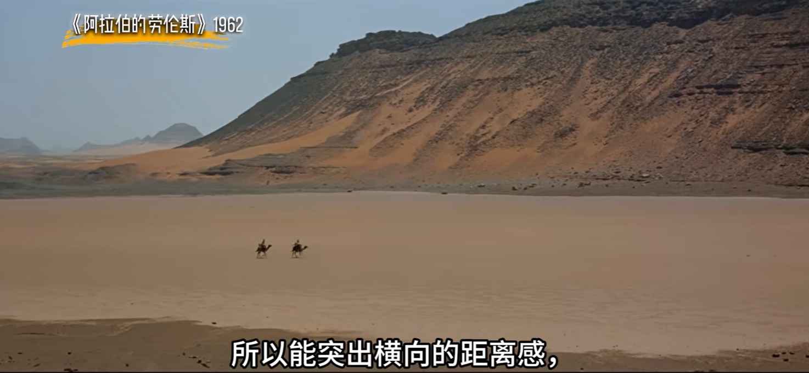
>
> 同时，因为左右之间的距离很远，从最左边走到最右边要花的时间就长，所以你会感觉画面里的主体横向移动的速度比较慢。
>
> 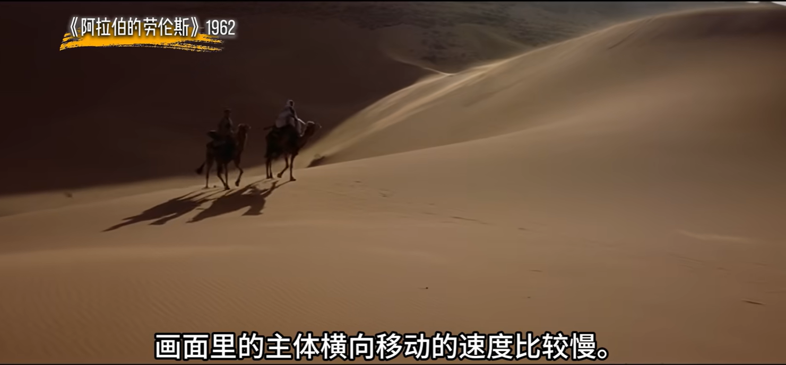
>
> 这是广角镜头拍横向空间的特点：**距离宽，运动慢。**
>
> 那长焦自然是反过来，刚刚说的一切参数都反过来，就是长焦的特点。
>
> 所以长焦镜头里，左右横向运动的速度就显得非常快。
>
> 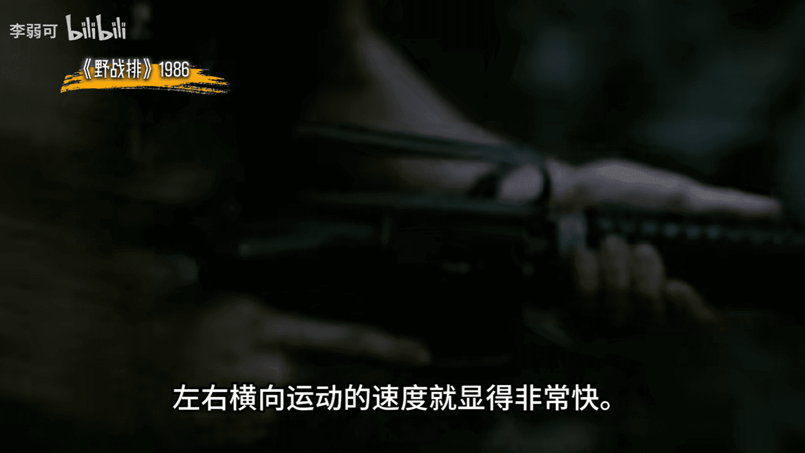
>
> 而长焦镜头里的纵向运动就显得慢，比如钢铁侠里这种镜头，就会让我们感觉他步履维艰，好像怎么都走不出沙漠。
>
> 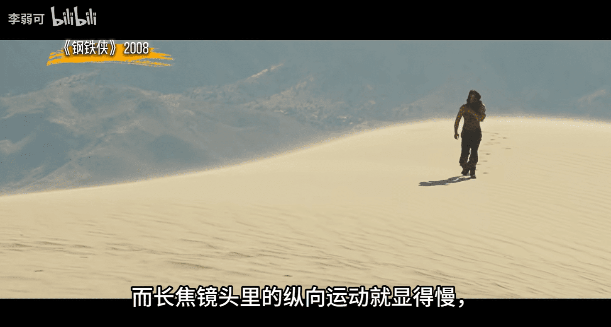
>
> 所以拍「逃离爆炸」的时候经常用长焦镜头，压缩了纵向空间，所以显得人跟爆炸点很近，降低纵向速度，所以显得人物逃离得很艰难。
>
> 
>
> 《无可奈何》这里是拍横向空间。所以总结就是：**广角突出距离，长焦突出速度。**
>
> 🔗 *Link:* [《无可奈何》调皮分镜设计原理 - B 站丨李弱可](https://www.bilibili.com/video/BV17GkeBhEvw/)

### 关于 uppercase 与 lowercase

> **为什么 7-11 便利店的英文（SEVEN-ELEVEn）只有最后一个字母是小写？**
>
> 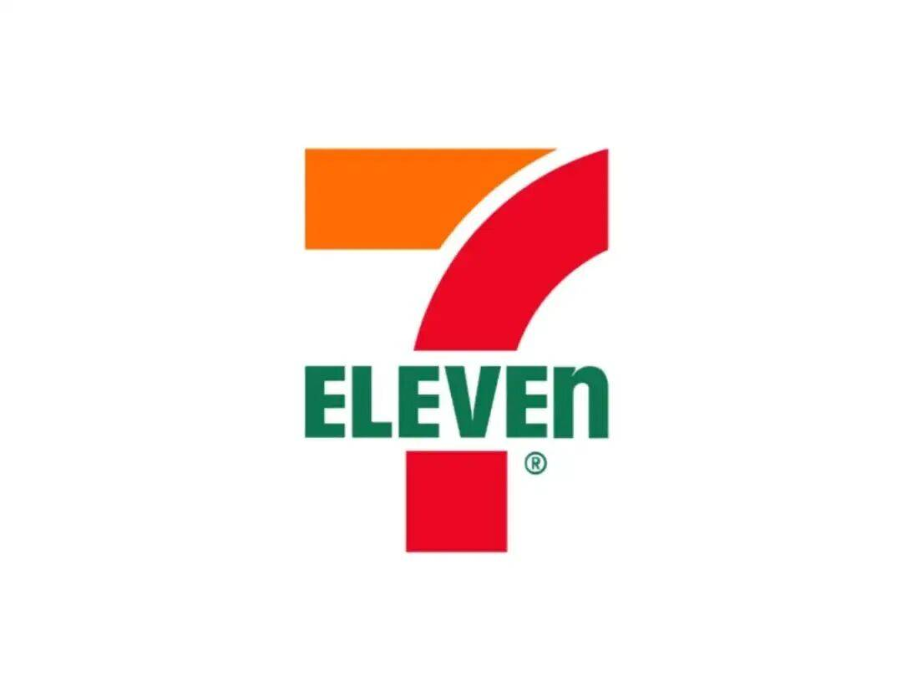
>
> 单词的大小写在阅读中会给人带来不同的情感色彩。
>
> - **全大写文本**通常被感知为更正式、更权威、更有距离感，同时也更难以阅读。全大写的品牌名比较适合那种走高端或者奢侈路线的品牌，比如 DIOR、LV、GUCCI 等高端品牌；走在路上的告示牌也会使用全大写的字体来增加其警示作用；
> - **小写字母**整体比较圆润，给人带来柔和可接近的感觉，更是适合走亲民路线。比如 adidas 等一些常见的消费品牌；
> - 还有一种就是**混合大小写**，给人带来一种打破常规、活泼有趣的情感色彩，传递出创新与众不同和现代的品牌个性。比如 Coca-Cola 和 iPhone；
> - 而 7-11 这个品牌名中偏偏最后一个字母小写，采用另一种技巧：故意偏离标准。这种处理方式就好像在告诉大家，我和其他的便利店不一样哦。品牌通过这种设计成为消费者的心理锚点。
>
> ---
>
> 在英文中，**Uppercase（大写）**<mbr>和 **lowercase（小写）**<mbr>的概念可以追溯到印刷术的发明。
>
> 15 世纪欧洲活字印刷时代，印刷工人排版时会把一个个金属活体的字母放在特制的木架中，这个架子就是 case。而为了方便排版，工匠们常把小写字母的活字放在离手最近、位置更低的货架上，这个货架就叫 lower case。大写字母主要用于开头或专有名词，这些活字用的很少，所以就被放在更高一层的货架上，这个货架就叫 upper case。
>
> 久而久之，人们就直接用 lowercase 指代小写字母，uppercase 指代大写字母了。
>
> 🔗 *Link:* [为什么711就用n小写？ - 小红书丨元来如此](http://xhslink.com/o/4TqXHXUcixR)

### 亲爱的…我还不知道

> 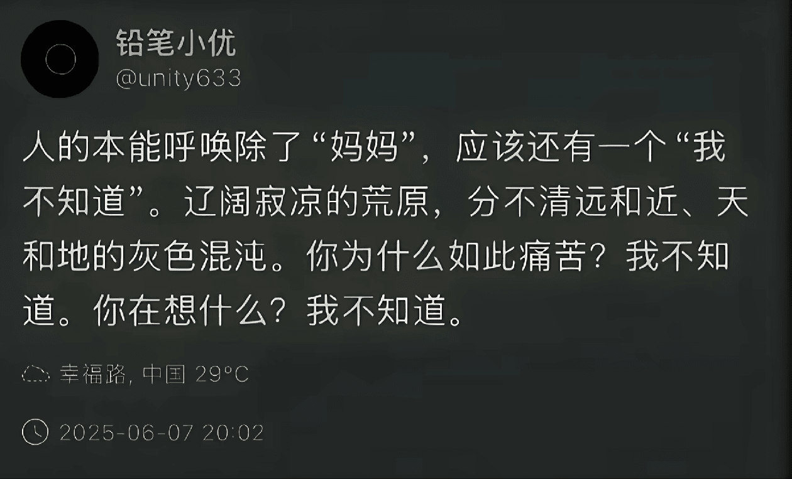

我的未来、我的去向、我的关系、我的周遭。我求索、我判断、我惶恐、我迷茫。

亲爱的…我还不知道。

### 何以为爱

> 

>  我如果爱你——
>  
> 绝不像攀援的凌霄花，借你的高枝炫耀自己；
>  
> 我如果爱你——
>  
> 绝不学痴情的鸟儿，为绿荫重复单调的歌曲；
>  
> 也不止像泉源，常年送来清凉的慰藉；
>  
> 也不止像险峰，增加你的高度，衬托你的威仪。
>  
> 甚至日光。甚至春雨。
>  
> 不，这些都还不够！
>  
> 我必须是你近旁的一株木棉，作为树的形象和你站在一起。
>  
> 根，紧握在地下，叶，相触在云里。
>  
> 每一阵风过，我们都互相致意，
>  
> 但没有人，听懂我们的言语。
>  
> 你有你的铜枝铁干，像刀，像剑，也像戟；
>  
> 我有我红硕的花朵，像沉重的叹息，又像英勇的火炬。
>  
> 我们分担寒潮、风雷、霹雳；
>  
> 我们共享雾霭、流岚、虹霓。
>  
> 仿佛永远分离，却又终身相依。
>  
> 这才是伟大的爱情，坚贞就在这里：
>  
> 爱——
>  
> 不仅爱你伟岸的身躯，
>   
>  也爱你坚持的位置，足下的土地。
> 

> 

>  —— 《致橡树》当代诗人，舒婷
> 

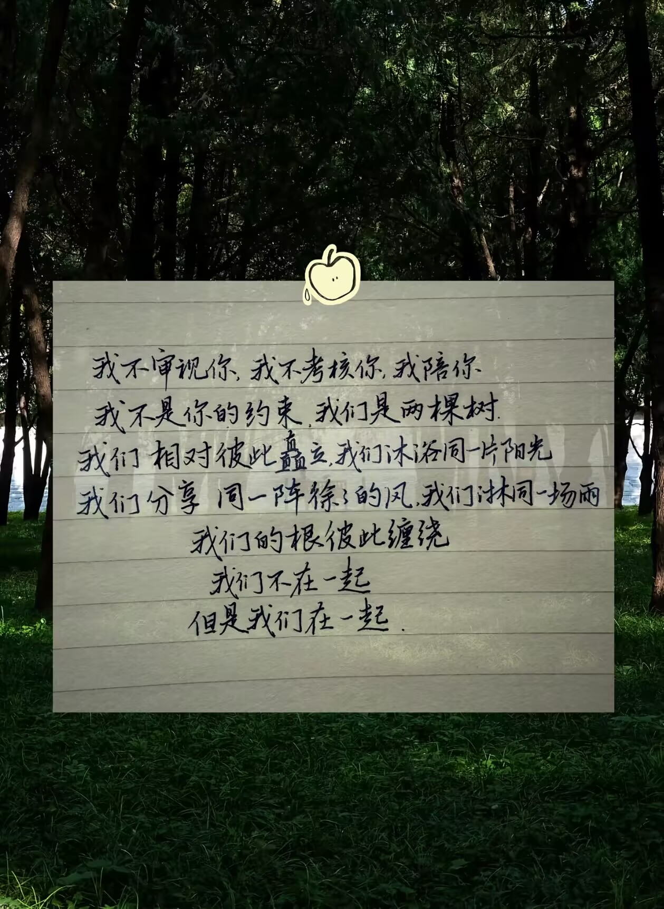

## ✲ · 脉冲 Spark

### 一之一

这次从上海回海口坐的是国航。登机检票时，我前面是一对母女——妈妈穿的不算特别合身，小女孩扎着可爱的辫子。

我看着小女孩满面春风和验票的乘务员大声打招呼，然后迫不及待的冲到廊桥上，背上红彤彤的鲨鱼小书包一甩一甩。她一边跑，一边脆生生的喊着「去\~度\~假~」，阳光透过落地窗把她的头发打上了好看的金色。妈妈举着手机录着视频，在后面笑着追上去。

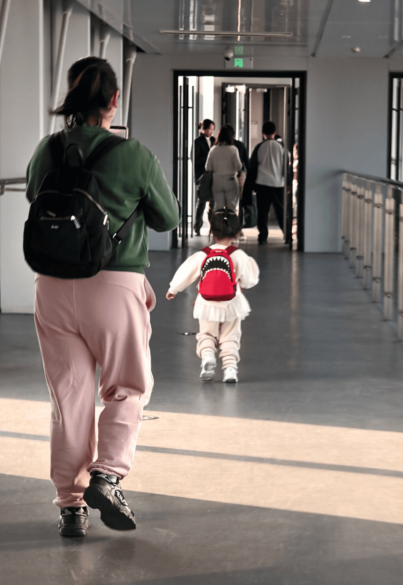

希望她们在这里玩的开心。

<mbr>