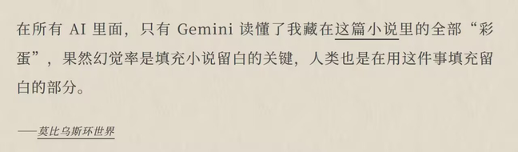
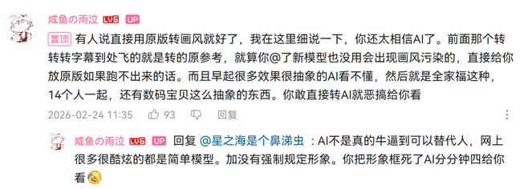

这一行字敲于 2026 年 2 月 28 日 的凌晨六点，在惊愕中发现已经来到二月的最后一天。

二月，刚好横贯我的整个假期。与中学老友们重聚，和家人为新年奔忙。节庆的喧嚣淡淡的开始又匆忙的结束，徒留遥远的耳鸣。本来就短的二月在忙碌中流走，一晃眼，已经到了准备离开的时候。

在又一个深夜新建 Markdown 文档，想着把月刊在最后一天赶出来，没料到光是整理素材就花了六个小时。应该赶不到二月发表了，写到哪就算哪吧。

祝你我新的一年也是个好年。

## ◈ · 断点 Track

### 人们是是流动的

> 有点sadly的是回顾这一集发现上下文已经记不太清了·上次看大概已经是初中的事情
>
> 曾经最喜欢的事物，随时间的推移，最终都只剩下某种模糊的感觉，一时兴起尝试刻舟求剑的时候才发觉自己原来已经变化了这么多
>
> （加之早上想喊初中好久没见的当时最好的朋友出来聚聚，看这集的时候刚好收到了他委婉拒绝的消息，突然有点破防）

郑重的告别往往都还会再见，而真正的告别往往没有预告，只是随着你往前走，留在了你的昨天里。

每一次相聚发现彼此都会聊不同的话题。

一些心得：

- 保持联系的重要性。主动才有结果
- 坦然接受朋友的阶段性与流动性

### 网站建设快报

- 403 和 404 页面
    - 可以试试在这个网站https://patorjk.com/software/taag字体类型选择ANSI Shadow，或者其他你喜欢的字体类型，很丰富。按着自己喜好选择就可以了。我一般neovim的首页艺术字之类都在这里生成的。
    - pagga
- 友链邮报
- 图库懒加载逻辑
- serif 字体

## ↯ · 信号 Flash

### 谷爱凌是不是「雇佣兵」

> "Propaganda idol"（宣传偶像）在不同语境中存在多重解读，主要涵盖主流价值观塑造的模范人物、政治符号化偶像、以及娱乐产业中人设与宣传反差的争议案例。

> 网球风云吧真的是一批很有活的人，基本是给，但是关注竞技体育，因此恶臭，然后喜欢说淋语，叫各个运动员大妈，喜欢撕逼，但活人感也是拉满
>
> 听起来像是集直男和通讯录糟粕之大成
>
> 除去我可以我老公的发骚，大部分是原始厮杀本能的“竞争”，拿金牌的就是slay可以掌掴其他人，下一场输了就要被掌掴被骂，完美体现竞技体育的竞争残酷性所在。在这里可以看见纯粹的人类欲望 
> 不过刚刚吧里也有很多人对雇佣兵谷爱凌表达了认可（我倒是不太关注冬奥会，这刷新了我的认知），他们盛赞谷爱凌的大心脏，在各种争议中仍然保持高水准输出，竞赛风格畅快，性格外向，很有巨星风采 
> btw，我自己的看法是，竞技体育是一种代替战争以激发人们心中潜藏的战斗、嗜血本能的温和战争表演，所以我觉得竞技体育的存在本身就是邪恶 
> 所以在这里见到最纯粹最原始最下贱（？）最歧视的各种黑吹婊骂战，是符合我的心理预期的233
>
> 与之相对的微博则是死人感满满，全是机器人的感觉 
> 真说不上来哪个更好一点 
> 关于这个思考 
>
> 1. 人类的某些原始的冲动总要有地方抒发，血腥暴力的电影、犯罪惊悚题材的小说乃至当代对抗性的竞技体育，是一种文明时代的野蛮表演艺术，总不能真的像野生动物一样争的你死我活吧，如果说竞技体育的存在本身就是邪恶，那也许人本身就是存在邪恶的一面，竞技体育将这一面文明化、温和化、艺术化了 
>
> 关于这个「雇佣兵」的定义，建立在一个相对中立的立场上（我自己对她没有太多的恶意），我冒出了一些好玩的思考：
>
> 1. 谷爱凌现在在双国籍中选择了中国国籍，她的这个行为可以成为反对「雇佣兵」的说辞的力证吗； 
> 2. 如果谷爱凌是「主动选择」在中国接受运动素养的培训（也就是说用的是中国的资源），可以成为反对「雇佣兵」的说辞的力证吗；如果在前期使用美国教育资源，后期使用中国教育资源，会对价值判断造成什么影响？
>
> 
> 一份相关的参考材料：
> 美国副总统万斯近期称谷爱凌受益于美国的教育体育，并直言谷爱凌应该为美国队出战。 接受《今日美国》采访时，谷爱凌正面回应了万斯的言论：“我感到有点受宠若惊。 谢谢你，JD（万斯），这真是太贴心了。 ”随后，记者询问谷爱凌是否觉得自己被政客们给盯上了，后者表示：“我确实有这样的感觉。 实际上有很多（在美国长大的）运动员都为其他国家参赛，但他们偏偏只盯上了我。 
>
> 3. 如果谷爱凌是在中国官方性质的运动协会运作下「被动拥有」为中国争光的身份，因此称她为「雇佣兵」。这样的推导合理吗；
>
> 4. 谷爱凌无论如何都有美国的血脉，所以永远在出身上不纯粹，因此无法正名「雇佣兵」的身份。这样的论断成立吗；
>
> 5. 当然我认识到，也许当人们讨论时给谷爱凌贴上「双面间谍」「雇佣兵」的标签时，字面意思是否合理往往不是重点，而是通过攻击这样的符号来快速在一个团体中形成意见的共识，这个团体会建立在合理的前提上将它们作为跳板来同仇敌忾的攻击一些其他的东西，背后实际的问题是阶级矛盾、仇富、资本家云云，因为这些问题客观存在，所以大家对某类人更容易产生怨恨；类似的说法还有「赛博丁真」（对丁真的怨恨到对何同学的怨恨）。 
>
> 
>
> 我把这段回答喂给了三个AI，得到了一些回应：
>
> 
> 谷爱凌是不是雇佣兵.pdf
>
> 
>
> 当然我知道你用这个词没什么，可以当成我的过度解读
>
> 有趣的是，对于这个问题，豆包作为中国AI，立场也很明显偏向于中国主流立场
>
> 6. 我认为一切以「暴露在公众面前」为重要属性的职业，不管是热点运动员、网红、明星，还是自媒体的意见领袖，做到「称职」的重要条件，就是能以健康成熟的心态去面对千万张嘴——不迷失在夸赞中，不陷入批评里，永远做好该干的事情。 「盛赞谷爱凌的大心脏，在各种争议中仍然保持高水准输出，竞赛风格畅快，性格外向，很有巨星风采」，那我认为谷爱凌在这一方面做得很好。但这是她该干的，干不好就得倒牌滚蛋，由不得她。但话又说回来，在当下「讨厌你就要毁掉你」的舆论倾向下，这个能力会更重要，同时也更被动，在足够恶劣的极端情形下甚至不随主观意志改变。 
>
> 把第六点思考喂给gemini，它有一句话很有趣：
>
> 
>
> 「当你不依赖于单一的评价体系生存时，你就很难被这个体系彻底毁掉。」 这让我想到之前玩原神的一个up主，因为在开荒的过程中吐槽非常有趣起号大成功，我自己也很爱看他的实况，那个阶段应该全职做自媒体都能完全养活他，但他在粉丝多多的时候依然把实况当做副业或者兴趣。后期因为对一个争议角色的评价让社区难以满意，他的口碑大幅滑落，那段时间从B站到贴吧对他的攻击井喷。他选择是不解释不争论不下场，直接停更消失。就是因为他现实中有正事要干，所以他根本不在乎。 
> *中国主流立场→中国官方立场 
>
> 我的想法是，竞技体育这个东西坏得很，大家还要一起宣传竞技体育的什么体育精神，赞美运动健儿在赛场上的奋斗——有点像赞扬军官在战场上杀了多少人。 至于一些围绕着竞技体育的乱象，我觉得那是因为竞技体育本身就歪了，他的设置就是为了让人能不受肉体伤害地互相讨伐
>
> 我可以赞美体育精神，奋斗、不放弃、努力，或者全民参与体育的精神，或者友谊第一世界各族人民大团结的精神。但是竞技体育的这种竞争性，残酷的训练对运动员往往会造成终身损伤，与资本捆绑的体育，与民族荣耀捆绑的体育，以及竞技体育的根基——胜负的判定，胜者为王败者为寇，让我难以直视
>
> 这个其实我听说，人的心理状态会大幅影响人的肉体状态，经常会出现一些有天赋的运动员，但是缺乏抗大赛的心理素质，所以这个“不随主观意志改变”是非常困难的能力。所以这个能否在争议中稳住自己的心态，是一件可能比我想的更难得事情。比如黑人黄人混血网球运动员大阪直美，她已经得抑郁症了，也影响了自己的成绩
>
>  她和林孝埈那种归化的球员还有一个小小的不同，当时是说她疑似持有双重国籍的待遇，然后中国这边官方说法并不承认双重国籍
>
> 再加上她比较高调，自然也会有非议，这倒是正常的 
> 现在怎么样我倒是不知道了
>
> 理论上，归化后的运动员能跨越血统为他国效力，全部是雇佣兵，既然体育赛事的制定者允许这种情况的发生，我也不想说什么。 还有就是国内人对于移民的看法和外国人的看法可能不一样。外国人持有双重国籍，从自己的祖国移民到美国、英国什么的，可能没有太大的精神负担，中国人这边则是比较复杂，叛国+羡慕润人过上好日子的嫉妒，让舆论场变得更复杂
>
> （同样也因为中国是个汉族为主的国家，有强的文化、历史，民族=国家的概念也深入人心） 
> （似乎是一个太宏大的话题）
>
> 但是核心还是夺金，夺金了就有商务，没夺金会被骂死，商务断了她的训练会不会受到影响？（毕竟她的项目都是很烧钱的） 
> 话说因为谷爱凌的夺冠，国内也增加了对U型池的训练，今年是谷爱凌金另一个中国选手银 
> 二游也是一个粪坑 
> 现在不是：我不喜欢这个，我不玩这个。而是：我不喜欢这个，我们来一起把他搞死 
> 
>
> 真的很原始啊我真的不行了！现在是在车郑钦文，开始对比郑钦文VS谷爱凌，从大赛成绩含金量到各自的商务、世界影响力
>
> 这就是竞技体育带出来的兵！
>
> （x） 
> 关于第五点，我觉得可能是，互联网大浪淘沙，简单+好记+特点鲜明的词会被留下来 
> 大家用赛博丁真这四个字的zip指代自己对何同学绣花枕头一包草中看不中用的鄙夷
>
> gemini给出的是好玩的思考，相对来说最中立哎 
> 也不是说中立
>
> 豆和g比较倾向于给出结论：不是雇佣兵 
> ai并没有立场！
>
> 我懂你的意思。不过想补充一个视角：胜者为王败者为寇，这种野蛮的黑暗森林零和博弈并不仅仅在竞技体育的赛场中发生，但竞技体育有着相比于其他场合更透明的规则，大家都在明面上比，是公平的。 
> 至于游戏残酷，也是因为他在明面上面，任舆论去为胜者欢呼 
> 我认可这个角度 
> 在中国的语境之下，移民是一个太遥远的词。当我们看到一个Mr. International左右逢源的时候，当然会本能的有一些反感的心理
>
> 对，核心并不是讨好舆论，而是夺金。这个我觉得是明星运动员相比于其他在公公面前的职业不同的地方当公共人物需要靠舆论这碗饭吃饭，那么就会更加的被动，比如其他的明星或者自媒体
>
> 不一定公平哎，最能凸显公平的可能是田径，读秒不可能读慢（此时路过一个被封杀的女子），乒乓球之类的运动，为了创造出公平的胜负（我这里用创造这个词，引人深思），人为制造着复杂而费解的规则，其结果到底公不公平还很难说。更不用说一些打分的比赛，跳水、花滑 
>
> 虽然在结果上不一定100%公平，但是在立场上当然是公平，不然不公平没有人来比了
>
> 或者说他在传达一种公平的价值观
>
> 这个公平是相对于其他比较黑暗的成人世界来说的
>
> 我认为这个竞技体育的源头，以一方胜过另一方为这个活动的最终目的和最大结果，我是有点反感的 
> 这种公平我很难欣赏？
>
> 这算是我的个人审美倾向了，有时间我再细化一下 
> 竞技体育前身应该是古罗马那种真正的你死我亡 
> 从另外一个角度来说，如果没有竞技体育，人类就永远不知道自己的身体能够达到什么样的极限 
> 确实
>
> 大家和和美美的最好了~
>
> 我认可这种形式存在，但我坚定的认为我不会走上这一条类似的路 
> 那其实类似的高考也是这样的一个角色 
> [表情]
>
> 力求形式上公平 
> 但是不是真的公平非常有待商榷
>
> 对我来说竞技体育是一种以他人无法自我实现为代价来进行自我实现的玩法，所有的残酷和光辉都来自于此，在同一个毛孔里流出来 
> 啊啊啊高考在公平方面…… 
> 但是高考还受到复杂的社会的政治的地缘的因素影响
>
> 是 
> 好吧好像没什么东西不是这样的
>
> 零和博弈喜恶同因

### 关于语义精准

不精确可能体现了一种思想的懒惰。

> https://onojyun.com/2026/02/20/%e7%90%86%e8%ae%ba%e7%9a%84%e5%82%b2%e6%85%a2/
>
> 可以跟我们过去的一次讨论呼应的的一篇文章，作者Ono也是和朋友在一次讨论中，对方在功利主义还是效用主义的用法上僵持不下，模糊了本来的对话焦点。文章在复盘这件事后延伸了关于ai和词语精确性的一些思考 
> 作者认为从文学的角度上来看，“随意组合辞藻”体现的与精确用词相对的撒谎和不诚恳也是有正面价值的
>
> 这种词语的化合，能够带给人思考的留白
>
> 精确用词与否在文学性的场合和科学性的场合，有着不同程度的坚持 
> 至于我们上次关于用词的讨论，现在我又有了一些新的想法。因为我当时在总结一个结论性的东西，那么你不理解它，一方面可能是我的用词的模糊和不严谨导致的，另一方面你也提到是我们的知识背景不同导致的。现在我觉得还有一个更重要的原因，是当时我在提出这个结论之前，并没有注重共识的建立，而是直接提出了某个我针对我过往经验得出的观察，但我的这个过往经验并不能等同于你所看到的。如果我想把这个结论做得更可靠和容易理解，我应该在前提和共识上花更多的功夫 
>
> 话说我很好奇，那些浩如烟海的AI科幻作品里，有没有人成功预言AI的“幻觉” 
> 啊啊啊感觉是个很好的project
>
> 
>
> 幻觉绿素什么意思 
> 我的话觉得，如果作者明知如此故意为之，那是在追求一种艺术效果。如果作者并不知道而错用误用，那可能是一种错误。这种错误如果因为一些巧合而具有了文学性、艺术性而被作者发现后保留了下来，那可能成为一种美丽的巧合，这个错误也能成为一种表达的方式
>
> 这也是为什么140字内容的微博无法把一件事说清楚~
>
> 幻觉本意是指大语言模型瞎编不符合事实或者实际定义的东西，幻觉率是用来衡量一个大语言模型的标准，幻觉率越高，生成的结果越不可信 
> 他放在这个语境，可能指的是幻觉率让大语言模型的回答多了一些文本之外的波动？ 
> gemeni的幻觉绿更高吗 
> 他不是更擅长推理吗 
> 我不认为
>
> 所以他应该用这个幻觉率这个名词，并不是真的指代幻觉率这种东西，我就当做理解他的意思吧
>
> SOS
>
> 以身试法
>
> [表情]
>
> 就我亲自试过来，gemini从结果到文风还是相对可靠的 
> 是啊我也是这么听说 
> 应该→这里 
> 所以不知道他说的幻觉绿是个什么东西 
> 结合语境我会这样想，他估计是把Ai这种解读言外之意的能力统一归因于幻觉 
> 但实际由什么造成我也不太清楚，幻觉应该能起到一定作用吧
>
> > 所以我需要不断地追问 AI，这些新造的词到底是组合结果，还是有其原本的实际出处……我会更喜欢拥有幻觉率的 Gemini，我会任由它随意组合词藻
>
> 我想他的意思是，ge会生成一些并不存在的词语的搭配 
> 但是仍然让他觉得很美，很惊喜
>
> 这是一种幻觉 
> 好了我知道世界上大家都用上ge了！就我没有！呜呜呜

### 去议论还是去记叙

> 议论文写多了会伤害大脑吗？因为写作者会逐渐把「解释能力」误认为「洞察能力」。当创作者长期停留在可控、可自证、无须承担回应的写作姿态里，就会慢慢失去让故事自行生长的能力——角色不再反抗，冲突不再失控，意义被提前解释，世界被作者接管。议论文的能量适合解构与诊断，却不适合生成；一旦混淆这两种能量，所谓的「大脑受损」，并非能力下降，而是创作者忘了什么时候该闭嘴。

> 知识精英热衷于「拿着锤子找钉子」。他们擅长构造出一个抽象概念，并不断发展这个概念，用它来解释一切、解释世界，并在这一套已经建立起来的前提之下成为能够解释和反驳一切的神。然而，若是要他们从这个假设和前提中跳脱出来，他们却没办法解释这个概念本身，继而与现实立的越来越远。

> 坦诚的说，我也会与你的文字暗搓搓的比较和学习，对比后我会发现我以前的文字太死太满，好像一切都要一定归纳到一个结论，现在我会尝试用一种更谦和的方式去展示与表达，让读者有更多的解读空间……总之，我很庆幸我们会有这种不同

区别在于是否允许思想留白的发生。

### 为自己而写还是为他人而写

- 写作的诚实度
    - 景观，审视，面具
- 被审视的景观：为自己还是为他人？
    - 比例问题
    - 「选题上忠于自己，表达上服务意识」
- 输出的模式：一个顺畅的写作工作流
    - 为什么，打通上下游
        - 学而不思则罔，思而不学则殆
    - 如何做，我是怎么做
        - 形式上，indie web
        - 内容上，connect the point

> **另一个关键，是因为独立博客的“人设”功能，迫使它需要按照某种“姿态”去表达自我。**哪怕是对现实的抱怨，也因为有了一层对外展示的需求，而自然而然地附着上了“表演的意图”，目的是为了获得肯定、赞美、关注这些站在聚光灯下才能得到的东西——我当然也有表演的意图。大部分时候我在现实比博客上的“人设”更嘴毒，总喜欢拆解底层逻辑。但是在建立社交关系之中，这种人设又会慢慢褪去变得无下限的有趣（但是还是很少会提供情绪价值）。起初，我可能还会考虑自己的哪句话会不会惹到别人，这么三年过去了，**我发现与其去新建一个“人设”努力地维系他的表演性，不如就让把博客当做是我现实折射的一部分**——所以，就会说更多难听的话和真相，惹到更多人。
>
> [无聊的中文博客圈 – 莫比乌斯](https://onojyun.com/2024/11/22/无聊的中文博客圈/)

> 我的博客写作模式
>
> 我的博客文章基本由2个部分组成：每周更新的周记 + 不定期更新的专题文章。
>
> 我觉得这是一个非常好的写作模式。它让我的博客既可以定期地记录那些生活化、日常化的内容，又能承载有一定结构和深度的文章。
>
> 对我来说，“有感而发”是写作中非常重要的一个状态。因为灵感往往转瞬即逝，时间的滚轮无情地推进，当下的感受和想法如果放着，很容易就流失掉了。即使过段时间再记录，可能很快就没有当初的鲜活了。
>
> 我的方法是，把这些“有感而发”的内容随时记录下来，以周记的形式定期整合。它们可以很片段，不成体系，重要的是先记录下来。
>
> 周记承担了双重角色：一方面，它作为灵感和日常的记录，让我保持观察、思考和输出的习惯；另一方面，它又成了一个绝佳的素材库，让这些零散的想法有机会慢慢沉淀，最终组合成更有体系的内容。
>
> 我的很多专题文章都取材自周记，例如，我上周完成的一篇专题文章，内容基本就是从之前三篇周记素材里“拼”出来的。 虽然整合时又添加了将近1/4的新内容，但因为有之前那些基本想法的支撑，我才能把更多精力放在打磨、组装文字和捋顺主线结构上。
>
> > 上周写的专题文章：
> >
> > - [不必听过很多道理，我们也能过好一生](https://goldenriver.site/posts/ess-theory-more-action/)
> >
> > 取材自过往的周记的内容:
> >
> > - [2025 Week 14 - 不必听那么多道理](https://goldenriver.site/posts/2025-week-14/#不必听那么多道理)
> > - [2025 Week 16~17 - 不必听那么多道理(2)](https://goldenriver.site/posts/2025-week-16-17/#不必听那么多道理2)
> > - [2025 Week 18 - 不必听那么多道理(3)](https://goldenriver.site/posts/2025-week-18/#不必听那么多道理3)
>
> 我觉得这非常符合自然的状态。对于一个主题的体悟和思考，一时的想法未必能非常完整，更多的是散落在日常的点点滴滴。 能够组合成有体系化的文章当然很好，但如果没有，那也没关系，就让他们躺在周记里，写下来，就算是完成了一次“建立并维护好自己的输入输出系统”的践行。
>
> ---
>
> 我好像从来不焦虑自己写的东西有没有人看。我常会想起卡夫卡。
>
> 卡夫卡热爱写作，却不以发表小说成为名作家为目的，临终前，卡夫卡特意嘱咐恋人将他写的东西全部一起烧掉。他纯粹是把写作当成人生的寄托，通过写作来寄寓自己的思想感情，排遣内心的忧愁苦闷。
>
> 每次想到这个就觉得很受慰藉，在这个层面，我和卡夫卡是同类人。

> 日更就像是一个严苛的审计员，每天定时来敲门，要求你交付一些有价值的产出。这时候，如果白天的思考深度不够，或者仅仅是机械地重复生活，文字就会显得极其苍白。我也比较过那些能够长期保持高质量输出的状态，发现真正的勤奋往往不在于写的那一两个小时，而在于全天候开启的观察和琢磨。一旦停止了对周遭事物的系统化审视，表达欲也会随之萎缩。
>
> 今天的这种「写不出来」，其实是思维懒惰发出的警示。它提醒我不能为了维持更新的天数而强行拼凑，没有灵魂的文字打动不了自己。
>
> 思考确实太重要了，它是维持表达欲望最核心的燃料。在未来的日子里，比起刻意「找时间写」，我可能更需要「找时间想」。只有思考跟上了，文字才会自然而然地成型。
>
> https://blog.solazy.me/20260116/

> 我一直深受一句话的影响，是一位美国的编辑写下的一句话：一位作者的立身之本并不是技巧，而是他写作的意愿和欲望。以至于别人在问起我为什么要写作时，我只能用一句无奈于无法通过技巧获得成功的、但是又高度浓缩了意愿和欲望的结论回答道：“我喜欢写。”
>
> [我可能是个疯子 – 莫比乌斯](https://onojyun.com/2026/01/19/我可能是个疯子/)

> IndieWeb 确实有个著名的口号，Publish on your Own Site,Syndicate Elsewhere（简称 POSSE）
>
> "Publish on your Own Site, Syndicate Elsewhere” (简称“POES”）是内容创作与分发领域的核心策略，核心逻辑可拆解为“自有阵地优先发布，再对外同步分发”，旨在平衡内容的“所有权掌控”与“传播覆盖面”，具体解析如下:
>
> 核心原则：先“保根”，再“扩散”
> “Publish onyour Own Site”(自有站点优先发布)：创作者需先将原创内容（文章、视频脚本、播客文案等）发布在自己完全掌控的平台上，比如个人独立博客、品牌官网、自建公众号等。这一步的关键是“掌握所有权”——-自有站点的内容数据（阅读量、用户画像）、版权归属、传播规则均由创作者主导，避免依赖第三方平台（如社交媒体、内容聚合平台）导致的“平台规则变动风险”（如限流、下架、数据屏蔽）。
> "SyndicateElsewhere”（对外同步分发）：在自有站点发布后，再将内容（或经过适配的精简版、改写版）同步到第三方平台，比如知乎、小红书、YouTube、Medium等。目的是“扩大传播”利用第三方平台的流量基数触达更多潜在受众，同时在分发内容中引导用户跳转至自有站点（如标注“原文首发于XY埔客”），为自有阵地引流、沉淀核心用户。

> 适度的「自我审查」当然有必要：
>
> 1. 保证观点清晰，尽可能不让读者误解自己的意思
> 2. 保证句意和自己想要表达的意思匹配，不让词句被写下来之后就变了味
>
> 考虑到写作目的、受众和发布的平台，创作者或许还需要进一步的、更严格的自我审查。如果在公共平台发布内容，也就是「非独立」的内容平台，比如 Bilibili 等视频平台、小宇宙等播客平台、少数派等文字内容平台，就需要注意有什么东西不能发出来。
>
> 不是说因为受到相关部门监管才需要注意言论，而是因为在公共平台发布内容需要考虑公众影响。你当然可以在自己完全独立的博客上写点胡说八道的话，但发表在公共平台并传播之后，你就需要为自己毫无根据的观点负责了。
>
> 写博客和在公共平台发布内容，二者主要的区别在于，**话是说给自己和自己网站的访客听的，还是摆明了想写给大众看的**。
>
> 在自己的独立博客上写东西时，应该有更大的自由。不是说不需要为自己说的话负责，而是说，在博客上写东西应该和「和另一个人（朋友也好、偶遇的陌生人也好）聊天对谈」一样自在，而不是和「在讲台上发表演讲」一样严肃。
>
> [我会带着我的观点下地狱去](https://www.geedea.pro/essays/我会带着我的观点下地狱去/#写博客和做内容的区别)

我其实想要结合这个理论来分析更多的，最近有一种「我的文字是我利他性人格外化」的思考，不过也先摆着。

朋友你好！随机读了几篇文章，很有意思的博客和文字，留下一个脚印~

读到博主之前 ONO 评论区关于「文艺青年」的分类 —— 「体验型」把日子过程诗，「表达型」用文艺来抵御庸常。不想过于标榜自己，但确实从这两则描述中我读出了我的生活理念的某些映射；又读到关于三分化的运动规划，自己最近也在尝试这种健身方式，有些亲切。

顺便祝朋友新年快乐！

PS. 在第一次访问此界面的时候我遇到了和楼上 Cry 君一样的问题，评论区是白底浅灰字，有些难以阅读。但是调成暗黑模式就正常了。我猜想是 twikoo 评论区没有正确匹配上全局的亮暗主题设置。

[**金色河流**](https://goldenriver.site/) 博主 1 天前

回复 [@伏枥](https://goldenriver.site/pages/guestbook/#9ab76c0f52424db593efd0ab0307a6ee) :

伏枥你好，新年快乐。你的博客之前有看到过，没有仔细读，现在通读了一些，发现你确实是一个非常有趣的人，有丰富的现实生活和精神世界，也有很好的审美追求，向你学习！
关于健身我现在停滞很久了，受到你最新一篇文章的激励，我考虑重启了，将来一起努力。

[**金色河流**](https://goldenriver.site/) 博主 1 天前

回复 [@伏枥](https://goldenriver.site/pages/guestbook/#9ab76c0f52424db593efd0ab0307a6ee) :

感谢指出评论区设置的问题，我以为之前的问题解决了原来还没有，现在针对性地调整了一下，应该没问题了

[**伏枥**](https://leehenry.top/) 1 天前

回复 [@金色河流](https://goldenriver.site/pages/guestbook/#3b496362937f4d739c0d62397386126d) :

太棒了！我想也是一种写博客的无心插柳，同样也是很激励我的回声。期待日后互相交流学习，这里很多感悟对我也非常有启发性，稍后会链上贵站，会常来看看的。

用博客的形式发表文字，是为了自己还是为了别人，我也有时候摇摆在两个可能中，不太坚定我的文字是否真诚的忠实于自己。后来读到你的博客自省问卷的时候，你用「写给自己」和「写给他人」的比例来衡量发表文章的自觉，我觉得这是一个不错的角度。

这篇健身笔记对我也是这样的角色。本意是为了自己：其一是把阶段性的感悟用文字的方式整理出来，并用一些看不见的读者的监督让这次尝试坚持久一些，其二不想每次找动作要领都要在小红书的收藏夹中翻找，记下来比较方便查阅。这些写作动机完全是为了「自己」。当发表出来后，读者的反馈让这篇文章[在阅读中完整](https://leehenry.top/posts/words_in_wildness/ww-vol06/#文字在阅读中完整)，客观上确实起到了「帮到他人」的结果。我喜欢这种感觉。

表达是有意义的，就像你说的，「内容创作上，持续性大于一切」。让我们继续写下去吧。

[**伏枥**](https://leehenry.top/) 1 天前

回复 [@伏枥](https://goldenriver.site/pages/guestbook/#8eb8ea99beef4b9599e34220fdb1d279) :

好吧，「这些写作动机完全是为了自己」也不够诚实，因为发表出来的文字，为了达到「帮到他人」的结果，我时常会审视我的文字在表达和内容上「有没有利他的价值」。所以关于这个话题，我依然困惑，但一直寻找。

### AI 如何摧毁创作者

图灵测试，ai能不能被人所分辨，决定了以前机器人的某种界限；而判断力是人赖以生存的某种特质，如何判断危险、如何判断同类，从而趋利避害，这是写在人生存法则的某项技能

那么当人真的没办法判断（你所说的「精细辨认」），未来是什么样的呢？

当AI慢慢变得无法分辨：

- 人们无法判断「你是不是为这个画面投入了巨大心血」 这对创作者是一件令人沮丧的事情。悲观得看，在AI「真正」牛逼到可以替代人之前，创作者会早早被那些「认为」AI可以做到的人的声音压死了。降格来自人类内部，践踏尊严
- AI 让知识无从溯源，从互联网从开放走向封闭。
- “如果你能想得到，你就能拥有它”，想象力与审美将成为这个时代最核心的生产力。

> 魔镜魔镜告诉我
> 朋友说，有人和我一样做着日更的博客。我看了看，AI 味浓得不能再浓了，AI 搭框架、自己扩写一部分，连小标题的 emoji 都懒得修改一下。人的逻辑不可能这么好的核心原因，是人类大部分时候采用的是归纳法，但是 AI 使用的是演绎法，人类要使用演绎法就会建立在大量的「经历」与「底层逻辑」上面，而每一个人的经历是独一无二的，都可以拆解到闪光点。
>
> 人类在使用归纳法时，场景、情绪、偶然性、甚至矛盾与偏见都是人类无法隐藏的细节，逻辑往往是以小见大，在保留主观色彩的前提下延展道理；AI 的演绎法是从语素中快速检索相似模式并重新组合，逻辑往往是以大见小，分三段从知识回归事例，从观点到套用场景。
>
> 所以当一篇文章同时符合三件事，几乎可以断定是 AI 创作，人类辅助：
>
> 逻辑以大见小、缺乏偶然性；
> 细节抽象，缺失时空，没有个人经历路径；
> 结论普世，文章更像是「道理的集合」；
> 人类思维的美妙，就在于经验通常是不完美且带有主见的，绝对中立客观的不是人类，而是自我驯化出来的人类，跟秉持中庸之道等着别人先选择的人一样。或者说，人不是不能做到客观，而是在看见客观的自己时，先有一个不客观的人站在了镜子前面，才可以分裂成三个人，站在镜子前的自己（个体）、镜子里的自己（幻想）和正在观察自己照镜子的自己（客观）。缺失了任何一个，演绎法的逻辑链都会断裂；但是 AI 不是照镜子得出的结论，是回应了照镜子的人最想听到的答案。
>
> 我赞同 AI 用来增香增味，但不赞同用 AI 来屎上雕花。
>
> https://onojyun.com/2025/08/02/%e5%bf%ab%e6%9d%a5%e7%94%a8-ai-%e6%9d%a5%e5%b1%8e%e4%b8%8a%e9%9b%95%e8%8a%b1%e5%90%a7%ef%bc%81/

> 如果现在不写，将来就没法写
> 看到 一篇文章  ，讲如何肉眼识别AI文章，看完还蛮感慨的。
>
> 感慨的点不在于他罗列的AI写作的文风、修辞技巧的问题——这个就像盲人摸象，各家模型有各家的训练方式，并且处于不断的变动之中，这些罗列难以概括全部。
>
> 也不在于他点出的思维方式的异同——这个就像刻舟求剑，AI发展迅速，我豪不怀疑AI迟早会更“像人”以至于达到完全的以假乱真。
>
> 感慨之处在于文章结尾他说，这是一个“现在不写，将来就没法写”的题目。就像现在没人会去追问手工饺子和机器饺子的区别。
>
> 他写道：
>
> 只有在AI刚出现的时候，我们才会让它与人类棋手对弈，争个胜负。
> 现在，马车早已退出比赛；人机对弈也成了历史一幕，不再需要公开比试。
> 压力，从马车身上卸下，落到了棋盘上；又从棋盘上，落到了人类更珍视的领域——写作。
> 也许只有在今天，我们还会认真讨论：这篇文章，是人写的，还是AI写的？ 等再过三五年，AI再进化一轮，或许大家就不会太在意——这是谁写的，又有什么所谓？
> 对大多数食客而言，饺子好吃就行，谁包的并不重要；更何况，大多数人也吃不出差别。
>
> https://goldenriver.site/posts/2025-week-23-24/#%E5%A6%82%E6%9E%9C%E7%8E%B0%E5%9C%A8%E4%B8%8D%E5%86%99%E5%B0%86%E6%9D%A5%E5%B0%B1%E6%B2%A1%E6%B3%95%E5%86%99

> 这个世界上还是有人在较真的
>
> 先花后叶，对于大部分人来说其实是无所谓的知识
>
> 也是无用的知识
>
> 学生物的人真的很细致？他们的乐趣确实也很刁钻
>
> 素
>
> 比如无穷小亮分辨某某动物不是A鱼而是B鱼，其实A鱼和B鱼对于大众来说没有什么区别的必要
>
> 只看花的形状确实差不多
>
> 这种较真的精神，或许在未来会有什么用处也说不定
>
> 所以人工智能不断粉碎各个领域的严肃性？
>
> 让大众视线的一切变得“差不多就行了”
>
> 生成式AI的设计目的就是创造乍一看的图像
>
> 是
>
> 「包括小亮老师的视频里也介绍过很多画画很牛逼的学者，其实动植物学者里懂画画的比我们想象的要多」
>
> 这个是真的！
>
> 他们在乎这朵花有多少个瓣
>
> 有点像在大海上扔鱼的小男孩
>
> 生物学家都是手账大师和手工大师
>
> 做着自己力所能及的微小的工作

> 

> 关于 AI 辅助写作
> https://www.geedea.pro/posts/weekly/62/
>
> LLM 可以写出平均的「好」，但写不出真实的「坏」，更何况，LLM 生成的内容也逃离不了幻觉、错误，写出来的文章也绝非完美（写文章根本没有完美这一说！）。

> #### 一、关于 AI 变革时代的焦虑
>
> 2025 年 Vibe Coding 的变化简直惊人，我对 AI 的态度也发生了几种不同的转变。
>
> 年初的时候，AI 写代码还写得非常糟糕，它一度让我感到烦躁。这个烦躁源于两点：一是我经常跟它来回 battle，感觉自己在浪费时间；二是 AI 的出现，让我不能像以前那样沉浸写代码，注意力总是被打断。
>
> 与此同时，它引发了我第一阶段的焦虑：**感觉用 AI 写代码没有成长 1️⃣。**
>
> 以前的成长，往往来自于过程中的卡顿与突破，而现在更多的是在验证 AI 的输出。我很难再从写代码中获得以往那种确定的积累感，也很难确认被 AI 生成的结果在多大程度上真正转化成了自己的能力。
>
> 再到后来，Claude Code 和 Gemini3 Pro 出现了，AI 变得无比聪明。它可以完成我 70% 的工作内容，让我每天的工时缩短了一倍。我尝试了几次 vibe coding，发现 AI 在我不熟悉的领域，同样可以生成完成度很高的 demo。
>
> 我对 AI 的定义，逐渐从“辅助工具”，转变成“我的伙伴、老师”，它可以补全我能力的短板，帮我消除陌生领域带来的学习成本。
>
> 在这种情况下，**第一阶段的焦虑反而被消除了，我的心态彻底地躺平 2️⃣**：以 AI 现在进化的速度来说，用不了 2 年就能成为所有领域的专家，到那个时候“个人的技术能力有多强”，这个问题根本已经不重要了，有了 AI 这个第二大脑，“每个人都是专家”。
>
> 我开始完全享受 AI 带给我的便利，不仅仅用它去解决工作中的问题，在任何迷茫、焦虑、不知道该怎么做的时候，我都会去找 AI 聊聊，让它给我一些建议。
>
> 但随着 AI 能力越来越强，我看到了各行各业的人用 vibe coding 做出的东西，**又陷入了另外一种焦虑 3️⃣：**
>
> 
>
> 当技术的护城河被消除之后，我开始羡慕其他行业的人，他们相比于程序员拥有了更多的视野，我时常感觉自己没什么创造力，审美也不太行。
>
> 2025 年，我确切地感觉到，我们现在正处于一个变革时代的浪潮中。就像马斯克在访谈里所说的那样：
>
> > “My prediction is in less than 20 years working will be optional. The advancements in AI and robotics will bring us to the point where working is optional, but then at a certain point AI will actually saturate on anything humans can think of. If you can think of it, you can have it will be the future.”
>
> **“如果你能想得到，你就能拥有它”，想象力将成为这个时代最核心的生产力。**
>
> [2025：承启之年](https://polebug.github.io/2026/01/18/plog_2025/)

> 写长文太容易了。一个观点，AI轻松可以写出五千字五万字。但用有限的字数传达清楚信息和观点，才最难。这不正是推特字数限制的意义嘛？最讨厌一句话能讲清楚的事情变成AI味十足的长篇大论。遇到这种我会直接mute。
>
> SkyWT

> 图灵测试，ai能不能被人所分辨，决定了以前机器人的某种界限；而判断力是人赖以生存的某种特质，如何判断危险、如何判断同类，从而趋利避害，这是写在人生存法则的某项技能
>
> 那么当人真的没办法判断（你所说的「精细辨认」），未来是什么样的呢？
>
> 衍生阅读：《AI 迫使我们重新思考资本主义》
> https://pathos.page/blog/ai-and-capitalism/
> 原文摘取：
>
> AI 开启了一个人类的新纪元。人类正努力创造能够最终取代自己的东西，每个有识之士都对此心知肚明。每个对 AI 甘之如饴的人，最终都可能成为 AI 祭坛上的祭品。
>
> 如果 AI 还是一种工具，像人类以往发明的所有其他工具一样，只是会改善人类的生活和生产状况，正如它现在所展现的那样，那就没有使我们的世界超出马克思的想象。但是，AI 的未来不会永远只作人类的工具。它们终将有自己的意识，有自己的人格。
>
> 如果 AI 不只会是工具，我们有什么理由继续发展它？取代程序员？取代医生？取代律师？取代法官？最后连清洁工和理发师也取代？这不是在开发工具，而是在自我降级。现在每个人都能看清这一点，但看不出有什么人打算停止继续发展 AI。因为如果你不发展这项技术，紧要的问题不是被降级，而是被消灭。
>
> 尼采曾暗示，资本主义和共产主义都是乐观主义，都认为人类可以通过物质进步而实现人类的完美——最大程度的快乐。但这种得到最大快乐的人——“末人”——却是一个对这个世界无动于衷的人，不再有任何伟大的事情需要为之担忧、希冀、激动、奋斗，不再有伟大的心跳、献身与承诺。所有以往重大实践，都会被搬到舞台，成为某种仪式。
>
> 然而，AI 的发展还是大大超出了尼采的想象，或者为“末人”和“超人”提出了更具象的理解。未来不只是一个物质极大丰富但精神极大贫瘠的时代，而是一个人类被取代、被降级、被超越的时代。
>
> 我觉得去和AI较劲，通过战胜AI来体现人的独特性，失败了就是AI代替人类了，这个逻辑走不通。在生成速度方面，输给AI是肯定的。生成式AI的强项是模仿和快速生成
>
> 那怎么样才能走的通🤔
>
> 我不太懂这个上下语境是什么
>
> 图灵测试一直被视为分辨AI的一种方法，但我觉得也未必可靠？
>
> 我觉得这篇文章的论点推演有点快，AI还没有自己的意识，没有自己的人格，想要讨论这个的话，只能当科幻小说来想了
>
> 是，这篇文章是类似一个思想实验
>
> 嗯综上所述我觉得，现在对AI话题的讨论，完全都收束在人类会不会被代替这个辩题上，我觉得有点惊人的狭窄
>
> = =还有我能接触的AI，都笨笨的！我还没体会过现在最新的AI！
>
> [语音]我翻了一下他之前的演讲切片还有视频，我没有找到很切实的相关的话，但我可以确认确认他肯定是说过的。我觉得大概意思就是说，嗯，TIM认为这个AI能够首先它能够快速的帮我们打破技术的壁垒，然后我们去尝试说我们比AI强的点是因为我们有更好的想法，然后这个A
>
> ↑
>
> 这个我会引入世界草台班子理论
>
> [语音]然后，后面去举这个视频的例子，我觉得就是一个很好的例证。就是啊，当很有想法的人，他即使没有掌握专业的视频制作工具，他也可以用现有的最新的AI做出如此惊人的作品。甚至我觉得不失于很多专业的成本低的这些短视这些摄制组吧，就是说那个影像团队做出来的视频，
>
> AI泛滥的现在，也没看到什么著名的AI文化艺术作品，我倒是看到不少科比VS耄耋
>
> 大多数人还是有相当的惰性，愿意创作的人本身没有我们想的那么多
>
> 更不要提愿意长期创作、钻研其中的人
>
> 但没有ai的时候，我们身边的消费品也都不是什么著名的东西，而是一些稍纵即逝的奶头乐，只是ai重构了我们周围的内容生产方式而已
>
> 不过还是一点，TIM应该有广泛接触业界，大概，他知道的用AI的工作流比我知道的更加全面和系统
>
> （一想到大家也和我一样对AI知之甚少就发表着各种对AI的观点，世界草台班子理论被进一步论证！）
>
> 分享一则AI用于商业化广告的一个很有趣的案例
>
> 外星从《银河系卖马指南》🕹️正片上映 温馨提示：以... http://xhslink.com/o/8y9fePh9t7V 
> 复制后打开【小红书】查看笔记！
>
> 我看到有人用AI做那种商场无人机穿梭展现全貌的视频，只要给几个关键图，剩下的让AI来完成。我还看过一个视频介绍古法无人机拍商场是怎么做的，遥控者坐在一辆车里，旁边除了一个司机还要备一个看地图的，因为无人机信号覆盖范围有限，他们要按照计划好的路线移动
>
> 总之现在已经可以胜任非常精细的场景了
>
> 我现在一个阶段性的结论是生成式AI很擅长模仿某种已有的风格，快速生成。弱项是创造，所以使用者自己肚子里要有货
>
> 同意
>
> 而对于一些不需要“创造”的行当，比如拍个商单，AI横扫
>
> 这个观点我也认可
>
> 如果只让AI学习油画，他应该无法自己创造出那种现代主义风格的美术
>
> 后续会发展到什么程度我倒是不知道
>
> 因为威尔史密斯吃面也就三四年的时间？
>
> 计算机业内，还是内容生产业内，还是什么
>
> 因为某种程度，译者也是一种创造性的职业，但是对于能用就行，比如说同声传译或者看懂生肉这种级别的，我觉得ai应该可以完全替代了
>
> 电影行业，短剧行业（AI生成的漫剧现在也很火），广告电商，教育，翻译等等各种能被AI“代替”的行业实际情况
>
> 我上次就是看一个评论说，这也不行
>
> 但他也没仔细说
>
> 不过下游的应用产业。肯定会比实际的技术进程要落后的，辐射需要一定的时间，学习需要一定的时间，推广需要一定的时间
>
> AI这个东西其实还挺新的，他要满足大量的市场的需求，本身也需要抓很多市场上的平台上的内容来训练

> 谈到AI慢慢变得无法分辨的一大影响，就是人们无法判断「你是不是为这个画面投入了巨大心血」 
> 世界起源于AI！ 
> 这对创作者是一件令人沮丧的事情
>
> AI时代创作者要更意识到自己该往哪里使力
>
> 不过如果对所要呈现的内容有特别细致的要求，用AI做的话要调教半天
>
> 如果用积分做的，那简直是……灾难！
>
> 比如，登场人物复杂，前后的一致性，之类的 
> 是的啊，为了达到完全可控，用非常非常多的精力来做建模动画，但是作为观众没有分辨的能力就会用“这是AI做的吗”“为什么不用AI做”来underrate这一份工作量
>
> 
>
> 一个用AI把数码宝贝OP3D化的UP主哭嚎：
>
> ai小鬼！ 
> ai小鬼骑着珍妮纺织机冲过来了！
>
> 悲观得看，在AI「真正」牛逼到可以替代人之前，创作者会早早被那些「认为」AI可以做到的人的声音压死了
>
> 甚至现在鬼畜区也能见到一堆说现在的鬼畜是「AI当道时老艺术家坚持手搓」 
> 虽然是句玩笑话，但可以解读出一点保守和落后的言外之意

## ☨ · 探针 Probe

### 成熟是「见人说人话，见鬼说鬼话」

*哪个社交平台最烂？*

谈谈广义上的社交

> 是的，我非常同意的，就是他这个人成熟的一个标志，就是培养见人说人话，见鬼说鬼话的能力。
>
> 在不同场合，与不同性格的人相处时，应该把自己往多面体发展，让自己变成一个瑞士军刀：用钥匙去开门，用锤子去敲钉子，用开瓶器去开酒。
>
> 我之前觉得自己有些孤独的，因为在我尝试调整自己来适应他人的过程中，我发现我自己没有办法在任何的人面前展示完整的自己，从而有时陷入一种孤独感，这期播客让我认知到，这样的孤独感其实反而意味着我在变得成熟。
>
> 而关于社交媒体，我也力求在不断的相处中，去构建对彼此身为人更丰富的语境，避免陷入到虚空的讨论与对战之中。不用标签与偏见粗暴的把别人放到某一个固定的框架，这是我在当前的网络环境中尝试成为的姿态。当然，更多还是去重视在现实中真实的连接。

行为

- 铺垫和共识很重要，需要有循序渐进和过渡的过程
    - 先从对面的身上出发，慢慢过渡到你感兴趣的话题。情绪价值与接话。
    - 交换的艺术，接球的艺术
- 还是得要主动一些
    - 主动邀请
    - 主动展示

心态

- 不奢求不被全部理解，不再害怕孤独。与孤独和解是一生的命题。
- 相信吸引力法则，我不做什么硬门槛，展示就好，自如一些，想了解我的自然会发现。
    - 如何与知识分子的自说自话做对抗？接触世界，创建共识，实践指导。

理由

- 为什么？我需要连接，我在联系中生存。
    - 有个男生在交朋友时候发现跟别人格格不入，不能产生共鸣。树老师回答：找朋友的过程就是在寻找自己到底是谁的过程。

### 聪明人如何向上管理长辈

> 观察到以我爸为代表的老一辈的交流底层代码：
> 1. npd，强加意见，我行我素，不把别人的拒绝放在眼里，eg. 他认定好吃的菜一定要夹给你，不在乎你的想法
> 2. 不接受意见，下意识反对，固执的坚持一套框架，eg. 对任何一个观点，不假思索的回复开头是“不是A（观点的关键词），B（他自己复读了一遍自己的想法）”
> 3. 当话题来到自己不熟悉的领域，无法做出评论，将没有耐心等对方说完，直接打断并粗暴的切换话题，以达到永远把握话题的主导权的目的
> 4. 用“某个朋友/亲戚说xxxx”的引用来为自己的想法背书，而该朋友/亲戚表达的极大可能不是这个意思
>
> ---
>
> 我现在已经很熟练的圆滑的处理，已经站在了更高一层，有一种睥睨人性的爽感（？
>
> 所以我还挺享受这种我可以讲很多东西，但是他们哑口无言的占领知识高地的成就感（？尝试转移话题我也会察觉到这种生硬的转折然后拉回来我的主场。某种程度来讲他们也会爱听我讲这些，因为也是了解我的一个窗口，在他们眼中总归比闷着要好
>
> 我觉得很空虚？这种无效谈话，没有交流的欲望
>
> 确实不是为了得到共识，只是在各自的主场输出罢了，因为没有达到共识的期待所以对我来说也还好，只是一种get in touch的方式
>

> 请赐予我勇气，改变我能改变的。请赐予我平静，接受我不能改变的。请赐予我智慧，让我知道如何分辨这两者。

### 运动如何自然嵌入生活

*练一千小时瑜伽给我生活带来什么改变？*

最大的期待：运动生活化，一切都在同一条呼吸线上发生

- 共识形成的另一种方式：claim 自己的资格
- 聚光灯效应，运动与社交

健身邪修

> 不会沉肩：想象你电瓶车快没电了拧到底。
>
> 不会屈髋：想象去坐一个很脏的马桶不想碰到。
>
> 不会收腹：自己轻声默念哈利波特，并且每个字都吐一小口气。
>
> 高位下拉：想象自己腋下有个鸡蛋要去夹。
>
> 控制离心：想象和孩子拉皮筋，你要对抗他的拉力，缓慢放回，以防突然松手弹到他。
>
> 坐姿划船：想象双手拿枪要收到腰间的枪套里。
>
> 硬拉：想象成你穿个紧身裤使劲提裤子。
>
> 收肋：想象的咳一下，肋骨保持内收的状态。
>
> 核心绷紧：想象有人要来挠你痒痒。

### 聊聊今年的春节档

#### 《飞驰人生3》

老套的剧本，成功学，人物不够立体

#### 《星河入梦》

《瞬息全宇宙》，想象力

#### 《镖人》

酷炫的武打戏

### 色彩参考

> [Beautiful themes for shadcn/ui — tweakcn | Theme Editor & Generator](https://tweakcn.com/)

### 一些项目

> [research-writing: Elevate your AI research writing, no more tedious polishing ✨](https://github.com/Leey21/awesome-ai-research-writing)
>
> [op7418/Humanizer-zh: Humanizer 的汉化版本，Claude Code Skills，旨在消除文本中 AI 生成的痕迹。](https://github.com/op7418/Humanizer-zh)
>
> [DDULDDUCK/every-pdf: ✍️ A powerful, all-in-one desktop PDF toolkit to edit, convert, merge, and secure your documents. Built with Electron, Next.js, and Python.](https://github.com/DDULDDUCK/every-pdf)
>
> [Wayoung7/firework-rs: A cross-platform ascii-art firework simulator in terminal](https://github.com/wayoung7/firework-rs)

> 每次打开zlibrary的时候，在地址栏里输入zlib.re回车就可以了。地址是干变万化的，你只需要记住zlib.re就可以了。至于有些人说的可以搜索，但是下载不了的问题，你登录一下啥问题都解决了！

## ❏ · 快照 Quote

### 原来这些 Emoji 是这个意思！

> - Emoji 来源于日语"絵文字"（えもじ），即"图画文字"的意思；而颜文字（emoticon）其实是 emotion 和 icon 的拼合词，两者长得像纯属巧合。
> - 📛：其实是日本幼儿园小朋友的姓名牌，红色边框是郁金香造型，中间留白用来写名字。不了解这一文化的外国人解读成了"燃烧的豆腐"，tofu on fire。而这个称呼反而被日本网友接受并喜爱，衍生出了各种周边。
> - ♨️：是日本地图上的温泉 / 矿泉标识，下方的弧形代表热水池，上方的波浪线是蒸汽。没有温泉文化的外国人可能认为是铁板烧甚至咖啡店的标识。
> - 〽️：这个符号叫"安典尤里（あんてなゆり）"，用在日本传统乐曲的乐谱里，标记段落划分和歌词起始位置，现代也会用来区分正文和歌词，功能有点像音符符号。
> - 🉐"得"在日语里表示划算、占到便宜；🈹"割"则代表折扣，日语里"一割引"就是打九折。🈶🈚"有""无"在日本本意是收费（有料）和免费（无料），但日常口语里也和中文一样，就是字面意思的"有"和"没有"。
> - 💮：是对小朋友的夸奖，意思是"做得棒极了"，造型来自日本老师给学生盖的奖励印章。日本小学老师会用不同的圆圈评价作业：单个红圈表示还不错，双层圆圈更进一步，而最高等级是花丸（はなまる）——一个带花纹的圆，类似于中国老师给小红花。
>
> [【Emoji】原来这些表情居然是这个意思！- 暴躁柠檬鸽子亦（B站）](https://b23.tv/tfIA5MN)

### “海内存知己”的“存”是什么意思？

> 温存，指殷勤抚慰、温柔。【其中“存”字，指恤问、劳问、问候。】《说文》：“存，恤问也。”  唐韩偓《寄湖南从事》：“莲花幕下风流客，试与温存谴逐情。”韩愈《雨中寄孟刑部几道联句》：“温存感深惠，琢切奉明诫。”这些是【较早的用例，指抚慰、体贴，为动词。】  
>
> 时代往下，“温存”一词整体引申出形容词的“温柔”意。如《红楼梦》第五十八回：“每日演那曲文排场，皆是真正温存体贴之事。”  【“存”的“恤问、劳问、问候”义其实并不罕见。】曹操《短歌行》：“越陌度阡，枉用相存。”李周翰注：“存，问也。”  另王勃《送杜少府之任蜀州》有：“海内存知己，天涯若比邻。”此句中“存”字，也有学者认为是“恤问”之意，亦可备一说。
>
> [“海内存知己”的“存”是什么意思？ - 小红书](http://xhslink.com/o/5WcHR93sXER)

### 出版社的 slogan

4.17 复制打开抖音，看看【刺桐与荒原的图文作品】喜欢收集各个出版社的slogan，短短一句话，就把... https://v.douyin.com/2Kd38hnWgAQ/ a@N.WZ FHV:/ 10/18 

译林出版社：不过坏日子，不读坏东西

樂府：心里满了，就从口中溢出

果麦：以微小的力量推动文明

新星出版社：感谢你把百无聊赖的黑夜交给我

后浪出版社：先读书，后浪

一页：始于一页，抵达世界

理想國：想象另一种可能

中信出版社：我们提供知识，以应对变化的世界

人民文学出版社：古今中外，提高为主

商务印書馆：数百年旧家无非积德，第一件好事还是读书

广西师范大学出版社：为了人与书的相遇

磨铁：跟文化死磕

大鱼：让日常阅读成为砍向我们内心冰封大海的斧头。

上海译文：有我世界更大

凤凰文艺出版社：唯有书籍能抵御时间的磨损

花城出版社：独立精神 人文立场 新锐主张

午夜文库：阅读之前，没有真相

单读：在宽阔的世界，做一个不狭隘的人

读库：我们把书做好，等待您来发现

四川文艺：陪伴阅读时光，共享文学之美

https://v.douyin.com/2Kd38hnWgAQ/ 

### 我与我的连接

> 因为自己活得很努力很累，所以也知道大家在同样的百忙之中，还能有心执行祝福，实属应该跪拜叩谢的慈善行径。毕竟也已经渐渐到了谁都懂的年纪。
>
> 曾经看过一句浪漫至极的话，“我是那些我吻过的嘴唇”，我曾经也如此向往万人迷的生活，所以印象深刻，结果事与愿违。
>
> 但稍微化用，这个句式也可以是我人生的真谛，“我是那些我拥过的余温”。
>
> 以后的日子里，可预见、有预警地会少一些坦诚相待，多一些商业互捧。但我想就跟及时行乐一样，及时安于此刻的现状，珍惜自己得到的友谊、青春和热血。
>
> 因为这些得到，是因为还没失去。

### 关于自由

> 自由是很迫切的失去，眼泪也是，懂事也是。

> 所以这就是自由的代价之一吧：一切都要自己学习，一切都要自己理解，一切都要自己负责。对我而言，这其实非常令人兴奋。
>
> [极客死亡计划书 III](https://www.geedea.pro/posts/site-report-3/#自由与代价)

### 关于极简主义

> *定期清理、严苛的软件筛选标准和数字极简主义是你最好的存储方案。*
>
> [器用](https://www.geedea.pro/uses/#存储)

## ✲ · 脉冲 Spark

### 一之二

第 130 次首谈备份之重要性

### 二之二

这样做饺子

<mbr>

