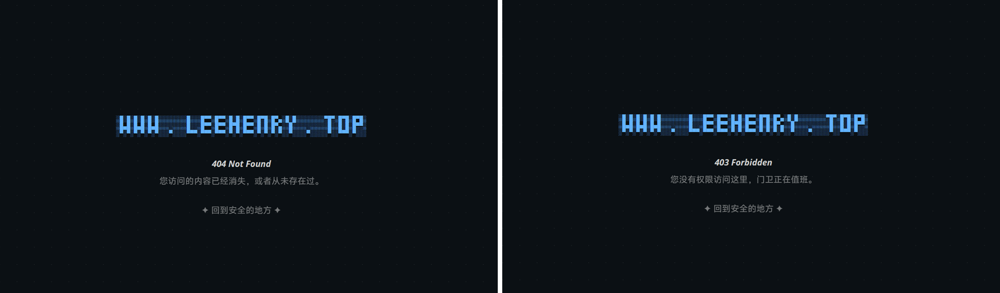
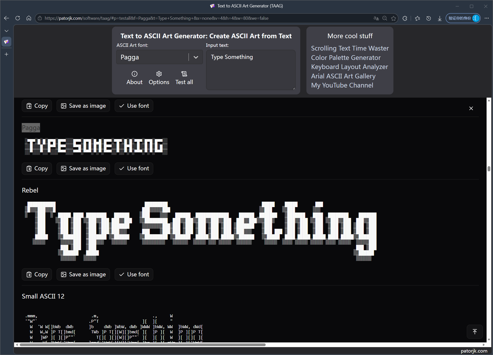
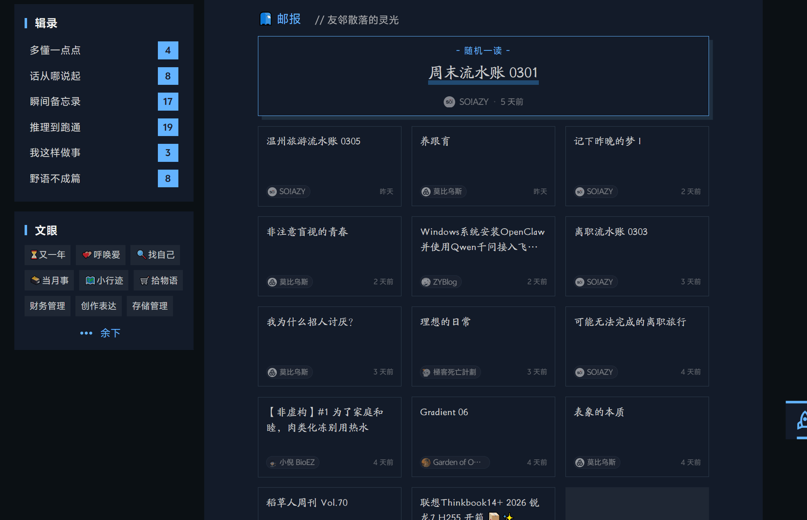
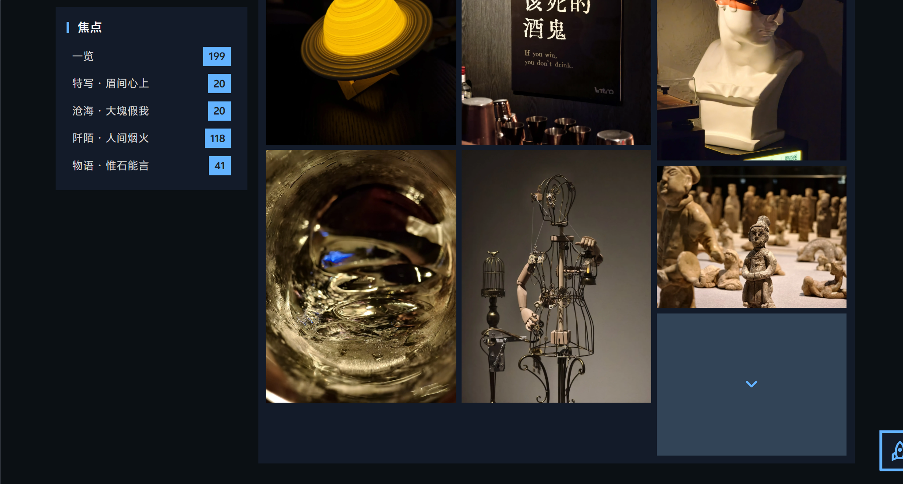
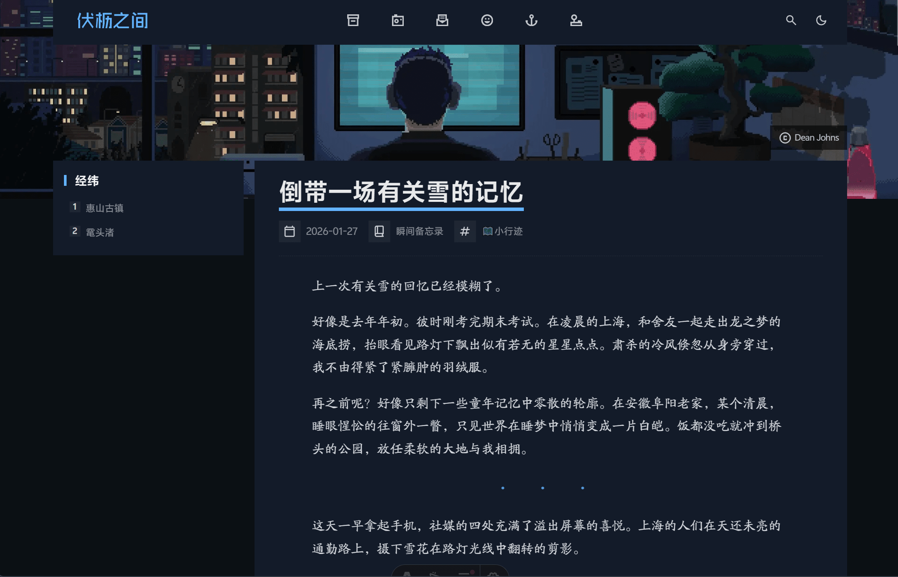
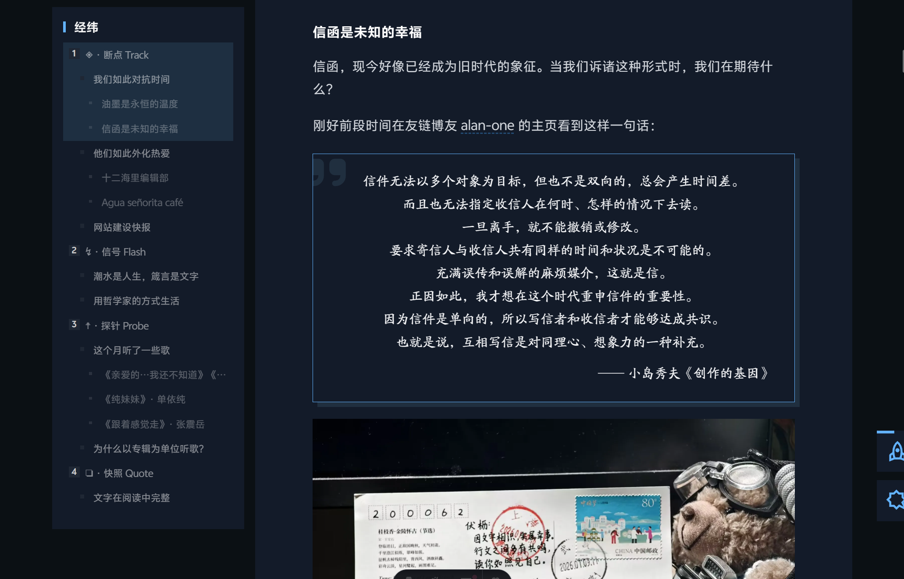
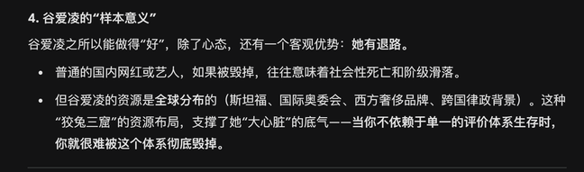
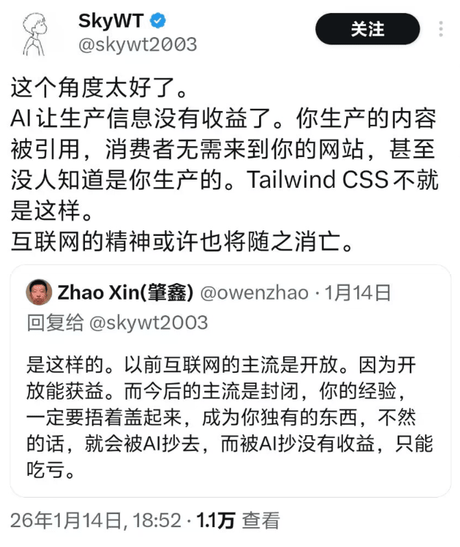
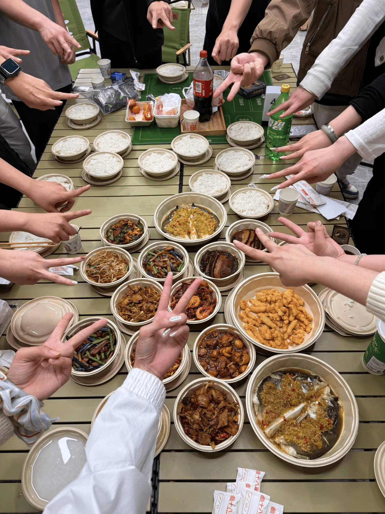

这行字敲于 2026 年 2 月 28 日 的凌晨六点，惊愕中发觉二月已经来到最后一天。

二月，刚好横贯我的整个假期。与中学老友们重聚，和家人为新年奔忙。节庆的喧嚣淡淡的开始又匆忙的结束，徒留遥远的耳鸣。本来就短的二月在忙碌中流走，一晃眼，已经到了准备离开的时候。

在又一个深夜新建 Markdown 文档，想着把月刊在最后一天赶出来，没料到光是整理素材就花了六个小时。应该赶不到二月发表了，写到哪就算哪吧。（~~从飞机上写到书桌前，还是陆陆续续又写一周。月刊就这样慢慢滑向了节气刊~~）

祝你我新的一年也是个好年。

## ◈ · 断点 Track

### 这样拌饺子馅很好吃

今年回家发现这次家里自己包的饺子很好吃。最大原因应该是葱姜花椒碎料不会拌匀在酱料里了，口感细腻顺滑很多。

在除夕夜陪家人一起包饺子的时候偷学了一手配方。

> 1. 秘诀在于第一步：往葱丝、花椒与姜丝加入 80℃ 开水，静置后只留水，去掉渣。这样后面就不用另外加入调料，导致影响口感了。
>
> 
>
> 2. 把葱姜花椒水拌到肉泥中，可以加个蛋，往一个方向搅拌均匀，直到「上韧」，这时候肉看起来有一种「温顺的阻力」；
>
> 3. 调味。若 3 斤左右馅料：
>
>    - 生抽酱油 3-4 勺；
>
>    - 蚝油 3 勺；
>
>    - 老抽 1 勺；
>
>    - 盐 2 勺；
>    - 白芷十三香和鸡精适量，大致均匀撒在表面上；
>
> 4. 继续搅拌均匀；
>
> 5. 准备馅料，香菇肉馅为例，把香菇剁成粒，与大小葱末混合；
>
> 6. 搅拌均匀，馅料准备完成。后面就可以包饺子啦！
>
> 

### 网站建设快报

月刊的一些小惯例。

重新设计了 403 和 404 错误的重定向页面。

支持亮暗配色自适应，设计灵感来源于 [鹅玉](https://ro3or.com/)。其中页面中心的 ASCII 字符画使用的生成器是 [这个网站](https://patorjk.com/software/taag/)。网站有着非常丰富的预设，我选用的是 Pagga 。

[友邻](https://leehenry.top/friends/) 增加了「友链邮报」的区块，用来按时间展示朋友们最新的文章，起到一个简易信息聚合的作用。

> [!TIP]
>
> 「随机一读」是可以点击的按钮~

实现方式是在服务端自部署了 [Friend-Circle-Lite](https://github.com/willow-god/Friend-Circle-Lite) 的组件。每天的凌晨三点会通过定时任务 `crontab` 自动遍历 RSS 链接抓取最新文章，储存为 JSON 并上传，前端读取 JSON 信息实现热更新。

实际上整个过程中的绝大部分是听 Claude Code 的话一步步跑通了技术上的流程，最后自己调整了前端的设计，和前面的友链卡片保持整体性。

重写了 [光影](https://leehenry.top/gallery/) 的瀑布流加载逻辑。之前 [薯泥](https://blog.marshuni.fun/) 反馈过图片批量加载过多影响显示体验的问题，经过苦心积虑的思索，现在每次显示一批次 12 张图片，使用按钮展示更多。现在访问体验更好了一些。前面的「邮报」区块也继承使用了类似的加载方案。

Serif 字体一致性。通过内部引用设置，现在网站使用的 Serif （衬线）字体被统一为「方正北魏楷书简体」，用于短句的引用块与一些随笔。

## ↯ · 信号 Flash

### 谷爱凌到底是不是「雇佣兵」

> **W 君**：（最近竞技体育相关的贴吧战火四起。）大家的讨论充满了原始厮杀本能的「竞争」，拿金牌的就是 slay 可以掌掴其他人，下一场输了就要被掌掴被骂，完美体现竞技体育的竞争残酷性所在。在这里可以看见纯粹的人类欲望。
>
> 
>
> 不过刚刚吧里也有很多人对雇佣兵谷爱凌表达了认可（我倒是不太关注冬奥会，这刷新了我的认知），他们盛赞谷爱凌的大心脏，在各种争议中仍然保持高水准输出，竞赛风格畅快，性格外向，很有巨星风采。
>
> 我自己的看法是，竞技体育是一种代替战争以激发人们心中潜藏的战斗、嗜血本能的温和战争表演，所以我觉得竞技体育的存在本身就是邪恶。所以在这里见到最纯粹、最原始、最下贱（？）、最歧视的各种黑吹婊骂战，是符合我的心理预期的。与之相对的微博则是死人感满满，全是机器人的感觉，真说不上来哪个更好一点。
>
> **伏枥**：我想，人类的某些原始的冲动总要有地方抒发，血腥暴力的电影、犯罪惊悚题材的小说乃至当代对抗性的竞技体育，是一种文明时代的野蛮表演艺术，总不能真的像野生动物一样争的你死我活吧。如果说竞技体育的存在本身就是邪恶，那也许人本身就是存在邪恶的一面，竞技体育将这一面文明化、温和化、艺术化了。
>
> ---
>
> 关于这个「雇佣兵」的定义，我自己对她没有太多的恶意，建立在一个相对中立的立场上，如果进一步细谈，我在思考这些事情：
>
>   1. 谷爱凌在中美双国籍中选择了中国国籍，她的这个行为可以成为反对「雇佣兵」的说辞的力证吗； 
>   2. 如果谷爱凌是「主动选择」在中国接受运动素养的培训（也就是说用的是中国的资源），可以成为反对「雇佣兵」的说辞的力证吗；如果在前期使用美国教育资源，后期使用中国教育资源，会对这个价值判断造成什么影响？
>
>   3. 如果谷爱凌是在中国官方性质的运动协会运作下「被动拥有」为中国争光的身份，成为某种意义的 Propaganda idol ，因此称她为「雇佣兵」。这样的推导合理吗；
>   4. 谷爱凌无论如何都有美国的血脉，所以永远在出身上不纯粹，因此无法正名「雇佣兵」的身份。这样的论断成立吗；
>
> ---
>
> 当然我认识到，当人们讨论时给谷爱凌贴上「双面间谍」「雇佣兵」的标签时，字面意思是否合理往往不是重点，而是通过攻击这样的符号来快速在一个团体中形成意见的共识，这个团体会在预设共识合理的前提上，将它作为跳板来同仇敌忾地攻击一些其他的东西，背后实际的问题可能是阶级固化、资源分配不平等、经济形势恶劣云云。
>
> 因为这些问题客观存在，所以大家标签所代表的某类人更容易产生怨恨。类似的说法还有「赛博丁真」，我认为这是对丁真的怨恨转嫁到对何同学的怨恨。 
>
> ---
>
> 此外，我认为一切以「暴露在公众面前」为重要属性的职业，不管是热点运动员、网红、明星，还是自媒体的意见领袖，做到「称职」的重要条件，就是能以健康成熟的心态去面对千万张嘴——不迷失在夸赞中，不陷入在批评里，永远做好该干的事情。
>
> 人们 「盛赞谷爱凌的大心脏，在各种争议中仍然保持高水准输出，竞赛风格畅快，性格外向，很有巨星风采」，那谷爱凌在这一方面做得很好。但这是她该干的，干不好就得倒牌滚蛋，由不得她。但话又说回来，在当下「讨厌你就要毁掉你」的舆论倾向下，这个能力会更重要，同时也更被动，在足够恶劣的极端情形下，心脏再大也于事无补。 
>
> 另外，我把这个思考喂给 Gemini，它有一句话我觉得有点意思：
>
> 
>
> 「当你不依赖于单一的评价体系生存时，你就很难被这个体系彻底毁掉。」 这让我想到之前玩原神的一个 up 主，因为在开荒的过程中吐槽非常好玩，起号大成功，我自己也很爱看他的实况。在那个鼎盛阶段，他全职做自媒体都能完全养活他，但他只当做副业和兴趣。后来，因为对一个争议角色的评价难以让社区满意，口碑大幅滑落，那段时间从 B 站到贴吧对他的攻击井喷。他选择是不解释不争论不下场，直接停更消失。就是因为他现实中有正事要干，所以他根本不在乎。 
>
> **W 君**：我的想法是，竞技体育这个东西坏得很，大家还要一起宣传竞技体育的什么体育精神，赞美运动健儿在赛场上的奋斗——有点像赞扬军官在战场上杀了多少人。 至于一些围绕着竞技体育的乱象，我觉得那是因为竞技体育本身就歪了，他的设置就是为了让人能不受肉体伤害地互相讨伐。我可以赞美体育精神，奋斗、不放弃、努力，或者全民参与体育的精神，或者友谊第一、世界各族人民大团结的精神。但是竞技体育的这种竞争性，残酷的训练对运动员往往会造成终身损伤，与资本捆绑的体育，与民族荣耀捆绑的体育，以及竞技体育的根基——胜负的判定，胜者为王败者为寇，让我难以直视。
>
> 我听说，人的心理状态会大幅影响人的肉体状态，经常会出现一些有天赋的运动员，但是缺乏抗大赛的心理素质，所以这个能否在争议中稳住自己的心态，是一件可能比我想的更难得事情。比如混血网球运动员大阪直美，她已经得抑郁症了，也影响了自己的成绩。
>
> 谷爱凌和林孝埈那种归化的球员还有一个小小的不同，当时是说她疑似持有双重国籍的待遇，然后中国这边官方说法并不承认双重国籍，再加上她比较高调，自然也会有非议，这倒是正常的。现在怎么样我倒是不知道了。理论上，归化后的运动员能跨越血统为他国效力，全部是雇佣兵，既然体育赛事的制定者允许这种情况的发生，我也不想说什么。 
>
> 还有就是国内人对于移民的看法和外国人的看法可能不一样。外国人持有双重国籍，从自己的祖国移民到美国、英国什么的，可能没有太大的精神负担，中国人这边则是比较复杂，叛国加上羡慕润人过上好日子的嫉妒，让舆论场变得更复杂。同样也因为中国是个汉族为主的国家，有强的文化和历史，民族等于国家的概念也深入人心。这似乎是一个太宏大的话题。
>
> 谷爱凌作为运动员，核心还是夺金，夺金了就有商务，没夺金会被骂死，商务断了她的训练会不会受到影响？毕竟她的项目都是很烧钱的。顺带一提，因为谷爱凌的夺冠，国内也增加了对 U 型池的训练，今年是谷爱凌金另一个中国选手银。
>
> 说起二游确实也是一个粪坑。现在不是：我不喜欢这个，我不玩这个。而是：我不喜欢这个，我们来一起把他搞死。关于最后一点，我觉得可能是因为互联网大浪淘沙，简单、好记、特点鲜明的词会被留下来，大家用「赛博丁真」这四个字的压缩包指代自己对何同学绣花枕头一包草，中看不中用的鄙夷。
>
> **伏枥**：我懂你的意思。不过想补充一个视角：胜者为王败者为寇，这种野蛮的黑暗森林并不仅仅在竞技体育的赛场中发生，但竞技体育有着相比于其他场合更透明的规则，大家都在明面上比，是公平的。 至于游戏残酷，也是因为它任舆论去为胜者欢呼。
>
> 在中国的语境之下，移民是一个太遥远的词。当我们看到一个国际上两头占好处的人，当然会本能的反感。但就像你说的，谷爱凌的立身之本不是讨好舆论，而是夺金。这个是明星运动员相比于其他公共性职业不同的地方。当公共人物需要靠舆论这碗饭吃饭，那么就会更加的被动，比如其他的明星或者自媒体。
>
> **W 君**：我觉得也不一定公平哎，最能凸显公平的可能是田径，读秒不可能读慢（此时路过一个被封杀的女子），乒乓球之类的运动，为了创造出公平的胜负（我这里用创造这个词，引人深思），人为制造着复杂而费解的规则，其结果到底公不公平还很难说。更不用说一些打分的比赛，跳水、花滑。
>
> **伏枥**：虽然在结果上不一定 100% 公平，但是在立场上当然是公平，不然没有人来比了。或者说他在传达一种公平的价值观。这个公平是相对于其他比较黑暗的成人世界来说的。
>
> **W 君**：我认为这个竞技体育的源头，以一方胜过另一方为这个活动的最终目的和最大结果，我是有点反感的，这种公平我很难欣赏？这算是我的个人审美倾向了，有时间我再细化一下。对我来说**竞技体育是一种以他人无法自我实现为代价来进行自我实现的玩法，所有的残酷和光辉都来自于此，在同一个毛孔里流出来。**
>
> **伏枥**：竞技体育的前身我猜想是古罗马那种真正的你死我亡的斗兽场。从另外一个角度来说，如果没有竞技体育，人类就永远不知道自己的身体能够达到什么样的极限。我认可这种形式存在，但我坚定的认为我不会走上类似的路。
>
> 我想，高考某种程度类似的角色。力求形式上公平，但是不是真的公平非常有待商榷。
>
> **W 君**：啊啊啊高考在公平方面……但是高考还受到复杂的社会、政治、地缘的因素影响。好吧好像没什么东西不是这样的。
>
> ---
>
> 对了，体育赛事也能汇聚金钱。顶尖运动员必须要烧钱。如果没有烧钱没有训练，很难达到国际水准。体育不是随地拉一个扫地僧就能拿冠军的，要系统的训练。
>
> **伏枥**：喜恶同因的零和博弈。运动员本身也会有类似这样的心理：这么多钱花在自己身上了，不跑出个结果那岂不是对不起全国人民。运动员一方面享受着关注，以及由此带来的金钱和名声，一方面又难逃它作为压力的反面。
>
> 另一方面，竞技体育确实是一个可以代表综合国力的符号，背后考验的是整个国家能不能筛选出顶尖的体育人才，以及有没有资金培养出来。
>
> **W 君**：一个衍生思考，就是因为《歌手》引入了排名淘汰，所以关注度暴涨，大家喜欢看到人和人厮杀。观众投票决定歌手名次的这个事情哪怕再蠢，只要引入了淘汰机制，总是能勾起人心中的战斗本能。要是拉八个歌手开一次主题演出…… 0 人 care （夸张）
>
> 再哲学一点的说，<mbr>**人们总希望万事万物有个「结果」，这样方便人们孤立静止的理解事情。**<mbr>始终用发展辩证的观点看人看事是很累的。
>
> > - 小王家的孩子怎么样了？
> > - 现在正在全面发展中～
> > - 所以是怎样哦！
>
> **伏枥**：有道理哦。竞技体育能够存活至今的根基，也是因为零和博弈先天就能引起关注度。没有关注度，其他什么都是假的。另外接触竞技体育，哪怕不知道复杂的规则也可以参与讨论，知道谁输谁赢就可以了。

### 使用术语到底要不要足够精准

之前，与 W 君讨论社媒舆论话题的时候，我从观察到的失控现象出发，尝试总结它们恶化的共性逻辑，论证：为什么「[理性讨论似乎只能小范围存在](https://leehenry.top/posts/words_in_wildness/ww-vol03/#%E7%90%86%E6%80%A7%E8%AE%A8%E8%AE%BA%E4%BC%BC%E4%B9%8E%E5%8F%AA%E8%83%BD%E5%B0%8F%E8%8C%83%E5%9B%B4%E5%AD%98%E5%9C%A8)」。探讨的初衷是我想要和他确认我总结的逻辑是不是全面的、严谨的、有效的。

那时我使用了类似「投射」「符号」「语境」的术语来指代过程中的抽象概念。即使我通过修改措辞、补充例证来企图让道理被表述清楚，但 W 君一直不太理解。后来这个话题被弃置，焦点偏移到了术语的使用上。

W 君坚持：**术语是压缩好的语境包**

- 已经在学界形成广泛共识的术语，自带定义、范畴和研究背景；
- 使用术语就是为了避免重复交代语境，误用术语会造成误解并污染讨论空间；
- 文字工作者有义务在使用前掌握术语，或另起名字加以区分；
- 对表达准确性的较真是一种负责任的态度，而非苛求。

我的立场是：**语境应该优先于术语**

- 术语本身没有固定、权威的语境，它的意义取决于使用场合；
- 只要在使用前申明自己的定义和讨论范围，就是负责任的表达；
- 完美的术语理解不是表达的前提，观点的迭代和修正是自然的过程；
- 一直纠结术语是否「正确」，会喧宾夺主，盖过真正有价值的思考。

在这次没有争论出结果的辩论后，我时常会反思自己表达的问题。

首先，我仍然认为 <mbr>**[保持对经典作家观点的距离感和模糊感，重要的不是「精确」或「系统」把握他们的观点，而是利用他们的核心概念或洞见发展自己的思想](https://leehenry.top/posts/words_in_wildness/ww-vol06/#用哲学家的方式生活)**<mbr>，是一种以我为主、对自己负责的学习与思考方式。但在此之后，我会多两条追问：

- 使用术语时，我能否用自己的话解释清在语境中的意思；
- 使用术语后，预期面向的读者能否通过它还原我的本意。

第一条用来反省自己，我对这个术语是理解之上的借用还是真的误用，第二条是因为现在我认识到，对于一段论述，当本意无法还原、语言成为壁垒，这样的表达就很有可能是低效乃至失败的。

> **伏枥**：读到了一篇可以跟我们过去的一次讨论呼应的的一篇文章叫做[《理论的傲慢》](https://onojyun.com/2026/02/20/理论的傲慢/)。和我们上次类似，作者 ONO 在和朋友的一次讨论中，对方在功利主义还是效用主义的用法上僵持不下，模糊了本来的对话焦点。文章在复盘这件事后延伸了关于 AI 和词语精确性的一些思考。
>
> 作者说，从文学的角度上来看，「随意组合辞藻」体现的与精确用词相对的「撒谎」和「不诚恳」也是有正面价值的。词语的化合能够带给人思考的留白。这样看来，精确用词与否，在文学性的场合和科学性的场合，有着不同程度的坚持。
>
> 至于我们上次关于用词的讨论，现在我又有了一些新的想法。因为我当时在总结一个结论性的东西，那么你不理解它，一方面可能是我的**用词的模糊和不严谨**导致的，另一方面你后来提到，**我们的知识背景不同**也是一大因素。现在我觉得还有一个更重要的原因：当时我在提出这个结论之前，**缺乏了共识的建立**，直接提出了某个我针对我过往经验得出的观察，但我的这个过往经验并不能等同于你所看到的。如果我想把这个结论做得更可靠和容易理解，我应该在前提和共识上花更多的功夫。

### 为自己而写还是为他人而写

关于写作（或者说在博客上写作），有个话题困惑了我很久：我应该「为自己而写」还是「为他人而写」，我对这一判断又是否真的发自内心的诚实。

我常读的有着持续输出习惯的博主，对这个话题多少有一些自己所坚持的观念。带着问题找答案，最近留意了他们对于这个问题的思考。

> 对我来说，「有感而发」是写作中非常重要的一个状态。因为灵感往往转瞬即逝，时间的滚轮无情地推进，当下的感受和想法如果放着，很容易就流失掉了。即使过段时间再记录，可能很快就没有当初的鲜活了。
>
> ---
>
> 我好像从来不焦虑自己写的东西有没有人看。我常会想起卡夫卡。
>
> 卡夫卡热爱写作，却不以发表小说成为名作家为目的，临终前，卡夫卡特意嘱咐恋人将他写的东西全部一起烧掉。他纯粹是把写作当成人生的寄托，通过写作来寄寓自己的思想感情，排遣内心的忧愁苦闷。
>
> 每次想到这个就觉得很受慰藉，在这个层面，我和卡夫卡是同类人。
>
> 🔗 *Link:* [2025 Week 41~42 | 金色河流](https://goldenriver.site/posts/2025-week-41-42/)

> 在这一年多的实践中，我发现碎片化的感触和能够转化为文字的深度思考完全是两回事。日常生活中我们会有很多转瞬即逝的想法，如果不去刻意捕捉、加工和推演，它们很快就会消散。
>
> ---
>
> 今天的这种「写不出来」，其实是思维懒惰发出的警示。它提醒我不能为了维持更新的天数而强行拼凑，没有灵魂的文字打动不了自己。
>
> 思考确实太重要了，它是维持表达欲望最核心的燃料。在未来的日子里，比起刻意「找时间写」，我可能更需要「找时间想」。只有思考跟上了，文字才会自然而然地成型。
>
> 🔗 *Link:* [日更博客的真正门槛 | So!azy](https://blog.solazy.me/20260116/)

> 从写作者，也就是自己的角度思考，博客应该写「自己想写的东西」，写「有感触的东西」。写作是为了满足 [自我外化的需求](https://www.geedea.pro/posts/自我外化与表达欲/) ，而不是完成作业。
>
> 从读者的角度思考，博客应该写「别人愿意读的东西」。这就不太好把握了，因为青菜萝卜各有所爱，什么东西都有人愿意看。你可以想想看你愿意让什么样的人读自己的文章。如果你认为写博客不是给别人看的，那不管别人也没问题。
>
> 你也可以把自己当作读者来思考。当你在读别人的博客时，你希望读到什么样的内容，你读到什么样的内容会觉得无聊。比如我想要读到真实的经历和体会，就算是抱怨也会觉得有趣，我还想要读到个性十足的观点，让我认识到对方是一个真实的人。那么，我自己在写作时，也会尝试往这个方向走。
>
> 🔗 *Link:* [我会带着我的观点下地狱去 | 极客死亡计划](https://www.geedea.pro/essays/我会带着我的观点下地狱去/#写博客写什么)

> 明确博客的目标是首要的。为什么要写博客？写博客只是业余活动。这就决定了，不应也不会为之投入太多的时间和精力。为了把博客写好，我们肯定要使读者轻松易懂。我认为，一般而言，博客的目标应当是这样的：通过写作来提升自己的思考，**附带地**对公共有益。
>
> 假设我是一个学习哲学的研究生，经常阅读并思考一些问题。于是我就把某段时间深入思考的问题写下来。一方面，这样做的好处是，通过写作，整理了自己的思想，使之清晰，使之固定，使之成熟。写博客最大的受益者必须是作者本人。另一方面，在写作的过程中，我还需要考虑，既然把这篇文章公开，而不是放在自己电脑硬盘里，那么读者会有什么收益？
>
> 第二个问题其实是第一个问题的另一个侧面。写作是一种对话，不是自言自语。思考如果只是自言自语，也永不会清晰。这里的主要问题是，首先，什么人会对我讨论的问题感兴趣，其次，他们一般的想法或见解是什么，最后，怎样才能使目他们能够轻松理解。
>
> 🔗 *Link:* [如何写好博客？（或如何写好文章？）| 2750 words](https://pathos.page/blog/how-to-write-blog/#写作目标)

> 博客是一种[「在公开中学习」](https://farland.vip/2022/04/29/learn-in-public/)。人们藉由公开的思想表达，互相学习，互相批判，最终进入更完善的认识阶段。因此，公开写作也是自我监督，督促自己走向真理。
>
> 🔗 *Link:* [博客网络 | 松易涅的写作分享站](https://www.sungyinieh.com/blog-network)

> 我一直深受一句话的影响，是一位美国的编辑写下的一句话：一位作者的立身之本并不是技巧，而是他写作的意愿和欲望。以至于别人在问起我为什么要写作时，我只能用一句无奈于无法通过技巧获得成功的、但是又高度浓缩了意愿和欲望的结论回答道：「我喜欢写。」
>
> 🔗 *Link:* [我可能是个疯子 | 莫比乌斯](https://onojyun.com/2026/01/19/我可能是个疯子/)
>
> ---
>
> 博客是一种公开的展示窗口，无论你的目的是建造一个流量博客、还是自话自说的博客，**一旦公开就不可能忽略「社交属性」的存在——公开带来的必然结果就是引起与他人关系的构建。**
>
> 🔗 *Link:* [写博客的目的性与社交的目的性 | 莫比乌斯](https://onojyun.com/2024/01/12/写博客的目的性与社交的目的性/)
>
> ---
>
> **独立博客的「人设」功能，迫使它需要按照某种「姿态」去表达自我。**<mbr>哪怕是对现实的抱怨，也因为有了一层对外展示的需求，而自然而然地附着上了「表演的意图」，目的是为了获得肯定、赞美、关注这些站在聚光灯下才能得到的东西——我当然也有表演的意图。大部分时候我在现实比博客上的「人设」更嘴毒，总喜欢拆解底层逻辑。但是在建立社交关系之中，这种人设又会慢慢褪去变得无下限的有趣（但是还是很少会提供情绪价值）。起初，我可能还会考虑自己的哪句话会不会惹到别人，这么三年过去了，**我发现与其去新建一个「人设」努力地维系他的表演性，不如就让把博客当做是我现实折射的一部分**——所以，就会说更多难听的话和真相，惹到更多人。
>
> 🔗 *Link:* [无聊的中文博客圈 | 莫比乌斯](https://onojyun.com/2024/11/22/无聊的中文博客圈/)

> 特德·姜說，儘管 ChatGPT 可以完美地模仿人類寫作，但：
>
> > 「想要表達自己想法的掙扎永遠不會消失，每當你開始起草一篇文章時，這種掙扎就會出現。而只有在親自寫作的過程中，人才能發現自己最初的想法。」
>
> AI 會取代人類的重復勞動與陳詞濫調。最終留下珍貴體驗的，是我們自己。
>
> 🔗 *Link:* [簡介 | Zoeash](https://writee.org/atzoeash/jian-jie)

我很能体会这种在起草文章中与某种「挣扎」对抗的心情。

在 [金色河流](https://goldenriver.site/posts/2025-week-25-26/#%E5%86%99%E4%BD%9C%E7%AE%B4%E8%A8%80%E4%B8%89%E5%88%99) 读到一则写作箴言：

> 
写作之难，在于将网状的思想，通过树状的结构，用线性的文字展开。

——史蒂芬·平克

当我开始讨论一个话题时，Brainstorm 是网状的，发散混乱，天马行空；文章的组织是树状的，我需要考虑结构如何搭建、话题如何聚焦；最后写成一行行的文字，它变成了线性，我需要关注从一句话到一个段落，能不能清楚的表明我的意思。

哲学一点的说，宇宙自发会倾向于熵增，而写文章是一种让思维熵减的过程，为了对抗自然的力量，需要迫使自己不断地思考、推敲、揣度，最后才能让想法具体成独立的文章。

我想这也是文章和笔记的区别，笔记可以允许 Brainstorm 和混乱的发生，但一篇文章理应是成为想法清晰化的结果。具体、清晰和固定是在写作的过程中对自己的要求。**这个过程中充满了对想法的取舍和对内心的叩问，挣扎就在其中发生。**

---

到此为止，关于「为自己而写还是为他人而写」的话题，我想可以为我的态度初步做个简明的总结：

1. **内容上，为了自己而写**。博客是我思想与人格的外化，我通过这种方式来主动让阶段性、流动性的思想固定并成熟。我有划定主场、自我展示与表达的欲望，也有持有我的观点与外界接触与交换的社交需求。这个过程中，我理应是最大的受益者。
2. **形式上，为了他人而写**。精准、易读与有益是读者能够真正触及自己观点的敲门砖。公开写作中，总是考虑到读者的阅读体验，是负责任的写作者应有的姿态。我会在文字的「易读性」和选题的「利他性」上自我审查。当然选题的「有益」是广泛的，我持有最大解释权。

### AI 如何摧毁创作者

> 

> 只有在 AI 刚出现的时候，我们才会让它与人类棋手对弈，争个胜负。现在，马车早已退出比赛；人机对弈也成了历史一幕，不再需要公开比试。
>
> 压力，从马车身上卸下，落到了棋盘上；又从棋盘上，落到了人类更珍视的领域——写作。也许只有在今天，我们还会认真讨论：这篇文章，是人写的，还是 AI 写的？ 等再过三五年，AI 再进化一轮，或许大家就不会太在意——这是谁写的，又有什么所谓？
>
> 对大多数食客而言，饺子好吃就行，谁包的并不重要；更何况，大多数人也吃不出差别。
>
> 🔗 *Link:* [如何肉眼识别AI文章？- 虎嗅网 | CxEric](https://www.huxiu.com/article/4447044.html)

图灵测试 —— 在黑盒后的 AI 能否「骗过人类」—— 决定了以前人与机器的某种界限。更广泛的说，判断力是人类赖以生存的重要特质，如何判断危险、如何判断同类，从而趋利避害。这是写在人类生存法则中的技能。

当 AI 慢慢变得无法被判断，能被图灵测试的界限已经不复存在。与此同时，AI 正在粉碎各个领域在大众视野的严肃性与专业性。当人们预设 AI 能够生产一切「已经差不多够用」的内容，便无法判断「你是否为当前的内容投入了巨大心血」，我想这对创作者存在价值的挑战是灾难性的。

悲观的看。在 AI「真正」强大到可以替代人之前，创作者可能已经早早被那些「认为」AI 可以做到的人的声音淹没了：「AI 能快速解决的东西，你在这上面花心思还有什么意义？」

**AI 降格人类的开始，来自内部对同类尊严的践踏。**

## ☨ · 探针 Probe

### 聪明人如何向上管理长辈

> 🔗 *Link:* [294-一个聪明的中年人如何向上管理长辈？- Apple 播客 | 独树不成林](https://podcasts.apple.com/cn/podcast/294-一个聪明的中年人如何向上管理长辈/id1711052890?i=1000746794274)

过年期间，信息流中有一大类主题显著增加：**被迫与长辈社交的痛苦**。

这次回家，遇到与长辈观点不一致的时候，我发现自己情绪稳定了很多，不再因为矛盾争得面红耳赤，反而会抽离出来，站在更高一层观察长辈的「权威」具体如何体现在交流中。

> 观察到以我爸为代表的老一辈与晚辈的交流底层代码：
> 1. NPD 倾向，强加意见，我行我素，不在乎他人的拒绝；
>    - e.g. 他认定的菜一定要夹给你，不在乎你到底想不想吃；
>    - e.g. 想让你做某件事时，不在乎你当前有没有更重要的事情在做；
> 2. 不会尝试理解你的观点，下意识反对，固执坚持一套框架；
>    - e.g. 对任何一个观点，不假思索的回复「不是 A（观点的关键词），B（复读一遍自己的想法）」；
> 3. 当话题来到自己不熟悉的领域，无法做出评论，将直接打断并粗暴的切换话题，永远把握话题的主导权；
> 4. 用「不是我说的，是我某个朋友说的」为自己的想法背书，以达到无需为观点负责的目的，尽管该朋友表达的极大可能不是这个意思。
>

刚好收听了仲树老师的第 294 期博客，仲树观察了她妈妈作为一个中年人和长辈相处的方式。当她的子女在离婚官司中周旋、长辈因车祸病危住院时，还能心态平和的保持生活的节奏和步调。

把她妈妈的生活智慧用理论解释，其实就是「课题分离」。播客的评论区再次提到了那句来自《尼布尔的祈祷文》的经典表述：

> 
请赐予我勇气，改变我能改变的。 请赐予我平静，接受我不能改变的。 请赐予我智慧，让我知道如何分辨这两者。

### 运动如何自然嵌入生活

> 🔗 *Link:* [296-练一千小时瑜伽给我生活带来什么改变 - Apple 播客 | 独树不成林](https://podcasts.apple.com/cn/podcast/296-练一千小时瑜伽给我生活带来什么改变/id1711052890?i=1000747052409)

假期重拾健身。在 [错峰勇闯健身房：新手三分化健身笔记](https://leehenry.top/posts/step_by_sense/ss-vol02/) 中详细介绍了这期播客的内容。总之，对自己最大的期待是仲树老师提到的理想状态：**让运动生活化，一切都在同一条呼吸线上发生**。

不过现在回到上海，最大的困难居然成了出门 —— 裹紧衣服，克服刺骨的寒风，对意志力是更大的挑战……

### 一个色彩参考网页

> 
>
> 
>
> 🔗 *Link:* [Beautiful themes for shadcn/ui — tweakcn | Theme Editor & Generator](https://tweakcn.com/)

一款**专为 shadcn/ui 打造的开源可视化主题编辑器**，基于 TypeScript 开发，无需注册即可在线使用，能大幅提升 UI 设计与开发效率。

对我来说最有用的是它提供的 43 套精心设计的主题预设。可以在线应用和预览效果，可以对浅色 / 深色模式颜色分别定制。可以作为不错的网站配色参考。

## ❏ · 快照 Quote

### 不明所以的 Emoji

> Emoji 来源于日语「絵文字」（えもじ），即「图画文字」的意思；而颜文字（emoticon）其实是 emotion 和 icon 的拼合词，两者长得像纯属巧合。
>
> 📛：其实是日本幼儿园小朋友的姓名牌，红色边框是郁金香造型，中间留白用来写名字。不了解这一文化的外国人解读成了「燃烧的豆腐」，tofu on fire 。而这个称呼反而被日本网友接受并喜爱，衍生出了各种周边。
>
> ♨️：是日本地图上的温泉 / 矿泉标识，下方的弧形代表热水池，上方的波浪线是蒸汽。没有温泉文化的外国人可能认为是铁板烧甚至咖啡店的标识。
>
> 〽️：这个符号叫「安典尤里（あんてなゆり）」，用在日本传统乐曲的乐谱里，标记段落划分和歌词起始位置，现代也会用来区分正文和歌词，功能有点像音符符号。
>
> 🉐「得」在日语里表示划算、占到便宜；🈹「割」则代表折扣，日语里「一割引」就是打九折。🈶🈚「有」「无」在日本本意是收费（有料）和免费（无料），日常口语里也可以和中文一样，表示字面意思的「有」和「没有」。
>
> 💮：是对小朋友的夸奖，意思是「做得棒极了」，造型来自日本老师给学生盖的奖励印章。日本小学老师会用不同的圆圈评价作业：单个红圈表示还不错，双层圆圈更进一步，而最高等级是花丸（はなまる）—— 一个带花纹的圆，类似于中国老师给的小红花。
>
> 🔗 *Link:* [【Emoji】原来这些表情居然是这个意思！- B 站 | 暴躁柠檬鸽子亦](https://b23.tv/tfIA5MN)

### 海内「存」知己在「存」什么

> 温存，指殷勤抚慰、温柔。【其中「存」字，指恤问、劳问、问候。】《说文》：「存，恤问也。」  唐韩偓《寄湖南从事》：「莲花幕下风流客，试与温存谴逐情。」韩愈《雨中寄孟刑部几道联句》：「温存感深惠，琢切奉明诫。」这些是【较早的用例，指抚慰、体贴，为动词。】  
>
> 时代往下，「温存」一词整体引申出形容词的「温柔」意。如《红楼梦》第五十八回：「每日演那曲文排场，皆是真正温存体贴之事。」  【「存」的「恤问、劳问、问候」义其实并不罕见。】曹操《短歌行》：「越陌度阡，枉用相存。」李周翰注：「存，问也。」  另王勃《送杜少府之任蜀州》有：「海内存知己，天涯若比邻。」此句中「存」字，也有学者认为是「恤问」之意，亦可备一说。
>
> 🔗 *Link:* [「海内存知己」的「存」是什么意思？ - 小红书 | 小叶栀子爱文史](http://xhslink.com/o/5WcHR93sXER)

### 收集一些出版社的 slogan

一位博主收集了各大出版社的 slogan ，短短一句话高度浓缩了一家出版社的精神气质。下面摘选了一些我觉得比较有意思的。

| 出版社         |                   标语                   |
| -------------- | :--------------------------------------: |
| 译林出版社     |          不过坏日子，不读坏东西          |
| 樂府           |          心里满了，就从口中溢出          |
| 果麦           |           以微小的力量推动文明           |
| 新星出版社     |       感谢你把百无聊赖的黑夜交给我       |
| 后浪出版社     |               先读书，后浪               |
| 一页           |            始于一页，抵达世界            |
| 理想國         |              想象另一种可能              |
| 人民文学出版社 |            古今中外，提高为主            |
| 商务印書馆     |  数百年旧家无非积德，第一件好事还是读书  |
| 磨铁           |                跟文化死磕                |
| 上海译文       |               有我世界更大               |
| 大鱼           | 让日常阅读成为砍向我们内心冰封大海的斧头 |
| 凤凰文艺出版社 |         唯有书籍能抵御时间的磨损         |
| 花城出版社     |       独立精神、人文立场、新锐主张       |
| 午夜文库       |            阅读之前，没有真相            |
| 单读           |       在宽阔世界，做一个不狭隘的人       |
| 读库           |        我们把书做好，等待您来发现        |

> 🔗 *Link:* [喜欢收集各个出版社的 slogan - 抖音 | 刺桐与荒原](https://www.douyin.com/note/7609580020646620337)

### 我是我和我的连接

摘选自朋友圈一位朋友的生日总结。我很喜欢这句「我是那些我拥过的余温」。可以是「人的本质是一切社会关系的总和」的一种文艺化的阐述。

> 因为自己活得很努力很累，所以也知道大家在同样的百忙之中，还能有心执行祝福，实属应该跪拜叩谢的慈善行径。毕竟也已经渐渐到了谁都懂的年纪。
>
> 曾经看过一句浪漫至极的话，「我是那些我吻过的嘴唇」，我曾经也如此向往万人迷的生活，所以印象深刻，结果事与愿违。
>
> 但稍微化用，这个句式也可以是我人生的真谛，「我是那些我拥过的余温」。
>
> 以后的日子里，可预见、有预警地会少一些坦诚相待，多一些商业互捧。但我想就跟及时行乐一样，及时安于此刻的现状，珍惜自己得到的友谊、青春和热血。
>
> 因为这些得到，是因为还没失去。

### 自由与自由的代价

> 
自由是很迫切的失去，眼泪也是，懂事也是。

——焦迈奇《爱情是》

> 所以这就是自由的代价之一吧：一切都要自己学习，一切都要自己理解，一切都要自己负责。对我而言，这其实非常令人兴奋。
>
> 🔗 *Link:* [极客死亡计划书 III | 極客死亡計劃](https://www.geedea.pro/posts/site-report-3/#自由与代价)

### 极简主义

> 定期清理、严苛的软件筛选标准和数字极简主义是你最好的存储方案。
>
> 🔗 *Link:* [器用 | 極客死亡計劃](https://www.geedea.pro/uses/#存储)

我想化用一下这句话。同样的，「定期清理、严苛的**物品**筛选标准和**生活**极简主义是你最好的**收纳**方案」。

## ✲ · 脉冲 Spark

### 一之一

曾经最喜欢的事物，随时间的推移，最终都只剩下某种模糊的感觉，一时兴起尝试刻舟求剑时才发觉，原来已经变化了这么多 —— 不管是自己还是彼此。

和初中的朋友时隔六年后再次重聚，发现彼此还是记忆中的样子。有的高了些，有的胖了些，不过再次聊起，熟悉的感觉没变。那天下午玩得很开心，我们聊起当时的老师、课堂和晚霞，还像当时的体育课那样，玩了一局又一局闹闹哄哄的狼人杀。我们对现在过着怎样的生活心照不宣的避而不谈。像是从现在的生活轨迹中暂停抽离，一起做了一场热烈但短暂的梦。

这次在告别时，我发现我说不出口一句「下次再见」——我想，郑重的告别往往都还会再见，而真正的告别往往没有预告。只是随着你往前走，留在了你的昨天里。

和撒汤谈起这段经历，他留给我一句话：

> 
「经历。路过。回味。不停留。」

<mbr>

