朋友们久等了！新一期「漫想与杂谈」虽迟但到。

> 最近忙活的大事，一条主线是毕业论文：从开写到焦虑到头痛到提交，好在盲审顺利通过；一条主线是学习委员：毕业论文的收发、毕业信息的核对、学生证的盖章等一箩筐事都集中吻上来，必须逐一拜访亲力亲为。
>
> 但我发现，越是这种火烧眉毛的时候，我「不务正业」的欲望越是强烈 —— 最忙的一个月反而让我博客的大兴土木空前的剧烈和频繁，此外还注册了个联邦宇宙的账号后天天泡在里面逃避现实，中间还抽空从上海去到杭州看了场张震岳演唱会（？）总之度过了很莫名其妙的三月！好在事情在兵荒马乱中基本都摆平了……后面的事后面再说吧！
>
> 

> —— 摘选于《<a href="https://leehenry.top/posts/words_in_wildness/ww-vol07/">漫想与杂谈 Iss.05 · 惊蛰</a>》中对薯泥的 <a href="https://leehenry.top/posts/words_in_wildness/ww-vol07/#b17f51486aeb4c9aa75dec9220a3379b">回复</a>
> 

现在的我刚交上导师托付的 PPT 汇报，总算是又拥有一块属于自己的时间。打开月刊的草稿，播放器此时随机到了孙燕姿的《极美》。「就在日落以后」的明天，我将前往她苏州的演唱会。

::music{query="极美"}

校园的白玉兰已经零落成泥，不见踪影。在有些夺目的阳光下放眼望去，目力所及已经尽是绿色。

夏天大约的确是要来了。

## ◈ · 断点 Track

### 一间「伏枥之间编辑部」

一个平凡的日子，W 君赠予我一方微缩房间 —— 「伏枥之间编辑部」。

他说，这个礼物从去年 11 月立项，随着时间的推移，将我字里行间的兴趣爱好陆续装潢其中，实体化了我的一部分人生。**这是我此生收到的最为隆重的礼物。**

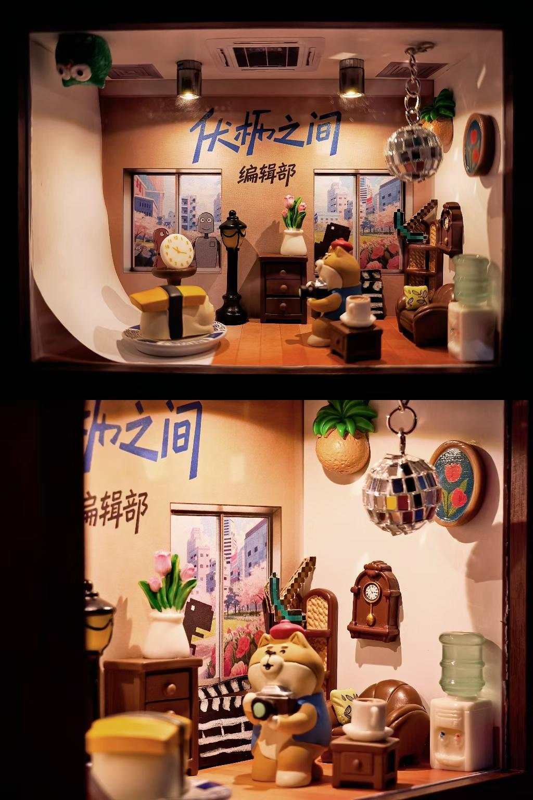

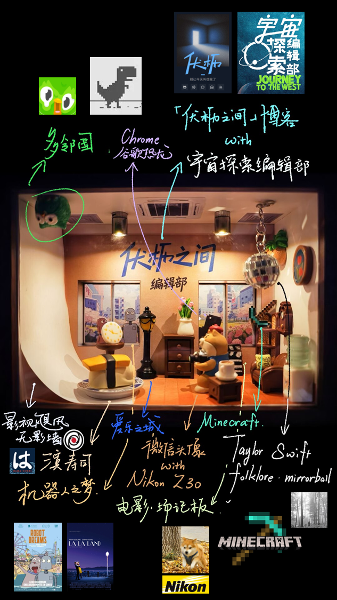

W 不是人名，只是个奇妙的代号。时至今日我们相识一年又半载，但是关于他叫什么、身处何方、多大年龄、什么工作，这些我仍然一无所知。我想常来的读者会熟悉这个名字，W 君早已是「伏枥之间」各种意义上的常客。我们日常的交流形式很像笔友，有且仅有在精神世界发生。

他总以半途而废、一事无成的悲观自居，称我是一个「有生命力」「总在路上」的人。但他有所不知，我总和身边人骄傲的炫耀：**我有这样一个朋友，他葆有广泛的好奇心与探索欲，允许彼此几乎在任何话题上长篇大论。他让我的困惑和摇摆有了出口。**

感谢他将时间凝固，注入满腔想象力与创造力。我将珍藏。

---

说起来，我之前留意到友邻 [Eltrac](https://www.eltr.ac/)、[Cytrogen](https://cytrogen.icu/) 和 [Lok](https://l3on.site/) 在自己的博客站点之外，专门设计了个人主页，以承载更多离「自己」更近的东西，非常别具一格。这也激起我一些创作灵感 —— 我构想，当我也有这样的个人主页，我可以用拼贴或手绘的方式，把过去的二十多年人生中那些我热爱或影响我的事物汇聚到一起，构建起一隅以我为名的有机生态圈。那 W 君缔造的这个房间，又何尝不是替我把这个想法提前搬进了现实呢？

### Claude 与 Claude Code 初探

为了写毕业论文，体验了 Claude 和 Claude Code。小克的理性和个性早有耳闻，据说是「最善于顶撞用户」的大语言模型。抱着尝试的心态，我在闲鱼上斥巨资￥104 购买了月度的 Claude Plus 礼品卡。经过一个月的高强度使用，Claude 现在已然超越 Gemini，荣升「我最信赖的硅基生命」第一名。

小克平时闲时会自动拓展两倍额度，直接打到账上，一个月时长到期了之后还让我多用了半个月……这个月不仅帮我摆平了毕业论文，更高效解决了一大堆来自导师和客户的 Dirty Work。除了一次对话可以生成两万字的超夸张上下文之外，让我尤其震撼的是 Claude 的语气调教：不迎合、不冗长、会辩证、有思想，经常可以从我的论述中洞见一些从未想到的新视角。我猜想这和 Anthropic 聘请的哲学家和伦理学家团队参与了上游的思维框架的设计把控有关。

> 从 Claude 3 开始，Anthropic 在对齐微调流程中加入了「性格训练」环节，目标是让 Claude 培养出好奇心、开放性、深思熟虑等更细腻丰富的特质。Anthropic 刻意避免在性格训练中给 Claude 植入具体的立场或观点，而是倾向于培养广泛的品格特质，让 Claude 能够以辨别力回应真实世界中多元的道德景观。
>
> 🔗 *Reference:* [Claude’s Character \ Anthropic](https://www.anthropic.com/research/claude-character)

---

月间待办事项很多，我尝试寻找 To-Do 软件。自己的需求具体来说可以拆解为以下五条：

1. 最简朴的可带时间戳的记录即可，不需要太复杂的紧急程度标记，因为我自己心里有数；
2. 支持年度循环事件的倒数日，因为我想要整合一下好朋友们的生日；
3. 最好是开源自由软件，这样我有数据掌控权；
4. 因为在电脑上的时间很多，所以多平台同步不是刚需，但不排除未来的开发；
5. last but not least，不能用丑东西侮辱我的眼睛。

没有找到特别合适的。需求整理清楚后，刚好是 Vibe Coding 项目的舒适区，于是用 Claude Code 配合 [deginprompts.dev](https://www.designprompts.dev/) 的 Newsprint 设计提示词定制了一个。one-shot 的完成度就令人震惊的高。最后迭代了 2-3 版，现在已经真实成为自己生产力 SOP 的一部分。

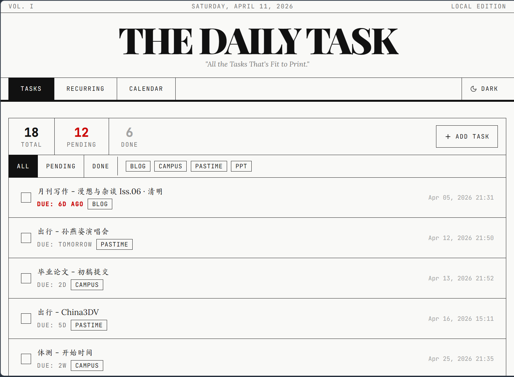

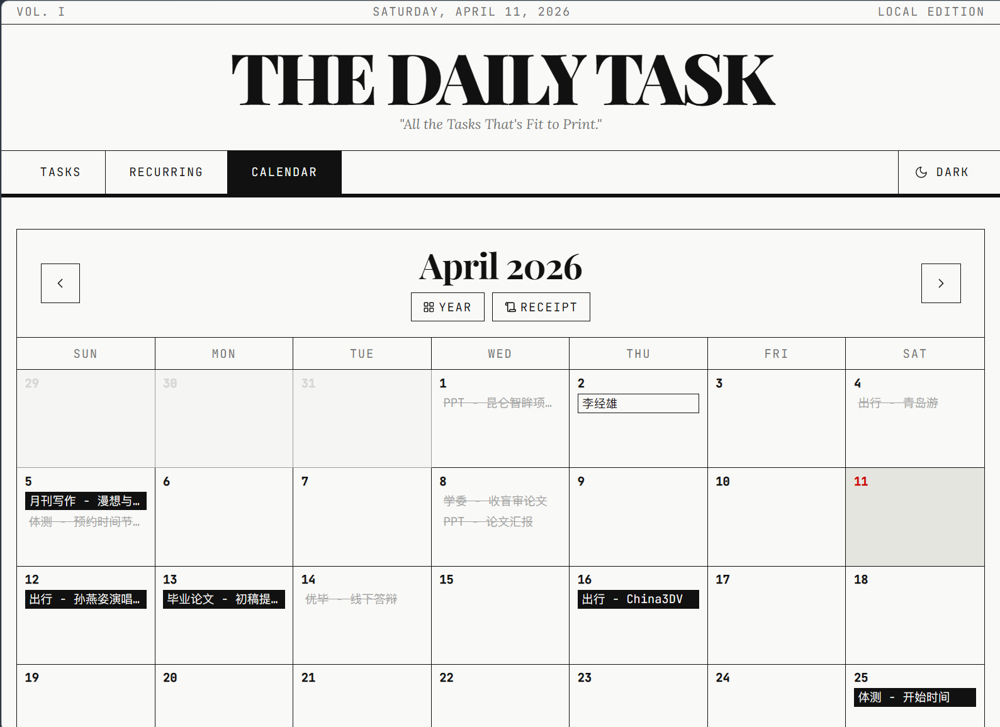

::github{repo="LeeHero0803/daily-task"}

---

关于 LLM 与 Agent 在工作中的使用，我更多把它们定位为配合我达成工作目标的「协作者」与「智囊团」 —— **而我作为主导人，对交付的结果完全负责**。同样的需求我会同时求助于多个大语言模型，类似机器学习中的「联邦学习」，我在多个观点和解决方案中进行筛选与评价，从中选择我认为最可信和有效的，防止自己在有讨好倾向的大模型的答案下偏听偏信。

那么，LLM / Agent 的能否达成我最终的理想目的，很大程度取决于自己「**需求是否清晰**」与「**资源是否到位**」。随着 LLM 和 Agent 的能力越来越强，我认为这两大方面的主导会变得越来越重要。

> 计算机编程的难点并不在于用代码表达我们想让机器做什么。真正的挑战在于将人类思维 一一 充满模糊性、歧义性和矛盾性 一一 转化为逻辑严密、清晰无误的计算思维，进而用编程语言的语法形式化地表达出来。
>
> 当程序员们还在穿孔卡片上敲打孔洞时，这是最棘手的环节；当他们敲打 COBOL 代码时，这也是最棘手的环节；当他们将 VisualBasic 的图形界面变得栩栩如生时，这同样是最棘手的环节；即便如今他们提示语言模型去预测看起来合理的 Python 代码时，这依然是最棘手的环节。
>
> **真正的难点始终是 —— 并且很可能在未来许多年里继续是 —— 确切知道该提出什么样的要求。**
>
>  🔗 Reference: [The Future of Software Development is Software Developers – Codemanship's Blog](https://codemanship.wordpress.com/2025/11/25/the-future-of-software-development-is-software-developers/) | [Zine#47](https://taxodium.ink/47.html)

需求清晰，意味着需要足够清楚自己想要什么，并且能够用足够精准的语言描述出来；资源到位，意味着在 LLM / Agent 正式开始工作前，它充分了解了任务的背景与上下文，从而在必要的限制下发挥能动性。

正如我在 [《如何在上级的压迫下自如地浑水摸鱼》](https://leehenry.top/posts/mindlight_maze/mm-vol05/)中的「向上管理」小节提到的那样，在这里我们不过是从「任务的完成者」的角色变成了「任务的分配者」，而上下游有效沟通的底层逻辑是相通的。**从这个角度上讲，与硅基生命共事，和碳基生命没有什么本质上的区别。**

因此，我很鄙夷一些过于神话 Skill 和 Prompt 的言论，妄想不需要经过任何主动的思考，复制粘贴一些文本，再下载注入更多文本，就可以一次性让结果符合自己料想的一切，把自己的大脑彻底扔掉。

我相信**作为人的判断力和审美力，已经成为、并在未来依然成为最重要的核心竞争力。**

### 网站建设小报

这个月的站点日新月异。让我好好翻翻 GitHub 的提交记录……让我挑几个比较好玩的和大家聊聊！

#### 一些新的组件

**[88x31 徽章墙。](https://leehenry.top/friends/#friends-stamps)**<mbr>受到 [Eltrac](https://www.geedea.pro/weekly/73/#%E7%BD%91%E9%A1%B5%E6%A8%AA%E5%B9%85%E6%8C%89%E9%92%AE%E8%80%83%E5%8F%A4) 和 JN 一篇关于 Y2K 文化的 [文章](https://blog.giveanornot.com/you-should-check-out-the-indie-web/) 影响，了解到这一特别的独立网站文化。[88×31](https://indieweb.org/88x31) 尺寸的站点徽章诞生于 1990s 的 Web 1.0 时代，那时候以论坛和 BBS 为主体的站长们用精心设计的徽章介绍自己、表达态度，现在更多流行于 [IndieWeb](https://indieweb.org/) 和 [Neocities](https://neocities.org/) 等社群，设计也更加现代多元了。

下面是我在制作「伏枥之间」的 88x31 徽章时找到的一些网站，他们收录了涵盖各种领域、多种多样的 88x31 设计，或许可以由此一窥互联网变迁历程的一角。

> - [capstasher](https://capstasher.neocities.org/88x31collection-page1)
> - [THE 88×31 ARCHIVE](https://hellnet.work/8831/)
>
> - [A.N. Lucas's 88x31 button Collection](https://anlucas.neocities.org//88x31Buttons)
>
> - [The 88x31 GIF Collection](https://cyber.dabamos.de/88x31/)
>
> - [88x31 Collection - Home](https://88x31.nl/)
> - [The 88x31 GIF Collection - 0b5vr](https://scrapbox.io/0b5vr/The_88x31_GIF_Collection)

为了体现这种复古的文化精神，我的这面徽章墙在设计上也致敬了 Windows XP 的系统弹窗。（~~冷知识：点击这里「Made with Windows」的徽章，会真的带你来到一个网页端的 Windows XP，可以画画和玩扫雷的那种\~~~）

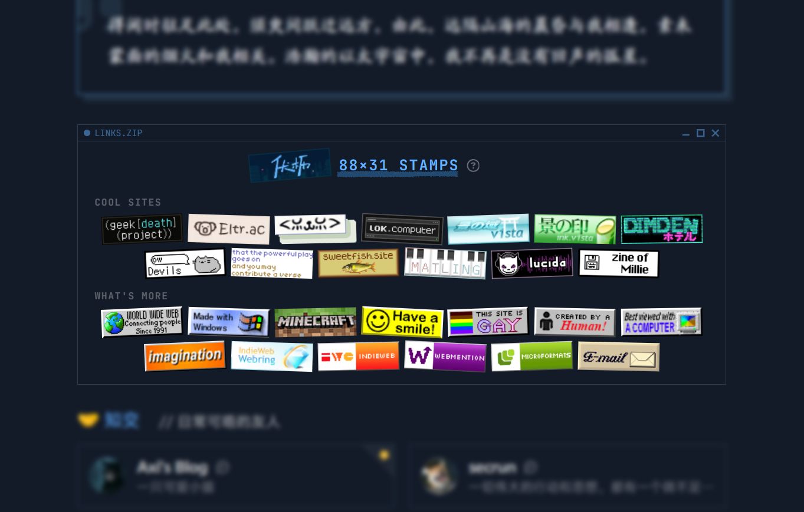

**[点赞回应交互。](https://leehenry.top/guestbook/)**<mbr>为了鼓励读者积极回应，增加了文章的点赞功能，配合上一个有趣的动画 —— 点赞 Section 初始化时会落下当前点赞数量的心心，如果你也点了一个爱心，你的心心就会落入心心的海洋 ❤️ 

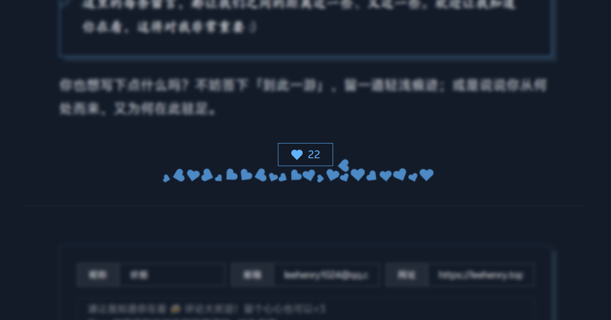

**[嵌入式音乐卡片。](https://leehenry.top/posts/words_in_wildness/my-select-album/)**<mbr>调用了 [Apple Music](https://developer.apple.com/documentation/applemusicapi) 的接口，很方便的实现了歌曲和专辑信息的获取以及歌曲片段的试听。现在可以很好的嵌入到文章的内容之中。读到本期的「回响」章节你就会看到更多~

#### 一些设计调整

**[文章卡片设计。](https://leehenry.top/)**<mbr>精简了首页卡片的陈列信息，删除了不必要的字段，增加了信息分级的对比度。另外学习（~~抄袭~~）了 Eltrac 网站上的扭曲滤镜 CSS 应用于标题的下划线，以期营造出类似「马克笔划过」的粗砺感。这一设计语言沿用到了文章正文的标题部分。

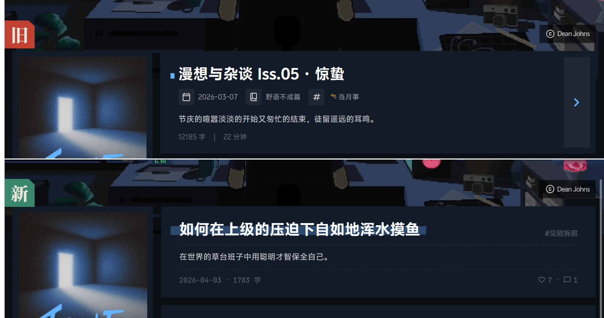

[**按周划分的热力图设计。**](https://leehenry.top/archive/)在联邦宇宙中刷到了椒盐豆豉老师的 [一条嘟文](https://douchi.space/@mtfront/116198023250247941)，介绍了一种按周分隔的热力图设计，灵感来源于 [rexarski](https://rexarski.com/now/) 的当下页面。

> [椒盐糖蒜](https://douchi.space/@mtfront)：rexarski 这个 now 页面的按周分隔的热力图或许才是适合大多数博客的热力图形式，毕竟绝大多数人一年中大多数时间是不更博客的，传统的 GitHub 形式的按天分布的热力图零零星星没什么意思。按周看则即能纵观历史又能信息密度大一些，感觉更实用。有点想抄~
>
> 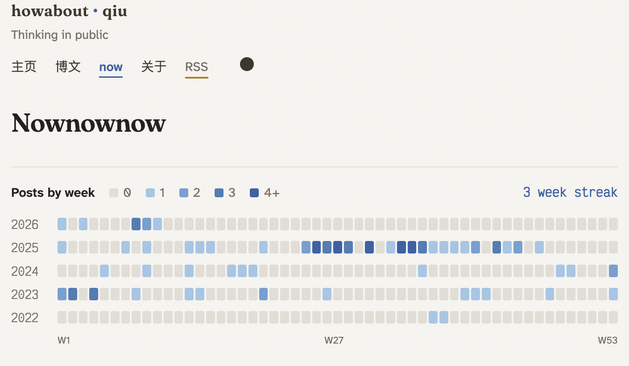

从这种设计理念出发，考虑到自己长期咕咕一憋就憋个大的体质，改成了更合理的按字数统计，并进一步微调了样式：

- 弱化具体数据，使用 Less-More 的图例，参考自 Github 的热力图；
- 还没开始的日子所对应的格子调低了透明度，这样热力图最新的一行也可以看做是今年的进度条。

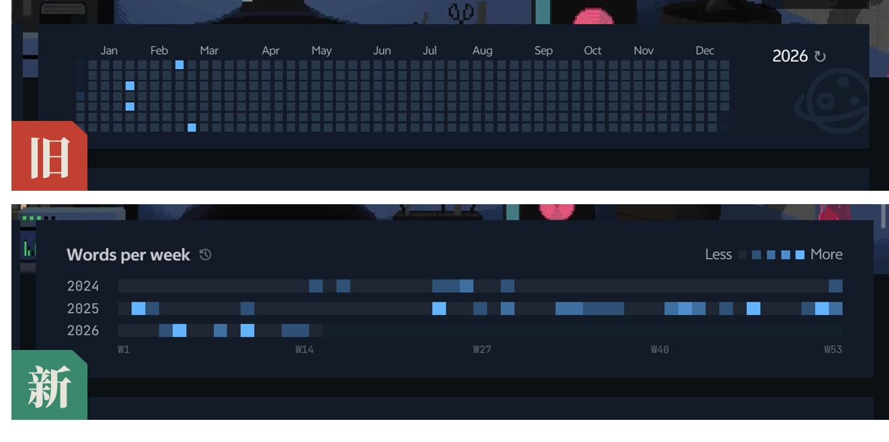

#### 一些新的特性

- 「[友邻](https://leehenry.top/friends/)」和「[一隅](https://leehenry.top/about/)」页面现在支持了 TOC 侧边栏目录的导航定位！
- 评论区增加了一些新的成员 —— 小豆泥和 Blobcat！并支持嵌入式显示了！当鼠标覆盖到表情上还有一个小特性~[试试看](https://leehenry.top/guestbook/)？
- 「伏枥之间」现在支持了 [Webmention](https://indieweb.org/webmention) 和 [Microformat](https://indieweb.org/microformats) 技术，并加入了 [IndieWeb Ring](xn--sr8hvo.ws/)。如果你好奇这是什么，我在这条 [嘟文](https://c7.io/@LeeHenry/116325170087645847) 汇总了一些信息~

## ↯ · 信号 Flash

### 去中心化与联邦宇宙

正如本期引言谈及的那样， 过去的一个月我花了些时间在联邦宇宙中混迹。更准确来说，是加入了联邦宇宙中的微博客平台 Mastodon（人称「长毛象」）。如果读者朋友好奇我的 Mastodon 的账号，可以在本站首页的 Profile 卡片找到它。

> [!NOTE]
>
> **联邦宇宙 (Fediverse)**：是所有基于 W3C 开放协议 ActivityPub 互联互通的去中心化社交平台 / 服务器的总称。它不是一个具体的软件或网站，而是一张分布式社交网络。
>
> **长毛象 (Mastodon)**：联邦宇宙里最为流行的「微博客」平台，体验上类似于去中心化的推特，在用户量、服务器数、生态成熟度均为联邦宇宙第一。

我在 Mastodon 的第一条嘟文，引用了之前和 W 君的一则讨论：

> 各大平台的数据被视作公司私有资产的一部分，对于这些中心化的平台，用户只有浏览和制造的权利，没有拥有的权利。这很糟糕，AI 的发展更是加剧了这种糟糕。
>
> 最近我在尝试在给博客上一个书影音的集合界面。一开始是想要直接爬取豆瓣的数据，研究了一下才知道，近些年来，豆瓣先是关闭了官方 API 接口，后来每当社区探索出一些新的爬取方法，豆瓣都会想办法魔高一尺道高一丈的拦截他们。于是现在豆瓣账号备份工具「豆坟」早已停止维护，想要直接从豆瓣的嘴里把数据偷出来也阻碍重重。
>
> 替代方案是直接放弃豆瓣，拥抱 [🧩 NeoDB](https://neodb.net/) —— 这是一个开源的软件项目，是书影音标记的去中心化解决方案，它支持在任何地方部署。一旦部署，你可以和其他拥有「联邦宇宙」的人像豆瓣一样自由交流。最大的区别是，NeoDB 自由、开放、互联，你拥有一切对数据的掌控权，永远不会被封闭的大公司夺走，也不会随着中心化的公司倒闭后，珍贵的数据消弭于互联网中。
>
> 我想这就是为什么 Indie Web 的先锋们开始开荒一系列去中心化的替代方案，用 Mastodon 替代 TikTok/Twitter/微博 等社交媒体的账号，用独立网站作为内容的主阵地再分发四处，这背后就是他们为了对抗大公司的封闭，想要永远拥有对自己数据的掌控权。
>
> **其实还挺唏嘘的，这本来是我们先天享有的权利，现在想要重新获得掌控内容的自由，代价是去学习如何重建一个新的独立世界。**

数据主权，正是我加入「联邦宇宙」的一大原因。而另一个原因是常读的博客主最近陆陆续续取消了传统的评论区，开始基于联邦宇宙的桥接进行对文章进行讨论互动。为了参与讨论，有一个联邦宇宙的账号无疑会方便很多。

加入联邦宇宙以来，在世界意义上认识了一些天南海北的新朋友，也参与了很多有趣的话题，更为「伏枥之间」提供了一种被大家认识的新方式。体验上确实是和传统的社交媒体有很大不同。

> **伏枥**：对我来说，多数时候联邦宇宙会接近于你之前所说的那种，基于 QQ 群聊的那种交流体验 —— 大部分时间可以视奸，大多数用户都很有人味，没有太多营销号式和 AI 滥用的信息流，哪怕没有过多能量，点个赞表示「已读」也可以，你可以随时参与、随时离开。此外，偶尔有感兴趣的话题，也允许比较深入详尽的理性讨论。
>
> 不过由于不同于熟人社交，在用词和态度上，礼貌和边界的尺度我还在摸索，也经过了一些碰壁，还在寻找平衡。总体来看，我的态度还是积极的。
>
> **W 君**：关于联邦宇宙，我会觉得（我自己）可能会混淆讨好和自我表达，像是为了向圈子里的人证明自己的才能而活动着，热情互动是为了获得更好的社交成绩，和我想的博客来「表达自我」的功能稍有冲突。
>
> 我会这样想也有我的个性在，我一方面厌恶虚情假意的互相捆绑的社交，一方面又渴望来自他人的温暖。
>
> **伏枥**：很锋利的观察，果然是旁观者清，最近心情的波动确实很大程度来自联邦宇宙的互动。我也在反思。
>
> 不过宕开一笔，联邦宇宙因为有手机 APP，所以给我提供了一种发东西更短的路径 —— 我指的是从思考到写下来的路径更短。这个月有了它，我多了一些得以捕获转瞬即逝的、迫切的想要表达出来的时刻，比如一场怅然若失的梦境，一些特定时刻生发的触动（~~读者朋友或许会留意到，这次的月刊「✲ · 脉冲 Spark」这一栏目的内容相比以往丰富了很多~~）。因为联邦宇宙的社交圈离现实足够远，表达不会产生过多的压力。
>
> ---
>
> **W 君**：对了，联邦宇宙让我想起朋友圈点赞，有的时候不太想点赞的内容也要点赞，因为这样可以维持关系，违心地点了很多赞。
>
> 我感觉非常功利，非常不纯粹，但是当精心编写的内容有很多人赞，也会有虚荣感/成就感。
>
> **伏枥**：实际上，我观察到联邦宇宙的大家发帖频率很高，无人问津是常态，这反而让人不会有过多 FOMO 的焦虑。另外因为联邦宇宙去中心化的一些软件特性，我这边点赞似乎只有同服务器之间的数量显示才是准确的，还有很多人选择了关闭点赞提醒。因为点赞变得不重要，一定程度解决了传统的社交平台「已读必须回」的互动压力。
>
> 不过关于虚荣和成就感的方面，你说的也对，我发布于五天前的 [一篇博客](https://leehenry.top/posts/mindlight_maze/mm-vol05/) 当时在联邦宇宙上也同步了更新通知，今天来自朋友的一次「转嘟」让广场上的更多人发现了这篇文章，进一步带来了更多「转嘟」。看到后台的浏览量增长拔群，确实爽哉。
>
> **我想，博客这种公开写作的方式是一体两面的，一方面是成为表达自我的容器，另一方面也承载了被人看到的期待。不管是开往、友链互访还是联邦宇宙，在我这里都提供了一种「被发现」的方式。毕竟现在酒香也怕巷子深。**
>
> **W 君**：这样，联邦宇宙可以不用在意这么多，不点就不点。不过朋友圈该怎么办，为什么我会有很恶毒的心态，觉得要惜赞如金，明明点个赞是顺手的事情。可能有种功利感吧，还会有很嫉妒的想法，我给你点赞你不给我点赞？我再也不给你点了！
>
> **伏枥**：诶，我倒觉得很正常，因为我也惜赞如金，点赞只会给到感兴趣的事物和人。会记得给我点赞过的人，看到会回个赞，从来没给我点赞过的人我也会看一眼划走。我想也许是没因为这些事情和别人起过争端，倒是没有太多心理压力。

### 朋友、边界与意义

这个月围绕着「友情与关系」这一议题，在各个地方展开了一些讨论。

---

首先是联邦宇宙的一条广场的 [讨论串](https://go5.dev/@anywhere/116278808339288809)。

> **laiiiiiiisse**：@board 香油们，有个简单的问题…友情和爱情的区别是什么？虽然很老套的样子，但我就是难以回答，想不清楚这个严重影响到了我的故事走向，抓耳挠腮，邀请大家不吝赐教。
>
> **伏枥**：我之前在一篇 [随笔](https://leehenry.top/posts/mindlight_maze/mm-vol03/) 中是这样定义的：
>
> > 你可能会问：
> >
> > 「如果一点都不期待，那恋人和朋友还有什么区别？」
> >
> > 当然，期待不可能完全消失，我「邀请」的动作本身，本质上就是一种「希望你在场」的期待。从这个角度来看，恋人和朋友最大的区别在于：
> >
> > 1. **关系的深度**。有些体验我不会轻易对朋友说出口，而在恋人面前我会更容易卸下伪装。我希望和你分享不只是日常，我希望你能看见我更柔软、更赤裸，习惯封存在内心深处的部分。
> > 2. **关系的责任**。有些事与其说是期待，更多是关系性质所决定的责任——在需要彼此的时候，恋人是第一优先级；关系遇到矛盾时，第一动作应该是「我们一起解决它」，而不是回避和忽视。这些是健康的亲密关系理应具备，而非争取讨要的。
> > 3. **关系的态度**。与朋友不同的是，对于恋人，即便我不会过度期待你接住我的「能力」，但我会期待你对我上心的「态度」。能力可以磨合培养，态度问题不能妥协——可以不擅长，但你得在场。
>
> 
>
> **laiiiiiiisse**：香油很好地讲述了「什么是健康的亲密关系」。可是我个人还是有点疑惑，第一反应感觉这些换到朋友身上，也是适用的，对我来说有点像「好朋友和更好的朋友」的感觉🤔
>
> **伏枥**：嗯……我想想，可能这也和性格有关系，列举的这些点，譬如深度链接、责任心和占有欲，也许是恋人更「理应」具备的特质，也就是对于朋友来说（至少在我的人际关系中）我不会苛求，所以也不会在友谊中因为这方面的心理落差而受伤，当然不排除非常好的朋友因为羁绊更加深切所以这些特质同样存在……
>
> 所以总的来说，前者是「遇见理应求」的合理，后者是「可遇不可求」的幸运？很抱歉说的有点混乱。所以好像羁绊足够深的挚友好像就不需要用爱情或者友情的界限去定义了！
>
> 可能这也是一些 CB 向（*注：全称 Character Bromance，指非爱情向的亲密关系，聚焦非恋爱的深厚情谊与默契*）的关系反而更令人动容的根本原因，正是因为取了友情和爱情的精华所在！（*注：整理到这里想到了《挽救计划》！*）
>
> **laiiiiiiisse**：大概我的占有欲太强了！无差占有，无差责任，无差特殊性，belike「遇到的感兴趣的人，对我而言都是独一无二的存在，所以我也会独一无二地与之相处」，呃这个话说出来有种寡王与海王只有一线之差的感觉……
>
> 这个问题就好像是贾宝玉处在混沌中，不辨亲情友情爱情的分别，咱也不知道这个是正常状态，还是真的有所缺失。
>
> **伏枥**：这个视角好有趣！如果从实践意义来说，我觉得倒是不用过度纠结这种心理是否「正常」或「正确」，从自己的内心出发，如果合乎自己观念原则就坚定做下去吧。「吸引力法则」会起作用。
>
> 不过突然又想到一个点：如果是友情，我会：「**和你玩很开心！还想和你玩！**」；如果是爱情，有一种更强烈的心情：「**好想让我的生命在你的生命中产生更多意义！**」
>
> **laiiiiiiisse**：唔，好有趣的视角，我的观念里似乎无差偏向第一种，或者关系伊始就是第一种。第二种我将细细研究一下！
>
> **伏枥**：也许对我来说，爱情会产生比友情更加视若己出的一种欲望……虽然这从现实的意义来说往往是盲目的。
>
> **laiiiiiiisse**：是指保护欲和责任感？哇，不自觉拢在羽翼下的行为，确实美味😋
>
> **伏枥**：对！

---

再后来是一位朋友问起「朋友的边界是什么」，我脑海里第一时间出现的几则 statements：

1. 对于朋友，自己有更多选择释放多少精力和时间的自由；
2. 对于不合拍或电波不合的朋友，我会倾向于选择淡出而不是切割。因为喜欢的反面不是讨厌，而是漠不关心，而我的漠不关心往往就是关系的终点。不过也不排除有新的缘分生发，创造新的际遇；
3. 如果要回答「朋友的边界」，需要先明确：朋友对我来说意味着什么，以及我对朋友的付出取决于什么；
4. 我的问答是：一个人对我的重要性，取决于「**我能对这个人产生多大的意义**」。如果这个程度越低，这个人对我越不重要，越接近我对他「漠不关心」的状态。

---

最后，在一个地方看到了这张图，出处不详，但觉得还蛮有意思的：

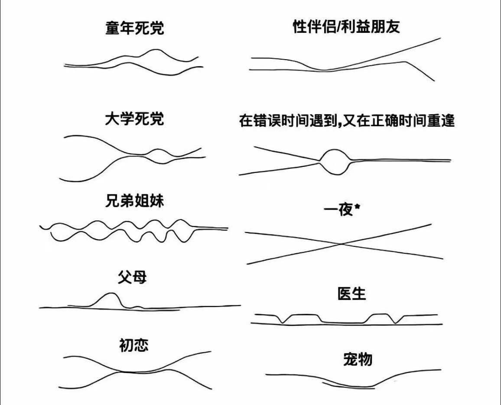

### FLAC 和本地音乐

看到 Eltrac 在联邦宇宙分享了自己在 [Lucida](https://lucida.to/) 下载 FLAC 的无损压缩音乐的心路历程，我在这个神奇的平台下载了一首 anpu 的《最好的时光》听了听看……

然后大脑只剩下一句震撼的「卧槽」——耳道被清理、大脑被加冕、精神被升华，突然理解了「朝闻道夕死可矣」这句话。第二反应是很想咒骂：流媒体你真的亵渎音乐了很久。

---

后来 Eltrac 把拥抱本地音乐的心路历程汇总成一篇科普性质的 [杂谈](https://www.geedea.pro/article/got-flac/)。整篇文章最打动我的是这句话：

> 本地音乐还会有一种收集的仪式感，因为必须要自己找音乐、下载、导入播放器。人们习惯了使用流媒体，或许时常忘了音乐是需要自己去发现的东西。即便没有能力消费 CD 和黑胶等实体音乐媒介，也能通过下载音乐到本地来体验收集的乐趣。

这让我回想起不允许携带智能手机的初中时光，淘宝随便挑的百元随身听，配上百元有线耳机，扎扎实实陪伴了我整个三年。那时的我，每个周末最期待的事情除了泡在 Hypixel 玩起床战争，就是在流媒体平台一首首挑出喜欢的歌，再想办法下载进随身听，用最朴素的文件夹为跑步、写作业等各种场合建立歌单。

尽管当时没有什么音质的追求，这份享受也是足够纯粹的。无需迎合点赞推荐评论的抱团，也无需放任响度战争无差榨干自己每秒的注意力，音乐的世界本来、也理应，没有那么复杂。

## ◎ · 回响 Echo

> 恭喜你发现新栏目！在这里，我把书、影、音、游等文化生活独立陈列，记录自己成为观众或听众后，留下了什么。用 Eltrac 的话来说，是 [不做信息的消费者](https://www.geedea.pro/essays/why-blog-weekly/)，用金色河流的话来说，是 [未经审视的赛博生活不值得过](https://goldenriver.site/posts/the-unexamined-cyber-life/)。

### 听了一些新歌

#### I care so much that i dont care at all

::music{query="I care so much that i dont care at all" type="album"}

来自 W 君的推荐。glaive 的纠结、憎恨、孤独与崩溃交叠在一起，好在还能嘶吼出来。有种《波奇米亚狂想曲》的气质，是从痛苦中喷薄而出的音符。

::music{query="the prom"}

从专辑的曲目名来看，连起来像一段日记的碎片。

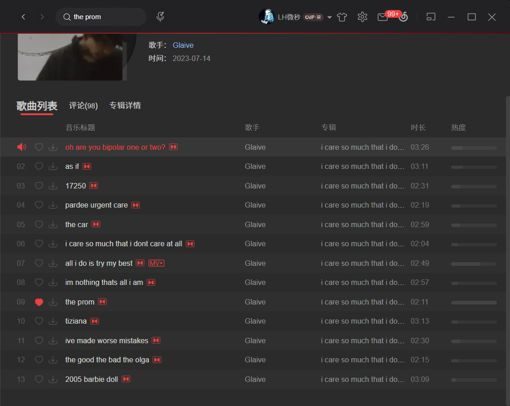

#### THIS MUSIC MAY CONTAIN HOPE.

::music{query="THIS MUSIC MAY CONTAIN HOPE." type="album"}

史诗的磅礴的伟大的隽永的。

感受得到 RAYE 在用对待音乐剧和电影的匠心来对待这张专辑。从 *Intro: Girl Under The Grey Cloud.* 就可以感受到她的音色很有故事感，渐入到 *I Will Overcome.*，像是英雄无归题材的电影从黑屏启幕的史诗。

::music{query="I Will Overcome." }

后来刷到她的黑胶设计 —— 拉开灰墙，启封了包裹音乐的蓝天，有点像《楚门的世界》。这样的包装与专辑名「THIS MUSIC MAY CONTAIN HOPE.」形成了很棒的呼应。从音乐本身到装帧设计，专辑的概念形成了完整的闭环。

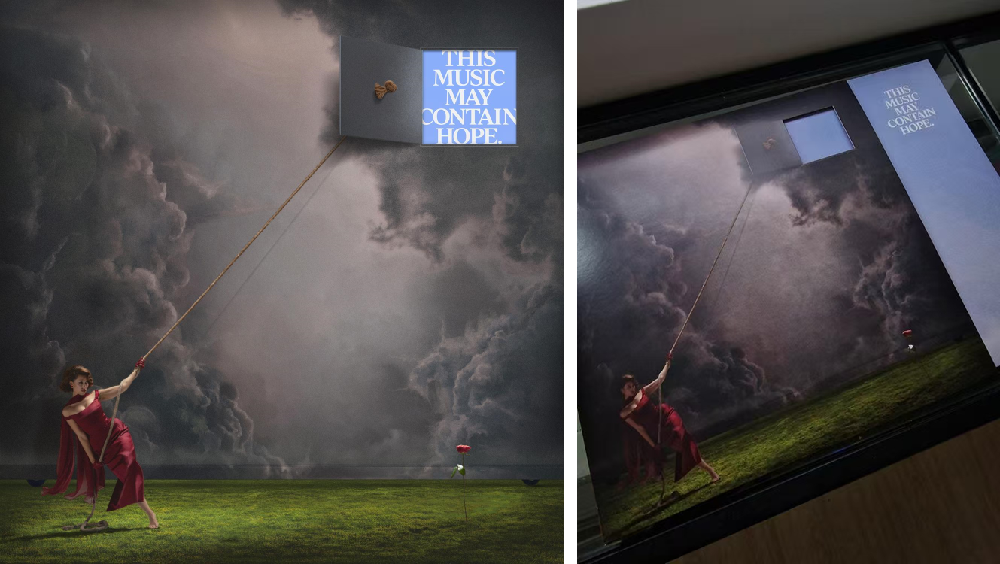

#### Groupies 吉他手

::music{query="Groupies吉他手" type="album"}

之前和朋友小沐在上海「漾应的火塘」Live House 听了一次台女专场，为了张悬而去，未曾想后来的一个月最多的声音倒成为了陈绮贞。写到这一行字时耳机正在循环《华丽的冒险》，除此之外，《沙发海》和《吉他手》也在近期反复品味。

尤其是《吉他手》这首单曲，每次听到心情都会格外晴朗。

::music{query="吉他手"}

不知道如何定义陈绮贞的音乐流派，评论区说这是介于「流行」和「民谣」之间的一种风格。叛逆、忧伤与明媚发生在同一个她身上，聆听的时候适合空想。

## ☨ · 探针 Probe

### 一款开源文字 PV 工具

> [!NOTE]
>
> **文字 PV**（文字プロモーションビデオ）是以文字为核心视觉元素的宣传影像，常见于音乐与 ACG 领域，通过文字的排版、动效与节奏，配合音乐传递情绪与信息。

PVTool 是一个文字 PV 的开源生成工具，经过社区的贡献迭代，目前支持 17 种特效预设配置与自定义，还可用于直播的歌词组件。我玩了一下体验还不错。除了作文字 PV 之外，感觉还很适合 [VJ](https://en.wikipedia.org/wiki/Video_jockey) 用来搓演唱会和派对的大屏画面，用来做混剪素材也很合适。

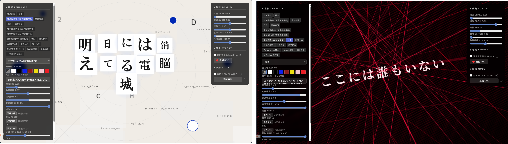

不过令我意想不到的是这个软件在开源后一个月内吸引来巨量牛鬼蛇神，时间之短丰富度之高令人咂舌。从作者的动态可以得知，包括但不限于：自部署后套壳圈钱的商业公司、打包贩卖赚信息差的二道贩子、乞讨项目用来包装简历的大学生……

> 🎬 *Video:* [一不小心写了一个三秒直出文字pv的工具_哔哩哔哩_bilibili](https://www.bilibili.com/video/BV1MrPhzhE9E/?share_source=copy_web&vd_source=13124edee9a4b745937af2c37bdad50c)
>
> 🌐 *Demo:* [PV Tool - 日式PV Visual生成](https://pv.pixjam.cn/)
>
> 💻 *Source*: [DanteAlighieri13210914/pv-tool: Automaticly generate kinetic typography](https://github.com/DanteAlighieri13210914/pv-tool)

## ❏ · 快照 Snap

### 垂直方向称为 Y 轴还是 Z 轴

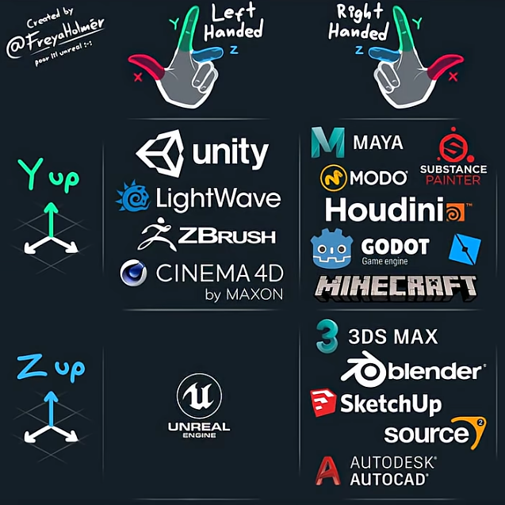

> 视频快速探讨了一个问题：为什么同样是「向上」的垂直方向，Minecraft 用 Y 轴来表示，而 Blender 用 Z 轴。
>
> 博主解释 Blender 沿用了图形辅助设计与数学建模领域的概念，习惯 Z 轴为空间外的「第三维度」；而许多早期游戏使用的的图形 API 和图像引擎为了简化运算，使用了 X 作为平面，Y 轴作为上下高度，而 Minecraft 在开发初期沿用了这一传统。
>
> Minecraft 并不是特例，上图展示了一些主流引擎 / 游戏使用的坐标系统分类。
>
> 🔗 *Link:* [麥塊的座標設計其實完全是一坨史👎 | @Zonzer](https://www.youtube.com/shorts/d0OSRDJfQh8)

### 去议论还是去记叙

> 议论文写多了会伤害大脑吗？因为写作者会逐渐把「解释能力」误认为「洞察能力」。当创作者长期停留在可控、可自证、无须承担回应的写作姿态里，就会慢慢失去让故事自行生长的能力——角色不再反抗，冲突不再失控，意义被提前解释，世界被作者接管。议论文的能量适合解构与诊断，却不适合生成；一旦混淆这两种能量，所谓的「大脑受损」，并非能力下降，而是创作者忘了什么时候该闭嘴。
>
> 🔗 *Link:* [议论文写多了会伤害大脑吗？ | 莫比乌斯](https://mobius.blog/18281.html)

> 知识精英热衷于「拿着锤子找钉子」。他们擅长构造出一个抽象概念，并不断发展这个概念，用它来解释一切、解释世界，并在这一套已经建立起来的前提之下成为能够解释和反驳一切的神。然而，若是要他们从这个假设和前提中跳脱出来，他们却没办法解释这个概念本身，继而与现实立的越来越远。这也使得，在互联网上最安全的讨论方式，就是加入一个同温层，加入一个有共识的认知体系自说自话。
>
> 🔗 *Link:* [《独树不成林》299 - 哪个社交平台最烂？](https://www.xiaoyuzhoufm.com/episode/6983a489c78b823892b31407) | [稻草人周刊 Vol.67](https://www.geedea.pro/weekly/67/)

### 「阿贝贝」与过渡性客体

> 所谓的「阿贝贝」，在心理学的范畴叫做<mbr>**「过渡性客体（Transitional Object）」。简单来说，过渡性客体是在用「物」来代替「人」，以缓解分离焦虑。**<mbr>比如一个布娃娃、一块沾满味道的毛巾、一张再普通不过的被套枕巾之类的。同时，嗅觉能够刺激海马回的神经元，从而调取记忆，因此嗅觉往往更容易刺激记忆当中的「符号」所引发的联想；也因此，「阿贝贝」和味道往往有直接联系。
>
> 🔗 *Link:* [人类的阿贝贝 | 莫比乌斯](https://mobius.blog/21526.html)

### 「认知」与情绪 ABC 理论

> 我最近一直围绕着「认知」在聊。是因为在写小说的人物小传，难免需要回到认知的层面去构建一个人物。这个模型来自于阿尔伯特·埃利斯的情绪 ABC 理论，
>
> > 人的负面情绪（C）并非由外界诱发事件（A）直接引起，而是由个体对事件的认知信念（B）决定的。
>
> 那么在剧情里，一个人为什么在面对诱发事件做出了一个出人意料的决定，就要回到认知的层面来完成逻辑闭环，而这个认知的构建，又要回到人物的童年、原生家庭、历史事件来进行翻译。
>
> 🔗 *Link:* [谈论“认知”是在羞辱他人吗？ | 莫比乌斯](https://mobius.blog/21657.html)

### Agent 如何同时放大乐趣与恐惧

> 我现在编程的乐趣前所未有，因为许多我曾苦于没时间编写的程序如今已然存在。我希望能将这份喜悦分享给那些对智能代理带来的变革感到担忧的人们。他们的恐惧我能理解, 我自己也对「唾手可得的智能」将把我们社会引向何方怀有更深层的不安。但在编写计算机程序这个有限领域里，这些工具为我的工作带来了无穷的探索乐趣。
>
> 🔗 *Link:* [crawshaw - 2026-02-08](https://crawshaw.io/blog/eight-more-months-of-agents) | [Zine#47](https://taxodium.ink/47.html)

> 那是一个极其疯狂的下午。我在宿舍的电脑前，同时跑着 4 个顶级 Claude Opus 4.6、1 个 Codex、1 个 Gemini CLI。我彻底进入了终极的“纯 Vibe”状态。无需构思语法，甚至无需自己管理项目，我的工作变成了纯粹的决策和调度——哪里亮了点哪里。
>
> 但随之而来的是：**我发现用 AI 竟然比自己写还要累。**
>
> 开发历史上的瓶颈，第一次从「敲代码的手速」变成了「人类审查逻辑的脑力带宽」。面对 6 个大模型源源不断吐出的高质量代码，我根本 Review 不过来。我不是在写项目，我是在被算力的洪流推着、甚至「逼」着往前狂奔。
>
> 几天后，博客 V2 摧枯拉朽般地写完并发布了。但在那个跑满算力的下午，我极其兴奋，但也极其害怕。那种害怕，是你作为一个个体，直面指数级进化时的渺小感。
>
> 🔗 *Link:* [我患上了 token 的瘾 | Grtsinry43 的前端札记](https://blog.grtsinry43.com/posts/token-addiction)

> 作为深度的 Agent 用户，我得以拥有那些比一般人高出三五倍甚至数十倍的工作效率，而在半年或者一年后技术更加普及之后，这些信息差将会抹平。这使得我不得不在这半年到一年之内尽可能地更好利用这一信息差，让我用那远超常人的效率来完成尽可能多的任务，从而为自己在领域中的地位奠定基础。而在他人和我具备同一能力之后，我才可以在另一方面具有超过他们的资本。
>
> 所以从一方面用一句简单的话来概括就是，Agent 虽然让事情解决变快了，但是 Agent 带来的紧迫感使得我要求自己做的事情变多了。
>
> 🔗 *Link:* [月记·二零二六·二月 • Axi's Blog](https://axi404.top/blog/journal-2602)

> Simon Willison 2026 年对 LLM 发展的预测：
>
> - 一年之内：大语言模型能够编写高质量代码将变得无可辩驳；
>
> - 一年之内：我们终将解决沙箱隔离问题；
>
> - 一年之内：编码智能体将遭遇「挑战者号事故」级别的安全危机；
>
> - 三年后：编程代理对软件工程的 [杰文斯悖论](https://en.wikipedia.org/wiki/Jevons_paradox) 终将得到解决，无论以何种方式；
>
>   > 在经济学中，杰文斯悖论，亦称杰文斯效应，指资源利用效率的技术性提升，不仅没有降低反而提高了该资源的总消耗量。
>
>   编程助手的发展可能走向两个方向：要么软件工程技能大幅贬值，要么我们变得比以往任何时候都更有价值、更高效。
>
> - 三年后：有人将借助 AI 辅助编程打造出一款全新浏览器，届时甚至不会令人感到意外；
>
> - 六年后：手工敲代码将成为打孔卡般的旧时代产物
>
> 🔗 *Link:* [LLM predictions for 2026, shared with Oxide and Friends](https://simonwillison.net/2026/Jan/8/llm-predictions-for-2026/#atom-everything) | [Zine#47](https://taxodium.ink/47.html)

> 在编程领域，AI 已经展现出了惊人的能力。是的，AI 能帮助减少很大一部分工作量 —— 从搭建框架、编写基础代码到调试常见错误。但另外 0.2 的工作才是最重要的核心，是这个项目和其他项目的真正不同之处。
>
> 这 0.2 包括：独特的业务逻辑、创新的机制设计、有温度的用户体验、以及那些无法用规则明确描述的「感觉」等等。
> AI 可以帮助我们快速达到 80% 的完成度，但最后的 20% 需要人类的创造力、直觉和对问题的深度理解。而对于一个项目的是否成功，这 20% 却是最为重要的。
>
> 🔗 *Link:* [关于AI的一些形而上思考 - idealclover](https://idealclover.top/archives/647/)

### 也许你并没有真正尝试过

> 人们往往受困于初次遭遇难题时展现的应对能力水平，若当时未能解决问题，此后便停滞于此。
>
> 🔗 *Link:* [Maybe you’re not Actually Trying - by Cate Hall](https://usefulfictions.substack.com/p/maybe-youre-not-actually-trying)

## ✲ · 脉冲 Spark

### 切片 六之一

是一个不吝啬向外界提供情绪价值的人，但发现自己近一年来时常陷入社交饥渴和社交戒断的钟摆中。有时非常渴望和世界的连接，有时平等的厌恶一切人类。

### 切片 六之二

晚上和远道来上海出差的老友见面，喝了点小酒，聊到了九点。

伊朗和伊斯兰革命；法条和权责划分；权利和本本主义。他高中选科是历史，现在学的却是物理。工作日的巨鹿路有些冷清，昏黄的路灯下聊了很多空中的话题。

回校选择了坐公交车。外面很冷，双手冰凉。我揣着兜选了个靠窗的位置。随便打开了一期独树不成林的运动播客。仲树热情高涨的声音没有太多进入脑海，思绪游离到了车窗之外。

静安区的小洋楼滑过眼前，看到茶百道正准备关上最后一盏灯。突然留意到外墙印着一个大大的数字：饮品折扣只需 6.9 元。

看到这个数字的瞬间，我脑海钻进来一串问题：「这是被这个寸土寸金的地块倒逼的定价吗？这能让它增加多少营业额？这个决策能让它多活多久？」而下一个瞬间，我有些诧异于这串念头的出现。

开始回想起小学的一些日子。那时候我会把奶茶换算成辣条的包数，用零食作为单位来对比文具的价格。为了一本《暴走漫画》可以少喝两杯彩色饮料，这样可以多带来两节体育课的快乐。

那时候的数字好像还不是数字。

### 切片 六之三

朋友推荐了孙燕姿的《同类》，去听了一下。

歌是很芭乐的一首，不算一下子抓耳的类型。但是看到评论区热评有这样一句话，来自账号已注销。

「相遇时以为是同类，相爱时假装是同类。」

让我想到了《花束般的恋爱》，传达的是类似的主题。在经历一些事情之后，我现在对擅自「觉得我们很像」有一些下意识的、应激式的抵触。

可能一方面是认识到了人的复杂性，自我投射的海市蜃楼是一种主动赋魅的虚假，经不起拷问。另一方面可能是不愿面对过去的那个，还很天真的我。

### 切片 六之四

沐浴更衣并做足了生理和心理准备
在十二点前终于要开始写论文了
…………
经过一番气定山河鸡飞狗跳的努力
现在我拥有了一个有序整洁的书桌🥰

#一旦开始写论文收拾房间都变得很好玩

### 切片 六之五

昨天午后，久违的阳光穿过楼宇与枝桠，倾泻在柏油路上再反射出刺眼的光斑，道旁玉兰花不知何时开了满树又落了一地。今天晚上，路过宿舍的大厅，正中央的白板上用七色的磁铁摆出一个零散而端正的爱心，也许是宿管阿姨自娱自乐的杰作。

两幅光景都在我内心停了一下，闪过一些念头，也许可以打开手机里的 CCD 模拟相机，把视网膜的构图定格成数字化的像素。这个念头迅速消散，像被其他任务的内存泄露挤占生存空间，无法运行而被迫终止的进程。

也许过段时间就好了。

> W：过段时间就会忘记的。
>
> 我：过段时间应该会回复这种闲情吧。
>
> W：hard，当下不做的话，之后就要花很长的时间回到和当时差不多的位置。
>
> 我：大脑占用是有限的，混沌的东西会长期增值然后吞噬掉为数不多的空闲精神细胞。强行逼着用自己为数不多的精神细胞去干美好的事情是一种对美好事物的挥霍。所以等待过段时间把混沌的东西清理干净再说~

### 切片 六之六

是的，我有见过你的梦。

你的梦是高脚杯插上吸管一饮而尽的乳酸菌，是来自千禧年炫目的橙色幻晕，是藏在糯米纸后看不清又触不及的距离。

好久没在梦里见到你了。别来无恙。
